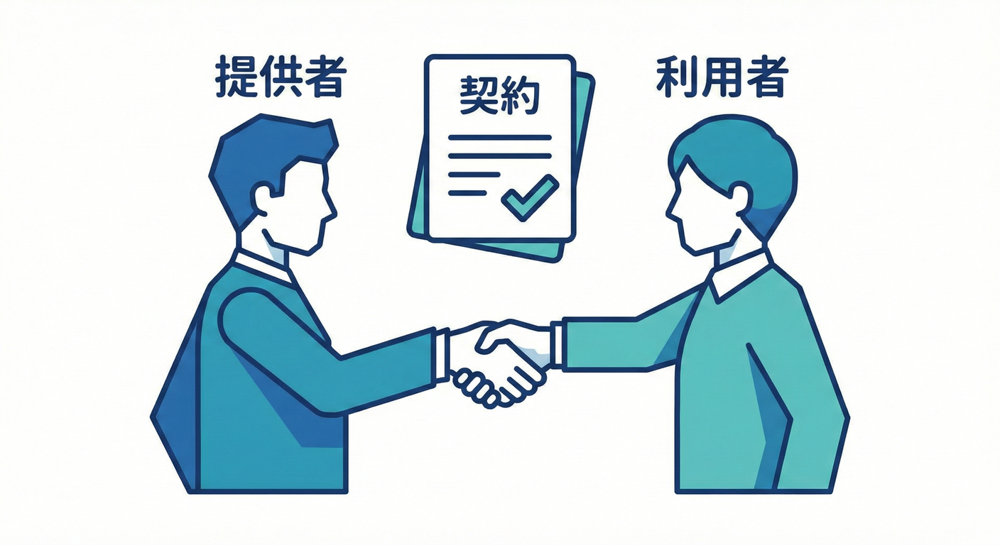
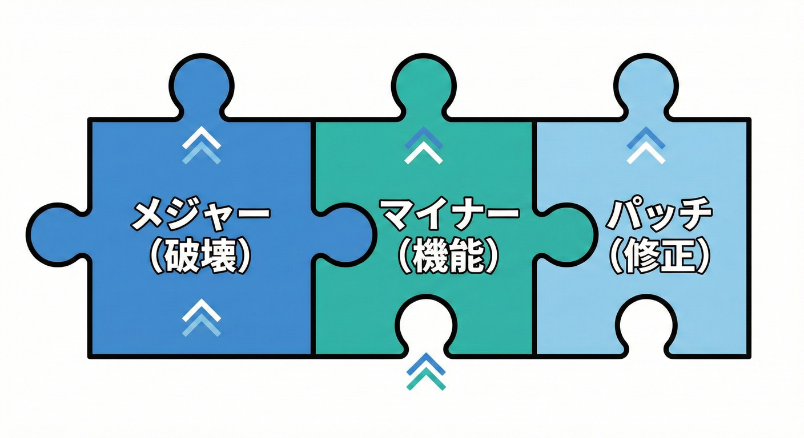
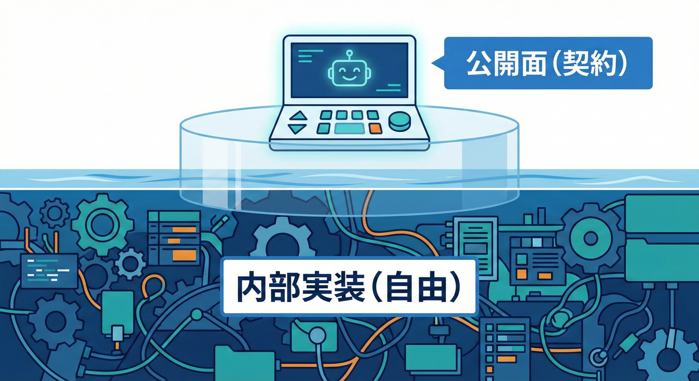
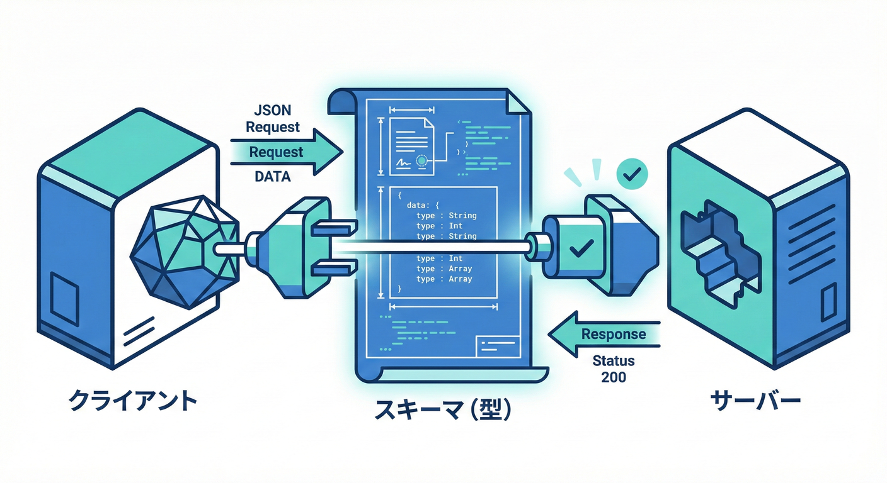
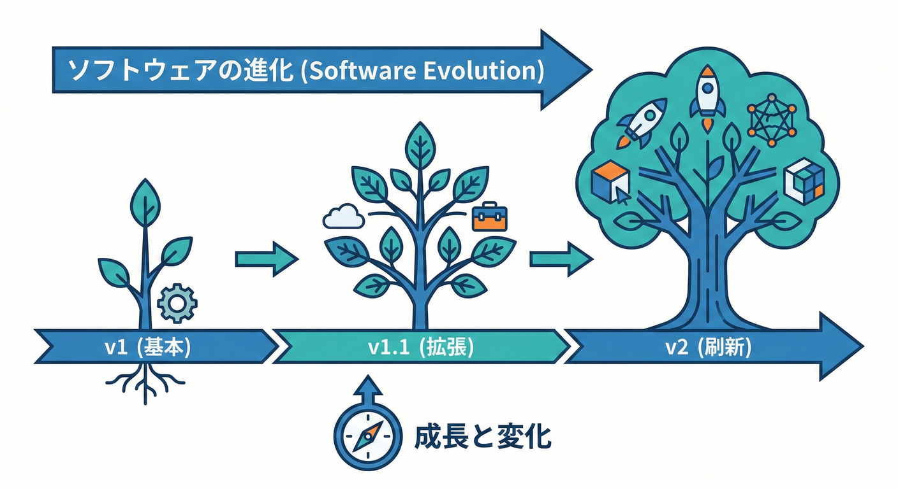

# 契約（Contract）設計（互換性・バージョニング）30章アウトライン📚✨（超入門→実務で回せるまで）

* .NET 10（LTS）＋C# 14 をベースにします✨ ([Microsoft for Developers][1])
* IDEは **Visual Studio 2026** を主役、必要に応じて VS Code も補助でOKにします🧰 ([Microsoft Learn][2])
* AI支援は GitHub Copilot や OpenAI 系ツールを「下書き係」として使う前提🤖✨（※VSでもCopilotが使える前提でOK） ([Visual Studio][3])
* 開発元は Microsoft の公式ドキュメントに合わせます📘 ([Microsoft for Developers][1])

## Part 1：まずは「契約」って何？を体に入れる（1〜6章）🌸

### 1章：はじめに🌷「契約」って結局なに？

* 契約＝「外に約束してる形」って話😊
* 破ると何が起きる？（利用者が困る・自分も未来で困る😵）
* ミニ実習：身近な“契約”を3つ書き出す✍️

### 2章：契約の種類マップ🧩（API/ライブラリ/DTO/イベント）

* どれも「変更すると壊れる面」だよ、って整理
* どれが今のあなたのプロジェクトに近いか選ぶ🎯
* AI活用：あなたの案件を入力→「契約候補」を洗い出し🤖

### 3章：契約の“利用者”を決める👀

* 利用者＝他人だけじゃない（未来の自分も含む！）
* 利用者が求めてるのは「安心してアップデートできること」
* ミニ実習：利用者ペルソナを1人つくる🧑‍🎓

### 4章：互換性の3兄弟（ソース/バイナリ/挙動）👨‍👩‍👧

* ソース互換：コンパイル通る？
* バイナリ互換：再ビルド無しで動く？
* 挙動互換：動くけど意味が変わってない？（事故りやすい😇）

### 5章：破壊的変更（Breaking Change）あるある💥

* 変更・削除・意味変更・エラー変更…どれが危険？
* 「壊れた」サイン（コンパイル/実行時/サイレント）
* ミニ実習：例を見て「どの互換が壊れた？」クイズ✅

### 6章：契約設計の全体像🗺️（最小の公開面を作る）

* 公開面（surface）を小さくするほど安全🛡️
* “内部実装”と“公開契約”を分ける考え方
* ここまでのまとめ：契約は「守るもの」📌

---

## Part 2：バージョニングの基礎を固める（7〜10章）🔢

### 7章：SemVer入門🔢（MAJOR/MINOR/PATCH）

* 3つの数字の意味（破壊/互換追加/修正）
* バージョンは「約束のラベル」🏷️
* ミニ実習：変更例を見て、上げるべき数字を当てる🎯

### 8章：互換ポリシーを決める📜（チームが1人でも必要）

* 「MINORは後方互換」など、ルールを文章で固定
* 例外（緊急対応など）も先に決める🚑
* AI活用：ポリシー草案を生成→あなたが添削する🤖✍️

### 9章：教材用ミニプロジェクトを作る🛠️（Producer/Consumer）

* 提供側（ライブラリ or API）＋利用側（コンソール）を用意
* “変更すると壊れる”を体験できる土台づくり
* 実習成果物：リポジトリ雛形📁

### 10章：契約を見える化する📌（公開API一覧・契約一覧）

* 「何を約束してるか」をリスト化（超大事）
* どこまでが契約？どこからが内部？を線引き✂️
* AI活用：公開面の候補を抽出→レビュー

---

## Part 3：C#の「ライブラリ契約」を安全に育てる（11〜18章）🔧

### 11章：公開API設計の基本（まず小さく）🌱

* publicを増やしすぎない（守る対象が増える😵）
* 型・メソッド名は“契約の言葉”
* 実習：公開APIを最小にしてv1を作る✨

### 12章：ドキュメントは契約の一部📝

* “何を保証するか”をコメントで明文化
* 使用例・前提・制約を書く
* AI活用：コメント下書き→人間が精査👩‍🏫🤖

### 13章：エラーの契約①（例外設計の基本）🚧

* どんな時に例外？どの例外型？メッセージは？
* 「想定される失敗」を仕様として書く
* 実習：例外を固定して、利用側がハンドリングする

### 14章：エラーの契約②（Result型/戻り値方針）🎁

* 例外に寄せる？Resultに寄せる？判断基準
* どっちでも「利用者が迷わない」が正義😊
* 実習：同じ機能を2方式で比較してみる

### 15章：nullabilityは契約☂️（Null許可の怖さ）

* nullを許す/許さないは、利用者のコードに直撃⚡
* “後から厳しくする”の影響を知る
* 実習：nullの扱いを固定してテスト

### 16章：破壊的変更カタログ①（コンパイルで壊れる系）🧱

* メソッド削除・シグネチャ変更・型変更など
* 実習：わざと壊して、利用側の修正を体験

### 17章：破壊的変更カタログ②（コンパイル通るのに壊れる系）🕳️

* オーバーロード追加の罠、既定値の罠、意味変更…
* ここが“事故ポイント”😇
* 実習：テストが無いと見逃す例を体験

### 18章：段階的廃止（Deprecated）戦略🧓➡️🧑

* Obsoleteで「今は使えるけど、将来消すよ」を伝える
* 廃止スケジュールと移行誘導📅
* AI活用：移行メッセージ案・FAQ案を作る🤖

---

## Part 4：NuGet/リリース運用（19〜21章）📦

### 19章：バージョニング実務①（NuGetのバージョン戦略）📦

* パッケージのバージョンは“契約の顔”
* 依存関係更新で壊れるケースを知る
* 実習：v1→v1.1のリリースを作る

### 20章：バージョニング実務②（変更ログとリリースノート）📰

* 何が変わった？どう直す？をセットで書く🧭
* “読む側が最短で直せる”文章術
* AI活用：下書き→あなたが例を検証して完成✅

### 21章：契約レビューの型（PRで見る観点）👀

* 「これは契約変更？」を判断するチェックリスト
* 変更の影響範囲を言語化する練習
* 実習：PR想定レビューごっこ（あなた＝レビュア）✨

---

## Part 5：Web APIの契約（22〜26章）🌐

### 22章：Web API契約①（成功レスポンスの約束）🍀

* ルート、HTTPメソッド、レスポンス形
* フィールド名・型・意味を固定する
* 実習：最小APIを作って、クライアントで呼ぶ

### 23章：Web API契約②（失敗レスポンスの約束）🚧

* ステータスコードの使い分け
* エラー形式（統一が命！）
* 実習：バリデーション失敗の設計

### 24章：OpenAPI契約①（仕様書を作る）📘

* OpenAPI＝契約書として固定する理由
* 仕様書に書くべきポイント（例・制約）
* 実習：OpenAPIを生成/整形して保存

### 25章：OpenAPI契約②（運用：差分・生成・レビュー）🔁

* 仕様の差分で破壊を検知する考え方🛑
* クライアント生成でズレを減らす
* AI活用：仕様説明文の下書き、レビュー補助🤖

### 26章：DTO（JSON）進化ルール🍡（互換性のコア）

* 追加は基本OK、削除/型変更は危険⚡
* 既定値・未指定・null の扱いを統一
* 実習：v1 DTO → v1.1 DTO を安全に増やす

---

## Part 6：イベント/メッセージの契約（27〜28章）📨

### 27章：イベント契約入門📨（「起きた事実」を運ぶ）

* イベントは取り戻せない＝契約が超重要😱
* “過去形の事実”として命名する
* 実習：イベントを1つ定義して購読側で処理

### 28章：イベント互換の設計（バージョン付き・進化戦略）🧱

* 互換な変更/非互換な変更の線引き
* バージョンの付け方（名前/フィールド/スキーマ）
* AI活用：互換ルール表を作って運用に落とす🤖

---

## Part 7：テスト＆自動化＆総合演習（29〜30章）🧪⚙️🎓

### 29章：契約テスト（守れてるかを自動で保証）🧪

* 提供側テスト：レスポンス形・例外・DTOを固定
* 利用側テスト：期待を固定（ズレを早期検知）
* 実習：1つの契約を「テストで守る」までやる✅

### 30章：総合演習🎓（v1 → v1.1 → v2 を作ってリリースまで）

* v1：最小契約で出す🌱
* v1.1：後方互換で拡張➕
* v2：破壊変更＋段階的廃止＋移行ガイド🧭
* CIの形：破壊っぽい変更を検知→バージョン更新→リリースノート生成（AI活用）🤖⚙️

---

## おまけ：この30章の「学び方」おすすめ🍰✨

* 1章＝「概念ちょい」＋「ミニ実習」＋「成果物1つ」
* 毎回の成果物例：契約一覧、互換ポリシー、変更ログ、移行ガイド、OpenAPI、契約テスト…📦

---

[1]: https://devblogs.microsoft.com/dotnet/announcing-dotnet-10/?utm_source=chatgpt.com "Announcing .NET 10"
[2]: https://learn.microsoft.com/en-us/visualstudio/releases/2026/release-notes?utm_source=chatgpt.com "Visual Studio 2026 Release Notes"
[3]: https://visualstudio.microsoft.com/github-copilot/?utm_source=chatgpt.com "Visual Studio With GitHub Copilot - AI Pair Programming"
