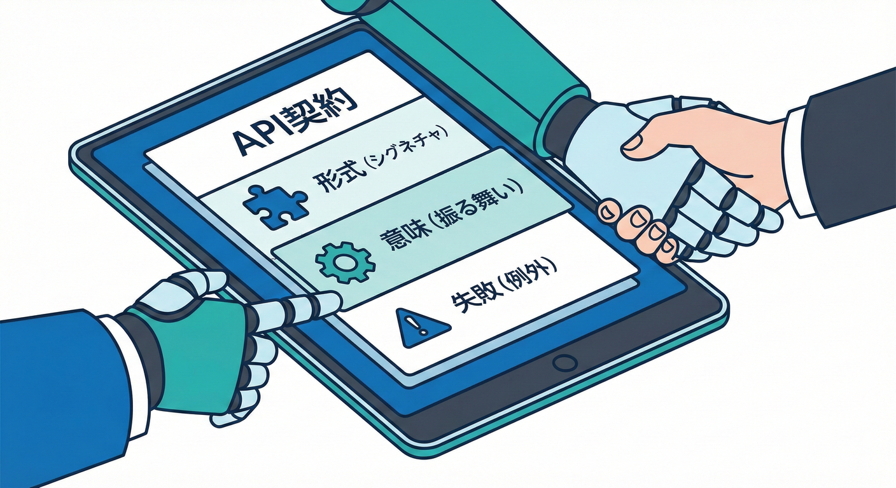
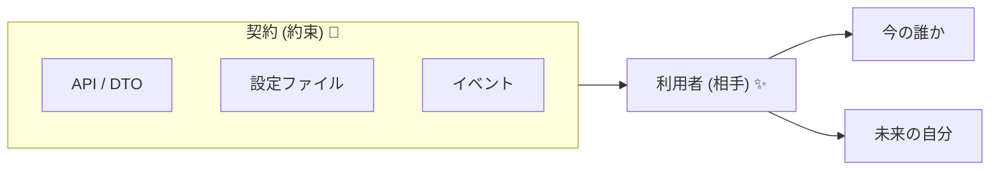
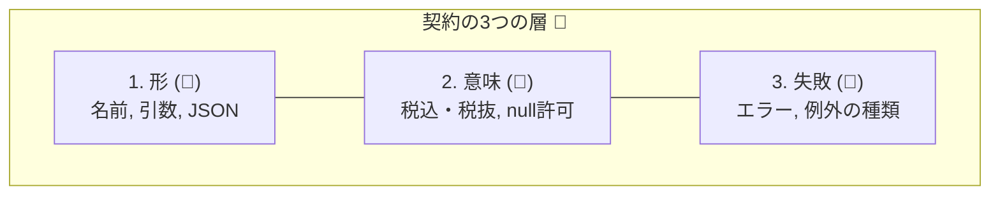
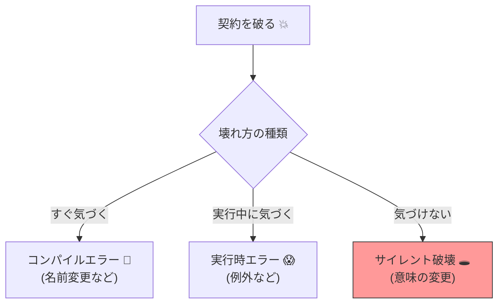

# 第01章：はじめに🌷「契約」って結局なに？

## この章のゴール🎯✨

* 「契約（Contract）」を、ふわっとじゃなく **自分の言葉で説明**できるようになる😊
* 「ここが契約！」「そこは実装！」を **ざっくり線引き**できるようになる✂️
* 契約を壊すと何が起きるかを **1回ミニ体験**して、怖さを知る😇💥

---

## 1. 「契約」＝“外に約束してる形”だよ🤝🌸




この教材では **こう覚える**のがいちばん早いよ👇😊

* **契約 = 外に公開してる「約束」**

  * 相手（利用者）が「こう使えるはず！」って信じてる部分✨
  * API、ライブラリ、DTO、設定ファイル、イベント…ぜんぶ「約束」になり得るよ🧩

ここでいう「相手」って、他人だけじゃないよ👀
**未来の自分**も、めちゃくちゃ強い利用者です😵‍💫（半年後に自分が泣くやつ…）

---

## 2. 契約には “3つの層” があるよ🧅✨（超ざっくり）



同じ「契約」でも、だいたいこの3つがセットで存在するよ👇

1. **形（かたち）** 🧱

* 例：メソッド名、引数、戻り値、JSONのフィールド名、URLパス…
* 見た目が変わると、相手のコードがすぐ困る😵

2. **意味（いみ）** 🧠

* 例：「この値は税込？」「この戻り値はnullあり？」みたいな“意味”
* 形は同じでも、意味が変わると地雷💣（気づきにくい）

3. **失敗のしかた（エラー）** 🚧

* 例：どんなとき例外？どの例外？メッセージは？
* 失敗の挙動も契約の一部だよ✨

この3つのうち、どれが変わっても「契約が変わった」可能性がある…って覚えると強い💪😊

---

## 3. 契約を破ると何が起きる？😇💥（初回はここだけでOK）



契約を破ると、だいたいこのどれかが起きるよ👇

* **コンパイルで死ぬ**（すぐ分かる）🧯

  * メソッド名変えた／消した など
* **実行時に死ぬ**（ちょい怖い）😱

  * 例外が増えた／入力の扱いが変わった など
* **静かに壊れる**（いちばん怖い）🕳️

  * 動くけど意味が変わって結果がズレる…😇

この3兄弟は、あとで章4〜5でガッツリやるよ👨‍👩‍👧✨

---

## 4. ミニ体験🧪：契約を壊すと“即”どうなる？（5〜10分）

ここは「うんうん」だけじゃなく、手を動かして感覚で覚えよ〜😊👐
**2つのプロジェクト**を作って、片方を利用者にするよ🎮✨

### 4.1 作るもの📦

* **Producer（提供側）**：メソッドを公開するクラスライブラリ
* **Consumer（利用側）**：そのメソッドを呼ぶコンソールアプリ

### 4.2 Producer（提供側）コード🧩

クラスライブラリに `Greeter` を作るよ👇

```csharp
namespace ContractDemo.Producer;

public class Greeter
{
    // ★これが「契約（公開された約束）」の一部だよ！
    public string Hello(string name)
        => $"Hello, {name}!";
}
```

### 4.3 Consumer（利用側）コード🧡

コンソール側から呼ぶよ👇

```csharp
using ContractDemo.Producer;

var greeter = new Greeter();
Console.WriteLine(greeter.Hello("Mika"));
```

ここまでで実行して、`Hello, Mika!` が出ればOK🎉✨

### 4.4 破壊してみよう💥（契約を変える）

Producer側でメソッド名を変えちゃう👇

```csharp
public string SayHello(string name)
    => $"Hello, {name}!";
```

すると…Consumer側が **コンパイルエラー**になるはず😵‍💫💥
これが **「契約を破ったら、利用者が困る」** の最短ルート体験だよ🧯✨

> ポイント💡
>
> * Producerは「ちょっと名前変えただけ」の気分でも、Consumerは「世界が崩壊」することがある😇

---

## 5. ミニ実習✍️：身近な“契約”を3つ書き出す

「契約」って言うと急にむずかしいけど、日常にもあるよ🍀
まずは感覚を作ろう😊✨

### 実習A：日常の契約を3つ📝

例）

* コンビニのセルフレジ：操作の順番が決まってる🧾
* 電車のICカード：タッチすれば入れる🚃
* スマホの充電：この端子なら刺さる🔌

→ あなたの例を3つ書こう✍️😊

### 実習B：自分のコードの契約を3つ🧑‍💻✨

「外に公開してる約束っぽいもの」を探すよ👀
例）

* public メソッド（名前・引数・戻り値）🧱
* 例外（投げる条件・種類）🚧
* JSONや設定ファイルのキー名🧩

→ いま思い当たるのを3つメモしてOK✍️💗

---

## 6. AI活用🤖✨（下書き係にして、あなたが最終責任者💪）

AIは「説明文」「例」「チェックリスト」の下書きが得意だよ😊
ただし、**契約は“約束”だから、最後は人間が決める**のが大事🫶

### 6.1 使えるプロンプト例（コピペOK）📋✨

**プロンプト①：自分のプロジェクトの“契約っぽい部分”洗い出し**

```
あなたはC#/.NETの設計レビュー担当です。
私のプロジェクトで「契約（外部への約束）」になりそうな箇所を10個、カテゴリ別に列挙してください。
カテゴリ例：公開API、DTO(JSON)、例外/エラー、設定、イベント、DBスキーマ、コマンドライン引数など。
各項目に「壊すと困る相手」を1行で添えてください。
```

**プロンプト②：契約の説明を“やさしい言葉”にして**

```
「契約（Contract）設計」を、設計超入門者に向けて、比喩を交えてやさしく説明してください。
ただし、嘘や過度な一般化は避け、C#/.NETの例を1つ入れてください。
```

**プロンプト③：この変更は“契約変更”か判定して**

```
次の変更は「契約変更」か「内部実装の変更」か判定し、理由も説明してください。
変更：publicメソッド名の変更 / 引数の追加 / 戻り値の型変更 / 例外を追加 / ログ文言の変更
```

---

## 7. 章末チェック✅✨（5問）

1. 契約をひとことで言うと？🤝
2. 契約の「形」「意味」「失敗のしかた」って何が違う？🧅
3. Producerで public メソッド名を変えたら、Consumerはどうなる可能性が高い？💥
4. いちばん怖い壊れ方はどれ？（コンパイル/実行時/静かに壊れる）🕳️
5. 「未来の自分」も利用者って言えるのはなぜ？🕰️

---

## 8. この章の成果物📦🎀（提出できる形）

* **契約メモ（6行でOK）**✍️

  * 日常の契約：3つ
  * 自分のコードの契約：3つ

---

## 参考（本章で触れた公式情報）📚✨

* Microsoft の .NET 10（LTS）概要とサポート期間 ([Microsoft for Developers][1])
* C# 14 の新機能（.NET 10 SDK / Visual Studio 2026 で試せる） ([Microsoft Learn][2])
* Visual Studio 2026 のリリースノート（Copilot関連機能など） ([Microsoft Learn][3])
* SemVer（Semantic Versioning）仕様 ([semver.org][4])

[1]: https://devblogs.microsoft.com/dotnet/announcing-dotnet-10/?utm_source=chatgpt.com "Announcing .NET 10"
[2]: https://learn.microsoft.com/en-us/dotnet/csharp/whats-new/csharp-14?utm_source=chatgpt.com "What's new in C# 14"
[3]: https://learn.microsoft.com/en-us/visualstudio/releases/2026/release-notes?utm_source=chatgpt.com "Visual Studio 2026 Release Notes"
[4]: https://semver.org/?utm_source=chatgpt.com "Semantic Versioning 2.0.0 | Semantic Versioning"
