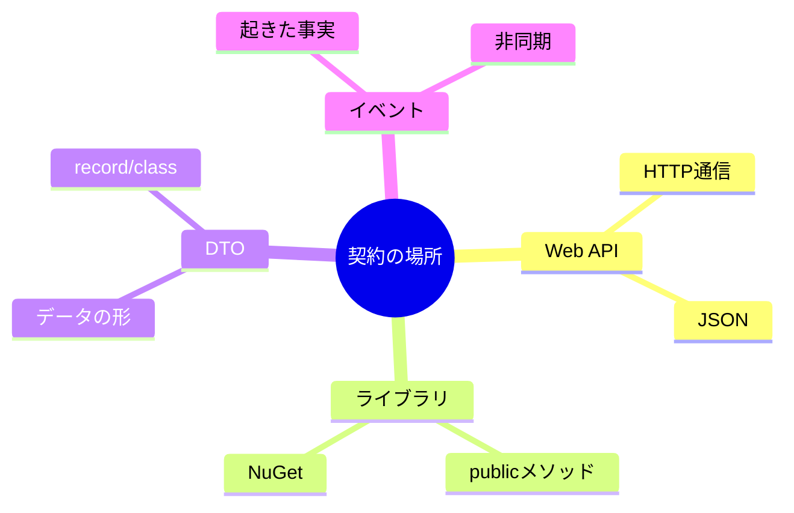
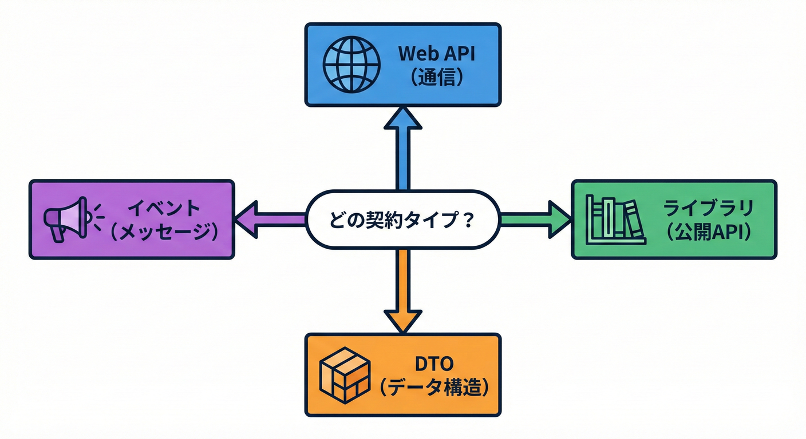
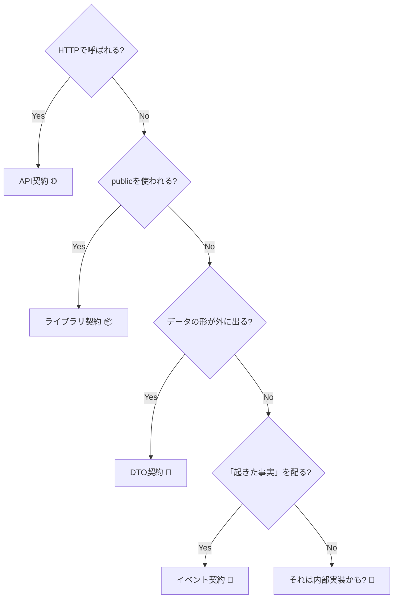

# 第2章：契約の種類マップ🧩（API/ライブラリ/DTO/イベント）

## この章でできるようになること🎯✨

* 「契約」になりやすい“場所”を、地図みたいにパッと分類できる📌
* 変更すると壊れやすいポイントを、種類ごとに見抜ける👀⚡
* 自分のプロジェクトで「どれが契約？」を棚卸しできる🧹📋
* AI（Copilotなど）に“下書き”させて、最終判断を自分でできる🤖✍️✅

---

## 1. まず“契約”って、どこにあるの？🧠💡

契約はだいたい **「境界（Boundary）」** に出ます🌈
境界＝「外の誰か（別プロセス・別チーム・未来の自分）と接する場所」だよ😊



この教材では、契約を4つに分けて覚えます👇🧩

1. **Web APIの契約**（HTTPで話す約束）🌐
2. **ライブラリの契約**（public APIの約束）📦
3. **DTOの契約**（データの形の約束）🍡
4. **イベントの契約**（“起きた事実”を運ぶ約束）📨

---

## 2. 契約4種類の“ざっくり地図”🗺️✨

### A) Web APIの契約🌐🍀

**何が契約？**

* ルート（URL）、HTTPメソッド（GET/POST…）
* ステータスコード（200/400/404/500…）
* リクエスト/レスポンスのJSONの形（フィールド名・型・意味）
* 認証（ヘッダ・トークン）や、ページング、並び順なども“実質契約”になりがち😇

**利用者は誰？**

* フロントエンド、モバイルアプリ、別サービス、社外クライアントなど📱🖥️🔁

**壊れ方あるある💥**

* ルート変更 → 呼べなくなる😱
* 返すJSONのフィールド名変更 → クライアントが壊れる🧱
* ステータスコードの意味変更 → エラーハンドリング事故🚧

---

### B) ライブラリ（public API）の契約📦🛠️

**何が契約？**

* `public` な型/メソッド/プロパティ/引数/戻り値の形
* 例外の種類（何を投げる？）
* 動作の意味（ソート順、大小の定義、丸めルール…）も契約になりやすい

**利用者は誰？**

* 同じソリューション内の別プロジェクト、別チーム、NuGet利用者など👥📦

**壊れ方あるある💥**

* シグネチャ変更（引数追加/型変更）→ コンパイルは通っても実行時に壊れることも😵
  「バイナリ互換」の話に直結します（後の章で詳しく）📌
  ※「public APIを変えると、古いアセンブリが呼べなくなる」タイプの破壊が起きます ([Microsoft Learn][1])

---

### C) DTO（データの形）の契約🍡📄

DTOは「Data Transfer Object」の略で、**データの形そのものが契約**です✨
C#だと `record` や `class`、WebだとJSONとして登場しがち。

**何が契約？**

* フィールド名（プロパティ名）
* 型（string/int/bool/配列/オブジェクト）
* null許可（nullable）
* “省略されたときの意味”（未指定 vs null vs 既定値）

**利用者は誰？**

* APIクライアント、別サービス、保存先（DBやログ）など📦🗃️

**壊れ方あるある💥**

* `int` → `string` に変更 → パースで落ちる😱
* フィールド削除 → 利用側が死ぬ⚡
* nullの扱い変更 → 地味に事故る😇

---

### D) イベント（メッセージ）の契約📨⏳

イベントは **「起きた事実」** を運びます。
いったん外に流れると、後から回収が難しいので契約が超重要😱🧨

**何が契約？**

* イベント名（例：`UserRegistered`）
* ペイロード（中身のDTO）
* 一意ID、発生時刻、並び順、重複（再配信）時の扱い（冪等性）なども実質契約

**利用者は誰？**

* 購読側サービス、バッチ、分析基盤、監査ログなど📊🔁

**壊れ方あるある💥**

* イベント名変更 → そもそも拾われない🙈
* フィールド削除/型変更 → 購読側が壊れる💥
* 意味変更（例：「登録」だったのに「仮登録」になった）→ サイレント事故😇

---

## 3. “一瞬で見分ける”ための判断チャート🔍✨




迷ったらこの質問👇を順番に当ててみてね😊

1. **HTTPで呼ばれる？** → はい：**API契約**🌐
2. **publicメンバーを使われる？** → はい：**ライブラリ契約**📦
3. **データの形が外に出る？（JSON/DTO/ログ/保存/メッセージ）** → はい：**DTO契約**🍡
4. **「起きた事実」を非同期で配る？** → はい：**イベント契約**📨

※ 1つの機能が「API＋DTO」みたいに **複数の契約を同時に持つ** のは普通だよ😌✨

---

## 4. それぞれの“契約っぽい例”をC#で見てみよう👀💎

### A) Web API契約の例（最小APIっぽい雰囲気）🌐

```csharp
// 例：GET /users/{id} は「契約」
// - ルート
// - id の型
// - 戻りの JSON の形（UserDto）
app.MapGet("/users/{id:int}", (int id) =>
{
    // ここは内部実装（契約ではない部分が多い）
    return Results.Ok(new UserDto(id, "Aki"));
});
```

### B) ライブラリ契約の例（public API）📦

```csharp
public sealed class Money
{
    public decimal Amount { get; }
    public string Currency { get; }

    public Money(decimal amount, string currency)
    {
        if (currency.Length != 3) throw new ArgumentException("ISO code", nameof(currency));
        Amount = amount;
        Currency = currency;
    }

    public Money Add(Money other)
    {
        if (Currency != other.Currency) throw new InvalidOperationException("Currency mismatch");
        return new Money(Amount + other.Amount, Currency);
    }
}
```

ここで契約なのは👇

* `Money` が `public` なこと
* コンストラクタの引数、`Add` の引数と戻り値
* 例外の種類（`ArgumentException` / `InvalidOperationException`）
* 「通貨が違うと足せない」という意味（挙動）

---

### C) DTO契約の例（record）🍡

```csharp
public sealed record UserDto(int Id, string Name);
```

`Id` を `Guid` に変えたら？ `Name` を `FullName` に変えたら？
→ 利用側が壊れやすいポイントだよ⚡😵

---

### D) イベント契約の例（“起きた事実”）📨

```csharp
public sealed record UserRegistered(
    Guid EventId,
    DateTimeOffset OccurredAt,
    int UserId,
    string Email
);
```

イベントは「過去形の事実」で命名するとブレにくいよ🕰️✨
（例：Registered / Created / Deleted みたいな）

---

## 5. “壊れ方”が違うから、守り方も違う🛡️✨（超ざっくり表）

| 契約タイプ     | よくある壊れ方            | 事故の見え方         | 守りやすい対策                                |
| --------- | ------------------ | -------------- | -------------------------------------- |
| Web API🌐 | ルート変更、レスポンス形変更     | 呼べない/パース失敗     | OpenAPI/契約テスト/互換ルール                    |
| ライブラリ📦   | public API変更       | コンパイル or 実行時例外 | 公開面を小さく、破壊変更を管理 ([Microsoft Learn][1]) |
| DTO🍡     | フィールド削除/型変更/null変更 | 実行時に壊れる/サイレントも | 追加中心、削除・型変更は慎重                         |
| イベント📨    | 名前/形/意味変更          | 購読されない/静かに壊れる  | バージョン戦略、冪等設計                           |

※ .NETの互換性の考え方や「どんな変更が互換性に影響するか」は、公式のルール整理もあるよ📘 ([Microsoft Learn][2])

---

## 6. ミニ実習①：自分の案件を“契約マップ”に落とす🗺️✍️✨

次のテンプレを埋めるだけでOK😊
（最初は雑で大丈夫！“見える化”が目的だよ🫶）

**契約一覧テンプレ📋**

* 契約名：
* 種類：（API / ライブラリ / DTO / イベント）
* 利用者：
* 入口（どこから触れる？例：URL / public型 / トピック名）：
* 変更すると壊れそうな点（1つでOK）：
* “守る方法”のメモ（テスト？ドキュメント？段階的廃止？）：

**例（書き方サンプル）🌟**

* 契約名：User取得API
* 種類：API + DTO
* 利用者：フロント（React）
* 入口：GET /users/{id}
* 壊れそう：`name` を `fullName` に変えたらパースが死ぬ
* 守る：レスポンス形の契約テストを追加

---

## 7. ミニ実習②：「いま一番近い契約タイプ」を選ぶ🎯💞

次のどれが“いまの自分の現場”に近い？（1つでOK）

* Web APIを作ってる/触ってる → 🌐
* 共通ライブラリや社内SDKがある → 📦
* JSON/DTOのやり取りが多い → 🍡
* キュー/イベント/非同期がある → 📨

選んだら、そのタイプの契約を **3つだけ** ピックしてテンプレに書いてみよう✍️✨
「3つ」に絞るのがコツだよ（増やすのは後でOK）😊🌸

---

## 8. AI活用🤖✨：契約候補の“洗い出し”を一瞬でやる（でも最後は人間が決める！）

CopilotやAI拡張は、こういう“棚卸し”が得意だよ🧹📋
特にVisual Studioでは、Copilotがコミット参照などを使ってレビュー系の作業を助ける流れも出てきてるよ🧑‍💻🤖 ([Microsoft Learn][3])

### プロンプト例①：契約候補を列挙して分類してもらう📌

（Copilot Chat に貼る用）

```text
このソリューションで「外部との契約」になっている可能性がある箇所を列挙して、
API / ライブラリ(public) / DTO / イベント に分類してください。
各項目に「利用者（誰が使うか）」と「壊れ方の例」を1つずつ添えてください。
```

### プロンプト例②：public APIの“公開面”を抜き出す📦

```text
このプロジェクトの public な型・メソッド・プロパティを一覧化して、
「契約として守るべき度合い（高/中/低）」を推定してください。
推定理由も短く添えてください。
```

### プロンプト例③：DTOの変更リスクを点検🍡⚡

```text
UserDto / OrderDto などDTOの一覧を作り、
「後方互換になりやすい変更（追加）」と「危険な変更（削除/型変更/nullability変更）」の例を、
このコードベースに合わせて具体例で出してください。
```

### プロンプト例④：PR/コミット単位で“契約影響レビュー”👀🧾

```text
この変更（差分）について、契約に影響する可能性がある点を指摘して、
影響があるなら「API/ライブラリ/DTO/イベント」のどれかに分類し、
利用者視点で何が壊れるかを説明してください。必要な対策（テスト/ドキュメント/段階的廃止）も提案して。
```

---

## 9. 章のまとめ📌✨

* 契約は「境界」に出やすい🧱🌈
* まずは **API / ライブラリ / DTO / イベント** の4分類で迷子にならない🧩😊
* いきなり完璧を目指さず、**契約を3つ選んでテンプレ化** から始めると強い✍️💞
* AIは棚卸しに超便利。でも「それが契約か？」の最終判断は人間が握る🤖➡️🧠✅

---

### 参考（公式ドキュメントの考え方）📘

* .NET 10はLTSで、リリース情報やサポート期間などが公式で案内されているよ ([Microsoft for Developers][4])
* .NETの互換性（破壊的変更の扱い）や分類（バイナリ/ソース/挙動）にも公式の整理があるよ ([Microsoft Learn][1])
* NuGetのバージョンやSemVerの扱いも公式でまとまってるよ ([Microsoft Learn][5])
* .NET 10（C# 14）周りの最新情報も公式の “What’s new” に集約されてるよ ([Microsoft Learn][6])

[1]: https://learn.microsoft.com/en-us/dotnet/standard/library-guidance/breaking-changes?utm_source=chatgpt.com "Breaking changes and .NET libraries"
[2]: https://learn.microsoft.com/en-us/dotnet/core/compatibility/library-change-rules?utm_source=chatgpt.com "NET API changes that affect compatibility"
[3]: https://learn.microsoft.com/en-us/visualstudio/releases/2026/release-notes?utm_source=chatgpt.com "Visual Studio 2026 Release Notes"
[4]: https://devblogs.microsoft.com/dotnet/announcing-dotnet-10/?utm_source=chatgpt.com "Announcing .NET 10"
[5]: https://learn.microsoft.com/en-us/nuget/concepts/package-versioning?utm_source=chatgpt.com "NuGet Package Version Reference"
[6]: https://learn.microsoft.com/en-us/dotnet/core/whats-new/dotnet-10/overview?utm_source=chatgpt.com "What's new in .NET 10"
