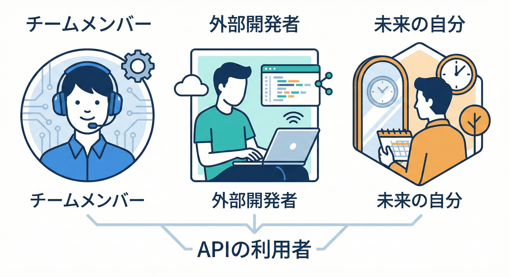
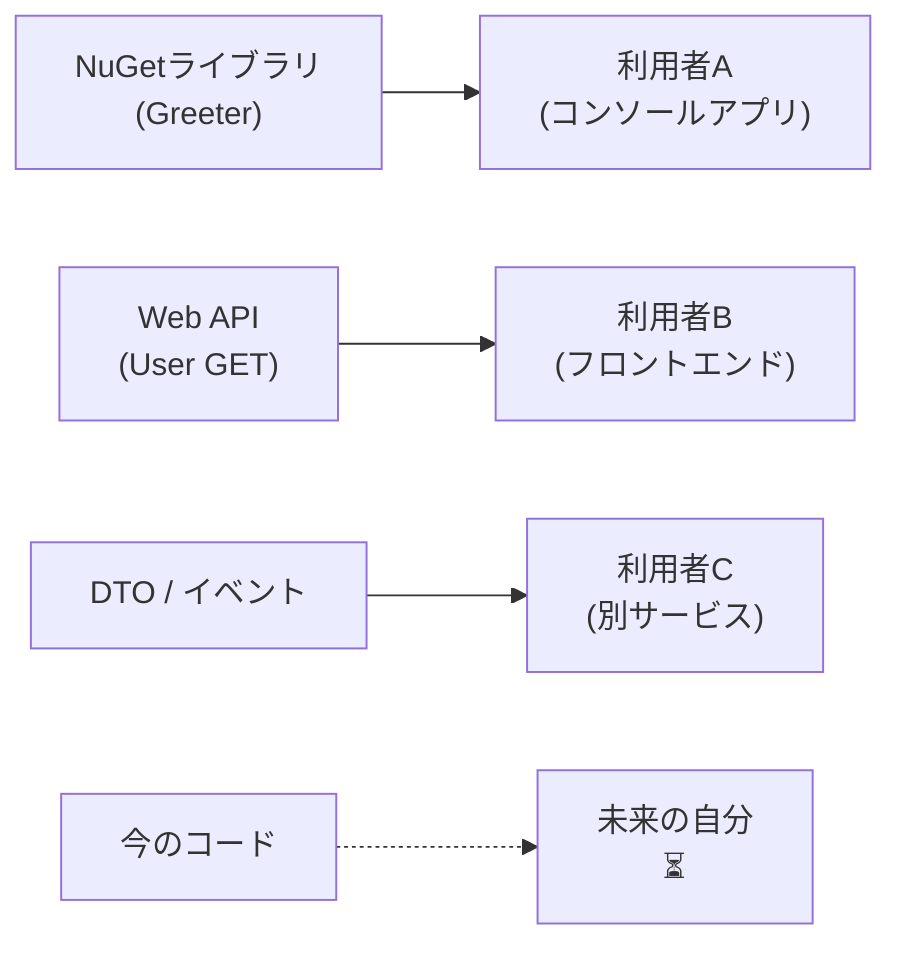

# 第3章：契約の“利用者”を決める👀

## この章のゴール🎯

この章が終わると、次の3つができるようになります😊✨

* 「この契約（API/ライブラリ/DTOなど）を誰が使うのか？」を言葉にできる👄
* 利用者の“困りごと”と“更新できる事情”を想像して、契約の守り方を決められる🛡️
* **利用者ペルソナ**を1人つくって、チーム（未来の自分も）に共有できる🧑‍🎓📌

---

## 1. そもそも「利用者」って誰？🤔




契約（Contract）の利用者って、**“それを使って何かする側”**のことです📦➡️🧑‍💻

たとえば…

* あなたが作った **NuGetライブラリ** を参照して呼び出す人📦
* あなたが作った **Web API** を叩くフロントエンドや別チーム🌐
* あなたが作った **DTO（データの形）** を受け取って処理する別システム🍡
* あなたが投げる **イベント（メッセージ）** を購読して動く別サービス📨

そして超大事ポイント👇✨

> 利用者は「他人」だけじゃない！
> **未来の自分**も“利用者”だよ〜⏳🧑‍💻➡️👵

---

## 2. 利用者を決めないと、何が困るの？😵

利用者が曖昧だと、契約はだいたいこうなります👇💥

* 「どこまで壊していいの？」が分からない🤷‍♀️
* 変更したら、どこで爆発するか読めない💣
* 事故が起きた後に「そんな使い方すると思わなかった…」が発生する😭
* 結局こわくて変更できなくなって、開発が止まる🧊

逆に、利用者が決まるとこうなるよ👇🌸

* 守るべき約束（＝契約）がハッキリする📝
* “互換性”の意味が決まる（どこまで守る？いつまで守る？）🛡️
* 変更の判断が速くなる（迷う時間が減る！）⚡

---

## 3. 利用者が求めてるのは、だいたいコレ🧡

利用者がほんとに欲しいものは、派手な新機能よりこれが多いです👇

* **安心してアップデートできること**😌🔁
* 変えても「急に壊れない」こと🧱
* 壊れるなら「事前に分かる」こと（予告がある）📣
* 直し方が「すぐ分かる」こと（移行手順がある）🧭

つまり契約って、カッコよく言うと…

> **“アップデートしても平和でいられるための約束”**🌿✨

---

## 4. 利用者の分類マップ🗺️（ざっくりでOK）

```mermaid
mindmap
  root((利用者の分類))
    A) 内部
      自分
      未来の自分
    B) 近場
      同じチーム
      同じ会社
    C) 外部
      社外クライアント
      OSS利用者
```

まずは利用者を“温度感”で分類するとスッキリします🧠✨

### A) 自分の中の利用者（未来の自分含む）⏳

* 「3か月後に見たら、覚えてない」問題🫠
* コメントや仕様が薄いと地獄👻

### B) 同じチーム/同じ会社の利用者🏢

* Slackで聞けるけど、忙しいと詰む😵‍💫
* リリースタイミングが合わないと壊れる🗓️

### C) 外部の利用者（社外/OSS/顧客）🌍

* 連絡できない/できても遅い📮
* いきなり壊すと信用が終わる😇

---

## 5. “更新できる事情”が超重要🔁⚠️

利用者って、気持ちの問題だけじゃなくて「現実」があります😅

* すぐ更新できる？ それとも半年に一度？📅
* 依存関係の更新が怖い職場？ それとも毎日CIで更新？⚙️
* 参照してるのは **ソースコード**？それとも **ビルド済みDLL**？📦
* 本番で落ちたらヤバい？多少ならOK？🔥

このへんが分かると、契約の守り方が決まります🛡️✨
（互換性の3兄弟は次章でやるけど、この章でも“事情の聞き取り”は先にやっちゃうのがコツだよ😉）

---

## 6. 利用者ペルソナってなに？🧑‍🎓

ペルソナは、利用者を“1人の人物”として具体化したものです✨
「たぶん誰かが使う」じゃなくて、「この人が使う」にするやつ👀💕

### ペルソナの良さ💡

* 会話がしやすくなる（抽象が減る）🗣️
* 判断が速くなる（迷いが減る）⚡
* 仕様が“人に優しく”なる（地味に最強）🌸

---

## ミニ実習：利用者ペルソナを1人つくる🧑‍🎓✍️

## Step 1) 利用者を1人選ぶ🎯

候補はこんな感じ👇（今の自分の案件に近いのを選べばOK）

* 自分（未来の自分）⏳
* 同じ会社の別チームの人👩‍💻
* 社外の開発者（NuGetで使う）📦
* フロントエンド（APIを呼ぶ）🌐
* バッチ/ジョブ（DTOを読む）⏰

---

## Step 2) ペルソナカードを書く📝（テンプレ）

このテンプレを埋めていきます✨（短くてOK！）

**🪪 利用者ペルソナカード（テンプレ）**

* 名前（仮名でOK）：
* 何を作ってる人？（役割）：
* 何を使う？（契約の対象）：
* 使う目的（やりたいこと）：
* 更新のペース（毎日/週1/学期ごと…）：
* 壊れると困る度（低/中/高）：
* “絶対に壊されたくない”ポイント（最大3つ）：
* 困ったときの連絡手段（聞ける？聞けない？）：

---

## Step 3) 例を見て、イメージをつかもう😊✨

### 例：NuGetライブラリの利用者📦

* 名前：さくら
* 役割：学内システムの保守担当（小さめチーム）
* 対象：自作NuGet `Acme.TextKit` の `Normalize()`
* 目的：文字列を正規化してDB検索を安定させたい
* 更新ペース：学期ごと（年2回くらい）
* 困る度：高（検索が壊れると問い合わせ地獄😱）
* 絶対に壊されたくない：

  1. メソッド名と引数
  2. 正規化のルール（挙動）
  3. 例外の種類（catchしてる）
* 連絡手段：聞けるけど返信遅め（みんな忙しい）

この例みたいに「生活感」を入れると強いよ〜🍵✨

---

## Step 4) “絶対に壊されたくない”を契約の言葉にする🧾

ペルソナができたら、最後にこれを一言でまとめます💡

* ✅ **利用者の約束（契約）**：利用者が安心して使えるように守ること
* ⚠️ **破ると事故**：利用者が困って、あなたも未来で困ること

たとえば上の例なら👇

* 「`Normalize(string)` の**意味**は変えない」
* 「失敗時に投げる例外を**突然別物にしない**」
* 「互換性を壊すときは、**予告と移行方法**を出す」

---

## 7. “契約の利用者”を決めるときのチェックリスト✅

迷ったらこれでOKだよ😊🌸

## ✅ 利用者の存在チェック

* [ ] それ、誰が呼ぶ？（人/アプリ/サービス）👀
* [ ] その人は、あなたと同じリポジトリにいる？別？📁
* [ ] その人は、更新の主導権を持ってる？あなたが持ってる？🔁

## ✅ 事情チェック

* [ ] 更新頻度は？（すぐ直せる？直せない？）📅
* [ ] 壊れたらどれくらいヤバい？🔥
* [ ] “何を壊されたら致命傷”か言える？🧱

---

## 8. AIに手伝ってもらう🤖✨（ペルソナ作りが爆速になる！）

AIは「文章を作るのが速い」から、ペルソナ作りにめちゃ向いてます💨
（ただし最後の判断は人間のあなたがやるよ😉）

## 🔥 コピペで使えるプロンプト集✍️

### ① 利用者候補を洗い出す

```text
次の対象について「利用者（Consumer）の候補」を10個出して。
対象：自作のC#ライブラリ（NuGet想定）
前提：契約設計の初心者にも分かるように、利用シーンも1行で添えて。
```

### ② ペルソナを3パターン作る（更新事情ちがい）

```text
次の契約対象の利用者ペルソナを3人作って。
それぞれ更新ペースが「毎日」「月1」「半年に1回」で違う設定にして。
契約対象：publicメソッドのAPI（C#ライブラリ）
出力：名前/役割/目的/更新事情/壊れると困る点（3つ）
```

### ③ “絶対に壊されたくない”を契約の文にする

```text
次のペルソナ情報から「契約として守るべき約束」を3つの箇条書きにして。
ペルソナ：{ここにペルソナカードを貼る}
```

※ Visual Studio 2026 では、C# 14 を .NET 10 SDK と組み合わせて使えることが案内されています。([Microsoft Learn][1])
※ Visual Studio 2026 では GitHub Copilot Chat が統合され、依存関係更新を支援する仕組み（NuGet MCP server）などもリリースノートで紹介されています。([Microsoft Learn][2])
※ GitHub 側の更新情報でも、Visual Studio 2026 での Copilot 機能アップデートが継続的に告知されています。([The GitHub Blog][3])

---

## 9. ミニクイズ✅（理解チェックだよ〜🧠✨）

## Q1️⃣ 利用者に「未来の自分」が入る理由は？

* A: 将来も同じ自分がコードを書くから
* B: 未来の自分は別人で、質問できないから
* C: コメントや仕様がないと“契約”が消えるから

👉 正解：**全部！**（A/B/Cぜんぶ当てはまる〜😂✨）

---

## Q2️⃣ 利用者が決まってない契約で起こりがちな事故は？💥

* A: “どこまで壊していいか”が分からず、変更が怖くなる
* B: “想定外の使われ方”で突然壊れる
* C: 互換性の判断基準が作れない

👉 正解：**全部！**（あるあるすぎて泣ける…😭）

---

## 10. この章の成果物📦✨（提出物みたいなやつ）

最後に、これが手元に残っていればOKだよ😊💕

* ✅ 利用者ペルソナカード（1人分）🪪
* ✅ “絶対に壊されたくない”ポイント3つ🧱
* ✅ それを契約の言葉にした箇条書き3つ🧾

---

## 参考：いまの基盤バージョンの確認メモ🧷

* .NET 10 は LTS（3年サポート）として案内されています。([Microsoft for Developers][4])
* C# 14 は .NET 10 上でサポートされ、Visual Studio 2026 でも試せると案内されています。([Microsoft Learn][1])

[1]: https://learn.microsoft.com/en-us/dotnet/csharp/whats-new/csharp-14 "What's new in C# 14 | Microsoft Learn"
[2]: https://learn.microsoft.com/en-us/visualstudio/releases/2026/release-notes "Visual Studio 2026 Release Notes | Microsoft Learn"
[3]: https://github.blog/changelog/2025-12-03-github-copilot-in-visual-studio-november-update/ "GitHub Copilot in Visual Studio — November update - GitHub Changelog"
[4]: https://devblogs.microsoft.com/dotnet/announcing-dotnet-10/ "Announcing .NET 10 - .NET Blog"
