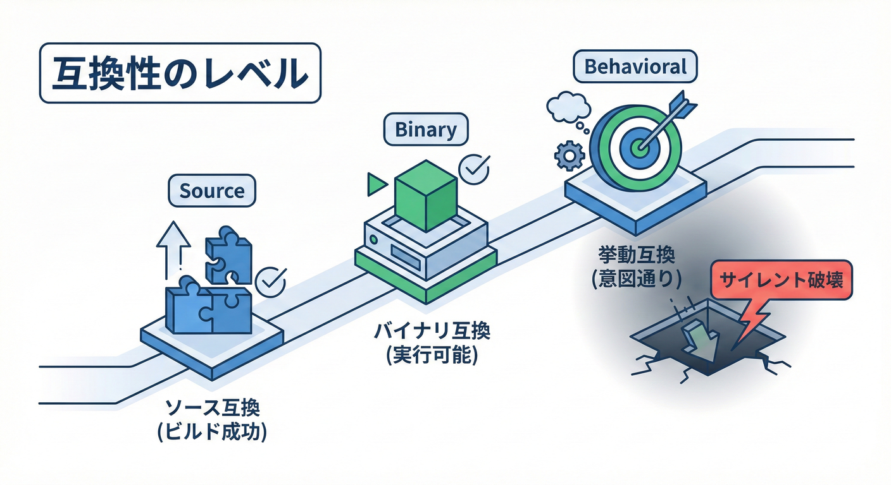

# 第4章：互換性の3兄弟（ソース/バイナリ/挙動）👨‍👩‍👧✨

## この章でできるようになること🎯

* 変更が「どの互換性を壊すのか」を3分類で言えるようになる🧠✨
* 破壊の種類ごとに「最短の確かめ方」を選べるようになる🔍💨
* “動いたからOK”が一番危ない理由を、実験で体感できる😇💥

---

## 1) 互換性って、結局なに？🤔💭



**互換性 =「アップデートしても、利用者が困らない度合い」**だよ〜😊✨
で、困り方には大きく3種類あるの。

* **ソース互換**：新しい版にしたとき、**ソースコードを再ビルドしたら通る？**🧩
* **バイナリ互換**：古い版でビルド済みのアプリが、**再ビルドなしで動く？**📦
* **挙動互換**：動くけど、**意味まで変わってない？**（ここが事故りやすい😇）🎭

この3つは、.NET の「Breaking changes」公式ドキュメントでも、破壊の分類として **source / binary / behavioral** が使われてるよ📘✨ ([Microsoft Learn][1])

---

## 2) 3兄弟のイメージ図🧠💡

イメージはこう👇

* **ソース互換**：コンパイル時に怒られる😾（親切）
* **バイナリ互換**：実行時に爆発する💣（MissingMethodException とか）
* **挙動互換**：爆発しないのに中身が変わって事故る😇（サイレント破壊）

---

## 3) まずは“ひとことで”覚える📌✨

## ソース互換（Source compatibility）🧩

**「利用者が再ビルドしたときに通るか」**だよ✅
例：メソッド名を変えた／引数を変えた → 利用者のコードがコンパイルエラー💥

## バイナリ互換（Binary compatibility）📦

**「利用者が再ビルドしなくても動くか」**だよ✅
例：メソッドのシグネチャを変えると、古いアプリは実行時に **MissingMethodException** を投げたりする😱 ([Microsoft Learn][2])

## 挙動互換（Behavioral compatibility）🎭

**「同じ入力なら、同じ意味の結果が返るか」**だよ✅
例：丸めルール・エラー条件・既定値・単位（%なのか0〜1なのか）を変えると、動くのに結果がズレる😇💥

---

## 4) 実習：3兄弟を“体で”覚える🛠️✨（ミニプロジェクト）

ここからは **2プロジェクト構成**でやるよ〜😊

* `ContractLib`（提供側：クラスライブラリ）📦
* `ConsumerApp`（利用側：コンソール）🖥️

---

## 実習A：ソース互換が壊れる瞬間🧩💥

## A-1) まず v1 を作る🌱

## ContractLib（v1）

```csharp
namespace ContractLib;

public static class Calculator
{
    public static int Add(int a, int b) => a + b;
}
```

## ConsumerApp（v1）

```csharp
using ContractLib;

Console.WriteLine(Calculator.Add(2, 3));
```

✅ ここまででビルド＆実行すると `5` が出るね🎉

---

## A-2) 提供側だけ変更してみる（ソース破壊）✂️

**Add の引数を変える**よ👇（v2 っぽい変更）

```csharp
namespace ContractLib;

public static class Calculator
{
    // 引数を増やした（シグネチャ変更）
    public static int Add(int a, int b, int c) => a + b + c;
}
```

そして **ConsumerApp をビルド**してみてね。

✅ 起きること：

* `Calculator.Add(2, 3)` が存在しないので **コンパイルエラー**になる😵‍💫💥

これが **ソース互換が壊れた**状態だよ🧩

---

## 実習B：バイナリ互換が壊れる瞬間📦💣

ソース互換は「ビルド時」に分かるけど、バイナリ互換は **実行時に爆発**しがち😇

## B-1) “再ビルドなし運用”を再現する🎬

1. いったん **全部 v1 の状態**に戻して、両方ビルドしてね✅
2. `ConsumerApp\bin\...` にある `ContractLib.dll` を確認👀（ここが実行時に読み込まれるやつ）

## B-2) 提供側だけ v2 にして DLL を差し替える🔁

さっきと同じく、提供側をこう変えて `ContractLib` だけビルド👇

```csharp
namespace ContractLib;

public static class Calculator
{
    public static int Add(int a, int b, int c) => a + b + c;
}
```

次に、**ConsumerApp をビルドしないまま**、`ConsumerApp` の出力先にある `ContractLib.dll` を **新しい DLL に差し替えて**実行してみてね🖥️💨

✅ 起きること：

* 実行時に `MissingMethodException` みたいな例外が出る可能性が高い😱💥

これが **バイナリ互換が壊れた**状態📦
公式ガイダンスでも「公開APIの変更（例：引数追加など）はバイナリ破壊になり得て、MissingMethodException が起き得る」って説明されてるよ📘 ([Microsoft Learn][2])

---

## 実習C：挙動互換が壊れる瞬間🎭😇（一番こわい）

ここが今日の山場⛰️✨
**コンパイルも通るし、実行もできるのに、意味が変わる**やつ！

## C-1) v1：割引計算（率は 0〜1）🍀

## ContractLib（v1）

```csharp
namespace ContractLib;

public static class Price
{
    // rate は 0.1 = 10% のつもり
    public static decimal Discount(decimal price, decimal rate)
        => price * (1m - rate);
}
```

## ConsumerApp（v1）

```csharp
using ContractLib;

Console.WriteLine(Price.Discount(100m, 0.1m)); // 期待：90
```

✅ `90` が出ればOK😊

---

## C-2) v1.1：シグネチャはそのまま。でも意味を変える😇💥

提供側だけこう変える👇（**率を “10 = 10%” と解釈する**仕様に変更）

```csharp
namespace ContractLib;

public static class Price
{
    // rate は 10 = 10% のつもり（仕様変更）
    public static decimal Discount(decimal price, decimal rate)
        => price * (1m - rate / 100m);
}
```

✅ 起きること：

* ConsumerApp は **そのままビルドも通る**✅
* 実行もできる✅
* でも `0.1m` を渡すと… `99.9` になって、**意味がズレる**😇💥

これが **挙動互換（behavioral）が壊れた**状態🎭

---

## 5) よくある変更を3兄弟に仕分け📚✨

| 変更内容                        | ソース互換🧩 | バイナリ互換📦 | 挙動互換🎭 | コメント📝          |
| --------------------------- | ------: | -------: | -----: | --------------- |
| public メソッド名変更              |       ❌ |        ❌ |      － | だいたい全部壊れる💥     |
| 引数の追加/削除/型変更                |       ❌ |        ❌ |      － | 実行時例外になりやすい😱   |
| オーバーロード追加                   |      ⚠️ |    ✅(多い) |     ⚠️ | 呼び出し解決が変わる罠あり😇 |
| 既定値の変更（optional）            |       ✅ |        ✅ |      ❌ | 動くけど意味が変わる🎭    |
| 例外条件を厳しくする（以前は通った入力で throw） |       ✅ |        ✅ |      ❌ | “動くけど落ちる”に変わる😇 |
| 戻り値の意味変更（単位/丸め/解釈）          |       ✅ |        ✅ |      ❌ | サイレント破壊の王👑     |

※「.NET の breaking changes 公式ページ」も、変更を **binary incompatible / source incompatible / behavioral change** に分類して説明してるよ📘 ([Microsoft Learn][1])

---

## 6) 現場での“確認の順番”🚦✨（迷ったらこれ）

1. **ソース互換チェック**：利用側を再ビルドしてみる🧩
2. **バイナリ互換チェック**：利用側を再ビルドせずに動かす📦
3. **挙動互換チェック**：同じ入力で同じ出力か、テストやログで見る🎭

この順番にすると、最短で原因に辿りつけるよ😊💨

---

## 7) AI（Copilot等）に頼むときの定番プロンプト🤖✨

そのまま貼って使えるやつ👇

```text
次の変更は「ソース互換」「バイナリ互換」「挙動互換」のどれを壊しますか？
壊す場合、利用者側で起きる症状（コンパイルエラー / 実行時例外 / 結果のズレ）を具体例付きで説明して。
最後に、破壊を避ける代替案を3つ出して。
---
変更内容：
（ここに PR の差分を貼る）
```

---

## 8) ミニクイズ✅✨（3問）

## Q1 🧩

`public int Age { get; }` を `public int Age { get; set; }` にした。
→ どの互換が壊れやすい？

## Q2 📦

`public int Add(int a, int b)` を削除した。利用側は再ビルドしないでDLLだけ差し替え。
→ 何が起きる？

## Q3 🎭

`Rate` の単位を「0〜1」から「0〜100」に変更したけど、メソッドの形は同じ。
→ どの互換が壊れる？

---

## 解答✅

* **A1**：基本は **ソース互換は保たれやすい**けど、利用側コードが `set` を期待してる/してない等で影響はケース次第。APIの意味が変わるなら **挙動互換**が論点になりやすい🎭
* **A2**：高確率で **実行時例外（MissingMethodException など）** → **バイナリ互換破壊**📦💥 ([Microsoft Learn][2])
* **A3**：動くのに結果がズレる → **挙動互換破壊**🎭😇

---

## 9) この章のまとめ📌💕

* 互換性は **ソース🧩 / バイナリ📦 / 挙動🎭** の3兄弟で考える！
* 一番危ないのは **挙動互換**（動くから気づきにくい😇）
* 変更を入れたら、**ビルド→差し替え実行→同入力で結果確認** の順でチェックすると強い🚦✨

---

## 参考（本日時点の公式情報）📘

* .NET 10 は LTS（3年サポート）として公開されているよ✨ ([Microsoft for Developers][3])
* C# 14 は .NET 10 SDK や Visual Studio 2026 で試せるよ✨ ([Microsoft Learn][4])

[1]: https://learn.microsoft.com/en-us/dotnet/core/compatibility/10?utm_source=chatgpt.com "Breaking changes in .NET 10"
[2]: https://learn.microsoft.com/en-us/dotnet/standard/library-guidance/breaking-changes?utm_source=chatgpt.com "Breaking changes and .NET libraries"
[3]: https://devblogs.microsoft.com/dotnet/announcing-dotnet-10/?utm_source=chatgpt.com "Announcing .NET 10"
[4]: https://learn.microsoft.com/en-us/dotnet/csharp/whats-new/csharp-14?utm_source=chatgpt.com "What's new in C# 14"
