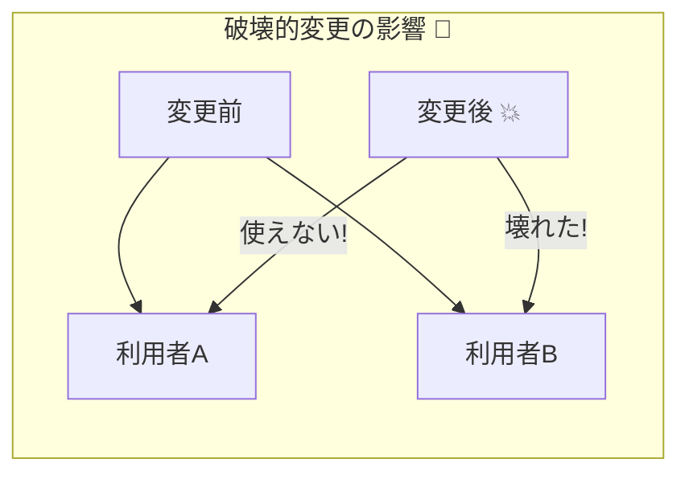
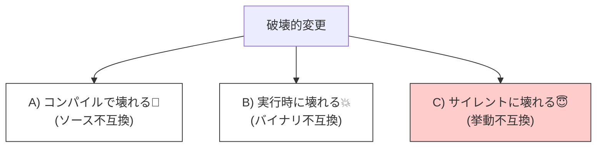

# 第5章：破壊的変更（Breaking Change）あるある💥

## この章のゴール🎯

* 「それ、破壊的変更かも…😇」を**早めに嗅ぎ分け**られる
* 破壊の種類を「**どこで壊れる？**（コンパイル／実行時／サイレント）」で分類できる
* 変更例を見て「**ソース互換／バイナリ互換／挙動互換**」どれが壊れたか当てられる✅

---

## 5-1. 破壊的変更ってなに？💣




**破壊的変更（Breaking Change）**は、ざっくり言うと
「使う側（利用者）が、今まで通りに使えなくなる変更」だよ😵‍💫

そして公式ドキュメントでは、破壊的変更は次の3種類で整理されることが多いよ👇

* **Binary incompatible（バイナリ非互換）**：古い利用側バイナリが、新しい実装に差し替えると動かない（ロード失敗や実行不能など）
* **Source incompatible（ソース非互換）**：新SDK/新参照でビルドし直すと、ソースがコンパイルできない
* **Behavioral change（挙動変更）**：ビルドも実行もできるのに、動きが変わる（事故りやすい😇）
  ([Microsoft Learn][1])

---

## 5-2. 破壊の“壊れ方”は3パターン🧨（超大事）



破壊的変更って、「どこで壊れるか」で体感が全然ちがうよ👇

## A) コンパイルで壊れる（気づきやすい😊）

* メソッド削除／名前変更
* 引数の型変更、数変更
* 戻り値型変更
* public→internal などアクセス変更

➡️ **ソース互換が壊れた**サインになりがち✅

---

## B) 実行時に壊れる（びっくり系😱）

* 古い利用側（ビルド済み）が、新しいDLLに差し替えたら `MissingMethodException` など
* publicフィールド→publicプロパティへ置き換え（利用側は古いフィールド参照のまま）
* 例外が増えた／違う例外型になった

➡️ **バイナリ互換が壊れた**サインになりがち✅

---

## C) サイレントに壊れる（いちばん怖い😇）

* 丸めルールや単位が変わった（円→税込み円、みたいな）
* `null` の扱いが変わった（前は許してたのに、後から禁止っぽくなった）
* JSONのプロパティ名や意味が変わった（通信は成功するのに意味がズレる）
* 既定値（default）が変わった

➡️ **挙動互換が壊れた**サインになりがち✅

---

## 5-3. 破壊的変更「あるある」カタログ💥（実務で遭遇しがち）

ここからは “遭遇率が高い順” のイメージでいくよ🧁✨
（「これやると壊れやすい」＝地雷マップ🗺️）

---

## あるある①：publicメソッドの削除／名前変更✂️

* **壊れ方**：コンパイルエラー（気づける）
* **壊れる互換**：ソース互換 ❌
* **利用者の気持ち**：「え、急に消えたんだけど！？😭」

---

## あるある②：引数の追加（特に“後ろに1個足す”）➕

* **壊れ方**：

  * 使う側を**ビルドし直したら**コンパイルエラー（必須引数なら）
  * 使う側が**ビルド済みのまま**なら、差し替えで実行時に壊れる（メソッド見つからない系）😱
* **壊れる互換**：バイナリ互換 ❌（そして場合によってソース互換も）
* **ポイント**：「シグネチャが変わる」＝だいたい危険⚠️

---

## あるある③：publicフィールド→publicプロパティに変更🧱

* **壊れ方**：ビルド済み利用者が実行時に壊れる（フィールドが消えた扱い）😱
* **壊れる互換**：バイナリ互換 ❌
* **やりがち理由**：「カプセル化したくなった」気持ちはわかる🥺

---

## あるある④：例外の種類・タイミングが変わる🚧

* **壊れ方**：実行時に落ちる、またはハンドリングが効かなくなる
* **壊れる互換**：挙動互換 ❌（場合によってバイナリ互換も）
* **地雷**：

  * 前は `false` を返してたのに、後から例外を投げる
  * 例外型が変わって `catch` が拾えない

---

## あるある⑤：「意味」を変える（最凶）🕳️

* **壊れ方**：動くけど結果が違う（サイレント事故）😇
* **壊れる互換**：挙動互換 ❌
* **例**：

  * `total` が「税抜」→「税込」に変わった
  * `status=1` の意味が変わった
  * 丸めが “切り捨て” → “四捨五入” に変わった

---

## あるある⑥：nullability（null許可）を後から厳しくする☂️

* **壊れ方**：

  * 利用側はコンパイルできる（警告が増える）
  * でも実行時に `ArgumentNullException` が増える、みたいなズレが起きやすい
* **壊れる互換**：挙動互換 ❌（設計上の契約が変わる）
* **コツ**：最初に「null許可/不許可」を決めるのが超大事⚡

---

## 5-4. 「壊れたサイン」早見表🔍（現場で役立つやつ）

## コンパイルで壊れたら🧱

* エラー：`CS1061 'X' does not contain a definition for 'Y'`
* エラー：`CS1503 cannot convert from ...`
  ➡️ **ソース互換が死んだ**可能性が高い😵

## 実行時に壊れたら💥

* 例外：`MissingMethodException`
* 例外：`MissingFieldException`
  ➡️ **バイナリ互換が死んだ**可能性が高い😱

## 何もエラー出ないのにおかしい😇

* 数値がズレる、意味がズレる、条件分岐が逆っぽい
  ➡️ **挙動互換が死んだ**可能性が高い🕳️

---

## 5-5. ミニクイズ✅「どの互換が壊れた？」（答えつき）

> ルール：次の変更が入ったとき、主にどれが壊れる？
> A: ソース互換 / B: バイナリ互換 / C: 挙動互換（または複合）
> ※公式もこの3分類で破壊的変更を整理してるよ📘 ([Microsoft Learn][1])

---

## Q1. `public void Pay()` を `public void PayV2()` にリネームした

* **答え**：A（ソース互換）❌
* **理由**：呼び出し側が `Pay()` を呼べなくなる（コンパイルで気づく）🧱

---

## Q2. `public int Add(int a, int b)` を削除した

* **答え**：A（ソース互換）❌
* **理由**：呼べない（コンパイルで死ぬ）💥

---

## Q3. `public int Add(int a, int b)` を `public long Add(long a, long b)` に変えた

* **答え**：A（ソース互換）❌（＋Bも危ない）
* **理由**：型が変わって呼び出しが合わない🧱／差し替え運用だと実行時も危険😱

---

## Q4. `public int TimeoutSeconds = 30;` を `public int TimeoutSeconds { get; set; } = 30;` にした

* **答え**：B（バイナリ互換）❌
* **理由**：ビルド済み利用者がフィールド参照のままだと実行時に壊れる😱

---

## Q5. `public string? Name { get; set; }` を `public string Name { get; set; }` にした

* **答え**：C（挙動互換）❌（設計契約が変わる）
* **理由**：今まで `null` を入れてた利用者が実行時に落ちる/破綻しやすい☂️

---

## Q6. `public decimal Total` の意味を「税抜」→「税込」に変えた

* **答え**：C（挙動互換）❌
* **理由**：動くけど結果が違う＝サイレント事故😇

---

## Q7. 以前は失敗時 `false` を返してたのに、失敗時に例外を投げるようにした

* **答え**：C（挙動互換）❌
* **理由**：利用側の分岐が崩れる／未ハンドリング例外で落ちる😵‍💫

---

## Q8. JSONの `userId` を `id` にリネームした（Web API/DTOの話）

* **答え**：C（挙動互換）❌
* **理由**：通信は成功しても、受け側が読めない・値が消える…のに気づきにくい😇

---

## 5-6. ミニ実習🛠️「わざと壊して、壊れ方を体験する」

ここは “体で覚える” パートだよ💪✨
**同じ変更でも「ビルドし直すか／差し替えるか」で壊れ方が変わる**のがポイント🎯

---

## 実習の題材：小さなライブラリ契約を作る📦

* ライブラリ：`ContractLib`
* 利用アプリ：`ConsumerApp`

---

## Step 1：v1（最初の契約）を作る🌱

### `ContractLib`（Class Library）

```csharp
namespace ContractLib;

public sealed class PriceService
{
    // v1 契約：税抜合計を返す
    public decimal CalcTotal(int quantity, decimal unitPrice)
        => quantity * unitPrice;

    // v1 契約：設定は public フィールド（ありがち）
    public int TimeoutSeconds = 30;
}
```

### `ConsumerApp`（Console）

```csharp
using ContractLib;

var svc = new PriceService();

var total = svc.CalcTotal(2, 1200m);
Console.WriteLine($"total={total}"); // 2400

svc.TimeoutSeconds = 10;
Console.WriteLine($"timeout={svc.TimeoutSeconds}");
```

✅ ここまで動けばOK🎉

---

## Step 2：破壊①「フィールド→プロパティ」へ変更してみる💥（バイナリ非互換の定番）

`ContractLib` をこう変える👇

```csharp
namespace ContractLib;

public sealed class PriceService
{
    public decimal CalcTotal(int quantity, decimal unitPrice)
        => quantity * unitPrice;

    // v2-ish：フィールドをプロパティに置換（見た目は同じ名前）
    public int TimeoutSeconds { get; set; } = 30;
}
```

### 期待される現象👀

* `ConsumerApp` を**再ビルド**すると普通に通ることが多い（ソース的には `svc.TimeoutSeconds` が同じ書き方で通る）😊
* でも、もし現場で「アプリはビルドし直さず、DLLだけ差し替え」みたいな運用をしてると…
  **実行時に `MissingFieldException` 系で爆発💥**しやすい😱

➡️ これが「**バイナリ互換が壊れる**」の体感！

---

## Step 3：破壊②「意味を変える（税抜→税込）」😇（サイレント破壊の代表）

`CalcTotal` をこう変える👇（例：税10%を足す）

```csharp
namespace ContractLib;

public sealed class PriceService
{
    // v2-ish：税込に変更（でも名前は同じ…😇）
    public decimal CalcTotal(int quantity, decimal unitPrice)
        => quantity * unitPrice * 1.10m;

    public int TimeoutSeconds { get; set; } = 30;
}
```

### 期待される現象👀

* コンパイルも実行も成功✅
* でも出力が `2400` → `2640` に変わる
* 利用側が「税抜のつもり」で計算してたら、地味に致命傷🕳️

➡️ これが「**挙動互換が壊れる**」の体感！

---

## Step 4：破壊③「引数を追加」➕（差し替えで爆発しやすい）

`CalcTotal` をこう変える👇

```csharp
namespace ContractLib;

public sealed class PriceService
{
    public decimal CalcTotal(int quantity, decimal unitPrice, bool includeTax)
        => includeTax ? quantity * unitPrice * 1.10m : quantity * unitPrice;
}
```

### 期待される現象👀

* 利用側をビルドし直したら、呼び出しが合わずコンパイルで死ぬ🧱
* DLL差し替えだと、古い呼び出し先シグネチャが存在せず実行時に死ぬ😱

➡️ 「**シグネチャ変更はだいたい危険**」が身にしみるやつ！

---

## 5-7. AIで“破壊っぽさ”を早期発見する🤖✨（下書き係として使う）

AIは超便利だけど、**「契約の最終決定」は人間の仕事**だよ👩‍🏫✨
（でも、発見スピードは上げられる！🚀）

## 便利プロンプト例🧠

```text
次の変更差分を見て、破壊的変更の可能性を
(1) ソース互換 / (2) バイナリ互換 / (3) 挙動互換
の観点で分類して。利用者への影響例と、安全な代替案も提案して。
```

```text
このAPI変更を、後方互換のまま実現する案を3つ出して。
「追加だけで済む案」「段階的廃止（Obsolete）案」「v2で割り切る案」の3パターンで。
```

`.NET 10` への移行や破壊的変更対応でAIを活用する話は、公式アナウンスでも触れられているよ📘([Microsoft for Developers][2])

---

## まとめ📌（第5章）

* 破壊的変更は「**どこで壊れる？**」で整理すると強い💪

  * コンパイル🧱＝ソース互換
  * 実行時💥＝バイナリ互換
  * サイレント😇＝挙動互換
* “意味変更” と “nullabilityの後出し変更” は事故りやすい⚡
* 公式も「Binary / Source / Behavioral」で破壊的変更を分類して公開している📘([Microsoft Learn][1])

[1]: https://learn.microsoft.com/en-us/dotnet/core/compatibility/10 "Breaking changes in .NET 10 | Microsoft Learn"
[2]: https://devblogs.microsoft.com/dotnet/announcing-dotnet-10/ "Announcing .NET 10 - .NET Blog"
