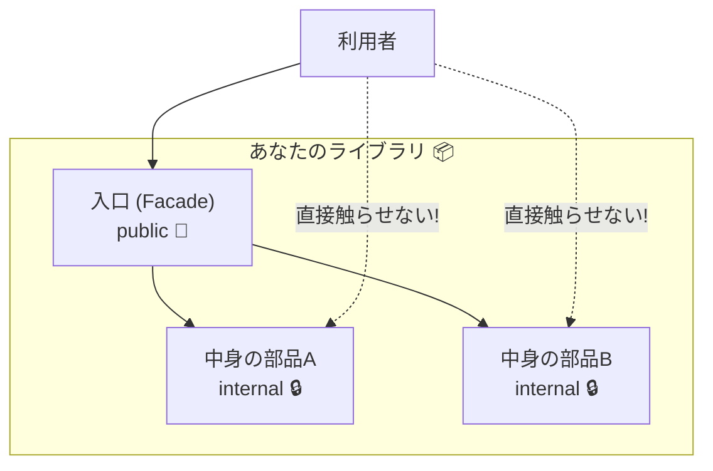
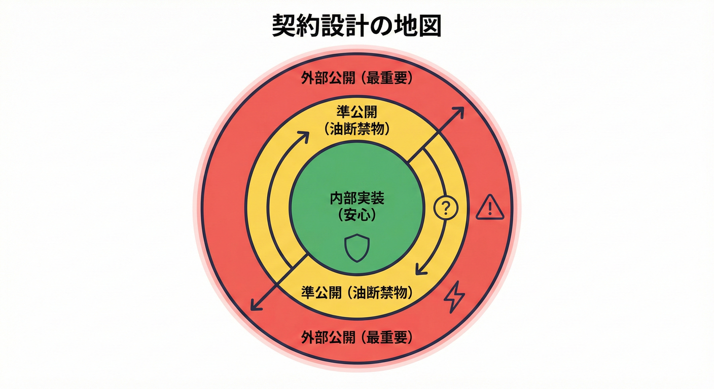
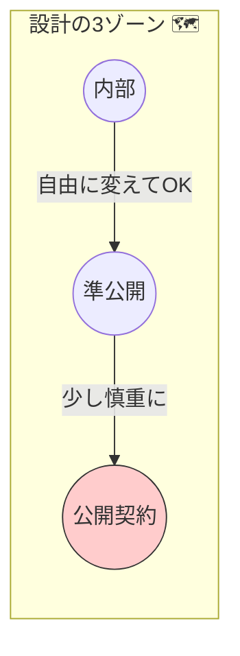

# 第06章：契約設計の全体像🗺️（最小の公開面を作る）

## この章でできるようになること🎯✨

* 「どこまでが契約（守る約束）？」を、自分のコードで線引きできるようになる✂️
* 公開面（public API）を **小さく** して、未来の自分を助ける設計ができるようになる🛡️
* C#の `public / internal / private` を “契約の境界線” として使えるようになる🔒
* まずは **壊れにくいv1（最小契約）** を作れるようになる🌱

---

## 1) 「契約設計」って、結局なに？😊📌




契約（Contract）設計はひとことで言うと、

**「外に見せる“約束”を小さく決めて、そこだけは守り続ける」**

ってことです✨

ここで大事なのが👇
**“外に見せる”＝公開面（surface）** です。

---

## 2) 公開面（surface）ってどこ？🧠🔍

C#の世界だと、ざっくりこう👇

* `public`（外から呼べる）→ **契約になりやすい**
* `protected`（継承先から呼べる）→ **契約になりやすい（さらに危険度高め）**
* `internal`（同じアセンブリ内だけ）→ **契約にしなくて済むことが多い**
* `private`（クラス内だけ）→ **契約じゃない（安心ゾーン）**

アクセス修飾子の意味自体はこの公式説明が基準だよ📘 ([Microsoft Learn][1])

---

## 3) なんで「公開面は小さいほどいい」の？🧨➡️🛡️

公開面が大きいほど、守る約束が増えます😵💦
守る約束が増えると…

* ちょっと名前を変えただけで利用側が壊れる💥
* 仕様を少し変えただけで「挙動互換」が崩れる😇
* 直したいのに「公開してしまったから消せない」地獄が始まる🔥

つまり、公開面は **「未来の自分への負債」になりやすい**んだよね💳😵

---

## 4) 契約設計の“地図”🗺️✨



（3つのゾーンで考える）

設計初心者さんは、まずこれだけ覚えればOK👍💕

1. **内部実装ゾーン（安心）**

   * `private` / `internal`
   * どんどん変えてOK🌪️

2. **準公開ゾーン（ちょい慎重）**

   * `internal` だけど、テストや別プロジェクトから触る可能性がある
   * なるべく触る範囲を限定する✋

3. **公開契約ゾーン（超慎重）**

   * `public` / `protected`
   * ここは「契約」＝守る対象📌
   * 変更するなら互換性を意識する（次章以降のテーマ）🔢

---

## 5) 「最小の公開面」を作るコツ 7つ💡✨

### コツ①：まず “public を最小” にする🌱

最初のv1は、**使う側が本当に困らない最小セット**だけを公開しよう🎀
（公開してから増やすのは比較的安全。公開してから減らすのは大事故💥）

### コツ②：`protected` は極力少なめにする🧬⚠️

`protected` を増やすと、継承して使われる前提が増えて、後で超しんどい…！😵
「拡張してほしい」はまず **interface** や **委譲（composition）** を検討すると安全寄り🛡️

### コツ③：引数・戻り値に “内部の型” を出さない🙅‍♀️📦

公開メソッドの型に、内部クラスが混ざると契約が太るよ⚡
公開側は「安定しやすい型（DTO/record/enum）」に寄せるのが基本🍡

### コツ④：公開クラスは “入口（Facade）” を用意する🚪✨

内部の細かい部品をいっぱい公開せずに、
**公開は1〜2個の入口クラス**にまとめると契約が小さくなるよ🎯

### コツ⑤：例外やエラーの方針は “後で決めない”🚧

「とりあえず例外投げとく」は、後で直すと挙動互換で事故りがち😇
（エラー契約は13〜14章でしっかりやるよ🧡）

### コツ⑥：名前は “契約の言葉”📝✨

`public` の型名・メソッド名は、そのまま利用者のコードに残る📌
恥ずかしくない名前にする（未来の自分が読む）😂

### コツ⑦：公開する前に「契約一覧」を書く📄✅

「何が契約か」を自分で言語化できると、設計が急に上手くなるよ🌸
（10章で“見える化”をもっと強化するよ📌）

---

## ミニ実習🛠️✨：公開面を“入口1つ”に絞って v1 を作る

## ゴール🎯

* ライブラリ側は `public` を必要最小限にする
* 利用側（コンソール）からちゃんと使える
* 内部実装は `internal` に押し込む

---

## Step 1：プロジェクトを作る📁✨

* クラスライブラリ：`ContractDemo.Lib`
* コンソール：`ContractDemo.App`
* `ContractDemo.App` から `ContractDemo.Lib` を参照

---

## Step 2：まず “公開する契約” を決める🧠📌

今回の契約（公開面）はこれだけ👇（最小！）

* `public enum NameOrder`
* `public sealed class DisplayNameFormatter`

  * `public string Format(string familyName, string givenName, NameOrder order = NameOrder.FamilyGiven)`

「入口は `DisplayNameFormatter` だけ」🚪✨
内部は好きに変えられるようにするよ😊

---

## Step 3：ライブラリ実装を書く（公開と内部を分ける）✍️

```csharp
// ContractDemo.Lib/NameOrder.cs
namespace ContractDemo.Lib;

public enum NameOrder
{
    FamilyGiven,
    GivenFamily
}
```

```csharp
// ContractDemo.Lib/DisplayNameFormatter.cs
namespace ContractDemo.Lib;

public sealed class DisplayNameFormatter
{
    public string Format(string familyName, string givenName, NameOrder order = NameOrder.FamilyGiven)
    {
        Guard.NotNullOrWhiteSpace(familyName, nameof(familyName));
        Guard.NotNullOrWhiteSpace(givenName, nameof(givenName));

        // “契約”として見せたい挙動だけここに置く（ルールは内部に逃がす）
        var f = InternalNameRules.Normalize(familyName);
        var g = InternalNameRules.Normalize(givenName);

        return order switch
        {
            NameOrder.FamilyGiven => $"{f} {g}",
            NameOrder.GivenFamily => $"{g} {f}",
            _ => $"{f} {g}"
        };
    }
}
```

```csharp
// ContractDemo.Lib/InternalNameRules.cs
namespace ContractDemo.Lib;

internal static class InternalNameRules
{
    internal static string Normalize(string s)
    {
        // 内部実装：将来ルール変えても、公開面は変えなくて済む✨
        return s.Trim();
    }
}
```

```csharp
// ContractDemo.Lib/Guard.cs
namespace ContractDemo.Lib;

internal static class Guard
{
    internal static void NotNullOrWhiteSpace(string value, string paramName)
    {
        if (string.IsNullOrWhiteSpace(value))
            throw new ArgumentException("空文字や空白はダメだよ🫶", paramName);
    }
}
```

ポイント🌟

* 利用者が触るのは `DisplayNameFormatter` と `NameOrder` だけ😊
* `Guard` や `InternalNameRules` は `internal` で隠してOK🔒
* こうしておくと、内部のルール変更は “契約変更” になりにくい🛡️

---

## Step 4：利用側から使ってみる（壊れない入口）🚀

```csharp
// ContractDemo.App/Program.cs
using ContractDemo.Lib;

var formatter = new DisplayNameFormatter();

Console.WriteLine(formatter.Format("徳川", "家康"));
Console.WriteLine(formatter.Format("徳川", "家康", NameOrder.GivenFamily));
```

---

## 体験チェック✅：「公開面」を目で確認しよう👀✨

## Visual Studio の場合🧰

* **オブジェクト ブラウザー（Object Browser）** や **IntelliSense** で
  `ContractDemo.Lib` の `public` がどれだけあるか見る🔎
* 「公開したくないものが public になってない？」を確認するのが目的だよ🎯

## VS Code の場合🧰

* IntelliSense で `ContractDemo.Lib` の補完候補を見る
* `internal` は外から出ないので、候補に出ない＝隠せてる👍✨

---

## よくある “公開面が増えちゃう” 事故あるある😇💥

* 便利そうだから `public class Utility` を量産しちゃう
* DTOのプロパティを全部 `public set;` にしちゃう（あとで変えにくい）
* `protected virtual` で拡張ポイントを作りすぎる（契約が増殖🧟‍♀️）
* 引数や戻り値に「内部の型」や「将来変えそうな型」を出しちゃう

---

## 成果物📦：「契約一覧（v1）」テンプレ

次の章に行く前に、これだけ書けたら強いよ💪💕

* 契約（公開してるもの）

  * `DisplayNameFormatter.Format(...)`：入力 → 表示名にする
  * `NameOrder`：表示順の指定
* 契約に含めない（内部）

  * `Guard`：入力チェック
  * `InternalNameRules`：整形ルール

---

## AI活用🤖✨（下書き係として使うと超ラク！）

ここは、GitHub の Copilot や OpenAI 系ツールでやると速いよ💨
（Visual Studio 2026 は AI 機能が強化されてる流れもあるよ🧠✨） ([Microsoft for Developers][2])

## 使える定番プロンプト例🪄

* 「この機能をライブラリ化したい。public API を最小にするなら、公開すべき型とメソッドを3つ以内で提案して」
* 「このクラスの内部実装っぽい部分を internal に分離して、Facade を1つにまとめて」
* 「利用側が迷わないメソッド名にしたい。候補を5つ出して、意図も説明して」
* 「このAPIを使うサンプル（Console）を書いて。public しか使わないで」
* 「public にすると危険な点（互換性）をレビュー観点で指摘して」

---

## まとめ📌✨（この章のキモ）

* 契約＝「外に約束した形」
* 公開面（surface）＝ **契約になりやすい場所**
* 公開面は小さいほど安全🛡️
* v1は「入口1つ」くらいから始めると強い🌱
* `internal` を味方にすると、設計が急に楽になるよ🔒

---

## ミニクイズ🎓✅（3問）

1. `internal` のクラスは、別プロジェクトから参照できる？🤔
2. `protected` を増やしすぎると、何がつらくなる？😵
3. 公開メソッドの引数に “内部の型” を出すと、どんな問題が起きやすい？💥

（答えは：7章以降の「互換性」とセットで理解が固まるよ🔢✨）

---

### 参考：この教材で使う最新前提（根拠）

* .NET 10 は LTS として提供されているよ📦✨ ([Microsoft for Developers][3])
* C# 14 は .NET 10 と一緒に使うのが基本だよ🧡 ([Microsoft for Developers][4])

[1]: https://learn.microsoft.com/ja-jp/dotnet/csharp/programming-guide/classes-and-structs/access-modifiers?utm_source=chatgpt.com "アクセス修飾子 (C# プログラミング ガイド)"
[2]: https://devblogs.microsoft.com/visualstudio/visual-studio-november-update-visual-studio-2026-cloud-agent-preview-and-more/?utm_source=chatgpt.com "Visual Studio 2026 November 2025 Update"
[3]: https://devblogs.microsoft.com/dotnet/announcing-dotnet-10/?utm_source=chatgpt.com "Announcing .NET 10"
[4]: https://devblogs.microsoft.com/dotnet/introducing-csharp-14/?utm_source=chatgpt.com "Introducing C# 14 - .NET Blog"
