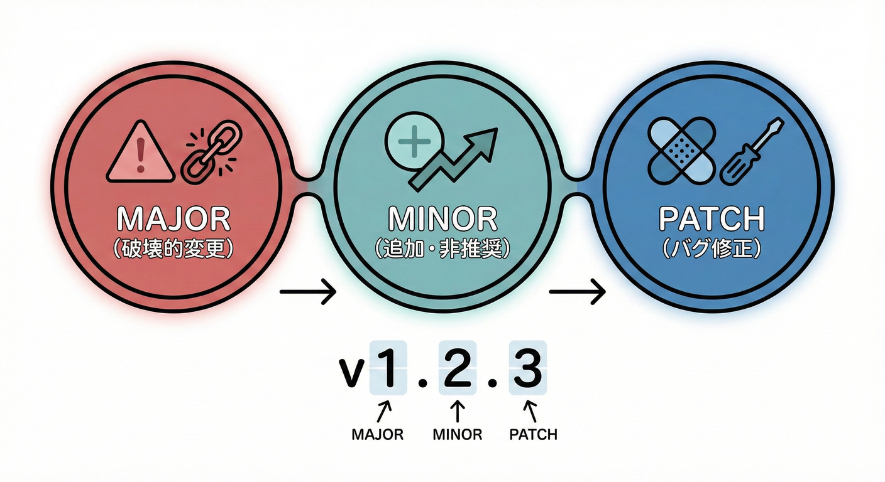
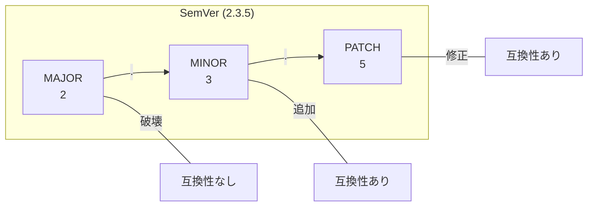
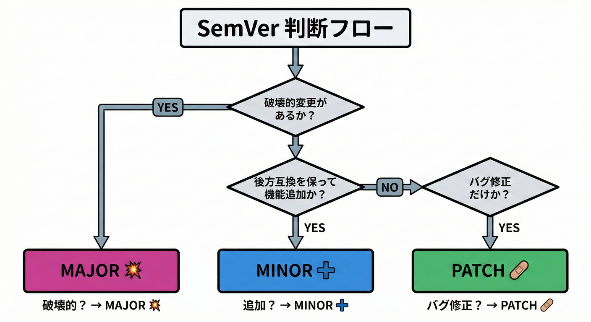
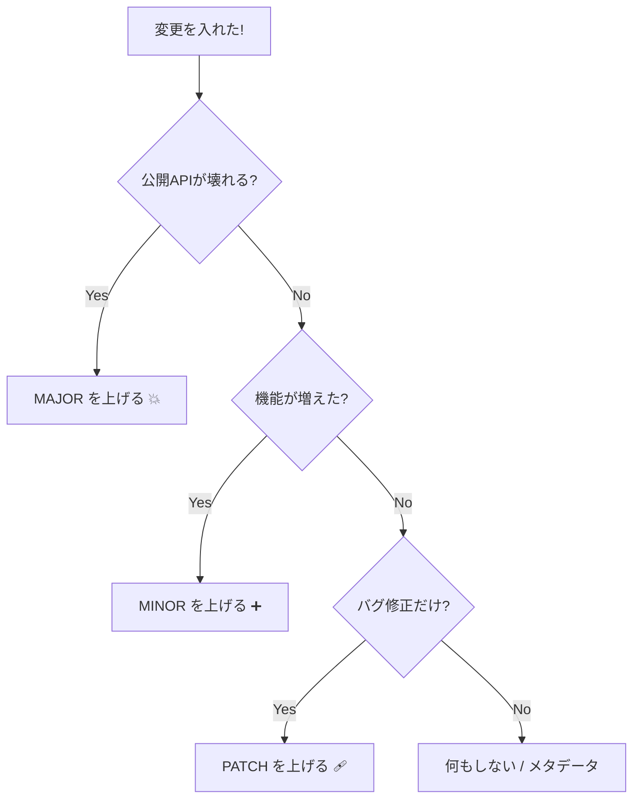

# 第07章：SemVer入門🔢（MAJOR/MINOR/PATCH）

## この章のゴール🎯✨

* `MAJOR.MINOR.PATCH` を見て「どう変わったのか」が想像できるようになる😊
* 変更内容から「どの数字を上げるべきか」を自信を持って選べるようになる💪
* “バージョン＝約束のラベル🏷️” って感覚が身につく🌸

---

## 1. SemVerってなに？🤔💡




**SemVer（Semantic Versioning）** は、バージョン番号に意味を持たせるルールだよ😊
基本は **`MAJOR.MINOR.PATCH`（例：`2.3.5`）** の3つの数字で、「互換性（壊れる？壊れない？）」を伝える🎁

SemVerの仕様（ルール本体）はここにまとまってるよ📘 ([Semantic Versioning][1])

---

## 2. まず大事：SemVerが守るのは「公開API」🧸🔒

SemVerは、**公開API（外に約束してる部分）** がどう変わるかで数字を決めるよ✨ ([Semantic Versioning][1])

公開APIってどれ？（C#の例だよ👇）

* `public` なクラス / メソッド / プロパティ / enum など（＝呼ばれる前提のもの）
* 受け渡しする型（DTO的なもの、戻り値の型、引数の型）
* 例外やエラーの出し方（「この時はこの例外」も契約になりがち😇）
* コメントやドキュメントに “保証” として書いたこと（あとで揉めるやつ💦）

逆に、`private` や内部実装は基本「契約の外」だよ（ただし挙動が変わると事故ることはある🫠）

---

## 3. 3つの数字の意味🔢✨（超重要）

SemVer 2.0.0 ではこう決まってるよ👇 ([Semantic Versioning][1])

## ✅ PATCH（例：`1.2.3 → 1.2.4`）🩹

* **後方互換（壊さない）なバグ修正だけ**
* 「内部の誤りを直した」イメージ✨
* “仕様として間違ってた挙動” を正すのが基本だよ🧼 ([Semantic Versioning][1])

## ✅ MINOR（例：`1.2.3 → 1.3.0`）➕

* **後方互換のまま機能追加**（新しいメソッド追加など）
* **非推奨（deprecated）を付けた時も MINOR**（重要！） ([Semantic Versioning][1])
* MINORを上げたら **PATCHは0に戻す**（`1.2.9 → 1.3.0`） ([Semantic Versioning][1])

## ✅ MAJOR（例：`1.2.3 → 2.0.0`）💥

* **後方互換が壊れる変更**（Breaking Change）
* MAJORを上げたら **MINOR/PATCH は0に戻す**（`1.9.9 → 2.0.0`） ([Semantic Versioning][1])

---

## 4. まずはこれだけ覚えれば勝てる判断フロー🧭✨




迷ったらこの順でOKだよ😊

```text
① 公開APIが壊れる？（呼べない・型が変わる・意味が変わる）→ MAJOR 💥
② 壊さずに機能が増える？（新しい呼び方が増える）→ MINOR ➕
③ バグ修正だけ？（呼び方は変わらない）→ PATCH 🩹
```

そして超大事ルール👇
**「一度出したバージョンは書き換えない」**（同じ番号で中身を変えない）
変えたら必ず新しいバージョンにするよ📦 ([Semantic Versioning][1])

---

## 5. “0.y.z” と “1.0.0” の意味🌱➡️🌳

## `0.y.z`（例：`0.4.2`）は “まだ不安定” 🧪

SemVer的には、**0系は「何でも変わり得る」** 扱いなんだよね😌
公開APIは安定版と見なさない、って書かれてるよ📘 ([Semantic Versioning][1])

## `1.0.0` は「公開APIを定義した」宣言📣

`1.0.0` で「ここからが本気の約束だよ」って扱いになる✨ ([Semantic Versioning][1])

---

## 6. プレリリース（`-alpha` / `-beta` / `-rc`）ってなに？🧪✨

SemVerでは、安定版の前にこういうのを付けられるよ👇

* `1.2.0-alpha`
* `1.2.0-beta.2`
* `1.2.0-rc.1` ([Semantic Versioning][1])

ポイントはこれ😊

* `1.2.0`（安定版）より、`1.2.0-rc.1`（プレリリース）の方が **優先度が低い**（＝安定版が強い） ([Semantic Versioning][1])
* `alpha < beta < rc < (安定版)` みたいに “段階” を表現できる🎈

## NuGetだとどうなる？📦

NuGetも基本はSemVerの優先順位に従うよ（安定版が優先、プレリリースは後） ([Microsoft Learn][2])
さらに、プレリリースの慣習（alpha/beta/rc）も整理されてるよ📘 ([Microsoft Learn][2])

---

## 7. ビルドメタデータ（`+something`）はどう扱う？🧩

SemVerでは `+` 以降は **優先順位に影響しない**（同じ扱い）ってルールだよ✨ ([Semantic Versioning][1])
例：`1.0.0+001` と `1.0.0+999` は “並び順” には関係ない😊

そして NuGet では、実務上は **`+` のメタデータを取り除いて扱う**（正規化）って説明があるよ📦 ([Microsoft Learn][2])
なので、NuGet運用では「`+` を付けても別物として扱われない」ことが多いと思ってOK👌

---

## 8. ミニ実習🎯：この変更、どの数字を上げる？（10問）✨

今は直感でOK！あとで答え合わせするよ😊💕

## 問題✍️

1. 変数名を少し整理した（public APIは無変更）
2. 計算ロジックのバグを直した（呼び方は同じ）
3. `public` メソッドを1つ追加した
4. 既存メソッドに **新しい引数を必須で追加** した
5. 既存メソッドを削除した
6. 既存メソッドの戻り値型を `int` → `long` に変えた
7. 既存の挙動を「意味が変わるレベル」で変更した（例：丸め規則が変わる）
8. 既存機能に `[Obsolete]` を付けた（まだ動く）
9. `public enum` に値を追加した
10. `1.3.0` を出す前の試作品として `1.3.0-rc.1` を配りたい

---

## 解答✅（理由つき）

1. **PATCH** 🩹（公開API無変更なら基本はパッチ寄り）
2. **PATCH** 🩹（後方互換のバグ修正） ([Semantic Versioning][1])
3. **MINOR** ➕（後方互換の機能追加） ([Semantic Versioning][1])
4. **MAJOR** 💥（呼び出し側がコンパイルできなくなる）
5. **MAJOR** 💥（呼び出し側が壊れる）
6. **MAJOR** 💥（型が変わる＝契約が変わる）
7. **MAJOR** 💥（“意味” が変わるのは破壊的になりやすい😇）
8. **MINOR** ➕（非推奨を付けたらMINOR） ([Semantic Versioning][1])
9. 基本は **MINOR** ➕（ただし、呼び出し側が `switch` を網羅してると実害が出ることもある💦）
10. **プレリリース** 🧪（例：`1.3.0-rc.1`） ([Semantic Versioning][1])

---

## 9. ハンズオン🛠️：C#で「バージョンの上げ分け」を体験しよう✨

ここは “肌感” を作るパートだよ😊🌸
（まだNuGet公開はしない。ローカルでOK👌）

## 9.1 最小の構成を作る📁

* **Class Library**：`MyCalc`
* **Console App**：`MyCalcConsumer`

`MyCalc` にこう書く👇

```csharp
namespace MyCalc;

public static class Calc
{
    public static int Add(int a, int b) => a + b;
}
```

`MyCalcConsumer` 側👇

```csharp
using MyCalc;

Console.WriteLine(Calc.Add(2, 3));
```

---

## 9.2 “バージョン” を csproj で管理する🏷️

`MyCalc.csproj` に `Version` を入れる（見える化✨）

```xml
<PropertyGroup>
  <Version>1.0.0</Version>
</PropertyGroup>
```

> バージョン番号は「この契約のラベル」だよ🏷️
> いったん `1.0.0` を出したら、中身を変える時は **新しいバージョン** にするのがルール😊 ([Semantic Versioning][1])

---

## 9.3 PATCHの例🩹：バグ修正だけ

わざとバグを作る👇（※例としてね！）

```csharp
public static int Add(int a, int b) => a - b; // 😱
```

直す👇（呼び方は変わらない）

```csharp
public static int Add(int a, int b) => a + b; // ✅
```

この場合は **`1.0.0 → 1.0.1`（PATCH）** が基本だよ🩹 ([Semantic Versioning][1])

---

## 9.4 MINORの例➕：後方互換の機能追加

メソッドを追加👇（既存コードは壊れない）

```csharp
public static int Multiply(int a, int b) => a * b;
```

この場合は **`1.0.1 → 1.1.0`（MINOR）** ➕
（MINORを上げたらPATCHは0に戻すよ） ([Semantic Versioning][1])

---

## 9.5 MAJORの例💥：呼び出し側が壊れる変更

例えば、メソッド名を変える👇

```csharp
public static int Sum(int a, int b) => a + b;
```

`Calc.Add(2,3)` を使ってた側が **コンパイルエラー** になるよね😵
これは **`1.x.x → 2.0.0`（MAJOR）** 💥 ([Semantic Versioning][1])

---

## 10. AI（Copilot / Codex等）に頼るときの“使い方”🤖✨

AIは超便利だけど、**「契約の境界」を誤解しやすい** のが落とし穴😇
なので、聞き方をテンプレ化すると安定するよ💕

## そのまま使える定番プロンプト集🪄

```text
あなたはライブラリのSemVer判定係です。
変更点は以下です（公開API/挙動/例外/戻り値の観点で整理して）。
そして、次のバージョンを MAJOR/MINOR/PATCH のどれにすべきか提案して。
最後に「利用者が壊れる可能性がある点」を箇条書きで出して。
```

```text
この差分は「公開APIが変わったか？」をまず判定して。
変わったなら、どの利用者コードが壊れるかを具体例付きで説明して。
```

## AIの回答で最後に見るチェック✅

* 「public APIが変わった？」をちゃんと見てる？
* “挙動の意味変更” を軽く扱ってない？（ここ事故りがち😇）
* 「非推奨＝MINOR」ルールを落としてない？ ([Semantic Versioning][1])

AIツールの例としては **GitHub Copilot** や **OpenAI 系のコーディング支援** があるよ🤖✨

---

## 11. SemVerとNuGet運用の“すれ違い注意”⚠️📦

SemVerは「約束の意味」だけど、実務では “依存関係の解決” も絡むよ😵

## 依存関係が絡むと何が起きる？🧩

* NuGetは依存関係を解決する時、いくつかのルールでバージョンを選ぶよ
  （例：lowest applicable version / floating versions など） ([Microsoft Learn][3])
* `6.0.*` みたいな **floating** を使うと「常に最新に寄せる」ができるけど、再現性が落ちやすいのでロックファイル推奨、って説明があるよ📌 ([Microsoft Learn][3])

このへんは “SemVerを正しく振ってても事故る” ポイントになりやすいから、頭の片隅に置いとこ😊

---

## 12. まとめ🎀✨（この章の持ち帰り）

* SemVerは **公開APIの約束を番号で伝える仕組み** 🏷️ ([Semantic Versioning][1])
* **壊す＝MAJOR / 追加＝MINOR / 修正＝PATCH** の3択が基本🎯 ([Semantic Versioning][1])
* **非推奨を付けたらMINOR**（地味だけど超大事）⚠️ ([Semantic Versioning][1])
* プレリリース（`-alpha/-beta/-rc`）は「不安定版」の表現🧪 ([Semantic Versioning][1])
* NuGetの世界ではSemVerを前提にしつつ、依存解決ルールも影響する📦 ([Microsoft Learn][3])

（補足：.NET 10 が 2025-11-11 にリリースされ、LTSとして 2028-11-10 までサポート、Visual Studio 2026 の更新も同時に提供されているよ📣） ([devblogs.microsoft.com][4])

[1]: https://semver.org/ "Semantic Versioning 2.0.0 | Semantic Versioning"
[2]: https://learn.microsoft.com/en-us/nuget/concepts/package-versioning "NuGet Package Version Reference | Microsoft Learn"
[3]: https://learn.microsoft.com/en-us/nuget/concepts/dependency-resolution "NuGet Package Dependency Resolution | Microsoft Learn"
[4]: https://devblogs.microsoft.com/dotnet/announcing-dotnet-10/ "Announcing .NET 10 - .NET Blog"
