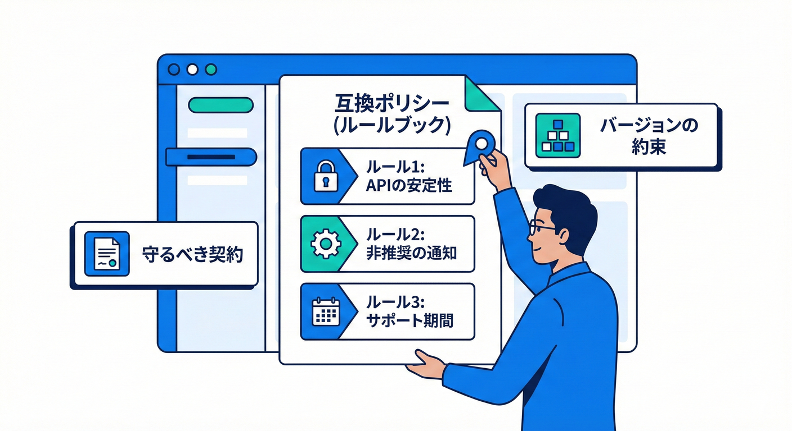
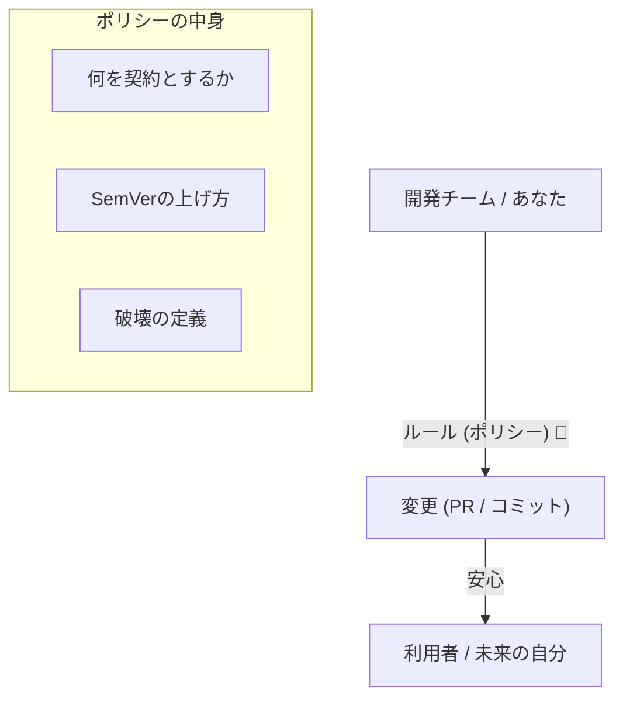
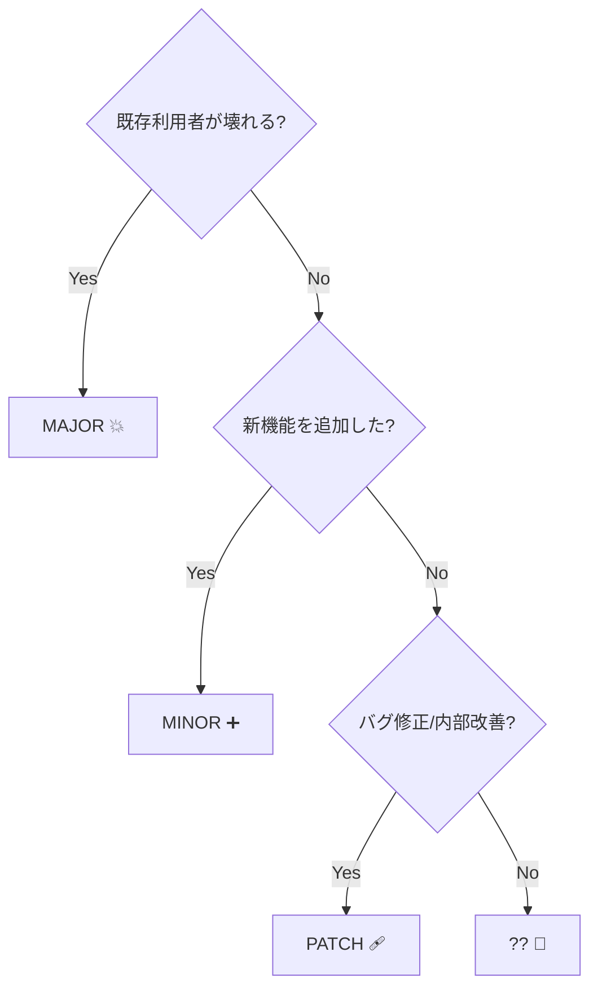

# 第8章：互換ポリシーを決める📜（チームが1人でも必要）

## この章でできるようになること🎯✨

* 「どんな変更ならOK？」「どこから破壊？」を、**文章のルール（ポリシー）**として固定できる🧷
* **SemVer（MAJOR/MINOR/PATCH）**と「互換性」の関係を、実務で迷わない形にできる🔢
* 例外（緊急対応・バグ修正のグレーゾーン）も先に決めて、未来の自分を救える🛟

---

## 8-1. そもそも互換ポリシーってなに？🤔📜




互換ポリシーは、ひとことで言うと **「変更のルールブック」** です📕✨
たとえば「MINORは後方互換だけ」「破壊はMAJORだけ」「廃止はまずObsoleteで告知」みたいに、**判断基準を文章で固定**します🧠🧷

## なんで1人開発でも必要？👤💡

1人でも、利用者は増えます👇

* ✅ 未来の自分（半年後の自分は他人😇）
* ✅ サンプルコードや別プロジェクト
* ✅ NuGetで配った場合の利用者
* ✅ 社内の別チーム、別サービス

ルールがないと、変更のたびに毎回こうなりがち👇

* 「これって破壊？どうしよ…😵」
* 「とりあえずMINOR上げとく？😇」
* 「利用側が突然壊れた！😱」

---

## 8-2. まず決めるべきは「何を契約扱いにするか」🧩

互換ポリシーは、いきなりバージョン番号を語る前に **“守る対象”** を決めます🛡️

## 守る対象（契約）になりやすいもの📌

* public な型・メソッド・プロパティ（＝公開API）
* DTO（JSON等）に出るフィールド名・型・意味
* 例外の種類、戻り値の意味、null許可
* 既定値（デフォルト値）の意味
* 「この入力ならこう動く」の挙動（動作仕様）

※「互換性に影響する変更」を分類する考え方は、.NET公式でも整理されています。([Microsoft Learn][1])

---

## 8-3. SemVer（バージョンの約束）を“ルール”に落とす🔢🏷️

SemVerの基本はこう👇

* **MAJOR**：互換性を壊す変更（Breaking）
* **MINOR**：互換のまま機能追加
* **PATCH**：互換のままバグ修正 ([Semantic Versioning][2])

ここまでは第7章でやったとして、**第8章は「じゃあ自分たちは何を“互換”と呼ぶ？」を決める章**です📜✨

---

## 8-4. 「後方互換」の定義をチーム（＝自分）用に固定しよう🧷

後方互換って、ふわっとしてると事故ります😇
なので、ポリシーではこういう文章にします👇

## よく使う宣言例（そのまま使ってOK）✅

* **「v1.0.0以降、MINOR/PATCHでは後方互換を保証する」**
* **「破壊的変更はMAJORでのみ行う」**
* **「利用者コードが再ビルド不要で動く（バイナリ互換）ことを重視する」**（ライブラリ向け）
* **「動作変更は“バグ修正”か“破壊”かを必ず明記する」**

.NETの世界だと「互換性」は、主にこういう観点で語られます👇（第4章の復習💞）

* ソース互換：コンパイル通る？
* バイナリ互換：再ビルド無しで動く？
* 挙動互換：動作の意味が変わってない？ ([Microsoft Learn][3])

---

## 8-5. 互換ポリシーに必ず入れる「変更分類」🧱

ポリシーは「判断の瞬間」に役立つ必要があります⚡
なので、**変更を分類して、バージョン上げルールに直結**させます🧠✨

## 変更分類のテンプレ（まずこれでOK）📌

### A. 互換（PATCH候補）🩹

* 内部実装の最適化（public API不変）
* バグ修正（“仕様どおり”に近づける）
* パフォーマンス改善（結果が同じ）

### B. 互換拡張（MINOR候補）➕

* 新しい public API を追加（既存はそのまま）
* DTOに **フィールド追加**（既存フィールドの意味は不変）
* オプション機能追加（デフォルト挙動が変わらない）

### C. 破壊（MAJOR確定）💥

* public API の削除 / 名前変更 / シグネチャ変更
* 例外型の変更（利用側のcatchが壊れる）
* DTOのフィールド削除 / 型変更
* 互換のつもりでも結果の意味が変わる挙動変更

.NET公式でも、互換性に影響する変更をどう扱うかの“考え方”が示されています（PRでAPIを変える人向けの説明もあります）。([Microsoft Learn][1])

---

## 8-6. 一番事故るやつ：「バグ修正」のグレーゾーン😇🌀

「バグ修正だからPATCHでしょ？」と思いがちだけど、利用者が“バグに依存”してたら、それは実質破壊です😵

だからポリシーに、こう書いておくと強いです👇

## グレーゾーン対策の文章例📝

* **「外から観測できる挙動が変わる修正は、影響を評価し“破壊扱い”も選択肢にする」**
* **「バグ修正でも、利用者に影響が出そうなら変更ログに必ず明記する」**
* **「既存の回避策が不要になる修正は、移行メモ（こう直してね）を付ける」**

---

## 8-7. 「例外」も最初に決めておく🚑📌

ポリシーって、例外がないと運用で破綻しがちです😇
よくある例外パターンを、最初から文章で決めましょう✨

## 例外の定番パターン✅

* 🔥 緊急（セキュリティ/重大障害）

  * 互換を崩す可能性があっても修正を優先する場合がある
  * その場合は **MAJOR** か、少なくとも **明確な周知** を必須にする
* 🧯 実験段階（0.y.z期間）

  * SemVerでは **0.y.zは不安定でもよい** という扱いがあります（安定APIの約束は1.0.0から）。([Semantic Versioning][2])

---

## 8-8. 「互換ポリシー」ドキュメントの完成形テンプレ📄✨

このまま `COMPATIBILITY.md` にしてOKです🧡
（あとで章10の「契約一覧」とセットで強くなるよ！）

```md
## Compatibility Policy（互換ポリシー）

## 1. 対象（このポリシーが守る契約）
- Public API（public な型/メソッド/プロパティ）
- DTO（外部に出るデータ形式）
- エラーの契約（例外/戻り値/エラーコード）
- Null許可（nullable の扱い）
- 仕様として明文化された挙動

## 2. バージョニング（SemVer）
- MAJOR.MINOR.PATCH を採用する
- 1.0.0 以降は互換性を重視する

## 3. 互換性の約束（Compatibility Promise）
- MINOR / PATCH では後方互換を保証する
- 破壊的変更（Breaking Change）は MAJOR のみ

## 4. 変更分類とバージョンの上げ方
## PATCH（互換のまま修正）
- バグ修正（外部仕様が大きく変わらない）
- 内部改善（public API不変）

## MINOR（互換のまま拡張）
- 新しい public API 追加（既存は不変）
- DTO フィールド追加（既存の意味を変えない）

## MAJOR（破壊）
- public API 削除/変更/名前変更
- DTO 削除/型変更
- 例外契約の変更
- 意味が変わる挙動変更

## 5. グレーゾーン（バグ修正で挙動が変わる場合）
- 外部から観測できる挙動が変わる場合は影響評価を行う
- 影響が大きい場合は MAJOR を検討する
- いずれの場合も変更ログに明記する

## 6. 非推奨（Deprecated）方針
- まず Obsolete 等で告知期間を設ける
- 次の MAJOR で削除する

## 7. 例外（緊急対応）
- セキュリティ/重大障害対応では例外的に優先する場合がある
- ただし周知と変更ログの明記は必須

## 8. 運用（リリース時チェック）
- 変更が契約に触れていないか確認する
- バージョン番号の妥当性を確認する
- 変更ログに「何が変わった / どう直す」を書く
```

---

## 8-9. バージョン判断の“超かんたんフローチャート”🔁✨



迷ったらこれだけ守ると事故が激減します🛡️

1. **既存の利用者が壊れる？**（コンパイル/実行/意味が変わる）

* YES → **MAJOR** 💥
* NO → 次へ

2. **新しい機能を追加した？**（互換のまま）

* YES → **MINOR** ➕
* NO → 次へ

3. **バグ修正や内部改善だけ？**

* YES → **PATCH** 🩹

4. **「バグ修正だけど挙動変わる…」**

* 影響小：PATCHでもOK（でも変更ログ必須）📝
* 影響大：MAJORも検討（ポリシーに従う）🚨

SemVerの増分ルール自体は上の通り定義されています。([Semantic Versioning][2])

---

## 8-10. ミニ実習🛠️：「変更例」を分類してみよう🎯

次の変更が来たとして、A/B/Cどれ？そしてバージョンは？😊

## 問1：publicメソッドの引数を1つ追加した

* 例：`DoWork(int x)` → `DoWork(int x, int y)`
  → だいたい **C（破壊）**（既存バイナリが呼べなくなることがある）💥

## 問2：新しいpublicメソッドを追加した（既存は無変更）

→ **B（互換拡張）** ➕

## 問3：DTOにフィールドを追加した（既存フィールドは無変更）

→ 多くのケースで **B（互換拡張）** 🍡
（ただしクライアント側の厳格バリデーション次第で事故るので、ポリシーに注意書きすると強い✨）

## 問4：例外の種類を変えた（`InvalidOperationException` → `ArgumentException`）

→ **C（破壊）**（catchが変わる）🚧

---

## 8-11. AIを「下書き係」にする使い方🤖✍️✨

AIは便利だけど、**契約の最終決定は人間がやる**のが安全です🧠🛡️
（とくに破壊判定は事故が高い😇）

## Copilot / Codex に投げる定番プロンプト集🧁

### ① ポリシー草案を作る

* 「このライブラリの公開API（public）を契約として、互換ポリシーの `COMPATIBILITY.md` を草案作って。SemVerで、MINOR/PATCHは後方互換、破壊はMAJOR。バグ修正のグレーゾーンも章立てに入れて。」

### ② 変更が破壊か判定させる（レビュー補助）

* 「この変更は source/binary/behavior のどれに影響する？破壊なら理由も。バージョンをMAJOR/MINOR/PATCHどれにすべきか提案して。」

### ③ 変更ログの雛形を作る

* 「利用者が最短で直せるように、変更ログ（What changed / Impact / How to migrate）を下書きして。」

Visual Studio 2026では、GitHub Copilot ChatがコミットやPRコメントと連携する機能なども案内されています（設定で有効化するタイプのものもあります）。([Microsoft Learn][4])

---

## 8-12. 章末チェックリスト✅✨（これが書けたら勝ち）

* [ ] 「契約扱いする範囲」を文章で書いた📌
* [ ] MAJOR/MINOR/PATCHのルールが決まってる🔢
* [ ] 破壊の定義（ソース/バイナリ/挙動）が入ってる🧱
* [ ] “バグ修正グレーゾーン”の扱いが決まってる😇
* [ ] 例外（緊急対応）ルールがある🚑
* [ ] 運用（リリース前チェック）がある👀

---

## この章の成果物📦

* `COMPATIBILITY.md`（互換ポリシー）1枚完成✨

[1]: https://learn.microsoft.com/en-us/dotnet/core/compatibility/library-change-rules?utm_source=chatgpt.com "NET API changes that affect compatibility"
[2]: https://semver.org/?utm_source=chatgpt.com "Semantic Versioning 2.0.0 | Semantic Versioning"
[3]: https://learn.microsoft.com/en-us/dotnet/standard/library-guidance/breaking-changes?utm_source=chatgpt.com "Breaking changes and .NET libraries"
[4]: https://learn.microsoft.com/en-us/visualstudio/releases/2026/release-notes?utm_source=chatgpt.com "Visual Studio 2026 Release Notes | Microsoft Learn"
