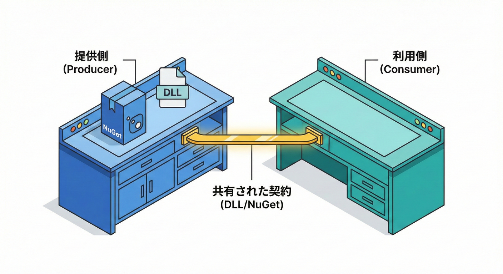
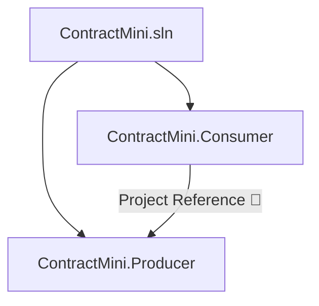

# 第9章：教材用ミニプロジェクトを作る🛠️（Producer/Consumer）

## この章のゴール🎯✨

この章が終わったら、次の状態になります😊💕

* 「提供側（Producer）」＝契約（Contract）を“公開する”プロジェクト
* 「利用側（Consumer）」＝その契約を“使う”プロジェクト
* 2つを同じリポジトリに置いて、**“変更すると壊れる”を安全に体験できる土台**が完成🎉
* 以降の章で、C#の契約（public API）を少しずつ変えて、互換性の事故を学べるようになるよ🧠⚡

---

## Producer / Consumer ってなに？🧩


超ざっくり言うと、こうです👇✨

* **Producer（提供側）**：
  「この形（型・メソッド・戻り値・例外）で提供するよ！」という **約束（契約）** を外に出す人📦
* **Consumer（利用側）**：
  その約束を信じてコードを書く人🧑‍💻

イメージ図📌

```text
Producer（契約を公開📦）  ──▶  Consumer（契約を利用🧩）
  public API が「契約」            public API に依存する
```

ここで超大事なのはこれ👇😇

* **Producerの public は“契約”**（＝簡単に変えちゃダメな部分）
* **Producerの internal/private は“内部実装”**（＝比較的自由に変えてOKな部分）

---

## まず作るリポジトリ構成📁✨

この章では、こういう形にします👇（超スタンダードで分かりやすい！）

```text
ContractMini/
  src/
    ContractMini.Producer/     ← 契約を公開する側📦
    ContractMini.Consumer/     ← 契約を使う側🧩
  ContractMini.sln             ← ソリューション
  .gitignore
  .editorconfig
  README.md
```



> .NET 10は `dotnet new sln` の既定が `.slnx` になったよ（新しい形式）。でもこの教材では、混乱しにくいように **`.sln`** を使っていくね🧸✨（必要なら `--format sln` を使う）([Microsoft Learn][1])

---

## 実習①：GUIで作る（ソリューション＋2プロジェクト）🪄✨

## 1) 空のソリューションを作る🧰

1. **新規作成** → **空のソリューション**（Blank Solution）を選ぶ
2. ソリューション名：`ContractMini`
3. 保存場所：好きな作業フォルダ

---

## 2) Producer（クラスライブラリ）を追加📦

1. ソリューションを右クリック → **追加** → **新しいプロジェクト**
2. **クラス ライブラリ（Class Library）** を選ぶ
3. プロジェクト名：`ContractMini.Producer`
4. フレームワーク：`net10.0`

---

## 3) Consumer（コンソール）を追加🧩

1. ソリューションを右クリック → **追加** → **新しいプロジェクト**
2. **コンソール アプリ（Console App）** を選ぶ
3. プロジェクト名：`ContractMini.Consumer`
4. フレームワーク：`net10.0`

---

## 4) Consumer から Producer を参照する🔗

1. `ContractMini.Consumer` を右クリック
2. **追加** → **プロジェクト参照**
3. `ContractMini.Producer` にチェック ✅
4. OK

これで Consumer 側から Producer の public API が使えるようになります🎉

---

## 実習②：CLIで作る（PowerShell）⚡

GUIより速い派はこちら😎✨
（途中で出てくる `.slnx` の話は “今は知らなくてOK” だけど、最新の挙動として押さえておくと安心💡）

## 1) フォルダ作成＋ソリューション作成

```powershell
mkdir ContractMini
cd ContractMini

## .NET 10 は既定が .slnx なので、教材では .sln を明示
dotnet new sln --name ContractMini --format sln
```

> `.NET 10` では `dotnet new sln` が既定で SLNX 形式になるよ。`.sln` が欲しいなら `--format sln` が推奨アクションだよ📌([Microsoft Learn][1])

---

## 2) Producer / Consumer を作る

```powershell
mkdir src
cd src

dotnet new classlib -n ContractMini.Producer -f net10.0
dotnet new console  -n ContractMini.Consumer -f net10.0
```

---

## 3) ソリューションに追加＋参照設定

```powershell
cd ..

dotnet sln .\ContractMini.sln add .\src\ContractMini.Producer\ContractMini.Producer.csproj
dotnet sln .\ContractMini.sln add .\src\ContractMini.Consumer\ContractMini.Consumer.csproj

dotnet add .\src\ContractMini.Consumer\ContractMini.Consumer.csproj reference `
  .\src\ContractMini.Producer\ContractMini.Producer.csproj
```

`dotnet sln` はソリューション内のプロジェクトを一覧・追加・移行できる公式コマンドだよ🧰([Microsoft Learn][2])

---

## 4) `.gitignore` と `.editorconfig` を作る🧼✨

```powershell
dotnet new gitignore
dotnet new editorconfig
```

`.NET SDK` には `.gitignore` と `.editorconfig` のテンプレが最初から入ってるよ✅（公式テンプレ一覧に載ってる）([Microsoft Learn][3])

---

## 実習③：Producer に「v1の契約」を置く📦✨

ここがこの章のメイン🌟
まずは **小さくて分かりやすい契約** を作るよ😊

## 1) Producer に新規ファイルを追加📄

`src/ContractMini.Producer/Greeter.cs` を作って、これを書いてね👇

```csharp
namespace ContractMini.Producer;

/// <summary>
/// こんにちはメッセージを作るサービス（この public が「契約」だよ）
/// </summary>
public sealed class Greeter
{
    public GreetingResult CreateGreeting(GreetingRequest request)
    {
        if (string.IsNullOrWhiteSpace(request.Name))
            throw new ArgumentException("Name is required.", nameof(request));

        var language = (request.Language ?? "ja").ToLowerInvariant();

        var message = language switch
        {
            "en" => $"Hello, {request.Name}!",
            _    => $"こんにちは、{request.Name}！"
        };

        return new GreetingResult(message);
    }
}

/// <summary>
/// 入力DTO（public ＝契約）
/// </summary>
public sealed record GreetingRequest(string Name, string? Language = null);

/// <summary>
/// 出力DTO（public ＝契約）
/// </summary>
public sealed record GreetingResult(string Message);
```

### ここで“契約っぽさ”を感じよう🧠💡

* `Greeter` / `CreateGreeting(...)` の **名前と引数と戻り値** が契約📌
* `GreetingRequest` / `GreetingResult` の **プロパティ（Name / Language / Message）** も契約📌
* `public` を増やすほど「守るべき契約」が増えるよ😵（だから最初は小さく🌱）

---

## 2) internal の “自由に変えていい場所” を作る（任意）🧸

同じ Producer に `GreetingTemplates.cs` を作って👇

```csharp
namespace ContractMini.Producer;

internal static class GreetingTemplates
{
    internal static string Build(string language, string name) =>
        language switch
        {
            "en" => $"Hello, {name}!",
            _    => $"こんにちは、{name}！"
        };
}
```

そして `Greeter` 側をちょい置き換え👇

```csharp
var message = GreetingTemplates.Build(language, request.Name);
return new GreetingResult(message);
```

こうすると、

* **契約（public）** はなるべく触らず
* **内部実装（internal）** で改良していく

…って感覚が掴みやすくなるよ😊✨

---

## 実習④：Consumer から呼び出して動かす🧩✨

`src/ContractMini.Consumer/Program.cs` をこれにしてね👇

```csharp
using ContractMini.Producer;

var greeter = new Greeter();

var result1 = greeter.CreateGreeting(new GreetingRequest("こみやんま"));
Console.WriteLine(result1.Message);

var result2 = greeter.CreateGreeting(new GreetingRequest("Komiyamma", "en"));
Console.WriteLine(result2.Message);
```

実行✅

```powershell
dotnet run --project .\src\ContractMini.Consumer\ContractMini.Consumer.csproj
```

出力イメージ🌸

```text
こんにちは、こみやんま！
Hello, Komiyamma!
```

---

## 実習⑤：最初の“成果物”を整える📌✨

## README を最小で作る📝

`README.md`（例）

* このリポジトリは Producer/Consumer で契約破壊を体験する教材
* 実行方法（dotnet run）
* この章で作った契約（Greeter / GreetingRequest / GreetingResult）

---

## Git の最初のコミット（任意だけど超おすすめ）🐙✨

```powershell
git init
git add .
git commit -m "ch09 scaffold producer-consumer"
```

---

## AI活用（“下書き係”にするコツ）🤖✨

この章は **AIに手伝わせやすい** ところが多いよ💕

## 使いやすい頼み方例📣

* 「Producer 側の public API は最小にしたい。DTOとメソッドを3つ以内で設計して」
* 「Consumer から呼び出すサンプルコードを、例外が起きるケースも含めて3パターン出して」
* 「README の最小テンプレを、手順と目的が伝わる感じで作って」

## 注意ポイント⚠️（超大事！）

* AIは **public を増やしがち** 😇
  →「public は契約なので最小に！」って毎回言ってあげると良い✨
* AIは **“便利そうなオプション”を盛りがち** 🍰
  →今は学習の土台なので、**機能は少なめ** が正解🙆‍♀️

---

## チェックポイント✅（ここまでできたら勝ち🎉）

* [ ] `ContractMini.Producer` と `ContractMini.Consumer` が同じソリューションにある
* [ ] Consumer が Producer を参照している（ビルドが通る）
* [ ] `Greeter.CreateGreeting(...)` が呼べて、実行結果が出る
* [ ] public と internal の違いを “なんとなく” 体感できた✨

---

## よくあるつまずき集🧯

## 😵「Consumer から型が見えない！」

* ほぼ確実に **プロジェクト参照が入ってない**
  → Consumer に Producer の参照を追加しよう🔗

## 😵「ビルドは通るのに実行が変」

* `Language` の入力が `EN` みたいに大文字だったりする
  → `.ToLowerInvariant()` みたいな “小さな防御” は内部実装でやると安全🛡️

---

## この章で作った“契約（v1）”まとめ📌✨

* `Greeter`

  * `GreetingResult CreateGreeting(GreetingRequest request)`
* `GreetingRequest`

  * `Name`
  * `Language`
* `GreetingResult`

  * `Message`

ここが「壊れると Consumer が困る場所」＝ **契約（Contract）** だよ😊💞

---

## （豆知識）C# 14 と .NET 10 って今どうなってるの？🔍✨

* `C# 14` は `Visual Studio 2026` または `.NET 10 SDK` で試せる（最新機能リストも公式にまとまってるよ）([Microsoft Learn][4])
* `.NET 10` は LTS として **3年間サポート** されるよ🛡️([Microsoft Learn][5])
* `Visual Studio 2026` は 2026年1月時点でも更新が続いていて、AI連携（Copilot周り）もリリースノートで継続的に強化されてるよ🤖([Microsoft Learn][6])

[1]: https://learn.microsoft.com/en-us/dotnet/core/compatibility/sdk/10.0/dotnet-new-sln-slnx-default "Breaking change - `dotnet new sln` defaults to SLNX file format - .NET | Microsoft Learn"
[2]: https://learn.microsoft.com/en-us/dotnet/core/tools/dotnet-sln "dotnet sln command - .NET CLI | Microsoft Learn"
[3]: https://learn.microsoft.com/en-us/dotnet/core/tools/dotnet-new-sdk-templates ".NET default templates for 'dotnet new' - .NET CLI | Microsoft Learn"
[4]: https://learn.microsoft.com/ja-jp/dotnet/csharp/whats-new/csharp-14 "C# 14 の新機能 | Microsoft Learn"
[5]: https://learn.microsoft.com/en-us/dotnet/core/whats-new/dotnet-10/overview "What's new in .NET 10 | Microsoft Learn"
[6]: https://learn.microsoft.com/en-us/visualstudio/releases/2026/release-notes "Visual Studio 2026 Release Notes | Microsoft Learn"
