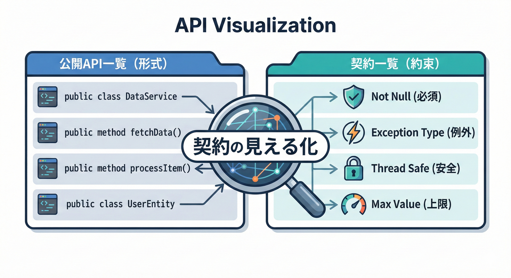
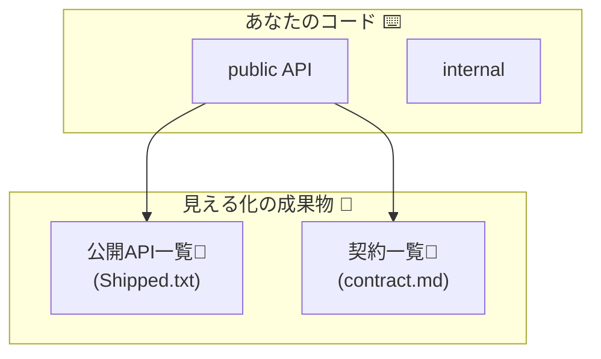
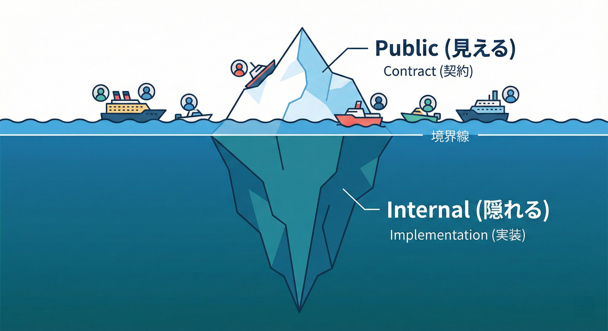
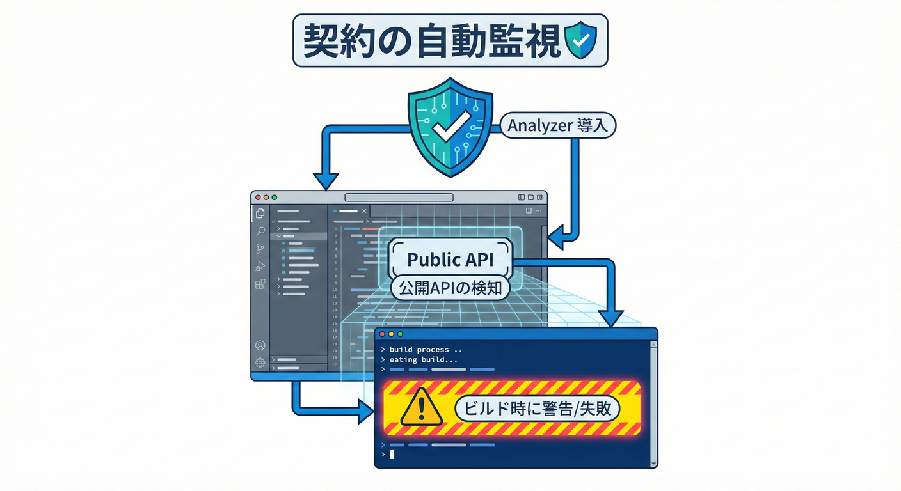
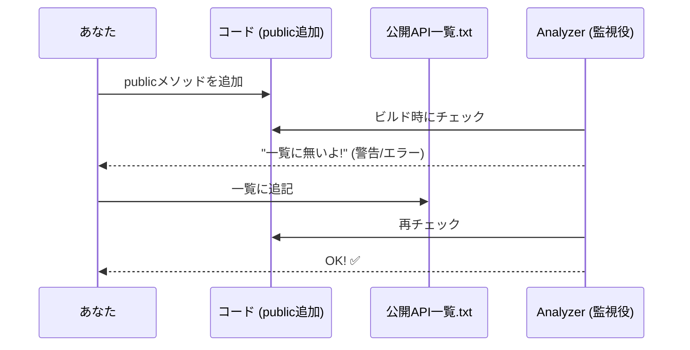
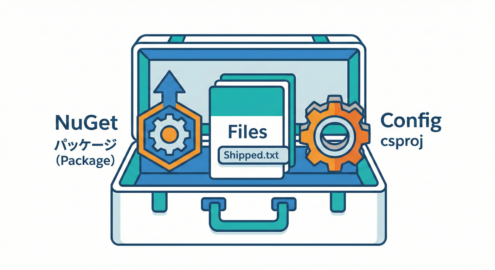
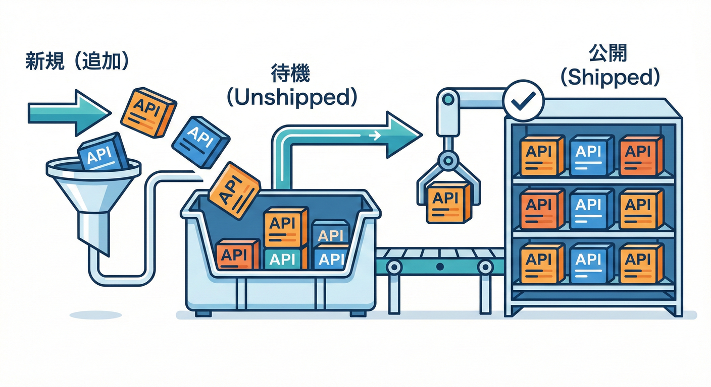
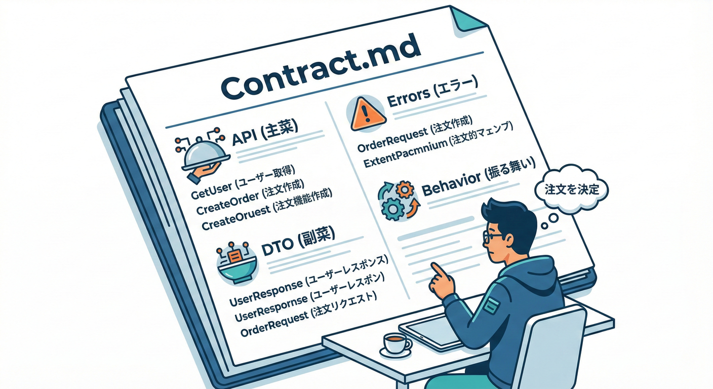
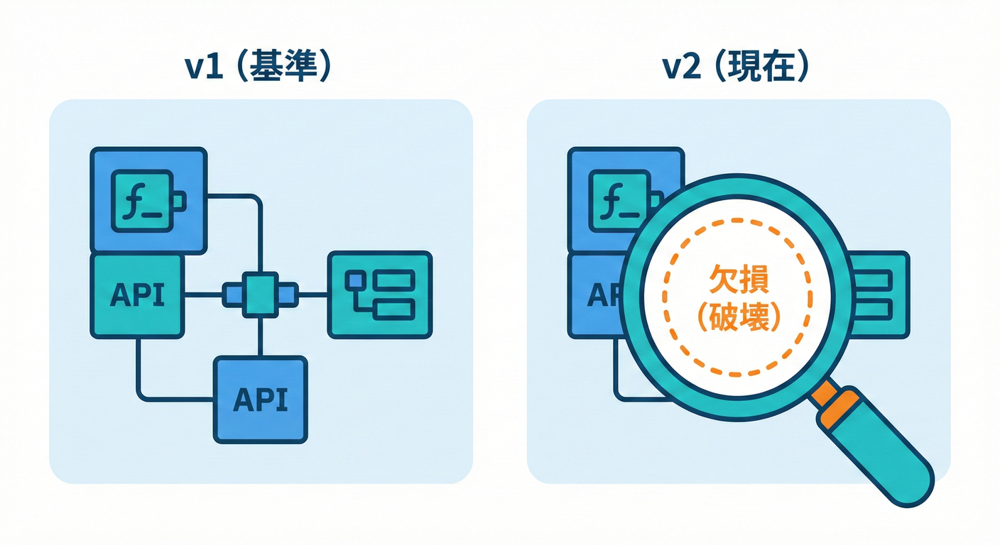

# 第10章：契約を見える化する📌（公開API一覧・契約一覧）

## この章でできるようになること🎯✨

* 「どこまでが契約（守る約束）？」を**線引き**できるようになる✂️
* いま公開しているもの（=壊したら困るもの）を **一覧化**できる👀📝
* 「うっかり public 追加」「うっかり削除」を **自動で検知**できるようにする🛡️⚙️
* チームが1人でも回る **契約ドキュメントの型**を作る📚✨

---

## 10.1 「契約を見える化」って、何をするの？🤔💡




契約（Contract）って、ざっくり言うとこう👇

* **外に約束してる形**（public API、DTO、エラー、挙動、制約…）
* それを **後から変えると**、利用者（未来の自分含む）が困る😇💥

だからこの章では、契約を「誰が見ても分かる形」にします！

## 見える化の成果物は2つ🌟

1. **公開API一覧（Public API list）**

   * いま外に公開してる「型・メソッド・プロパティ」などの一覧📃

2. **契約一覧（Contract list）**

   * そのAPIが「何を保証するか」も含めた約束ごとの一覧📜
   * 例：戻り値の意味、例外、null許可、スレッド安全性、互換ルール…など

---

## 10.2 まずは「公開面」を棚卸ししよう👀🧹


## 公開面（surface）ってどこ？🪟

C#だと基本はこれ👇

* `public` / `protected`（外から触れる可能性がある）
* `public` な型にぶら下がる `public` メンバー
* `public` なDTO（特に Web API やイベントで出すやつ）🍡📨

逆に、だいたい「内部」扱い👇

* `internal`
* `private`
* `file`（ファイルスコープ型）※C# 14でも使い分けがしやすくなってるよ😊 ([Microsoft Learn][1])

## “公開=契約” の強制ルール（超重要）🛑

**public にした瞬間、契約になっちゃう**と思ってOKです。
「とりあえず public」ってやるほど、未来の自分が泣きます😭

---

## 10.3 実習①：公開API一覧を「機械的に」作る🧰⚙️

ここからが本番！
**機械（ツール）にやらせて、人間はレビューする**のが勝ち筋です🤖✨

## 方法A：Public APIをテキストで固定する（おすすめ）📄✅

.NETの世界でよく使われるやり方がこれ👇

* `PublicAPI.Shipped.txt`（すでに公開して“守る”もの）
* `PublicAPI.Unshipped.txt`（次のリリースで公開予定のもの）

そして **Roslyn Analyzer** に見張らせます👮‍♀️✨
「public 追加したのに一覧に書いてないよ！」
「一覧にあるのにコードから消えてるよ！（破壊かも！）」
ってビルド時に教えてくれます💥

この仕組みの中心になるのが `Microsoft.CodeAnalysis.PublicApiAnalyzers` です。([nuget.org][2])

---

## 3. PublicApiAnalyzers を使ってみよう🛡️✨




## 10.4 実習②：PublicApiAnalyzers を導入して“公開API一覧”を作る🛠️✨


## Step 1：ライブラリ側（Producer）にパッケージ追加📦

Visual Studioなら「NuGet パッケージの管理」から
`Microsoft.CodeAnalysis.PublicApiAnalyzers` を追加でOK🙆‍♀️
（NuGet上で配布されてるよ）([nuget.org][2])

CLI派なら👇（コピペOK）

```powershell
dotnet add .\YourLibrary\YourLibrary.csproj package Microsoft.CodeAnalysis.PublicApiAnalyzers
```

## Step 2：2つのファイルを作る📄

ライブラリプロジェクト直下に作成👇

* `PublicAPI.Shipped.txt`
* `PublicAPI.Unshipped.txt`

中身は最初は空でOK！

## Step 3：csproj で “AdditionalFiles” 扱いにする🧷

（これを忘れると Analyzer が読めないことがあるよ⚠️）

```xml
<ItemGroup>
  <AdditionalFiles Include="PublicAPI.Shipped.txt" />
  <AdditionalFiles Include="PublicAPI.Unshipped.txt" />
</ItemGroup>
```

## Step 4：ビルドして「足りない分」を自動で埋める🧠✨

ここが気持ちいいポイント！

* ビルドすると「公開APIが一覧に無いよ！」って警告/エラーが出る
* Visual Studio の電球💡（クイックアクション）で
  **Unshipped に一括追加**できることが多いです（環境によって表示名は多少違うよ）

> 目的：**“公開API一覧”を、機械に作らせる**👏

---

## 10.5 “Shipped と Unshipped” の運用ルール🧭📅


## ざっくりルール（覚えるのこれだけ！）😽

* **新しく public を増やした**
  → いったん `PublicAPI.Unshipped.txt` に入る🆕
* **次のバージョンを正式に出す（リリース）**
  → `Unshipped` の中身を `Shipped` に“昇格”させる⬆️
* **Shipped にあるAPIを消した/変えた**
  → Analyzer が怒る＝破壊変更の可能性💥

この型を使うと「今どこまで約束してるか」がすぐ分かるようになります😊

---

## 10.6 実習③：契約一覧（Contract list）をドキュメント化する📝✨


公開API一覧は「形」だけ。
でも契約って「意味」も超大事！

だから次は **契約一覧** を作ります📜

## 契約一覧のテンプレ（そのまま使ってOK）🧩

`docs/contract.md` みたいなファイルを作って、こう書くのが鉄板です👇

* **対象**（どのライブラリ/API？）
* **利用者**（誰が使う？）
* **契約の範囲**（契約に含めるもの/含めないもの）
* **公開API（要点）**（特に重要な型・メソッド）
* **DTO契約**（null/未指定/既定値の扱い）
* **エラー契約**（例外 or Result、エラーコードの扱い）
* **挙動契約**（スレッド安全性、順序保証、重複、再試行時の性質など）
* **互換ルール**（SemVer とセットで）🔢
* **廃止ルール**（後の章の Obsolete に繋がる）🧓➡️🧑

例（超ミニ版）👇

```md
## Contract List: MyLibrary

## 1. Public API（守る対象）
- FooClient
  - FooClient.GetFooAsync(string id) : Task<Foo>

## 2. DTO / Null
- Foo.Name は null にならない
- Foo.Tags は null にならず、空配列になりうる

## 3. Errors
- id が null/空 → ArgumentException
- 見つからない → FooNotFoundException

## 4. Behavior
- GetFooAsync は I/O を行う（遅い可能性あり）
- 同じ id なら同じ結果を返す（ただしキャッシュは保証しない）
```

ポイントは、**「読む側が迷わない」**こと😊💕

---

## 10.7 実習④：破壊変更を“比較”で見える化する（ApiCompat）🔍⚙️


公開API一覧を作ったら、次は「差分チェック」もできると強いです💪

.NETには API互換性チェックの仕組みが用意されています。([Microsoft Learn][3])
その中でも手軽なのが **Microsoft.DotNet.ApiCompat.Tool**（グローバルツール）です🧰 ([Microsoft Learn][4])

## できること（超ざっくり）✨

* **新しい版** と **基準（前の版）** を比べて
  「消してない？」「変えてない？」をチェックできる✅ ([Microsoft Learn][4])

インストール例👇

```powershell
dotnet tool install --global Microsoft.DotNet.ApiCompat.Tool
```

※コマンドの細かいオプションは次章以降の「運用」でガッツリやるとスムーズです（この章では“存在を知る”がゴールでOK）😊 ([Microsoft Learn][4])

---

## 10.8 AI活用：契約の“抜け”を見つける🤖🔎✨


AIは「下書き係」として最強です💡
ただし **契約はウソつけない**ので、最後は必ず人間が確認ね😇

## Copilot Chat（Visual Studio）で使える質問例🗣️

Visual Studio には Copilot Chat が統合されています。([Microsoft Learn][5])

使うときのプロンプト例👇（そのまま貼ってOK）

* 「このプロジェクトの public 型と public メンバーを一覧にして、契約っぽい順に並べて」📋
* 「このAPIの利用者が困りそうな変更（破壊変更）を列挙して」💥
* 「docs/contract.md のテンプレをこのコードに合わせて埋めて（ただし推測は“推測”と書いて）」📝

GitHub公式の “IDEでCopilotに質問する” ガイドもあるので、迷ったらここを参考にすると楽です😊 ([GitHub Docs][6])

---

## 10.9 仕上げ：この章の提出物（成果物）📦✨

この章が終わったら、リポジトリにこれが入っていればOK！

* ✅ `PublicAPI.Shipped.txt`
* ✅ `PublicAPI.Unshipped.txt`
* ✅ `docs/contract.md`（契約一覧）
* ✅ 「契約/内部」の線引きが言語化されている（docs内でOK）✂️

---

## 10.10 チェックテスト（できた？）✅😊

次の質問に “はい” と言えたらクリア🎉

* public を追加したら、**Unshipped に増える**？（または警告が出る）
* public を消したら、**ビルド時に気づける**？💥
* 「このライブラリが約束してること」が、**docs/contract.md で説明できる**？📜
* 「契約に含めないもの（内部）」も、**ちゃんと書けてる**？🧹

---

## 10.11 よくある事故ポイント（先回り）🚑💦

* **“とりあえず public”** が増えて、契約が肥大化😵
  → `internal` を基本にして、公開は最小で！🌱

* **DTOの null/未指定/既定値が曖昧**で、後から地獄👹
  → 契約一覧に「nullになる？ならない？」を必ず書く☂️

* **動くけど意味が変わる**（挙動互換の事故）😇
  → 契約一覧に “意味” を書いておくと防げる📝

---

## 参考（この章の根拠になってる公式情報）📚✨

* .NET 10 が LTS であること・サポート期間など ([Microsoft for Developers][7])
* C# 14 が .NET 10 とセットであること（新機能の概要） ([Microsoft Learn][1])
* Visual Studio 2026 のリリースノート（Copilot関連の更新も含む） ([Microsoft Learn][8])
* Visual Studio の Copilot Chat 公式ドキュメント ([Microsoft Learn][5])
* .NETのAPI互換性チェック（ApiCompat含む） ([Microsoft Learn][3])

[1]: https://learn.microsoft.com/en-us/dotnet/csharp/whats-new/csharp-14?utm_source=chatgpt.com "What's new in C# 14"
[2]: https://www.nuget.org/packages/Microsoft.CodeAnalysis.PublicApiAnalyzers/?utm_source=chatgpt.com "Microsoft.CodeAnalysis.PublicApiAnalyzers 3.3.4"
[3]: https://learn.microsoft.com/en-us/dotnet/fundamentals/apicompat/overview?utm_source=chatgpt.com "API compatibility tools - .NET"
[4]: https://learn.microsoft.com/en-us/dotnet/fundamentals/apicompat/global-tool?utm_source=chatgpt.com "Microsoft.DotNet.ApiCompat.Tool global tool - .NET"
[5]: https://learn.microsoft.com/en-us/visualstudio/ide/visual-studio-github-copilot-chat?view=visualstudio&utm_source=chatgpt.com "About GitHub Copilot Chat in Visual Studio"
[6]: https://docs.github.com/copilot/using-github-copilot/asking-github-copilot-questions-in-your-ide?utm_source=chatgpt.com "Asking GitHub Copilot questions in your IDE"
[7]: https://devblogs.microsoft.com/dotnet/announcing-dotnet-10/?utm_source=chatgpt.com "Announcing .NET 10"
[8]: https://learn.microsoft.com/ja-jp/visualstudio/releases/2026/release-notes?utm_source=chatgpt.com "Visual Studio 2026 リリース ノート"
