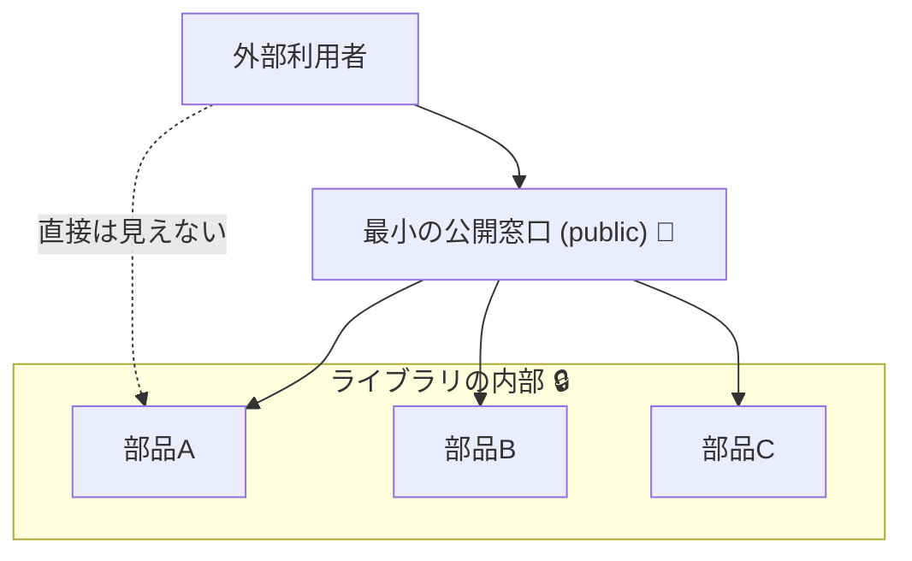

# 第11章：公開API設計の基本（まず小さく）🌱

## この章でできるようになること🎯✨

* 「公開API＝契約（Contract）」って感覚が身につく😊
* **public を増やしすぎない**設計のコツがわかる🛡️
* “利用者が壊れない” v1 の最小APIを作れるようになる💪
* うっかり破壊変更しやすいポイント（引数・オーバーロード・const など）を避けられる😇

---

## 11.1 公開APIってなに？（＝あなたが外に約束したもの）📦🤝

**公開API**は、ざっくり言うと「外部から見える `public` たち」です。
この `public` が増えるほど、守る約束（契約）が増える＝将来の変更コストが爆増します😵💥

公開APIに入るもの（例）👇

* `public` な **型名**（class/struct/record/enum など）
* `public` な **メンバー名**（メソッド、プロパティ、イベント…）
* **引数や戻り値の型**、`null` を許すかどうか
* オーバーロード（同名メソッドが複数あること）
* `public const` の値（これも契約！）

「利用者」は他人だけじゃないよ！未来の自分もガチ利用者🥹🫶

---

## 11.2 まず“小さく”作るのが最強な理由🔥

.NET の公式ガイドでも「破壊的変更は利用者に大きな悪影響」ってはっきり書かれています。特に低レベル（基盤）ライブラリほどキツい😱
さらに、**“新しいオーバーロード追加”ですら、以前は曖昧じゃなかった呼び出しが曖昧になってコンパイルエラー**になることもあります（＝ソース互換が壊れる）⚡ ([Microsoft Learn][1])

だから最初はこう考えるのが勝ちです👇

* ✅ v1 は **最小限**（使う人が迷わない）
* ✅ 追加はあとからできる（多くは後方互換で増やせる）
* ❌ 削除・変更は基本しんどい（破壊変更になりやすい）

---

## 11.3 “公開する前”に決める3つ✍️💡

### ① そのAPIの利用者は誰？👀

* 社内の別チーム？
* 自分の別アプリ？
* 将来 NuGet で配るかも？

利用者が広いほど、壊せない度が上がるよ😇

### ② そのAPIは「何を保証する」？🧾

例：

* 「負の値を渡したら例外」
* 「同じ入力なら同じ出力」
* 「小数は `decimal` を使う」
  こういう“当たり前”も契約になりがち📝

### ③ 拡張させたい？させたくない？🧩

拡張ポイント（継承・virtual・protected）は、入れるほど契約が増える💥
公式ガイドでも、拡張性は “最小コストの仕組みから選ぶ” のが推奨です。 ([Microsoft Learn][2])

---

## 11.4 公開APIを小さく保つための基本ルール7つ🛡️✨




### ルール1：`public` は「最後に付ける」くらいでOK🙆‍♀️

最初は `internal` / `private` で作って、**“本当に外に出す必要があるものだけ”** `public` にするのが安全🌱

---

### ルール2：公開型は“少数精鋭”にする🧑‍🎓✨

公開型が増えるほど、利用者のコードに入り込んで、変更できなくなる😵
**まずは「入口1つ」**を意識すると楽だよ👇

* 例：`ShippingFeeCalculator` だけ公開（内部ルールは全部 internal）

---

### ルール3：`public field` は基本やめよう（プロパティで！）🚫🧱

公式ガイドは **「フィールドは避ける」**方針で、プロパティ推奨です。 ([Microsoft Learn][3])
理由はシンプル：フィールドは後から仕様を入れにくい（検証・通知・遅延計算とか）😭

---

### ルール4：`public const` は“値が利用者に焼き付く”ので超注意🔥

`const` は呼び出し側に値が埋め込まれやすく、あとで変えると事故りやすいです（公式ガイドでも注意されてます）。 ([Microsoft Learn][3])
「変わるかも」の値は `static readonly` を検討しよ🧯

---

### ルール5：引数の追加・既定値変更は地雷になりやすい💣

「引数を増やす」はバイナリ互換を壊しやすい典型例（古い呼び出しが `MissingMethodException` とか）です。 ([Microsoft Learn][1])
さらに **省略可能引数（optional）の既定値を変える**のも、互換性ルールで “ダメ寄り” になりやすいです。 ([Microsoft Learn][4])

---

### ルール6：オーバーロード追加も安全とは限らない⚡

公式ガイドでも「新しいオーバーロードで以前の呼び出しが曖昧になる」例が出てます。 ([Microsoft Learn][1])

さらに最新事情：**C# 14（.NET 10）では Span 系のオーバーロードが“より多くの場面で適用される”**ようになって、解決されるオーバーロードが変わる可能性が明記されています。 ([Microsoft Learn][5])
つまり、「オーバーロード追加しただけ」でも、利用者側の挙動が変わるリスクがあるよ😇

---

### ルール7：`virtual` / `protected` は“公開契約の爆増装置”🎇

公式ガイドは **virtual メンバーをむやみに増やさない**ことを推奨しています。 ([Microsoft Learn][6])
継承を許すと、将来の変更で「派生クラスが壊れる」タイプの事故が起きやすい😱

---

## 11.5 実習：最小の公開APIで v1 を作る✨🛠️

題材：送料計算ライブラリ（わかりやすくて契約が見えるやつ）📦💨

### Step 1：プロジェクト構成（Producer/Consumer）📁

* `ShippingFee`（クラスライブラリ）＝提供側
* `ShippingFee.Demo`（コンソール）＝利用側

---

### Step 2：v1 の公開APIを“3つだけ”に絞る🌱

公開するのはこれだけ👇

1. `ShippingZone`（enum）
2. `ShippingFeeCalculator`（class）
3. `Calculate`（method）

#### ShippingFee（ライブラリ側）: `ShippingFeeCalculator.cs`

```csharp
namespace ShippingFee;

public enum ShippingZone
{
    Domestic = 0,
    International = 1
}

public class ShippingFeeCalculator
{
    public decimal Calculate(decimal weightKg, ShippingZone zone)
    {
        if (weightKg < 0) throw new ArgumentOutOfRangeException(nameof(weightKg));

        // ルールは内部へ（契約に含めない）
        return FeeRules.CalculateInternal(weightKg, zone);
    }
}

// 内部実装（契約の外）✅
internal static class FeeRules
{
    internal static decimal CalculateInternal(decimal weightKg, ShippingZone zone)
    {
        var baseFee = zone switch
        {
            ShippingZone.Domestic => 500m,
            ShippingZone.International => 1200m,
            _ => throw new ArgumentOutOfRangeException(nameof(zone))
        };

        // 例：重いほどちょい増える（ここは後で変えてもOKにしやすい）
        var extra = Math.Ceiling(weightKg) * (zone == ShippingZone.Domestic ? 80m : 150m);
        return baseFee + extra;
    }
}
```

ポイント💡

* `FeeRules` は `internal`：ここは後でいくらでも作り替えられる🎨
* 公開面は小さく：守る契約も小さい🛡️

---

### Step 3：Consumer（利用側）で使ってみる👩‍💻✨

#### ShippingFee.Demo: `Program.cs`

```csharp
using ShippingFee;

var calc = new ShippingFeeCalculator();

Console.WriteLine(calc.Calculate(0.2m, ShippingZone.Domestic));
Console.WriteLine(calc.Calculate(2.8m, ShippingZone.Domestic));
Console.WriteLine(calc.Calculate(1.4m, ShippingZone.International));
```

---

### Step 4：契約（Contract）を書き出してみよう📝✨

この v1 で「外に約束した」ものは何？👇

* `ShippingZone` という enum が存在する
* `ShippingFeeCalculator` が存在する
* `Calculate(decimal, ShippingZone)` が呼べる
* `weightKg < 0` のとき例外（挙動の契約にもなる）

逆に、**料金の計算ルールの細部は internal** なので、将来変えやすい🎯

---

## 11.6 “小さい公開API”が効く場面あるある🌸

* 料金ルールを変えたい（仕様変更）
  → 内部だけ直しても、利用者コードはそのままになりやすい😊
* 最適化したい（高速化）
  → `public` が小さいほど安心して改善できる⚙️✨
* 例外メッセージを整えたい
  → 公開APIが小さいほど、揺れの影響範囲が小さい🫶

---

## 11.7 🤖 AI支援（Copilot / OpenAI系）でやると強い使い方

### ① “公開APIを増やす前”の壁打ちプロンプト🧠💬

* 「この機能を追加したい。**public を増やさずに**追加できる案を3つ」
* 「この型を public にする必要ある？ **internal で済む設計**に変えて」

### ② 互換性チェックのプロンプト✅

* 「この変更は **ソース互換 / バイナリ互換 / 挙動互換**のどれを壊しうる？」
* 「オーバーロード追加で曖昧になりそうな呼び出し例を挙げて」 ([Microsoft Learn][1])

### ③ “契約の言葉”チェック（命名）📛

* 「利用者目線で分かりやすいメソッド名候補を5つ」
* 「引数名を named argument で使う前提で自然にして」
  （引数名を変えると named 引数利用者が壊れることがあるよ⚠️） ([Microsoft Learn][1])

---

## 11.8 公開APIを増やす前チェックリスト✅✨（超重要）

* [ ] それ、本当に `public` 必要？（internal で済まない？）
* [ ] 公開する型の数は最小？（入口1つにできない？）
* [ ] `public field` にしてない？（プロパティにできる？） ([Microsoft Learn][3])
* [ ] `public const` を置いてない？（将来変えたくならない？） ([Microsoft Learn][3])
* [ ] optional の既定値、後で変えたくならない？ ([Microsoft Learn][4])
* [ ] オーバーロード追加で曖昧にならない？（特に Span まわり注意） ([Microsoft Learn][5])
* [ ] `virtual/protected` を増やしてない？（契約が爆増してない？） ([Microsoft Learn][6])

---

## 11.9 ミニ問題（理解チェック）🧩✨

### Q1：`public` なクラスを10個作るのと、入口1個＋内部9個にするの、どっちが安全？

**A：入口1個＋内部9個**。守る契約が少なくて将来変更しやすい🌱

### Q2：`public const int TimeoutMs = 1000;` を後で 2000 に変えたら何が怖い？

**A：呼び出し側に値が焼き付いてる可能性**があって、更新してない利用者で不一致が起きやすい🔥 ([Microsoft Learn][3])

### Q3：メソッドのオーバーロードを追加しただけなのに、利用者がコンパイルエラーになることある？

**A：ある！** 以前は曖昧じゃなかった呼び出しが曖昧になることがあるし、C# 14 では Span 系がより多く適用されるケースもある⚡ ([Microsoft Learn][1])

---

## この章のまとめ🍀

* 公開APIは「外への約束」＝契約🤝
* v1 は **小さく出す**のがいちばん強い🌱
* `public field` / `public const` / optional / オーバーロード / virtual は、将来の自分を泣かせやすいポイント😇
* まずは「入口を小さく」、内部で自由に育てよう🛡️✨

[1]: https://learn.microsoft.com/en-us/dotnet/standard/library-guidance/breaking-changes "Breaking changes and .NET libraries - .NET | Microsoft Learn"
[2]: https://learn.microsoft.com/en-us/dotnet/standard/design-guidelines/property "Property Design - Framework Design Guidelines | Microsoft Learn"
[3]: https://learn.microsoft.com/en-us/dotnet/standard/design-guidelines/field "Field Design - Framework Design Guidelines | Microsoft Learn"
[4]: https://learn.microsoft.com/en-us/dotnet/core/compatibility/library-change-rules ".NET API changes that affect compatibility - .NET | Microsoft Learn"
[5]: https://learn.microsoft.com/en-us/dotnet/core/compatibility/core-libraries/10.0/csharp-overload-resolution?utm_source=chatgpt.com "C# 14 overload resolution with span parameters - .NET"
[6]: https://learn.microsoft.com/en-us/dotnet/standard/design-guidelines/member-overloading "Member Overloading - Framework Design Guidelines | Microsoft Learn"
