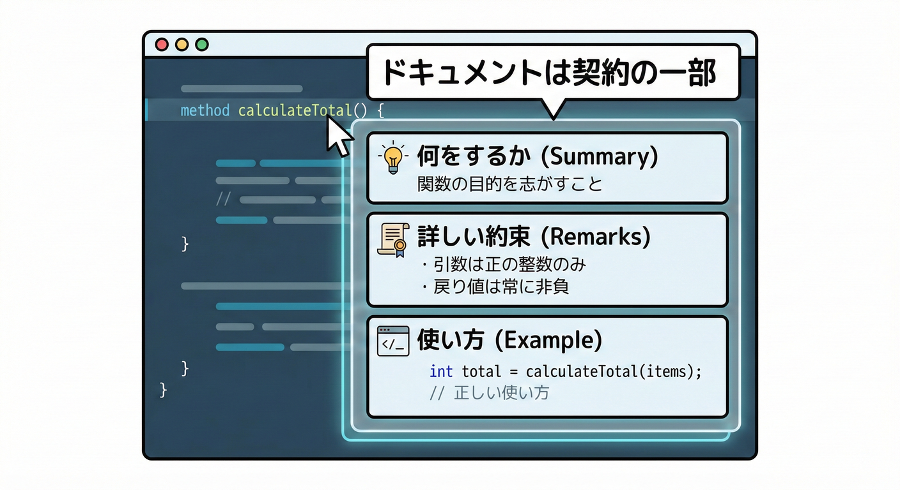
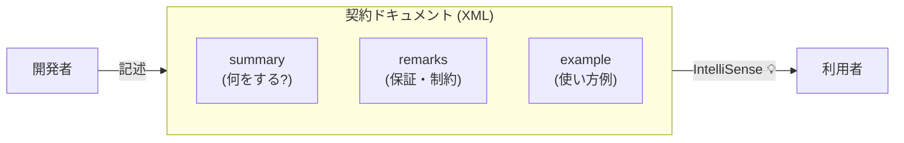

# 第12章：ドキュメントは契約の一部📝✨

## この章でできるようになること🎯

* 「ドキュメント＝契約の本文」だと理解して、何を書くべきか迷わなくなる😊
* C#の **XMLドキュメントコメント**（`///`）を、契約としてちゃんと書ける✍️
* IntelliSense に “利用者が欲しい情報” を届けられるようになる👀
* ドキュメントの「破壊的変更」を見分けられるようになる💥
* AI（Copilot / Codex系）を“下書き係”にして、品質を人間が担保できる🤖👩‍🏫

---

## 12.1 ドキュメントが「契約」ってどういうこと？🤝📜

### ✅ 契約は「コード」だけじゃない

利用者（他人 or 未来の自分）は、**メソッド名や型だけ**では安心できません😵
「どう使うの？」「何を保証してるの？」「何が起きるの？」を *文章で固定* して初めて、契約になります✨

C#のXMLドキュメントコメントは、コンパイル時にXMLとして出力できて、IDEがIntelliSense表示に使えます。つまり **“利用者に届く契約本文”** なんです📌 ([Microsoft Learn][1])

### ✅ ドキュメントが弱いと起きる事故あるある💥

* 「null返すの？例外なの？」が分からず、利用側が祈りコードになる🙏
* “たまたま動いてた”使い方が広がり、後から直せない😇
* 仕様が人によって違って、チーム内で揉める🌀

---

## 12.2 「契約ドキュメント」3点セット🧩✨（これだけは必須！）




### ① `<summary>`：ひとことで何をする？🧠

* 1〜2行でOK
* 「何のためのものか」を先に言う
* “どうやってるか” は書かない（内部実装は契約じゃない）🙅‍♀️

### ② `<remarks>`：保証・前提・制約を書く📌

ここが **契約の本体** になりがちです✨
例：

* 入力の制約（空文字OK？最大長は？）
* 正規化するか（trimする？小文字化する？）
* スレッドセーフ？（同時に呼んでOK？）
* 例外を投げる条件（投げるなら固定する）
* 文化依存（大文字小文字、カルチャ、タイムゾーン）🌍

### ③ `<example>`：使い方を1個だけ載せる🍰

利用者の理解が爆速になります⚡
「最短で成功する例」を1つだけで十分◎

---

## 12.3 C#のXMLドキュメントコメント基本🧷📘

`///` のコメント欄にXMLタグを書いていく方式です。C#公式の言語リファレンスにもまとまっています📘 ([Microsoft Learn][2])

### よく使うタグ（まずはこのへん）🍡

* `<summary>`：要約
* `<param name="...">`：引数
* `<returns>`：戻り値
* `<exception cref="...">`：例外（契約として超重要⚠️）
* `<remarks>`：補足（保証・制約・仕様の本文）
* `<example>`：使用例
* `<see cref="..."/>` / `<seealso cref="..."/>`：参照リンク（型やメソッドへ）
* `<paramref name="..."/>`：引数名の参照
* `<typeparam name="...">`：ジェネリック型パラメータ
  （タグの詳細やおすすめセットは Microsoft のガイドにも整理されています📚） ([Microsoft Learn][3])

---

## 12.4 実例：v1の最小APIに「契約コメント」を入れる🧪✨

ここでは「文字列をスラッグ化する」小さいAPIを例にします😊
**ポイント：コメントは“利用者が困らないための約束”を書く** です🤝

```csharp
namespace ContractDocs;

/// <summary>
/// Converts text into a URL-friendly slug.
/// </summary>
/// <remarks>
/// <para>
/// Guarantees:
/// </para>
/// <list type="bullet">
///   <item><description>Returns a lowercase ASCII slug.</description></item>
///   <item><description>Trims leading/trailing whitespace.</description></item>
///   <item><description>Replaces one or more whitespace characters with a single '-'.</description></item>
///   <item><description>Removes characters other than letters, digits, '-' and '_'.</description></item>
/// </list>
/// <para>
/// Notes:
/// </para>
/// <list type="bullet">
///   <item><description>This method is deterministic for the same input.</description></item>
///   <item><description>Culture is not used (invariant behavior).</description></item>
/// </list>
/// </remarks>
/// <param name="input">Source text. Must not be <c>null</c>.</param>
/// <returns>A slug string. Empty string is allowed.</returns>
/// <exception cref="ArgumentNullException">Thrown when <paramref name="input"/> is <c>null</c>.</exception>
/// <example>
/// <code>
/// Slugger.ToSlug("Hello World!");
/// // => "hello-world"
/// </code>
/// </example>
public static class Slugger
{
    public static string ToSlug(string input)
    {
        ArgumentNullException.ThrowIfNull(input);

        var trimmed = input.Trim();
        if (trimmed.Length == 0) return "";

        var sb = new System.Text.StringBuilder(trimmed.Length);

        bool lastWasDash = false;

        foreach (var ch in trimmed)
        {
            var c = char.ToLowerInvariant(ch);

            if (char.IsLetterOrDigit(c) || c == '_' )
            {
                sb.Append(c);
                lastWasDash = false;
            }
            else if (char.IsWhiteSpace(c))
            {
                if (!lastWasDash && sb.Length > 0)
                {
                    sb.Append('-');
                    lastWasDash = true;
                }
            }
            else if (c == '-')
            {
                if (!lastWasDash && sb.Length > 0)
                {
                    sb.Append('-');
                    lastWasDash = true;
                }
            }
            // other chars are removed (by contract)
        }

        // remove trailing dash if any
        if (sb.Length > 0 && sb[^1] == '-') sb.Length--;

        return sb.ToString();
    }
}
```

### ここが「契約として強い」理由💪

* **何を保証するか**（lowercase / trim / whitespace→`-` / 文字除去）を `<remarks>` に固定📌
* 文化依存しない（`ToLowerInvariant`）を宣言して、挙動ブレ事故を防ぐ🌍
* `null` でどうなるかを **例外として固定** してる⚠️
* 例が1つあるだけで、利用側が迷わない🍰

---

## 12.5 “契約コメント”の文章テンプレ🧁（迷ったらこれ）

### ✅ `<summary>` はこの形が強い✨

* 「何をする？」を動詞から
* “戻り値の意味”も一言入れると◎

例：

* `Parses ... and returns ...`
* `Creates ...`
* `Checks whether ...`

### ✅ `<remarks>` は「利用者が怖いところ」だけ書く😱→😊

次のチェックを順番に埋めると強いです👇

* 入力の制約：空OK？長さ上限？禁止文字？
* 正規化：trimする？大小文字変換？
* 既定：未指定のときどうなる？
* パフォーマンス：O(n)？重い？大量呼び出しOK？
* 並行性：スレッドセーフ？状態持つ？
* 例外：いつ投げる？投げない？（投げるなら固定）

---

## 12.6 AIでコメントを作る🤖✨（でも“契約”は人間が握る👩‍🏫）

### 12.6.1 Visual Studio：`///` の自動コメントをAIで埋める🪄

Visual Studio では `///` を入れたときに、Copilotが **summary/param/returns** を提案して埋めてくれる仕組みがあります（設定で有効化） ([Microsoft for Developers][4])
さらに右クリックの「Copilot actions」からコメント生成を呼べる流れも入っています ([The GitHub Blog][5])

**ただし注意⚠️**
AIが書くのは “それっぽい説明” になりがち。
契約に必要なのは **保証・制約・例外条件** なので、人間が必ず追記＆修正します👩‍🏫✨

### 12.6.2 VS Code：選択範囲→Generate Docs🧾

VS Codeでも、右クリックの “Generate Docs” 系の導線でドキュメント生成ができます ([code.visualstudio.com][6])

---

## 12.7 ドキュメント変更も「破壊的変更」になりうる💥😇

コードを変えてないのに、**契約を変えた** ことになるパターンがあります👇

### 破壊になりやすい例⚠️

* 「例外を投げない」→「投げる」に変更
* 「null返す」→「null返さない」に変更
* 「空文字OK」→「空文字NG」に変更
* 「カルチャ非依存」→「カルチャ依存」に変更

これ、利用側から見ると **仕様が変わった＝挙動互換が壊れた** なんです😵

### ✅ 逆に“破壊じゃない”ことが多い例🌸

* 誤字修正
* 文章が分かりやすくなっただけ
* 例を追加した（ただし嘘例はNG🙅‍♀️）

---

## 12.8 ビルドで「コメント漏れ」を検知する✅🧰

### 12.8.1 XMLドキュメントファイルを出力する

`GenerateDocumentationFile` を `true` にすると、コンパイル時にXMLドキュメントファイルを生成できます ([Microsoft Learn][1])

```xml
<Project Sdk="Microsoft.NET.Sdk">

  <PropertyGroup>
    <TargetFramework>net10.0</TargetFramework>

    <!-- XMLドキュメント出力 -->
    <GenerateDocumentationFile>true</GenerateDocumentationFile>
  </PropertyGroup>

</Project>
```

Visual Studioの設定/プロジェクト設定からも同じことができます（MS Learnに手順あり） ([Microsoft Learn][1])

### 12.8.2 “公開APIだけ”コメント必須にしていく（CS1591）🧱

XML出力をONにすると、**公開型/公開メンバーにコメントが無い** ことで警告（CS1591）が出ることがあります。これを使って「契約の穴」を見つけられます✅ ([Microsoft Learn][1])

最初から全部必須にするとしんどいので、コツはこれ👇

* まずは「公開APIだけ」書く
* 重要なところから埋める
* 慣れたら警告をエラーに格上げ（CIでも守れる）✨

---

## 12.9 NuGetのREADMEは“契約の入口”📦🚪

ライブラリ利用者は、まず **NuGetのページ** と README を見ます👀
`PackageReadmeFile` を設定すると、READMEをパッケージに同梱できます📦 ([Microsoft Learn][7])

```xml
<PropertyGroup>
  <PackageReadmeFile>readme.md</PackageReadmeFile>
</PropertyGroup>

<ItemGroup>
  <None Include="docs\readme.md" Pack="true" PackagePath="\" />
</ItemGroup>
```

READMEに最低限入れると強い内容🍰

* 何のライブラリ？（1行）
* 5行くらいの最短使用例
* “破壊的変更”の扱い（SemVer方針に沿う）
* 代表的な制約（null/例外/カルチャ）

---

## 12.10 ミニ実習🎓✨「契約ドキュメントを完成させる」

### ゴール🏁

* `Slugger.ToSlug` に **契約として必要な情報** を書き切る
* IntelliSenseで読んで “迷わない” 状態にする😊

### 手順🪜

1. `<summary>` を1〜2行で完成
2. `<remarks>` に “保証” を箇条書きで書く（3〜6個）
3. `<exception>` を **固定** する（少なくとも `ArgumentNullException`）
4. `<example>` を1つ書く
5. `GenerateDocumentationFile` をONにしてXMLを出す ([Microsoft Learn][1])

### 提出物📦（成果）

* `Slugger.cs` のXMLコメント
* `readme.md`（最短使用例つき）

---

## 12.11 ありがちNG集🙅‍♀️💦（契約を壊すコメント）

* ❌ 「内部実装」を書いてしまう（後で変えられなくなる）

  * 例：「正規表現で…」みたいなのは危険⚠️
* ❌ “たぶん” “基本的に” “状況による” が多すぎる

  * 利用者が判断できない😵
* ❌ 例が嘘（動かない）

  * 最悪。信用が死ぬ😇
* ❌ 例外条件を書かない

  * 利用側の try/catch が設計できない🚧

---

## まとめ📌✨

* ドキュメントは **契約の本文**。IntelliSenseに出る＝利用者に届く約束🤝 ([Microsoft Learn][1])
* `<summary>/<remarks>/<example>` がまず最強の3点セット🧩
* AIで下書きは速いけど、**保証・制約・例外** は人間が確定する👩‍🏫🤖 ([Microsoft for Developers][4])
* `GenerateDocumentationFile` をONにして、契約ドキュメントを“成果物”として配る📦 ([Microsoft Learn][1])

[1]: https://learn.microsoft.com/ja-jp/visualstudio/ide/reference/generate-xml-documentation-comments?view=visualstudio "XML ドキュメント コメントを挿入する - Visual Studio (Windows) | Microsoft Learn"
[2]: https://learn.microsoft.com/ja-jp/dotnet/csharp/language-reference/xmldoc/ "XML API ドキュメント コメント コメント - /// コメントを使用したドキュメント API - C# reference | Microsoft Learn"
[3]: https://learn.microsoft.com/en-us/dotnet/csharp/language-reference/xmldoc/recommended-tags?utm_source=chatgpt.com "Recommended XML documentation tags - C# reference"
[4]: https://devblogs.microsoft.com/visualstudio/introducing-automatic-documentation-comment-generation-in-visual-studio/ "Introducing automatic documentation comment generation in Visual Studio - Visual Studio Blog"
[5]: https://github.blog/changelog/2025-12-03-github-copilot-in-visual-studio-november-update/ "GitHub Copilot in Visual Studio — November update - GitHub Changelog"
[6]: https://code.visualstudio.com/docs/copilot/copilot-smart-actions?utm_source=chatgpt.com "AI smart actions in Visual Studio Code"
[7]: https://learn.microsoft.com/ja-jp/nuget/reference/msbuild-targets "MSBuild ターゲットとしての NuGet pack と restore | Microsoft Learn"
