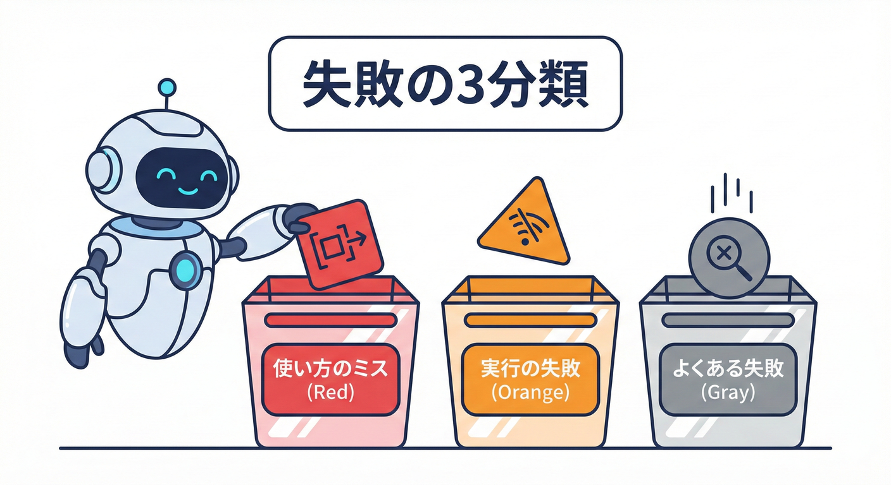
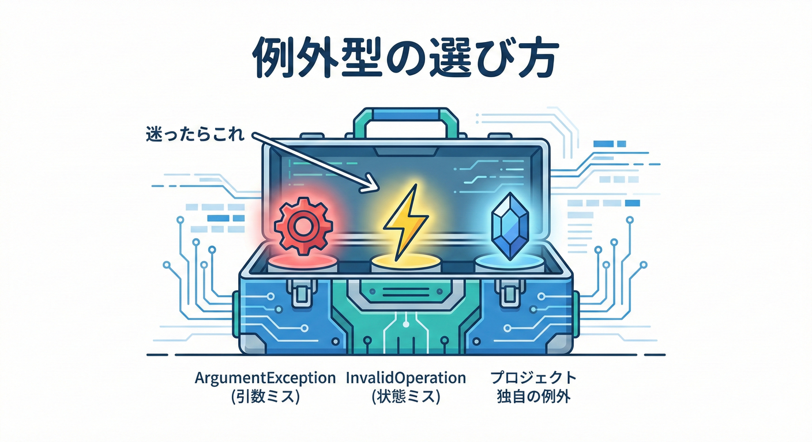
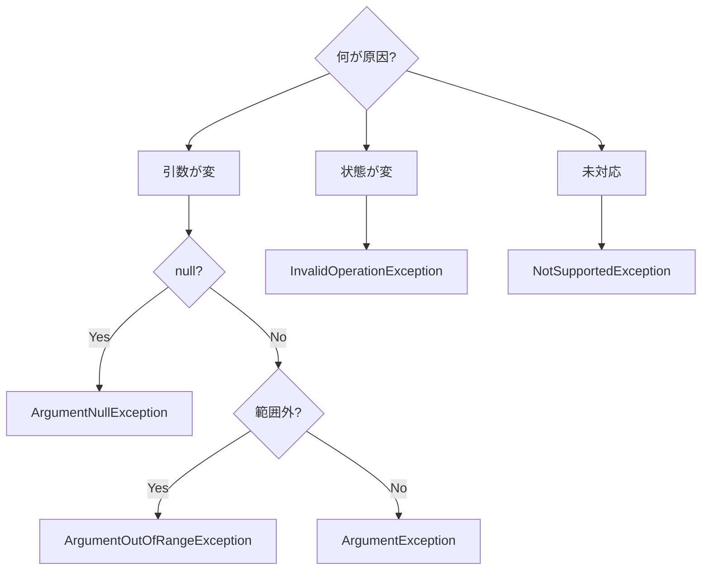

# 第13章：エラーの契約①（例外設計の基本）🚧

## この章でできるようになること 🎯✨

* 「どんな失敗を、どうやって呼び出し側に伝えるか」を**契約として固定**できるようになるよ🧾✅
* 例外を「投げるべきとき」「投げないほうがいいとき」を判断できるようになるよ🤔💡 ([Microsoft Learn][1])
* **適切な例外型**を選んで、呼び出し側が迷わずハンドリングできるようになるよ🧰✨ ([Microsoft Learn][2])
* “後から変えると壊れる”ポイント（互換性）をつかめるよ⚡️🧱

---

## 例外は契約の一部だよ 🧾🚦

「例外」は単なるエラーじゃなくて、**公開APIが外に約束する仕様の一部**だよ😊
たとえば呼び出し側が

* `FormatException` をキャッチして「入力フォームに戻す」📝
* `InvalidOperationException` をキャッチして「状態が変なので案内する」🧭

みたいに書いてたら、**例外の種類が変わるだけで動きが変わって壊れる**よね💥
だから、例外は「その場の気分」じゃなくて、**設計して固定する**のが大事🌸

あと、.NETの設計ガイドでは、フレームワーク/ライブラリのエラー通知は例外が基本で、**エラーコード返しは避ける**方針だよ📘 ([Microsoft Learn][1])

---

## まず覚える 失敗の3分類 🧠🗂️


例外設計が一気にラクになるコツは「失敗を分類する」ことだよ😊✨

### 1️⃣ 使い方が悪い 使い方ミス系 🙅‍♀️

* 引数が `null`
* 範囲外の値
* フォーマット不正（メールアドレスっぽくない等）

👉 こういうのは **Argument系 / Format系**で「呼び出し側の入力ミス」を伝えるのが基本🎯 ([Microsoft Learn][2])

### 2️⃣ 実行に失敗した 実行失敗系 🧯

* ファイルが存在しない
* ネットワークが落ちた
* 外部サービスがタイムアウト

👉 “やること自体は正しいけど、できなかった” なので、**実行失敗として例外**で伝えるのが自然だよ⚙️💥 ([Microsoft Learn][1])

### 3️⃣ よくある失敗 よくある系 😅

* 文字列のパースが失敗する（入力がしょっちゅう不正）
* 検索して「見つからない」が普通に起きる

👉 こういうのを毎回例外にすると重い＆扱いづらいので、**Tryパターン**や**事前チェック**を用意するのが推奨だよ🧪✨ ([Microsoft Learn][3])

---

## 例外を投げるか迷ったときの判断フロー 🧭💡

次の3つを順番に考えるとブレないよ😊

### ✅ 判断1 その失敗は例外的

* 「普通は起きない」→ 例外でOK💥
* 「普通に起きる」→ 例外以外の形も用意したい（Tryなど）🧰 ([Microsoft Learn][3])

### ✅ 判断2 呼び出し側が対処できる

* 対処できる（入力し直し、再試行、別ルート）→ **例外を型で伝える**🎯
* 対処できない（内部矛盾、続行不能）→ 上位でログ＆停止の方向も検討🧯 ([Microsoft Learn][1])

### ✅ 判断3 その例外は契約にしたい

* 例外型を決めたら、**「将来も守る約束」**になるよ🧾
  （変えたくなるなら、設計をもう1回見直すのが安全👍）

---

## 例外型の選び方 これだけで勝てる 🧰✨




「迷ったらこのへん」で、かなり実務でも戦えるよ😊

### 絶対やらない系 🚫

* `Exception` / `SystemException` を投げない
* `ApplicationException` を投げない＆継承しない
* 公開APIで `NullReferenceException` / `IndexOutOfRangeException` みたいな“バグっぽい例外”を出さない（実装漏れ感が出る）

これらはガイドラインでも明確にNG/非推奨だよ📘 ([Microsoft Learn][2])

### よく使う標準例外のテンプレ 🧩

* **引数がダメ** → `ArgumentException`
* **引数が null** → `ArgumentNullException`
* **引数が範囲外** → `ArgumentOutOfRangeException`
* **オブジェクトの状態がダメ** → `InvalidOperationException`
* **破棄後に呼ばれた** → `ObjectDisposedException`
* **機能的に対応してない** → `NotSupportedException`

特に `ArgumentException` 系は **ParamName（どの引数が悪いか）を必ず入れる**のが推奨だよ📝 ([Microsoft Learn][2])

---

## 引数チェックは最初にやるのが基本 ✅🧼

公開メソッドは外から何が来るかわからないので、**最初に引数を検証**するのが定番だよ😊
静的解析ルールでも「公開メソッドはnullチェックしよう」って言われてる✨ ([Microsoft Learn][4])

### 超おすすめの書き方 `ThrowIfNull` ✨

`ArgumentNullException.ThrowIfNull(x)` は、引数名も自動で拾えるので便利だよ（余計な文字列を書かなくてOK）🪄 ([Microsoft Learn][5])

---

## 実装例 Producer側 メールアドレスの契約 📦📨

「入力の失敗はよくある」けど、まずは **例外設計の基本**として `Parse` を作るよ😊
（Try版はこの章の後半でオマケとして出すね🎁）

```csharp
namespace MiniContracts;

public readonly record struct EmailAddress(string Value)
{
    /// <summary>
    /// 文字列からメールアドレスを生成する（失敗したら例外）。
    /// </summary>
    /// <exception cref="ArgumentNullException">value が null のとき</exception>
    /// <exception cref="ArgumentException">value が空文字のとき</exception>
    /// <exception cref="FormatException">メールアドレス形式として不正なとき</exception>
    public static EmailAddress Parse(string value)
    {
        // null は「使い方ミス」なので ArgumentNullException
        ArgumentNullException.ThrowIfNull(value);

        // 空文字も「使い方ミス」なので ArgumentException（paramName を必ず入れる）
        if (value.Length == 0)
            throw new ArgumentException("空文字はダメだよ。", nameof(value));

        // 形式不正は FormatException（Parse系っぽい契約）
        if (!IsLikelyEmail(value))
            throw new FormatException("メールアドレスの形式が正しくないよ。");

        return new EmailAddress(value);
    }

    private static bool IsLikelyEmail(string value)
    {
        // 教材用の超ざっくり判定（本番はもっと厳密に）
        var at = value.IndexOf('@');
        if (at <= 0) return false;
        if (at == value.Length - 1) return false;
        return true;
    }
}
```

ポイントはここだよ👇✨

* `ArgumentNullException` / `ArgumentException` / `FormatException` みたいに、**失敗の種類を型で伝える**
* `nameof(value)` を入れて、**どの引数が悪いか**を固定
* 「契約」なので、**例外型はむやみに変えない**🧱

標準例外の使い分けはガイドラインに沿ってるよ📘 ([Microsoft Learn][2])

---

## 実装例 Consumer側 例外をハンドリングする 🎮🧑‍💻

呼び出し側は「例外型」で分岐できると、すごく読みやすいよ😊

```csharp
using MiniContracts;

Console.Write("メールアドレスを入れてね: ");
var input = Console.ReadLine();

try
{
    var email = EmailAddress.Parse(input!);
    Console.WriteLine($"OK! 登録するよ: {email.Value} ✅✨");
}
catch (ArgumentNullException)
{
    Console.WriteLine("未入力だよ〜！まず何か入れてね📝💦");
}
catch (ArgumentException ex) when (ex.ParamName == "value")
{
    Console.WriteLine("空文字は登録できないよ〜🫠");
}
catch (FormatException)
{
    Console.WriteLine("形式が違うみたい！ example@domain.com みたいに入れてね📨✨");
}
```

ここで大事なのは👇

* **メッセージ文字列で分岐しない**（将来変わると壊れるから）
* **例外型で分岐する**（契約として安定しやすい）🧾✨

---

## 例外の契約でやりがちな事故あるある 💥😇

### 😇 事故1 例外型を適当に変える

たとえば `FormatException` を投げてたのに、後から `ArgumentException` に変えると…

* Consumerが `catch (FormatException)` で処理してたのに拾えなくなる
* いきなり最上位の `catch` に落ちて、想定外の表示になる

つまり **破壊的変更**になりがちだよ⚡️🧱

### 😇 事故2 NullReferenceException が外に漏れる

ガイドラインでも「公開APIから `NullReferenceException` を出すのは避けよう」って言ってるよ（実装詳細が漏れる＆バグ感）🫣 ([Microsoft Learn][2])
👉 だから最初に `ThrowIfNull` が効く✨ ([Microsoft Learn][5])

---

## よくある失敗は Tryパターンも検討しよう 🧪✨

「入力が不正」はよく起きるから、例外コストを避ける設計として **Tryパターン**が推奨されてるよ😊 ([Microsoft Learn][3])

```csharp
namespace MiniContracts;

public readonly record struct EmailAddress(string Value)
{
    public static bool TryParse(string? value, out EmailAddress result)
    {
        if (string.IsNullOrEmpty(value))
        {
            result = default;
            return false;
        }

        var at = value.IndexOf('@');
        if (at <= 0 || at == value.Length - 1)
        {
            result = default;
            return false;
        }

        result = new EmailAddress(value);
        return true;
    }
}
```

このときの契約はこう👇

* **「false」は“よくある失敗”として扱う**
* それ以外（たとえば内部エラー等）は例外でOK（Tryの“守備範囲”を明確に）🧱 ([Microsoft Learn][3])

---

## 非同期の例外 ここだけ注意 ⚡️🧵

`Task` を返すメソッドは、例外が **awaitしたタイミングで出てくる**ことがあるよ😵
でも「引数がダメ」みたいな **使い方ミス**は、できれば **同期的に先に投げる**のが推奨だよ✅ ([Microsoft Learn][6])

```csharp
public static async Task<string> FetchAsync(string url)
{
    // ここで先にチェックして投げる（使い方ミスは同期例外にする）
    ArgumentNullException.ThrowIfNull(url);

    await Task.Delay(10); // ここから先で投げる例外は Task に入る
    return "ok";
}
```

---

## Webやアプリの外に例外をそのまま見せない 🙈🔐

例外の詳細（スタックトレースとか内部情報）は、そのまま外に出すと危ないことがあるよ🧯
Web APIでは「開発中だけ詳細を見せる」「本番は安全な形式で返す」みたいな考え方が基本だよ🔒 ([Microsoft Learn][7])

（このへんの“失敗レスポンスの契約”は後半の章でガッツリやるよ📘✨）

---

## ミニ実習 例外の契約を固定する ✅🧪

### 実習1 仕様追加して例外を設計しよう 🧩

`EmailAddress.Parse` にルール追加👇

* `@` の後に `.` が無いのはダメ（例: `a@b` はNG）

やること✅

* どの例外型にするか決める（おすすめは `FormatException` のまま）
* Consumer側の表示も更新する📨

### 実習2 例外をテストで固定しよう 🧪

xUnitで「契約をテストで守る」練習✨

```csharp
using MiniContracts;
using Xunit;

public class EmailAddressTests
{
    [Fact]
    public void Parse_Null_Throws()
        => Assert.Throws<ArgumentNullException>(() => EmailAddress.Parse(null!));

    [Fact]
    public void Parse_Empty_Throws()
        => Assert.Throws<ArgumentException>(() => EmailAddress.Parse(""));

    [Fact]
    public void Parse_InvalidFormat_Throws()
        => Assert.Throws<FormatException>(() => EmailAddress.Parse("abc"));
}
```

---

## AI下書きの使い方 例外設計編 🤖🪄

### 例外設計のたたき台を作らせるプロンプト例

* 「このメソッドの失敗ケースを洗い出して、適切な標準例外型を提案して。引数ミスと実行失敗で分類して」🧠✨
* 「公開APIとして、`Exception` を投げない方針で例外型を選んで。`Argument*`/`InvalidOperationException`/`NotSupportedException` を優先して」🧰✨ ([Microsoft Learn][2])
* 「xUnitで“例外が契約通り”か確認するテストを作って」🧪✅

---

## チェックリスト これで例外の契約が強くなる ✅🧾

* [ ] 失敗を「使い方ミス / 実行失敗 / よくある失敗」に分類した？🗂️
* [ ] `Exception` / `ApplicationException` を投げてない？🚫 ([Microsoft Learn][2])
* [ ] `ArgumentException` 系は `nameof(param)` を入れた？📝 ([Microsoft Learn][2])
* [ ] 公開APIから `NullReferenceException` みたいなバグっぽい例外が漏れてない？🫣 ([Microsoft Learn][2])
* [ ] “よく起きる失敗”に Tryパターン等を用意した？🧪 ([Microsoft Learn][3])
* [ ] 例外型をテストで固定した？🧪✅

---

[1]: https://learn.microsoft.com/en-us/dotnet/standard/design-guidelines/exception-throwing "Exception Throwing - Framework Design Guidelines | Microsoft Learn"
[2]: https://learn.microsoft.com/en-us/dotnet/standard/design-guidelines/using-standard-exception-types "Using Standard Exception Types - Framework Design Guidelines | Microsoft Learn"
[3]: https://learn.microsoft.com/en-us/dotnet/standard/design-guidelines/exceptions-and-performance "Exceptions and Performance - Framework Design Guidelines | Microsoft Learn"
[4]: https://learn.microsoft.com/en-us/dotnet/fundamentals/code-analysis/quality-rules/ca1062 "CA1062: Validate arguments of public methods (code analysis) - .NET | Microsoft Learn"
[5]: https://learn.microsoft.com/ja-jp/dotnet/api/system.argumentnullexception.throwifnull?view=net-10.0 "ArgumentNullException.ThrowIfNull Method (System) | Microsoft Learn"
[6]: https://learn.microsoft.com/en-us/dotnet/standard/exceptions/best-practices-for-exceptions "Best practices for exceptions - .NET | Microsoft Learn"
[7]: https://learn.microsoft.com/en-us/aspnet/core/fundamentals/error-handling-api?view=aspnetcore-10.0 "Handle errors in ASP.NET Core APIs | Microsoft Learn"
