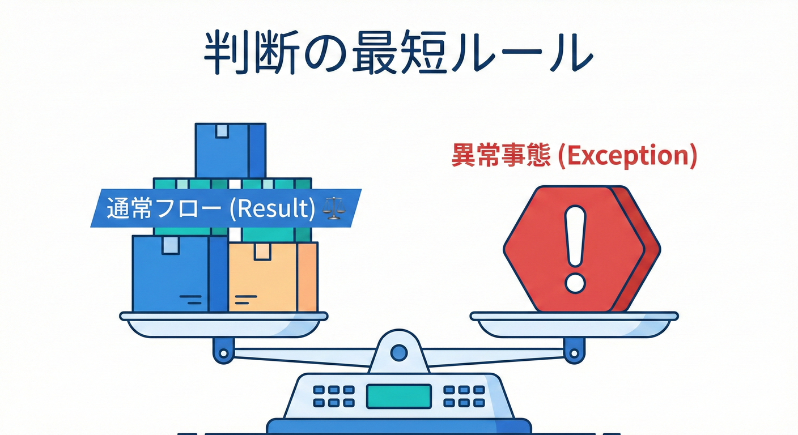
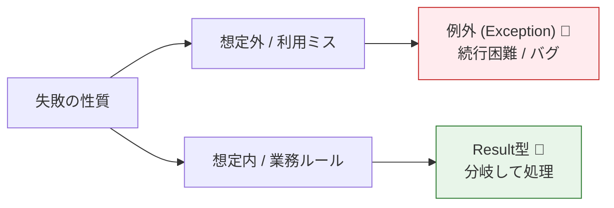
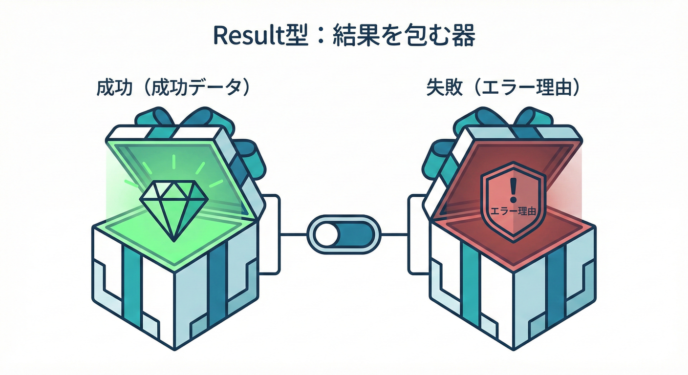
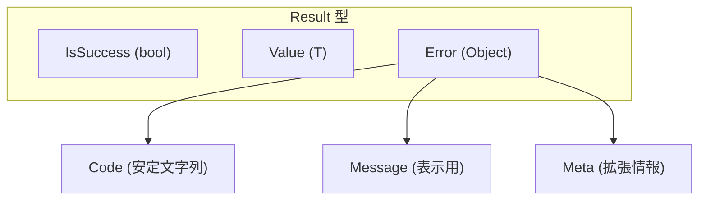

# 第14章：エラーの契約②（Result型/戻り値方針）🎁

## 14.1 この章でできるようになること ✅✨

* 「例外（Exception）にする？」「Result型で返す？」「Tryパターンにする？」を、**迷わず選べる**ようになる🧠💡
* Result型を自作して、**公開APIとして“契約”に耐える形**で設計できるようになる🏗️✨
* 同じ機能を **例外版 / Result版** の2通りで作り、利用側コードの違いを体験できる👀⚡
* 変更に強い「エラーの表現（Error Code など）」を作れるようになる🧾🔧

---

## 14.2 そもそも「エラーの契約」って何？🤔💭

エラーは、成功よりも利用者のコードに刺さりやすいです⚡
なぜなら利用者はこう書くから👇

* 成功時：だいたいそのまま使う😊
* 失敗時：**分岐（if/switch）・ログ・再試行・UI表示**を組み立てる😵‍💫

つまり、エラーの返し方がブレると利用者は迷子になります🌀
なので **「失敗をどう表現するか」も契約**です📌

---

## 14.3 例外 vs Result：世界観の違い🌍✨

### 例外（Exception）🚨

* 「ここに来たら通常フローじゃないよ！」を強く表現できる💥
* .NETの設計ガイドラインでは、**フレームワークのエラー通知は例外が基本**（エラーコードを返すのは非推奨）とされています📘([Microsoft Learn][1])
* ただし、**よく起きる失敗**を例外で表現するとコストが高くなりがちで、**Tryパターン検討**が推奨されます🧯([Microsoft Learn][2])
* さらに「普通に起こる失敗は null/default を返す」という回避策も、ベストプラクティスで言及があります🧩([Microsoft Learn][3])

### Result型（戻り値で成功/失敗を表す）🎁

* 「失敗も通常フローの一部だよ」を表現できる🌿
* 例：入力バリデーション、検索0件、在庫なし、権限不足 など
* 利用側が **if で分岐しやすい**ので、UI/業務ロジックに向いてる😊

---

## 14.4 どう選ぶ？判断基準の“最短ルール”⚖️✨




### まずこの2択だけ覚える（超重要）💎

1. **利用者が普通に分岐して処理する失敗** → Result（またはTry）🎁
2. **コードの使い方が間違ってる / 想定外 / 続行困難** → 例外🚨

### 具体例でスパッと分類✂️

* 入力が不正（メール形式NG）✉️ → Result（期待される失敗）🎁
* DBが落ちた / ネットワーク遮断🌩️ → 例外（環境要因で続行困難）🚨
* null渡し禁止なのに null を渡した🙅‍♀️ → 例外（利用者の使用ミス）🚨
* 「見つからない」検索🔎 → Result（普通に起こる）🎁
* 「TryParseできない」文字列→数値🧮 → Tryパターンが定番（例外回避）🧯([Microsoft Learn][2])

---

## 14.5 Result型を“契約として公開する”ときの注意点📌💣

Result型を public API に出すと、それ自体が契約になります。だから…👇

* `Result<T>` のプロパティ名変更 → **破壊的変更**💥
* `Error` の形（Code/Message/Details）変更 → **利用側の分岐が壊れる**💥
* 「失敗の種類」を enum で表すと、**後から値追加で switch が揺れる**ことがある（利用者の書き方次第）🌀

おすすめはこう👇✨

* 失敗理由は **安定した文字列コード（例: `"validation.invalid_email"`）** にする🧾
* 追加情報は `Dictionary<string, string>` みたいな拡張枠に入れる🧺
* 例外は「内部ログ用」に保持しても、公開契約には出しすぎない（漏えいリスク）🔒

---

## 14.6 実装してみよう：最小で強い Result 型🛠️🎁




ここでは **外部ライブラリなし**で、教材用に「ちょうどいい」Resultを作ります✨
（あとで必要なら FluentResults / OneOf / LanguageExt など検討でもOK🙆‍♀️）

### 14.6.1 Result と Error を作る（Producer側）🏗️

```csharp
namespace Contracts;

public readonly record struct Error(
    string Code,
    string Message,
    IReadOnlyDictionary<string, string>? Meta = null);

public readonly record struct Result(bool IsSuccess, Error? Error)
{
    public static Result Ok() => new(true, null);
    public static Result Fail(Error error) => new(false, error);
}

public readonly record struct Result<T>(bool IsSuccess, T? Value, Error? Error)
{
    public static Result<T> Ok(T value) => new(true, value, null);
    public static Result<T> Fail(Error error) => new(false, default, error);
}
```

ポイント🌟

* `Code` は **機械が分岐するため**（安定させる）🧠
* `Message` は **人に見せるため**（変更されがちなので依存しすぎない）📝
* `Meta` は **拡張枠**（後方互換で情報を増やしやすい）➕

---

## 14.7 同じ機能を「例外版 / Result版」で作って比べる🔁👀

題材：ユーザー登録のメールチェック✉️

* 失敗はよく起きる（入力ミス）→ **Result向き**🎁
* でも「例外版」も作って違いを体験するよ😊

### 14.7.1 例外版（Exception）🚨

```csharp
using System.Text.RegularExpressions;

namespace Producer;

public static class EmailService_Exception
{
    private static readonly Regex EmailLike = new(@"^\S+@\S+\.\S+$", RegexOptions.Compiled);

    public static string NormalizeEmail(string email)
    {
        if (email is null) throw new ArgumentNullException(nameof(email));
        var trimmed = email.Trim();

        if (trimmed.Length == 0)
            throw new ArgumentException("Email is required.", nameof(email));

        if (!EmailLike.IsMatch(trimmed))
            throw new FormatException("Email format is invalid.");

        return trimmed.ToLowerInvariant();
    }
}
```

### 14.7.2 Result版（Result<T>）🎁

```csharp
using System.Text.RegularExpressions;
using Contracts;

namespace Producer;

public static class EmailService_Result
{
    private static readonly Regex EmailLike = new(@"^\S+@\S+\.\S+$", RegexOptions.Compiled);

    public static Result<string> NormalizeEmail(string? email)
    {
        if (email is null)
        {
            return Result<string>.Fail(new Error(
                Code: "validation.email.null",
                Message: "メールアドレスが未入力です🥺"));
        }

        var trimmed = email.Trim();
        if (trimmed.Length == 0)
        {
            return Result<string>.Fail(new Error(
                Code: "validation.email.empty",
                Message: "メールアドレスを入力してね✍️"));
        }

        if (!EmailLike.IsMatch(trimmed))
        {
            return Result<string>.Fail(new Error(
                Code: "validation.email.invalid_format",
                Message: "メール形式が正しくないみたい💦",
                Meta: new Dictionary<string, string> { ["input"] = trimmed }));
        }

        return Result<string>.Ok(trimmed.ToLowerInvariant());
    }
}
```

---

## 14.8 利用側（Consumer）のコードはどう変わる？🧑‍💻💡

### 14.8.1 例外版の利用（try/catch）🧯

```csharp
using Producer;

try
{
    var normalized = EmailService_Exception.NormalizeEmail(inputEmail);
    Console.WriteLine($"登録OK: {normalized} 🎉");
}
catch (Exception ex)
{
    // 例外の種類で分岐しようとすると、利用側が複雑になりがち😵
    Console.WriteLine($"登録NG: {ex.Message} 💦");
}
```

### 14.8.2 Result版の利用（if で分岐）🎁

```csharp
using Producer;

var result = EmailService_Result.NormalizeEmail(inputEmail);

if (result.IsSuccess)
{
    Console.WriteLine($"登録OK: {result.Value} 🎉");
}
else
{
    // Codeで分岐できるのが強い💪✨
    Console.WriteLine($"登録NG: {result.Error?.Message} 💦");
    Console.WriteLine($"(code={result.Error?.Code})");
}
```

Result版の良さ😊

* 利用者が「失敗は普通に起こる」前提で組み立てやすい
* 画面表示・フォームエラー・再入力誘導が作りやすい📱✨

---

## 14.9 Tryパターンという“第3の選択肢”🧯✨

.NETの設計ガイドラインでは、**例外が頻発しうる操作**には Try-Parse パターンが推奨されています✅([Microsoft Learn][2])

たとえば `int.TryParse` みたいに👇

```csharp
public static bool TryNormalizeEmail(string? email, out string normalized)
{
    normalized = "";

    if (string.IsNullOrWhiteSpace(email)) return false;

    var trimmed = email.Trim();
    if (!trimmed.Contains('@')) return false; // 簡易チェック例

    normalized = trimmed.ToLowerInvariant();
    return true;
}
```

ただし注意💡

* **失敗理由を返しづらい**（false しか返らない）
* なので「理由が大事」なら Result の方が向いてることが多い🎁

---

## 14.10 “契約として強い”エラーコード設計🧾🔩

### 14.10.1 良い Code の条件 ✅

* 安定している（文章の変更で揺れない）🧊
* 階層化されている（検索しやすい）🧭
* 利用側が switch/if で分岐できる🧠

例：おすすめ命名🍡

* `validation.email.empty`
* `validation.email.invalid_format`
* `domain.user.already_exists`
* `auth.forbidden`

### 14.10.2 Message は“UI表示用のヒント”にする📝

* Message にロジックを依存させない🙅‍♀️
* 分岐は Code、表示は Message、追加情報は Meta 🧺✨

---

## 14.11 テストで「エラー契約」を固定する🧪🔒

Result型は、テストで契約をガチガチに守るのが強いです💪✨

```csharp
using Producer;
using Xunit;

public class EmailServiceResultTests
{
    [Fact]
    public void Null_returns_error_code()
    {
        var r = EmailService_Result.NormalizeEmail(null);

        Assert.False(r.IsSuccess);
        Assert.Equal("validation.email.null", r.Error?.Code);
    }

    [Fact]
    public void Invalid_format_returns_error_code()
    {
        var r = EmailService_Result.NormalizeEmail("abc");

        Assert.False(r.IsSuccess);
        Assert.Equal("validation.email.invalid_format", r.Error?.Code);
    }

    [Fact]
    public void Valid_email_returns_normalized_value()
    {
        var r = EmailService_Result.NormalizeEmail("  A@B.com ");

        Assert.True(r.IsSuccess);
        Assert.Equal("a@b.com", r.Value);
    }
}
```

これで「Code が変わったら落ちる」＝契約違反が即バレる😎🧪

---

## 14.12 AI活用：Copilot/Codex を“契約ブレ防止”に使う🤖🧰

GitHub Copilot や OpenAI 系ツールは、**下書き＋漏れチェック**に使うと強いです✨
（Visual Studio 2026 でも Copilot 連携が前提で進化しています🧠🛠️）([Microsoft Learn][4])

### そのまま使える定番プロンプト集🪄

* 「この public メソッドを Result<T> 版に変換して。Error Code も設計して」
* 「Result<T> の Error Code 一覧を “契約として安定する” 命名で提案して」
* 「この Result の返し方、破壊的変更になりそうな点をレビューして」
* 「テストを3本追加して。成功と失敗コードを固定したい」

---

## 14.13 まとめ🍰✨（この章の持ち帰り）

* 例外は「想定外/利用ミス/続行困難」に強い🚨（ただし多発する失敗には注意）([Microsoft Learn][2])
* Resultは「よくある失敗を通常フローとして扱う」のに強い🎁
* 公開する Result は **Code を中心に契約を固める**のが安全🧾🔒
* テストで Code を固定すると、契約が“自動で守れる”🧪✨

---

## 14.14 ミニ実習（提出物）📚✍️

1. `Result<T>` と `Error` を自作して、Producer 側に置く🏗️
2. 章内の `NormalizeEmail` を **例外版 / Result版** の2つ作る🔁
3. Consumerで呼び出し、UI表示（ConsoleでOK）を実装する🖥️✨
4. xUnitで **Error Code 固定テストを3本**書く🧪✅

---

参考（本章の根拠）📘

* .NET 10 は LTS として提供され、サポートポリシーも公開されています([Microsoft for Developers][5])
* 例外のベストプラクティス／設計ガイドライン（Tryパターン、エラーコード非推奨など）([Microsoft Learn][3])
* C# 14 の機能概要（本カリキュラムの前提言語）([Microsoft Learn][6])

[1]: https://learn.microsoft.com/en-us/dotnet/standard/design-guidelines/exception-throwing?utm_source=chatgpt.com "Exception Throwing - Framework Design Guidelines"
[2]: https://learn.microsoft.com/en-us/dotnet/standard/design-guidelines/exceptions-and-performance?utm_source=chatgpt.com "Exceptions and Performance - Framework Design Guidelines"
[3]: https://learn.microsoft.com/en-us/dotnet/standard/exceptions/best-practices-for-exceptions?utm_source=chatgpt.com "Best practices for exceptions - .NET"
[4]: https://learn.microsoft.com/en-us/visualstudio/releases/2026/release-notes?utm_source=chatgpt.com "Visual Studio 2026 Release Notes"
[5]: https://devblogs.microsoft.com/dotnet/announcing-dotnet-10/?utm_source=chatgpt.com "Announcing .NET 10"
[6]: https://learn.microsoft.com/en-us/dotnet/csharp/whats-new/csharp-14?utm_source=chatgpt.com "What's new in C# 14"
