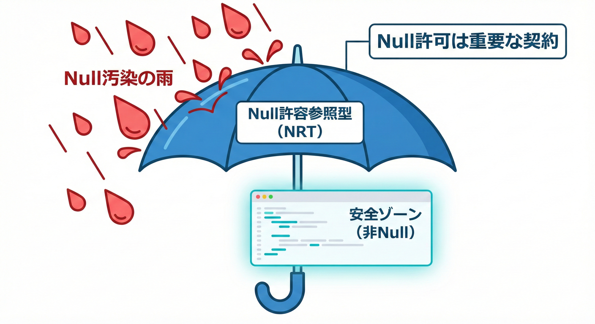
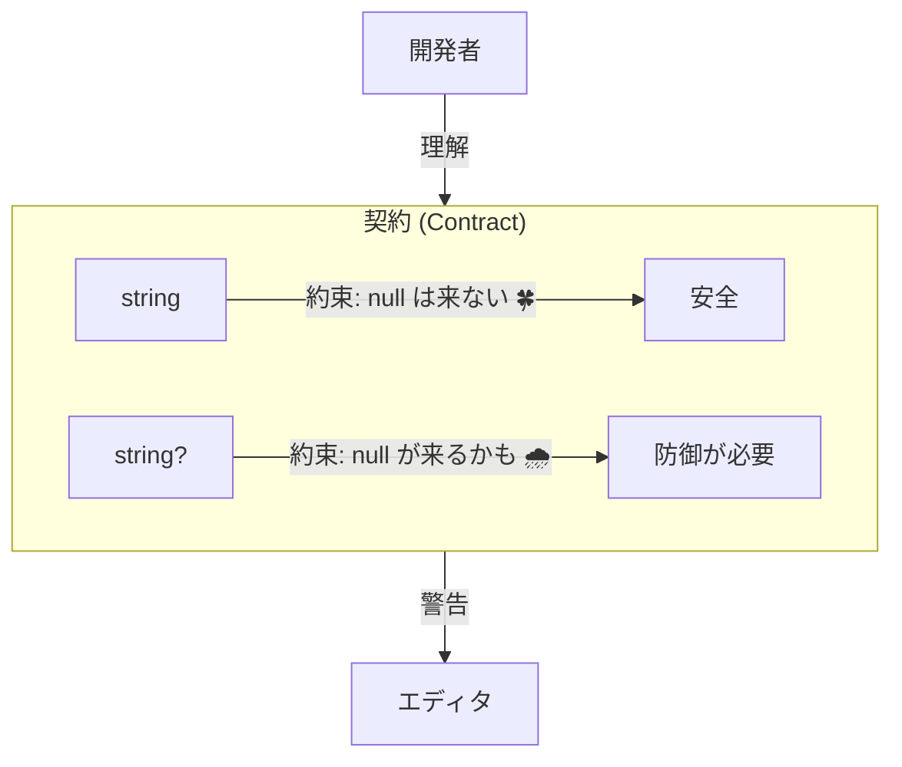
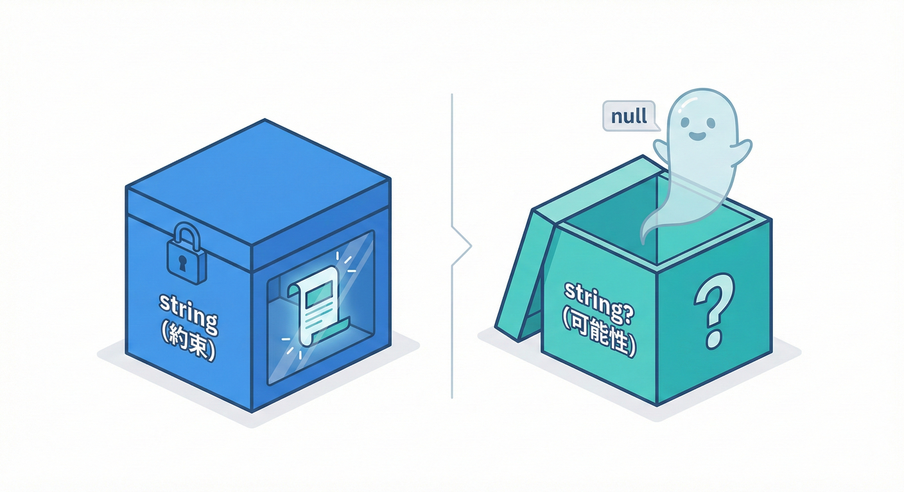
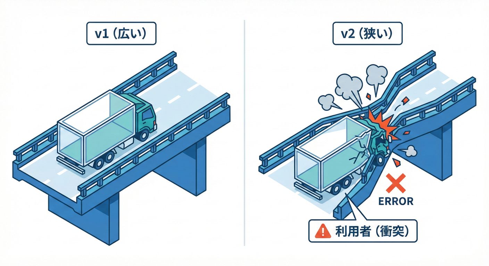
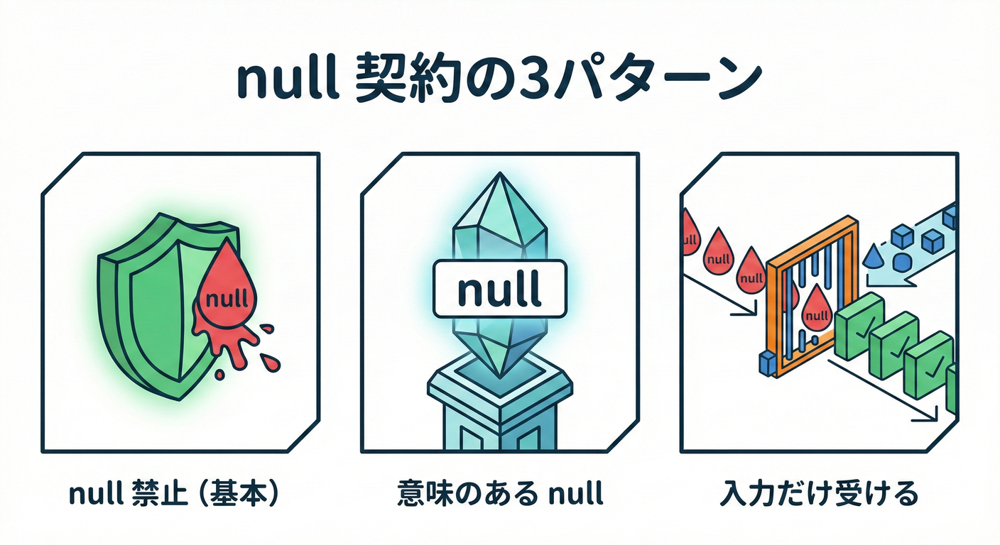
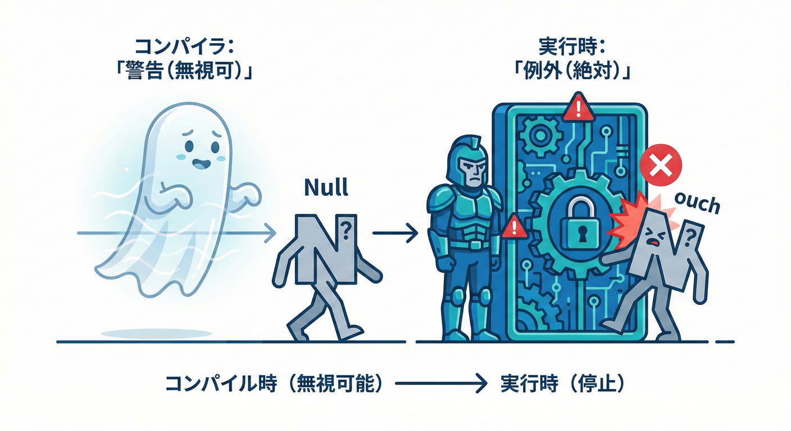
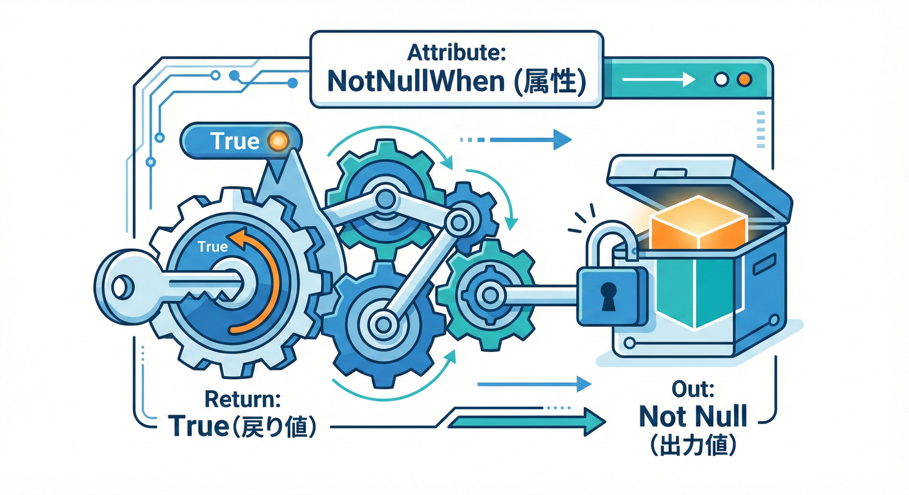
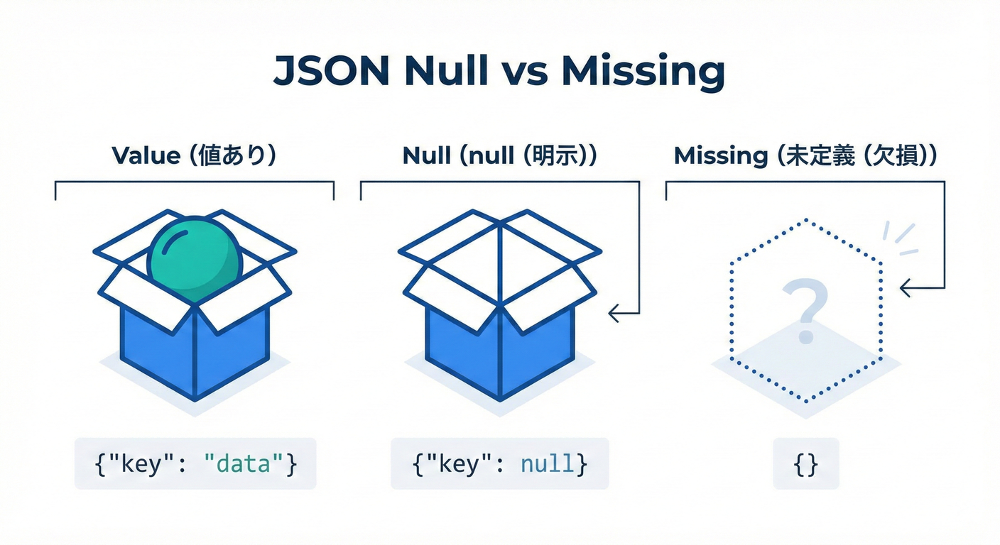
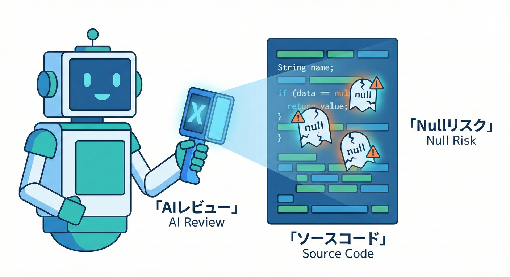

# 第15章：nullabilityは契約☂️（Null許可の怖さ）

## 15.1 この章でできるようになること🎯✨

* 「**null を許す／許さない**」が、**利用者にとっての契約**だと説明できるようになる😊☂️
* C# の **nullable reference types（NRT）**で、**契約をコードに埋め込む**書き方がわかる🧩
* 「あとから厳しくする（`string?`→`string`）」が **なぜ地味に危険か**を体感できる😇⚡
* **public API の null 受け取り**を、実行時にもちゃんと守る方法がわかる🛡️✨

---

## 15.2 まず結論：null は「仕様」だから、軽く扱うと事故る😵☂️




参照型は本質的に null を持てるけど、NRT を使うと「**ここは null にならない約束だよ**」を **コンパイラに伝えられる**ようになります😊
この「約束」が、まさに **契約（Contract）** そのものです☂️✨  ([Microsoft Learn][1])

そして超大事ポイント👇

* NRT は **コンパイル時の仕組み**（＝警告で教えてくれる）
* でも実行時には、呼び出し側が気合で null を渡すこともできる😇
* だから **公開API（public）では実行時チェックも必要** になることが多い🛡️（例：`ArgumentNullException.ThrowIfNull`） ([Microsoft Learn][2])

---

## 15.3 用語をゆるっと整理🧁📘

### non-nullable と nullable🍀🌧️

* `string`：**non-nullable**（null は来ない想定🍀）

* `string?`：**nullable**（null が来る想定🌧️）

この “`?`” は「型の趣味」じゃなくて、**利用者に対する説明書**です📘✨

---

## 15.4 「契約」として影響がデカい場所トップ5⚡🧨

1. **引数（parameter）**：null を渡していい？ダメ？
2. **戻り値（return）**：null が返る可能性ある？
3. **プロパティ（property）**：読み取り時に null あり？
4. **DTO/JSON**：欠損（未指定）と null を区別する？
5. **イベント/コールバック**：渡される値が null あり？


ここがブレると、利用者のコードに「`?.` と `??` と null チェックの森」が生えます🌳🌳🌳😵

---

## 15.5 “後から厳しくする” が危険な理由💣（`string?` → `string`）

### 何が起きるの？😇


たとえば v1 でこうだった👇

```csharp
public string? FindNickname(int userId);
```

利用者は「null が返る前提」で書くよね👇

```csharp
var nick = api.FindNickname(id);
Console.WriteLine(nick ?? "(no nickname)");
```

ここで v2 で「やっぱ null 返さないわ！」とこう変える👇

```csharp
public string FindNickname(int userId);
```

一見「安全になった」っぽいけど、利用者側では👇

* 以前は `string?` の前提で書いていたコードが、
  **警告の変化**・**解析結果の変化**・**ビルド設定次第でビルド落ち**につながることがある⚡
* 実際に .NET ライブラリ側でも、nullability 注釈の変更で **新しい警告が出る**ことが「破壊的に感じられる」ケースがある（＝互換性に影響する）([Microsoft Learn][3])

つまり、nullability は **公開APIの一部（契約の一部）** なんだよね☂️📘

---

## 15.6 “契約としての null” を決める3パターン🍡✨


```mermaid
flowchart LR
    A[null 戦略] --> B["A. 許さない 🍀<br/>(non-nullable)']
    A --> C["B. 意味を持たせる 🌧️<br/>(nullable)']
    A --> D["C. 受けて洗う 🚿<br/>(正規化)']
```

### パターンA：null を「許さない」🍀（基本これ推し）

* 引数で null を受けない
* 戻り値で null を返さない
* 「無い」状態は別の表現にする（`Try~` / `Result` / `Option` 的に扱う）🎁

### パターンB：null を「意味のある値」として使う🌧️（慎重に）

* 例：`nickname == null` は「未設定」を意味する
* その代わり、**ドキュメントとテストで固定**する🧪📝

### パターンC：外部入力だけは null が来る前提で「受ける」🚪

* JSON や外部API、DB などは “汚れてる” 前提😇
* 入口で正規化して、内部では non-nullable を保つ✨

---

## 15.7 プロジェクト設定：nullable を ON にする💡☂️

nullable はプロジェクト全体で有効化できます👇（`csproj`）

```xml
<PropertyGroup>
  <Nullable>enable</Nullable>
</PropertyGroup>
```

これで、参照型が基本 non-nullable として扱われ、必要なところだけ `?` を付ける運用がしやすくなります😊 ([Microsoft Learn][4])

ファイル単位で切り替えるなら `#nullable` も使えます👇
（移行中や自動生成コードまわりで便利！）

```csharp
#nullable enable
// ここから null 解析が有効
#nullable restore
```

`#nullable enable/disable/warnings/annotations` のバリエーションもあるよ☂️ ([Microsoft Learn][5])

---

## 15.8 公開APIは「警告」だけに頼らず、実行時でも守る🛡️✨


NRT は “コンパイラが親切に教えてくれる” 仕組みだけど、呼び出し側が警告を無視することもあります😇
なので public API では、入口でガードを置くのが安全です👇

```csharp
public void SetName(string name)
{
    ArgumentNullException.ThrowIfNull(name);
    // name はここから non-null として扱える
}
```

この `ThrowIfNull` は、公開APIの契約を実行時にも守る定番です🛡️ ([Microsoft Learn][2])

---

## 15.9 ちょい上級：属性で「null の条件」を説明する🧠✨

「このメソッドが true を返すとき、`out` は null じゃないよ」みたいな**条件付きの契約**、ありますよね😊
そんなときに使えるのが、コンパイラが理解する属性たちです👇

* `NotNullWhen(true)`
* `MaybeNull` / `NotNull`
* `AllowNull` / `DisallowNull`
* `MemberNotNullWhen` など


これらは **nullable 静的解析を強化するための属性**として整理されています📘 ([Microsoft Learn][6])

例：Try パターンの契約（成功時だけ out が non-null）👇

```csharp
using System.Diagnostics.CodeAnalysis;

public static bool TryGetEmail(int userId, [NotNullWhen(true)] out string? email)
{
    if (userId <= 0)
    {
        email = null;
        return false;
    }

    email = "a@example.com";
    return true;
}
```

利用者はこう書けて、警告が減ります😊✨

```csharp
if (TryGetEmail(id, out var email))
{
    Console.WriteLine(email.Length); // ここで email は non-null 扱い
}
```

---

## 15.10 実習①：null 契約を “固定” して、壊れ方を体験する🧪⚡

ここは「提供側（ライブラリ）」と「利用側（コンソール）」の2プロジェクト構成を想定します🛠️✨

### Step 1：v1 の API を作る🌱

```csharp
public static class UserNames
{
    // v1: ニックネームは無いことがある（null）
    public static string? GetNickname(int userId)
        => userId % 2 == 0 ? "Mia" : null;
}
```

利用側：

```csharp
var nick = UserNames.GetNickname(1);
Console.WriteLine(nick.ToUpper()); // ← 警告が出るはず⚠️
```

✅ ここで利用者は「null あり前提」の防御を書く必要が出る☂️

---

### Step 2：v1.1 で “契約を決め直す” 🎯（null を返さない方針）

「null を返さない」のが契約なら、返せる値を必ず返すようにする👇

```csharp
public static class UserNames
{
    // v1.1: null を返さない契約に変更（代わりに空文字を返す例）
    public static string GetNicknameOrEmpty(int userId)
        => userId % 2 == 0 ? "Mia" : "";
}
```

利用側：

```csharp
var nick = UserNames.GetNicknameOrEmpty(1);
Console.WriteLine(nick.ToUpper()); // 警告なし
```

✅ “null が無い世界” になると、利用者コードがスッキリします😊✨
⚠️ ただし「空文字の意味」を仕様として固定しないと別の事故が起きるので注意🧨

---

## 15.11 実習②：DTO/JSON の null を契約として扱う🍡📦


JSON は「フィールド未指定」と「null」が混ざりがちで、ここが契約の地雷原です😇💣

### System.Text.Json は “nullability を尊重する” モードがある☂️

`RespectNullableAnnotations` を有効にすると、**non-nullable なメンバーに null が入るのを検出**しやすくなります（ただし適用範囲や制限あり）📘 ([Microsoft Learn][7])

#### 例：オプションで有効化する

```csharp
using System.Text.Json;

var options = new JsonSerializerOptions
{
    RespectNullableAnnotations = true
};
```

#### 例：プロジェクト全体で既定値として有効化する（機能スイッチ）

`csproj` にこれを入れる方法もあります👇 ([Microsoft Learn][7])

```xml
<ItemGroup>
  <RuntimeHostConfigurationOption Include="System.Text.Json.Serialization.RespectNullableAnnotationsDefault"
                                  Value="true" />
</ItemGroup>
```

### DTO 側の設計のコツ🍀

* 「必須」は non-nullable（`string`）
* 「任意」は nullable（`string?`）
* “未指定” と “null” を区別したいなら、設計で表現する（別フィールド、別DTO、Result化など）🧩

---

## 15.12 AI 活用：null 契約のレビューを爆速にする🤖💨

### 使いどころ①：公開APIの「null ルール」を洗い出す🔍


* 「public なメソッドとプロパティを列挙して、`?` の有無を要約して」
* 「`string?` を使ってる理由（意味）を1行コメント案で添えて」

### 使いどころ②：`Try~`/`Result` の形に整える🧰

* 「この `null` 戻り値 API を、Try パターンに変換して」
* 「成功/失敗の契約を `NotNullWhen` で表現して」

※AI の提案は “下書き” として使って、最終判断は人間がやるのが安全だよ😊🧠

---

## 15.13 章末チェックリスト✅☂️

* [ ] public API で `string?` を使うとき、「null の意味」を説明できる📝
* [ ] 「null を返さない」方針なら、戻り値や DTO から null を排除できている🍀
* [ ] 外部入力（JSON等）は入口で正規化し、内部は non-nullable を維持している🚪✨
* [ ] public API の入口で `ThrowIfNull` など実行時ガードも入れている🛡️ ([Microsoft Learn][2])
* [ ] 条件付き契約（Try系）に属性を使える🧠 ([Microsoft Learn][6])

---

## 15.14 ミニ理解テスト🎓🌸

1. `string` と `string?` の違いは「実行時の型の違い」？それとも「契約」？☂️
2. public API で NRT を有効にしても、なぜ実行時 null チェックが必要になりうる？😇
3. `TryXxx(out T? value)` が成功時に value 非nullだと伝えたい。どの属性が使える？🧠

[1]: https://learn.microsoft.com/en-us/dotnet/csharp/nullable-references?utm_source=chatgpt.com "Nullable reference types - C#"
[2]: https://learn.microsoft.com/en-us/answers/questions/847575/is-warningsaserrors-nullable-enforced-on-client-co?utm_source=chatgpt.com "Is WarningsAsErrors Nullable enforced on client code?"
[3]: https://learn.microsoft.com/en-us/dotnet/core/compatibility/core-libraries/6.0/nullable-ref-type-annotation-changes?utm_source=chatgpt.com "Nullable reference type annotation changes - .NET"
[4]: https://learn.microsoft.com/en-us/dotnet/csharp/language-reference/builtin-types/nullable-reference-types?utm_source=chatgpt.com "Nullable reference types - C#"
[5]: https://learn.microsoft.com/ja-jp/dotnet/csharp/language-reference/preprocessor-directives?utm_source=chatgpt.com "プリプロセッサ ディレクティブ - C# reference"
[6]: https://learn.microsoft.com/en-us/dotnet/csharp/language-reference/attributes/nullable-analysis?utm_source=chatgpt.com "Attributes interpreted by the compiler: Nullable static analysis"
[7]: https://learn.microsoft.com/en-us/dotnet/standard/serialization/system-text-json/nullable-annotations?utm_source=chatgpt.com "Respect nullable annotations - .NET"
