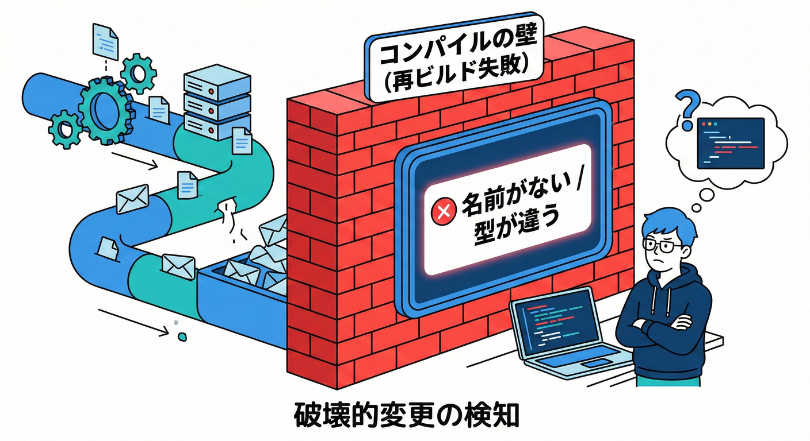
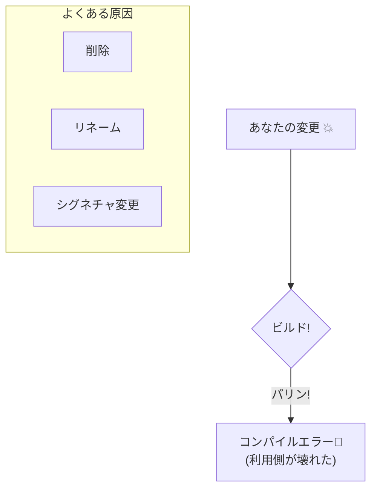

# 16章：破壊的変更カタログ①（コンパイルで壊れる系）🧱

## この章でできるようになること🎯

* 「これは **破壊的変更（Breaking Change）** かどうか」をサッと見分けられる👀
* 変更前に「利用側（Consumer）がどう壊れるか」を想像できる🧠
* 壊さずに進化させる「安全な逃げ道（移行ルート）」を作れる🛣️✨

---

## まず「コンパイルで壊れる」ってどういうこと？🤔💥

利用側がライブラリ（または共有コード）を更新して **再ビルド** した瞬間に、

* 「その名前のメソッドないよ！」
* 「引数の数ちがうよ！」
* 「型が合わないよ！」

みたいに **コンパイラが止めてくる** 状態のことだよ🧱🧱🧱
（逆にいうと、壊れ方がハッキリしてるので、直しやすい面もあるよ😊）

> 公開API（publicな“表の顔”）を変えると、互換性に影響が出やすいよ、というのが.NETライブラリの公式ガイダンスでも強調されてるよ📘([Microsoft Learn][1])

---

## 16.1 破壊的変更カタログ（コンパイルで壊れる系）📚💣




ここからは「やると高確率でビルドが落ちるやつ」を、ありがちな順に並べるよ✨
各項目に「よくある事故」と「安全な代替案」も付けるね😊

---

## ① publicメンバーを削除する（削除）🗑️💥

**壊れ方：** 呼び出し側が「存在しない」と言われてコンパイルエラー😵

### 例（Before → After）

```csharp
// Before: v1
public class PriceService
{
    public decimal GetPrice(int productId) => 100m;
}
```

```csharp
// After: v2（消した）
public class PriceService
{
    // GetPrice を削除
}
```

### 安全な代替案🛟

* いきなり消さないで、まず **[Obsolete]（非推奨）** を付けて移行期間を作る👵➡️👩

  * メッセージをちゃんと書くのが超大事（利用者が迷わない！）✍️
  * [Obsolete] は警告にもエラーにもできるよ⚠️⛔（IsError）([Microsoft Learn][2])

---

## ② 名前を変える（リネーム）📝💥

**壊れ方：** 古い名前で呼んでいる側が全滅😇

* 型名の変更（Class名）
* メソッド名の変更
* プロパティ名の変更
* 名前空間変更（namespace移動）

### 安全な代替案🛟

* 新名を追加して、旧名は **[Obsolete("新しい呼び方はこれだよ")]** で誘導👣
* どうしても移動が必要なら、旧namespaceに **薄いラッパー（転送）** を残す（※中身は新実装を呼ぶ）🪄

---

## ③ public → internal/private にする（公開範囲を狭める）🔒💥

**壊れ方：** 利用側から見えなくなってコンパイル不能😵

### よくある流れ😇

「これ外に出すのやめたい…！」→ いきなりinternalへ
→ 利用側「え、急に消えた😭」

### 安全な代替案🛟

* 段階的に：**[Obsolete] → 次メジャーで削除** の順にする📅
* そもそも「最初から public を増やしすぎない」も超効く（守る契約が増えるほど地獄）🔥

---

## ④ メソッドのシグネチャ変更（引数の数・型・順番）🧩💥

**壊れ方：** 呼び出し側が一致しなくなってコンパイルエラー😵

### 典型パターン

* 引数を増やす（必須パラメータ追加）
* 引数の型を変える
* 引数の順番を変える
* 戻り値の型を変える（これも契約！）

### 例（引数追加で壊す）

```csharp
// Before
public int Add(int a, int b) => a + b;
```

```csharp
// After（必須引数を増やした）
public int Add(int a, int b, int scale) => (a + b) * scale;
```

利用側は `Add(1, 2)` が通らなくなるよ💥

### 安全な代替案🛟（王道）

* **オーバーロード追加** で逃げ道を用意する✨

  * 例：`Add(int a, int b)` は残して、新しい `Add(int a, int b, int scale)` を追加
* 旧メソッドは新メソッドを呼ぶようにして、挙動を揃える🔁
* 旧メソッドに [Obsolete] を付けて移行ガイドを出す🧭

> ちなみに「public API の変更は互換性に直撃する」ので、公式ガイダンスでも注意点がたくさんあるよ📘([Microsoft Learn][1])

---

## ⑤ 既存の呼び出しが “名前付き引数” だと壊れやすい🧷💥

C#には `Foo(x: 1, y: 2)` みたいな **名前付き引数** があるよね😊
ここで **パラメータ名** を変えると、呼び出し側が壊れることがあるよ⚡

### 安全な代替案🛟

* 公開APIのパラメータ名は「契約の一部」として扱う👑
* 名前を変えたくなったら、メソッド自体を新設して移行ルートを作る🛣️

---

## ⑥ interface にメンバーを追加する（実装側が壊れる）🧱💥

**壊れ方：** そのinterfaceを実装してるクラスが「未実装だよ！」でコンパイルエラー😵

これは「利用側がConsumer」だけじゃなくて、**実装側が利用者** のケースで大事故になりがち💣

### 公式の考え方（ざっくり）📘

interfaceは追加に弱いから、拡張余地が必要なら **抽象基底クラス** も検討してね、という話が出てくるよ([Microsoft Learn][1])

### 安全な代替案🛟

* 新しいinterfaceを作って段階移行（例：`IFoo` → `IFoo2`）🪜
* 抽象基底クラス＋仮想メソッドで「デフォルト実装」を提供する🧰（設計次第）

---

## ⑦ ジェネリクス変更（型引数の数・制約）🧬💥

**壊れ方：** 利用側の型指定が合わなくなってコンパイルエラー😵

### ありがち変更

* `Repository<T>` を `Repository<T, TKey>` にしてしまう
* `where T : class` みたいな制約を後から追加する

### 安全な代替案🛟

* 新しい型を追加して、旧型は [Obsolete] で誘導
* 制約を後から強めるのは影響が大きいので、最初に設計で固めるのが安全🔧

---

## ⑧ enumメンバー削除 / リネーム 🧾💥

**壊れ方：** 利用側が使っていた値が消えてコンパイルエラー😵

### 安全な代替案🛟

* いきなり消さず、古い値は残しつつ **非推奨扱い（コメント/ドキュメント/ガード）**
* “どうしても消す” はメジャーアップの仕事🧱

---

## ⑨ const をいじる（文脈によってはコンパイルで壊れる）🧨

`const` は「コンパイル時定数」なので、使い方によっては壊れ方がややこしいよ😵‍💫
特に **属性引数** や **switch case** みたいに「定数が必要」な場所で、`const` を `static readonly` に変えるとコンパイルエラーになりやすい⚡

### 安全なコツ🛟

* 公開APIの `const` は慎重に…！（値も契約っぽい）
* “変わる可能性がある”なら最初から `static readonly` を検討する💡

---

## 16.2 実習：わざと壊して、エラーと仲良くなる🧪✨

## ゴール🎯

「壊し方」を体験して、**エラー文を見た瞬間に原因が分かる** ようになる😊

---

## 実習セット（Producer/Consumer）🛠️

1. クラスライブラリ（Producer）を作る
2. コンソールアプリ（Consumer）から呼ぶ
3. Producerを変更して、Consumerがどう壊れるか見る👀

---

## Step 0：最初のv1を作る🌱

Producer側（ライブラリ）に、こんなクラスを用意：

```csharp
public class GreetingService
{
    public string Hello(string name) => $"Hello, {name}!";
}
```

Consumer側（コンソール）：

```csharp
var s = new GreetingService();
Console.WriteLine(s.Hello("Aki"));
```

ビルドして動けばOK🎉

---

## Step 1：メソッド削除で壊す🗑️💥

Producerで `Hello` を消す → Consumerをビルド
✅ 「存在しない」系エラーが出るはず

**直し方（学習用）**
Consumer側を新APIに合わせる（もしくはProducerに移行ルートを作る）

---

## Step 2：引数変更で壊す🧩💥

Producerでこう変える：

```csharp
public string Hello(string name, int times)
{
    return string.Join(" ", Enumerable.Repeat($"Hello, {name}!", times));
}
```

Consumerは古い呼び方なのでビルド落ちるよ💥
✅ 「引数が足りない」系になるはず

---

## Step 3：public → internal で壊す🔒💥

Producerで：

```csharp
internal class GreetingService
{
    public string Hello(string name) => $"Hello, {name}!";
}
```

Consumerから見えなくなる😇
✅ 「アクセスできない」系が出るはず

---

## 16.3 壊さず進化させる“安全ムーブ”まとめ🛡️✨

## ✅ まずは「追加」で進化させる

* 新メソッド追加
* 新オーバーロード追加
* 新しい型を追加して誘導

## ✅ 旧APIはすぐ消さない（移行路を作る）🛣️

* [Obsolete("代わりはこれだよ")] を付ける
* 移行方法が分かるメッセージを書く✍️
* 必要なら警告→将来エラーの段階を踏む⚠️⛔([Microsoft Learn][2])

## ✅ “publicの形”を変えるのは超重い

公開APIを変えると互換性に響く、という考え方は公式にもまとまってるよ📘([Microsoft Learn][1])

---

## 16.4 PRレビュー用：コンパイル破壊チェックリスト✅👀

* public な型/メソッド/プロパティを **削除** してない？🗑️
* 名前（型名・メンバー名・namespace）を **変更** してない？📝
* public → internal/private に **狭めて** ない？🔒
* 引数（数/型/順番/名前付き引数影響）を **変えて** ない？🧩
* interface にメンバー追加して、実装側を **壊して** ない？🧱
* ジェネリクスの型引数/制約を **変えて** ない？🧬

---

## 16.5 ミニクイズ（3問）🧠💡

1. `public void Foo(int x)` を `public void Foo(long x)` に変更：コンパイルは壊れる？（どんな利用側が壊れる？）
2. `interface IFoo` に `void Bar()` を追加：誰が壊れる？
3. メソッド削除の代わりに [Obsolete] を付けると、利用側はどう嬉しい？

---

## 参考（公式）📘

* .NET 10 は 2025-11-11 にリリース、LTSで 2028-11-10 までサポートだよ🗓️([Microsoft for Developers][3])
* 破壊的変更（互換性）をどう扱うかの公式ガイダンス📘([Microsoft Learn][1])
* [Obsolete] の仕様（警告/エラー・メッセージなど）⚠️([Microsoft Learn][2])

[1]: https://learn.microsoft.com/en-us/dotnet/standard/library-guidance/breaking-changes "Breaking changes and .NET libraries - .NET | Microsoft Learn"
[2]: https://learn.microsoft.com/en-us/dotnet/api/system.obsoleteattribute?view=net-10.0&utm_source=chatgpt.com "ObsoleteAttribute Class (System)"
[3]: https://devblogs.microsoft.com/dotnet/announcing-dotnet-10/ "Announcing .NET 10 - .NET Blog"
