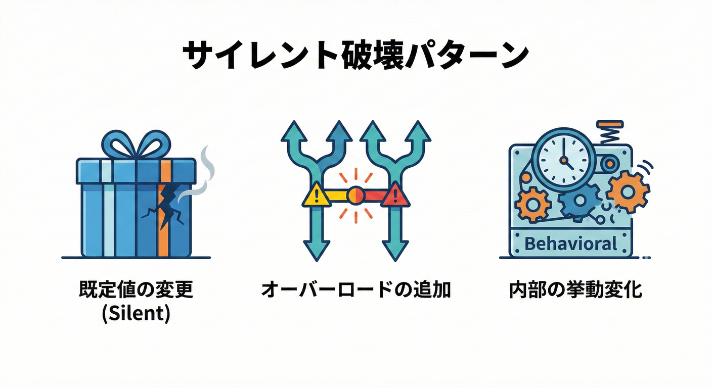

# 17章：破壊的変更カタログ②（コンパイル通るのに壊れる系）🕳️💥

## この章でできるようになること🎯✨

* 「ビルドは通るのに、実行すると壊れる」変更パターンを見抜ける👀💡
* 仕様（契約）として守るべき“挙動”を言語化できる📝✨
* **テストで事故を検知**して、リリース前に止められる🧪🛑
* 「やむを得ず変える時」の安全な逃げ道（段階的変更）も選べる🧯🌱

---

## 17.1 「コンパイル通るのに壊れる」って何？😇

コードが**コンパイル成功✅**しても、次のどれかが起きると実質“破壊的変更”です💥

* 返ってくる値の意味が変わる（例：`null`→空文字、丸め方が変わる）🔁
* 呼ばれるメソッドが変わる（オーバーロード追加で別の関数に吸い込まれる）🌀
* 例外の種類が変わって、`catch` が効かなくなる🧨
* 実行タイミングが変わる（遅延実行になって、列挙した瞬間に落ちる）⏱️💣

こういうのは .NET の互換性分類でも「**behavioral change（挙動変化）**」として整理されています📚✨ ([Microsoft Learn][1])

---

## 17.2 事故りやすい“サイレント破壊”パターン集📦🕳️


```mermaid
graph LR
    A[あなたの変更 🎁] -- "ビルド通る ✅" --> B[リリース]
    B -- "挙動が変わった!" --> C["サイレント破壊 💥<br/>(以前と違う結果)']
    
    subgraph Patterns ["主な原因"]
        P1[既定値の変更]
        P2[別の関数に束縛]
        P3[丸め/精度変更]
    end
```


## パターンA：**オプション引数（既定値）の変更**🎁➡️🎁

**見た目は同じ呼び出し**なのに、結果が変わります😵
しかも「再コンパイルした人だけ挙動が変わる」みたいな事故が起きがち💥

* .NETの互換性ルール上も「既定値変更は、再コンパイル後に挙動破壊になり得る」と明言されています📌 ([Microsoft Learn][2])
* オプション引数自体の基本仕様はこの辺📘 ([Microsoft Learn][3])

**対策🛡️**

* 既定値を変えたくなったら、安易に変更しない🙅‍♀️
* 代わりに「新しいオーバーロードを足す」か「明示引数を必須にする」など、移行を作る（後述）🌱

---

## パターンB：**オーバーロード追加で、別のメソッドが呼ばれる**🌀

「同じ呼び出しコード」なのに、**オーバーロード追加**で解決先が変わることがあります😱
しかも **コンパイルは通る**ので気づきにくい…！

.NET の互換性ルールでも、
「既存のオーバーロードを“食う”新オーバーロード追加で、違う挙動になるのは破壊」ってはっきり書かれています🛑 ([Microsoft Learn][2])

**対策🛡️**

* 追加するなら **“同じ意味”** を守る（同じ挙動ならOK寄り）✨
* どうしても意味が違うなら、名前を変える・明示メソッドにする・obsolete で段階移行へ🧓➡️🧑

---

## パターンC：**例外型が変わって、catchが効かない**🧨

利用側がこう書いてたら👇

```csharp
try { DoWork(); }
catch (ArgumentException) { /* リカバリ */ }
```

提供側が例外を `InvalidOperationException` に変えたら…
**コンパイルは通るのに、リカバリ不能で落ちる**💥

互換性ルールでは「より派生した例外にするのは許容（catchが効くから）」など、例外の互換性判断が整理されています📚 ([Microsoft Learn][2])

**対策🛡️**

* “投げる例外の型”も契約として固定しやすい（特に公開API）📌
* 変えるなら **派生方向**（例：`ArgumentException` → `ArgumentNullException`）を優先する✨ ([Microsoft Learn][2])

---

## パターンD：**丸め・精度・パースの微変更**🔢🧊

* 返す数値の精度が変わる
* パースが厳密になって例外が増える
* culture 依存の挙動が変わる（小数点、日付など）🌍

このへんは“たまたま動いてた”コードが一気に崩壊しがち😵
互換性ルールでも「数値精度変更はNG」や、パースと例外増加は慎重扱いが示されています📌 ([Microsoft Learn][2])

**対策🛡️**

* フォーマット／パースは `IFormatProvider` を契約として明示する🌍✨
* 丸め規則（銀行丸め？四捨五入？）も契約化する📝

---

## パターンE：**遅延実行化（IEnumerableの返し方変更）**🐢➡️🐇

v1は `ToList()` して返してたのに、v2で “賢く” 遅延にしたら…

* 列挙した瞬間に DB/ファイル/Dispose済みに触って落ちる💥
* いつ例外が出るかが変わって、利用側の例外設計が崩れる🧨

**対策🛡️**

* 「このAPIは即時評価で返す／遅延で返す」を契約に書く📝
* 迷うなら **即時評価で固定**（初心者に優しい）😊

---

## パターンF（最新・実例）：**C# 14（.NET 10）で span 系が“より適用される”問題**🧠⚡

C# 14（.NET 10）では **span 変換と型推論の改善**で、
`Span<T>` / `ReadOnlySpan<T>` 系のメソッドが **より多くの場面で候補になり**、呼ばれる先が変わることがあります🌀 ([Microsoft Learn][4])

特にやばい例がこれ👇
`Expression` のラムダ内で `array.Contains(num)` が **Enumerable じゃなく MemoryExtensions 側に束縛されて**、`preferInterpretation: true` の解釈実行で例外になる、というケースが公式に説明されています💥 ([Microsoft Learn][4])

**対策🛡️（公式推奨の回避パターン）**

* `((IEnumerable<int>)array).Contains(num)` のように **型を明示して束縛先を固定**
* あるいは `Enumerable.Contains(array, num)` のように **静的呼び出しで固定** ([Microsoft Learn][4])

---

## 17.3 実習：事故を“体験して→テストで止める”🧪🛑

ここからは **Producer（提供側）** と **Consumer（利用側）** を分けて、
「コンパイル通るのに壊れる」をガチで体験します😇✨

## 実習プロジェクト構成📁

* `ContractDemo.Producer`（クラスライブラリ）
* `ContractDemo.Consumer`（コンソール）
* `ContractDemo.ConsumerTests`（xUnit で契約テスト🧪）

---

## 実習17-A：オプション引数の既定値変更で“サイレント破壊”🎁💥

### v1（提供側）🍀

```csharp
namespace ContractDemo.Producer;

public static class Greeting
{
    public static string Hello(string name, string prefix = "Hello")
        => $"{prefix}, {name}!";
}
```

### v1（利用側）🍀

```csharp
using ContractDemo.Producer;

Console.WriteLine(Greeting.Hello("Aki"));
```

出力：`Hello, Aki!` 😊

### v1.1（提供側の変更）🌀

「もっとフレンドリーにしたい！」で prefix を変える👇

```csharp
public static string Hello(string name, string prefix = "Hi")
    => $"{prefix}, {name}!";
```

✅ コンパイル通る
✅ 実行も通る
❌ でも出力が変わる（利用側の期待が壊れる）💥

### 契約テストで止める🧪🛑

```csharp
using ContractDemo.Producer;
using Xunit;

public class GreetingContractTests
{
    [Fact]
    public void Hello_DefaultPrefix_IsHello()
    {
        Assert.Equal("Hello, Aki!", Greeting.Hello("Aki"));
    }
}
```

**ポイント📌**
「既定値」って“仕様の一部”になりやすいんだよね🥹
だから変更したいなら、次のように **新APIを足して誘導**が安全✨

---

## 実習17-B：オーバーロード追加で“別の関数が呼ばれる”🌀💥

### v1（提供側）🍀

```csharp
namespace ContractDemo.Producer;

public static class Logger
{
    public static string Log(object message)
        => $"[obj] {message}";
}
```

### 利用側🍀

```csharp
using ContractDemo.Producer;

Console.WriteLine(Logger.Log("OK"));
```

出力：`[obj] OK`

### v1.1（提供側）🌀

「string専用を足して、空文字を特別扱いしよ！」で追加👇

```csharp
public static string Log(string message)
    => message.Length == 0 ? "[str] <empty>" : $"[str] {message}";
```

利用側コードは **一切変更なし**なのに…

* `"OK"` は `Log(string)` が選ばれる
* つまり出力が `"[str] OK"` に変わる😱

こういう「新オーバーロードが既存を食って、挙動が変わる」のは互換性ルールでも危険扱い🛑 ([Microsoft Learn][2])

### テストで止める🧪🛑

```csharp
using ContractDemo.Producer;
using Xunit;

public class LoggerContractTests
{
    [Fact]
    public void Log_String_ShouldBehaveLikeObjectOverload_V1Contract()
    {
        // 「文字列もobject扱いでログされる」が契約ならこう固定する
        Assert.Equal("[obj] OK", Logger.Log("OK"));
    }
}
```

**安全にやるなら🛡️**

* `LogString(...)` みたいに名前を変える
* あるいは「両方のオーバーロードの挙動を同一にする」✨

---

## 実習17-C：例外型変更で“catchが外れて落ちる”🧨💥

### v1（提供側）🍀

```csharp
namespace ContractDemo.Producer;

public static class Parser
{
    public static int ParseAge(string text)
    {
        if (string.IsNullOrWhiteSpace(text))
            throw new ArgumentException("age is required", nameof(text));

        return int.Parse(text);
    }
}
```

### 利用側🍀

```csharp
using ContractDemo.Producer;

try
{
    Console.WriteLine(Parser.ParseAge(""));
}
catch (ArgumentException)
{
    Console.WriteLine("入力してね！");
}
```

### v1.1（提供側）🌀

「空は仕様的にダメだから InvalidOperation にしよ！」で変更👇

```csharp
if (string.IsNullOrWhiteSpace(text))
    throw new InvalidOperationException("age is required");
```

✅ コンパイル通る
❌ `catch (ArgumentException)` に入らず落ちる可能性💥

**契約として守りやすい方向🛡️**

* 例外型を変えるなら “より派生した例外” に寄せる（catchが効く）✨ ([Microsoft Learn][2])

---

## 実習17-D（最新）：C# 14 / span で Expression が落ちる事故を再現🧠💥

公式の例をそのまま体験してみよ〜！📘✨ ([Microsoft Learn][4])

```csharp
using System;
using System.Collections.Generic;
using System.Linq;
using System.Linq.Expressions;

M((array, num) => array.Contains(num)); // 失敗する可能性（MemoryExtensions.Contains に束縛）
M((array, num) => ((IEnumerable<int>)array).Contains(num)); // OK（Enumerable.Contains に束縛）
M((array, num) => Enumerable.Contains(array, num)); // OK

void M(Expression<Func<int[], int, bool>> e) => e.Compile(preferInterpretation: true);
```

**学びポイント🎓**

* 「同じ `Contains` 呼び出し」でも **束縛先が変わる**
* その結果、**実行モード（interpretation）で例外**になることがある
* だから、Expression を扱うコードは **束縛先を固定する癖**が強い味方🛡️✨ ([Microsoft Learn][4])

---

## 17.4 事故を減らす“設計のクセ”🧠🛡️

## ① “契約”は「型と名前」だけじゃなく「挙動」まで📜✨

* 入力に対して、何を返す？
* 失敗時に、何を返す？何を投げる？
* 既定値や丸め、culture は？
  こういうのを **短文で書ける**だけで、事故率が下がるよ😊📝

---

## ② オーバーロード地獄のコントロール：OverloadResolutionPriority 🧲

どうしても互換のために複数オーバーロードが並ぶ時、
オーバーロード解決の優先度を調整できる属性があります✨ ([Microsoft Learn][5])

※ただし「魔法の万能」じゃないので、まずは **意味を揃える／名前を分ける**が基本だよ〜🧁

---

## ③ “挙動破壊”は、SemVer的にだいたい MAJOR 💣

「壊れてるのに気づきにくい」ぶん、被害が大きい😵
だから **小さく直してるつもりでも MAJOR 相当**になりやすいよ⚠️
（この章のパターンは特にね…！）

---

## 17.5 AI（下書き係🤖）の使い方：この章に刺さるプロンプト集🪄✨

## ✅ 変更の“破壊ポイント”洗い出し

```text
あなたは公開ライブラリの互換性レビュアです。
次の変更差分（Before/After）を見て、
「コンパイルは通るが挙動が変わる」破壊的変更の可能性を列挙し、
利用側で起きる事故例と、回避策（移行API/テスト）を提案してください。
```

## ✅ 契約テスト自動生成（xUnit）

```text
次の public API について、
「契約として固定すべき挙動」を xUnit のテストとして列挙してください。
特に：既定値、例外型、戻り値の意味、遅延実行、オーバーロード解決の差を重点に。
```

## ✅ リリースノートの“利用者目線”化📰

```text
次の変更点を、利用者が最短で安全に移行できる形でリリースノートにしてください。
「何が変わった」「どう影響する」「どう直す」を必ず含めて。
```

---

## まとめ🍰✨

* 「コンパイル通るのに壊れる」は **いちばん怖い破壊**😇🕳️
* 代表的な事故は

  * 既定値変更🎁
  * オーバーロード追加で束縛先変更🌀
  * 例外型変更で catch が外れる🧨
  * 精度/丸め/パースの微変更🔢
  * 遅延実行化🐢
  * そして **C# 14 / .NET 10 の span 系による束縛変化**（Expression 事故）🧠⚡ ([Microsoft Learn][4])
* 最強の守りは **契約テスト**🧪🛡️（変更のたびに自動で止める！）

[1]: https://learn.microsoft.com/en-us/dotnet/core/compatibility/10 "Breaking changes in .NET 10 | Microsoft Learn"
[2]: https://learn.microsoft.com/en-us/dotnet/core/compatibility/library-change-rules ".NET API changes that affect compatibility - .NET | Microsoft Learn"
[3]: https://learn.microsoft.com/en-us/dotnet/csharp/programming-guide/classes-and-structs/named-and-optional-arguments "Named and Optional Arguments - C# | Microsoft Learn"
[4]: https://learn.microsoft.com/en-us/dotnet/core/compatibility/core-libraries/10.0/csharp-overload-resolution "Breaking change: C# 14 overload resolution with span parameters - .NET | Microsoft Learn"
[5]: https://learn.microsoft.com/en-us/dotnet/api/system.runtime.compilerservices.overloadresolutionpriorityattribute?view=net-10.0&utm_source=chatgpt.com "OverloadResolutionPriorityAttrib..."
