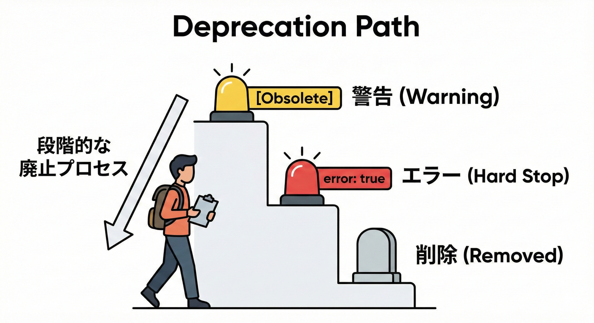
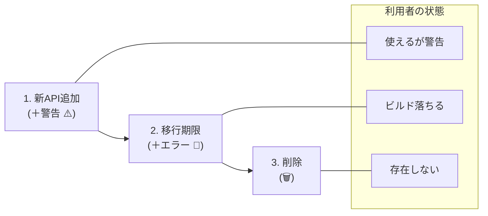

# 第18章：段階的廃止（Deprecated）戦略🧓➡️🧑✨

## この章でできるようになること🎯

* 「今は使えるけど、将来消すよ」を安全に伝える方法がわかる🧭
* `[Obsolete]` を **警告→エラー→削除** の順で段階的に運用できるようになる⚙️
* 「移行してね」を伝える **メッセージ文・FAQ・リリースノート** を作れる📝
* **NuGet 側の“パッケージ非推奨”** も使って、利用者に気づいてもらえる📦

---

## 1) 「非推奨」と「削除」は別ものだよ🧩

## 非推奨（Deprecated）🧓

* **まだ使える**（ビルドは通る）
* でも「将来なくなる」「推奨しない」を明確にする
* 目的：利用者に **安全な移行期間** を渡す🎁

## 削除（Removed）🗑️

* **使えない**（呼び出せない / コンパイルできない）
* 目的：古いものを整理して、保守コストや事故を減らす🧹

---

## 2) “廃止”を伝える場所は2つあるよ📍

## A. コード上（APIレベル）🧑‍💻

* 代表：`[Obsolete]`
* 使われた瞬間に「警告/エラー」を出して気づかせる
* メッセージで「代替はこちら」「いつ消える」を伝える📝
  `ObsoleteAttribute` は、使われたときに警告/エラーを出せる仕組みだよ。([Microsoft Learn][1])

## B. 配布上（パッケージレベル）📦

* **NuGet の“パッケージ非推奨化”**
* 「このパッケージはレガシだよ」「代替はこちら」を nuget.org 上で表示できる
* ※ただし、カスタムメッセージは **nuget.org には出るけど、`dotnet` や NuGet クライアントには出ない**（現状）([Microsoft Learn][2])

この2つをセットでやると、見落とされにくいよ👀✨

---

## 3) `[Obsolete]` の基本：警告にする？エラーにする？🚦

`[Obsolete]` には大きく2段階があるよ👇

## ✅ まずは「警告」で気づかせる（移行期間）⚠️

* メッセージ付きの Obsolete は **CS0618（レベル2警告）** になりやすいよ([Microsoft Learn][3])
* メッセージなしだと **CS0612（レベル1警告）** になりやすいよ([Microsoft Learn][4])
* 実務では「メッセージ無し」は不親切なので避けがち🙅‍♀️（後述のルールでも推奨されてる）

## ✅ 次に「エラー」で強制移行（期限が来たら）🛑

* `ObsoleteAttribute` は **使われたらエラー扱いにできる**（`IsError`/コンストラクタ引数）([Microsoft Learn][5])

---

## 4) 2026っぽい親切設計：DiagnosticId と UrlFormat🧷🔗

.NET 5 以降、`ObsoleteAttribute` に **2つの強化ポイント**が追加されてるよ✨([Microsoft Learn][6])

## 4-1) `DiagnosticId`：廃止警告に「固有ID」をつける🏷️

* これがあると、警告を **個別に抑制** できる（全部まとめて無視、を避けやすい）
* 公式でも「カスタム診断IDにより、個別抑制ができる」方針になってるよ([Microsoft Learn][7])

## 4-2) `UrlFormat`：IDEで「詳細リンク」へ誘導できる🔗

* 診断IDを埋め込める形式文字列で、説明ページに飛ばせるよ
* `UrlFormat` は「診断IDを含む汎用URLを作れる」仕様だよ([Microsoft Learn][8])

---

## 5) 段階的廃止の“王道3ステップ”👑📅




ここがこの章の本体だよ〜！✨

## Step 1：代替APIを追加して、旧APIは温存➕🧸

* 新API（置き換え先）を先に用意する
* 旧APIはまだ動く状態で残す（互換維持）

## Step 2：旧APIに `[Obsolete("移行してね")]` を付けて警告⚠️

* 利用者のビルドに「気づき」を出す
* メッセージで **代替・理由・期限** を伝える📝
  メッセージは “必須級” で、.NET の品質ルールでも「メッセージを書いてね」とされてるよ([Microsoft Learn][9])

## Step 3：期限が来たら「エラー化」→ 次のメジャーで削除🛑➡️🗑️

* いきなり削除より事故が激減する💥
* `IsError=true` で「いつまでも放置」を止められる([Microsoft Learn][5])

---

## 6) 実習🧪：ミニライブラリで “Deprecated運用” を体験しよう✨

## ゴール🎯

* v1.1：警告で移行促進
* v1.2：エラー化（移行期限）
* v2.0：削除（破壊的変更）

---

## 6-1) v1：最初のAPI（旧APIだけ）🌱

```csharp
namespace ContractsDemo;

public static class MathApi
{
    // v1で公開したAPI（のちに置き換える）
    public static int Add(int a, int b) => a + b;
}
```

利用側（Consumer）：

```csharp
using ContractsDemo;

Console.WriteLine(MathApi.Add(2, 3));
```

---

## 6-2) v1.1：新APIを追加して、旧APIは「警告」にする⚠️✨

ポイントはここ👇

* メッセージ付きにする（CS0618になりやすい）([Microsoft Learn][3])
* `DiagnosticId` と `UrlFormat` で “親切な警告” にする([Microsoft Learn][6])

```csharp
namespace ContractsDemo;

public static class MathApi
{
    public static int Sum(int a, int b) => a + b;

    [Obsolete(
        message: "Add(a,b) は非推奨です。Sum(a,b) を使ってね。2026-12-01以降は削除予定。", 
        error: false,
        DiagnosticId = "MYLIB0001",
        UrlFormat = "https://contoso.example/obsoletions/{0}"
    )]
    public static int Add(int a, int b) => Sum(a, b);
}
```

* `UrlFormat` は `{0}` に診断IDを入れられる形式が想定されてるよ([Microsoft Learn][8])
* `DiagnosticId` は “警告の固有ID” として抑制にも使えるよ([Microsoft Learn][10])

---

## 6-3) v1.2：期限が来たら「エラー化」🛑

「もう移行してね！」の合図を強くする✨
`IsError`（または `error:true`）でエラー扱いにできるよ([Microsoft Learn][5])

```csharp
namespace ContractsDemo;

public static class MathApi
{
    public static int Sum(int a, int b) => a + b;

    [Obsolete(
        message: "Add(a,b) は廃止されました。Sum(a,b) に移行してください。", 
        error: true,
        DiagnosticId = "MYLIB0001",
        UrlFormat = "https://contoso.example/obsoletions/{0}"
    )]
    public static int Add(int a, int b) => Sum(a, b);
}
```

---

## 6-4) v2.0：削除🗑️（メジャーアップでやるのが王道）

* ここで `Add` を本当に消す
* 破壊的変更なのでメジャーを上げる（SemVerの基本）🔢

---

## 7) “移行させる文章”テンプレ集📝💕（すぐ使える）

## 7-1) `[Obsolete]` メッセージの黄金構成👑

品質ルール的にも「メッセージは重要」で、置換先やサポート期間を書くのが推奨されてるよ([Microsoft Learn][9])

* ① 何がダメ？（旧API名）
* ② 何を使う？（代替API名）
* ③ いつまで？（削除予定 or 期限）
* ④ どこ見れば？（UrlFormatリンク）

例：

* 「`Xxx` は非推奨です。`Yyy` を使ってね。`2026-12-01` にエラー化、`v2.0` で削除予定。詳細：リンク」

## 7-2) リリースノート（Breakingじゃない時も書く）📰✨

* ✅ 追加した代替API
* ✅ 非推奨にしたAPI
* ✅ 移行手順（置換例）
* ✅ 期限（いつエラー化/削除か）

## 7-3) FAQ（よくある質問）💬

* Q. すぐ直さないとダメ？
* A. 期限までは動くけど、先に直すほど安全だよ〜
* Q. 置換は単純？
* A. 置換表とサンプルを用意したよ（例を貼る）

---

## 8) NuGet 側の「パッケージ非推奨化」も一緒にやろう📦👀

nuget.org では、パッケージを **一覧削除せずに** “非推奨” にできるよ。

* 「削除」は検索に出なくなる（発見されない）
* 「非推奨」は既存利用者に理由・代替を示せる（でも一覧は残る）([Microsoft Learn][2])

さらに注意ポイント⚠️

* nuget.org に書いた **カスタムメッセージは nuget.org にしか表示されず**、`dotnet` などのクライアントには出ない（現状）([Microsoft Learn][2])

だからこそ、**コード側の `[Obsolete]` とセット**が強いよ💪✨

---

## 9) 利用者が“警告を消したい”と言ってきたら？🙈（抑制は最終手段）

## 9-1) まずは「置換」を案内するのが正攻法✅

* 警告を消すより、移行のほうが安全🧯

## 9-2) どうしても…の時だけ局所的に抑制🩹

CS0618 の例（局所）：

```csharp
#pragma warning disable CS0618
Console.WriteLine(MathApi.Add(2, 3));
#pragma warning restore CS0618
```

## 9-3) カスタム診断IDの抑制（SYSLIB/EXTOBS系の考え方）🏷️

.NET 5+ の一部 Obsolete は **CS0618では抑制できず**、`SYSLIB0XXX` や `EXTOBS0XXX` のような **カスタムID** で扱う必要があるよ([Microsoft Learn][6])
（あなたのライブラリでも `MYLIB0001` みたいに “個別ID” を付けると管理しやすい✨）

---

## 10) PRレビューのチェックリスト👀✅

* [ ] 代替APIは先に用意されてる？➕
* [ ] `[Obsolete]` のメッセージに「代替」「期限」「理由」が入ってる？📝（メッセージは重要）([Microsoft Learn][9])
* [ ] `DiagnosticId` が付いてる？（個別管理できる）🏷️([Microsoft Learn][10])
* [ ] `UrlFormat` で詳細ドキュメントに誘導できる？🔗([Microsoft Learn][8])
* [ ] 期限後の「エラー化」→「削除」の計画がある？📅
* [ ] NuGet パッケージも非推奨化する？（代替案も書く）📦([Microsoft Learn][2])

---

## 11) AI活用🤖✨：廃止運用を“爆速で整える”プロンプト例

* 「このAPIの非推奨メッセージを、代替案＋期限＋置換例つきで作って」📝
* 「`Add`→`Sum` の移行ガイドを、Before/Afterのコード例つきで書いて」🧭
* 「リリースノートに“変更点/影響/対応方法”を短くまとめて」📰
* 「FAQを5個作って。利用者の不安（互換性/期限/置換コスト）に答えて」💬

---

## この章の成果物（提出物）📦✨

* ✅ Deprecated方針（警告→エラー→削除のスケジュール）📅
* ✅ `[Obsolete]` 付きコード（DiagnosticId/UrlFormat込み）🏷️🔗([Microsoft Learn][10])
* ✅ 移行ガイド（置換表＋Before/After）🧭
* ✅ リリースノート（非推奨・期限・対応）📰
* ✅ NuGet パッケージ非推奨化（理由＋代替）📦([Microsoft Learn][2])

---

## ミニ確認クイズ✅🎀

1. 「今は使えるけど将来消す」を伝える属性は？🧓
2. Obsoleteに **メッセージ無し** だと出やすい警告は？（CS0612/CS0618どっち？）([Microsoft Learn][4])
3. 警告を“個別に”扱いやすくするために付けるのは？🏷️([Microsoft Learn][10])
4. IDEから詳細説明へ誘導するために使えるのは？🔗([Microsoft Learn][8])

[1]: https://learn.microsoft.com/en-us/dotnet/api/system.obsoleteattribute?view=net-10.0 "ObsoleteAttribute Class (System) | Microsoft Learn"
[2]: https://learn.microsoft.com/ja-jp/nuget/nuget-org/deprecate-packages "nuget.org でのパッケージの非推奨化 | Microsoft Learn"
[3]: https://learn.microsoft.com/ja-jp/dotnet/csharp/language-reference/compiler-messages/cs0618?utm_source=chatgpt.com "コンパイラの警告 (レベル 2) CS0618 - C# reference"
[4]: https://learn.microsoft.com/ja-jp/dotnet/csharp/misc/cs0612 "コンパイラの警告 (レベル 1) CS0612 - C# | Microsoft Learn"
[5]: https://learn.microsoft.com/en-us/dotnet/api/system.obsoleteattribute.iserror?view=net-10.0&utm_source=chatgpt.com "ObsoleteAttribute.IsError Property (System)"
[6]: https://learn.microsoft.com/en-us/dotnet/fundamentals/syslib-diagnostics/obsoletions-overview "Obsolete features in .NET 5+ - .NET | Microsoft Learn"
[7]: https://learn.microsoft.com/en-us/dotnet/core/compatibility/core-libraries/10.0/obsolete-apis?utm_source=chatgpt.com "API obsoletions with non-default diagnostic IDs (.NET 10)"
[8]: https://learn.microsoft.com/en-us/dotnet/api/system.obsoleteattribute.urlformat?view=net-10.0&utm_source=chatgpt.com "ObsoleteAttribute.UrlFormat Property (System)"
[9]: https://learn.microsoft.com/en-us/dotnet/fundamentals/code-analysis/quality-rules/ca1041 "CA1041: Provide ObsoleteAttribute message (code analysis) - .NET | Microsoft Learn"
[10]: https://learn.microsoft.com/en-us/dotnet/api/system.obsoleteattribute.diagnosticid?view=net-10.0&utm_source=chatgpt.com "ObsoleteAttribute.DiagnosticId Property (System)"
