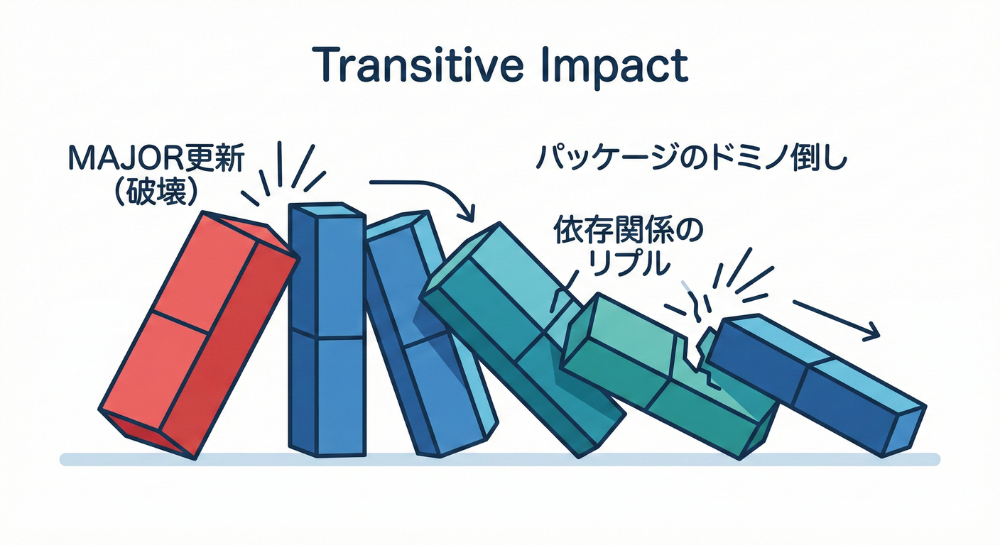
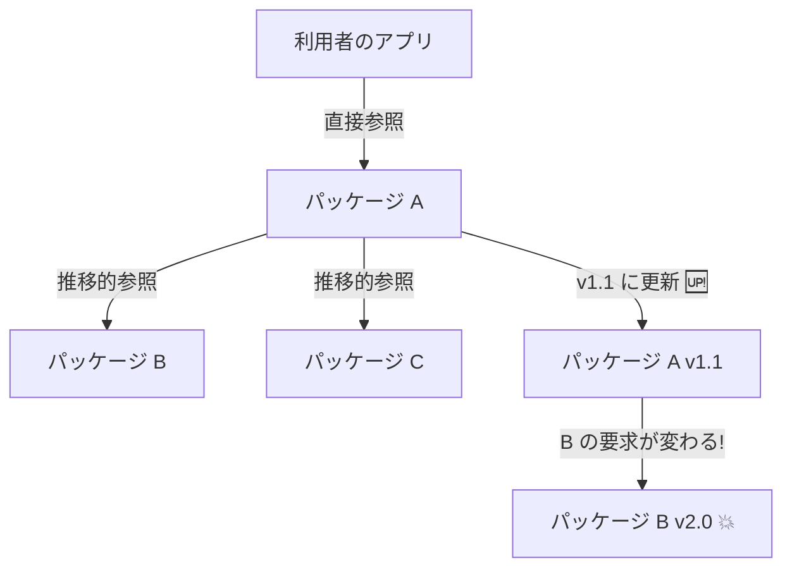

# 第19章：バージョニング実務①（NuGetのバージョン戦略）📦

## この章のゴール🎯✨

* 「どの変更で **MAJOR / MINOR / PATCH** を上げるか」を迷わず決められる🔢
* 依存関係の更新で起きる事故（とくに**自分のせいじゃない事故**）を予防できる🛡️
* **v1 → v1.1** を “安全に” リリースできる（実習つき）🧪✅

---

## 19.1 パッケージのバージョンは「契約の顔」🏷️🙂

Microsoftの .NET 10 は LTS（長期サポート）として提供され、今のC#開発の土台はここが基準になってるよ〜🧱✨ ([Microsoft for Developers][1])
その上で、ライブラリを配るときの **NuGet パッケージのバージョン**は、利用者にとって「アップデートして大丈夫？😳」を判断するラベルになるの📦🏷️

---

## 19.2 まずは基本：SemVer（セマンティック バージョニング）🔢

NuGet のバージョンは SemVer 2.0.0 を前提に整理されてるよ（範囲指定や正規化の話もここにまとまってる）📘 ([Microsoft Learn][2])

## 形式📌

* `MAJOR.MINOR.PATCH`
  例：`1.4.2`
* プレリリース：`-alpha` / `-beta` / `-rc.1` など
  例：`1.5.0-rc.1`
* （覚えとして）

  * **MAJOR**：壊れる変更💥
  * **MINOR**：互換を保った追加➕
  * **PATCH**：バグ修正🩹

> ポイント：利用者は「数字の上げ方」を見て、安心して更新するか決めるよ🙂✨
> だから“雰囲気で上げる”のが一番こわい😱

---

## 19.3 依存関係の指定には「幅」がある📏（そして事故は幅から来る）

NuGet では、利用側（Consumer）が「どのバージョンまで許すか」を指定できるよ🧩 ([Microsoft Learn][2])

## よく使う指定の考え方（超重要）💡

1. **固定（ピン留め）**：`1.2.3`

* 予測可能✅（同じものが入る）
* ただし更新は自分でやる必要あり🔁

2. **範囲（レンジ）**：`[1.2.3, 2.0.0)` みたいな形

* 「2.0.0 未満ならOK」みたいに表せる📏
* 範囲が広いほど「勝手に上がって勝手に壊れる」リスクが上がる😇

3. **ワイルドカード / floating**（例：`1.2.*` みたいなやつ）

* “動くこともある”けど、学習初期は基本おすすめしないよ〜⚠️
* **CIで昨日動いてたのに今日壊れる**が起こりやすい😵‍💫

---

## 19.4 「依存関係更新で壊れる」ってどういうこと？😱




## 事故パターンA：直接参照は変えてないのに壊れる（推移的依存関係）🧶

自分が入れたパッケージAが、裏でBやCに依存してると…

* Aの更新で **B/Cの解決結果が変わる**
* 結果：自分は何もしてないのに挙動が変わる😇

これが「依存関係更新こわい」最大の理由〜🫠

## 事故パターンB：同じ範囲指定でも「解決結果」が環境で変わる🌀

* ローカルは通るのに、別PC/CIで落ちる…あるある😭

そこで効くのが **ロックファイル（packages.lock.json）** だよ🧷✨
`dotnet restore --locked-mode` で「解決結果を固定して復元」できる（更新は許さない）🔒 ([Microsoft Learn][3])

---

## 19.5 実務のおすすめ：2つの立場で分けて考える👀

## ①提供側（Producer）：自分のパッケージの数字をどう上げる？📦⬆️

判断はこの3つだけでOK😊

* **PATCH**（例：1.0.0 → 1.0.1）🩹

  * バグ修正
  * パブリックAPI（public）が変わらない
* **MINOR**（例：1.0.0 → 1.1.0）➕

  * 後方互換の追加（メソッド追加、オプション追加など）
  * 既存の使い方が壊れない
* **MAJOR**（例：1.0.0 → 2.0.0）💥

  * 既存コードが壊れる変更（削除、シグネチャ変更、意味変更、例外仕様の変更…）

NuGetのバージョン自体の基本・考え方はここにまとまってるよ📘 ([Microsoft Learn][2])

## ②利用側（Consumer）：他人のパッケージ更新をどう安全に受ける？🛡️

おすすめはこの順で堅くなるよ👇

* **最小構成**：固定（ピン留め）＋定期更新🗓️
* **チーム/複数プロジェクト**：中央管理（Central Package Management）📌

  * `Directory.Packages.props` にまとめて書ける
  * `dotnet new packagesprops` で作れるよ✨ ([Microsoft Learn][4])
* **CIを安定させたい**：ロックファイル＋locked-mode🔒 ([Microsoft Learn][3])

---

## 19.6 実習：v1 → v1.1 をリリースして、利用側が安全に更新する🧪📦✅

## 実習で作るもの🎁

* 提供側：`Komi.ContractsDemo`（クラスライブラリ）📦
* 利用側：`Komi.Consumer`（コンソール）🖥️
* ローカルフィード：フォルダを1つ作って「そこをNuGetフィード扱い」にする📁✨

---

## Step 1：提供側ライブラリを作る（v1.0.0）🌱

1. Visual Studioで「クラスライブラリ」作成
2. `.csproj` にパッケージ情報を入れる（まず最低限）

```xml
<Project Sdk="Microsoft.NET.Sdk">
  <PropertyGroup>
    <TargetFramework>net10.0</TargetFramework>

    <!-- NuGetの“パッケージとしての”情報 -->
    <PackageId>Komi.ContractsDemo</PackageId>
    <Version>1.0.0</Version>
    <Authors>Komi</Authors>
    <Description>Contract demo package</Description>

    <!-- ビルドしたらnupkgも作る -->
    <GeneratePackageOnBuild>true</GeneratePackageOnBuild>
  </PropertyGroup>
</Project>
```

`PackageId` や `Version` などのプロパティは .NET SDK の標準のMSBuildプロパティで設定できるよ🧰 ([Microsoft Learn][5])

3. 例としてAPIを1つだけ用意（契約は小さく！）✨

```csharp
namespace Komi.ContractsDemo;

public static class Greeting
{
    public static string Hello(string name) => $"Hello, {name}!";
}
```

4. パッケージを作る（Pack）📦

* VS：プロジェクト右クリック → Pack（またはビルドで生成）
* CLIでもOK：

```bash
dotnet pack -c Release
```

---

## Step 2：ローカルフィードを作って、利用側から参照する📁➡️📦

1. 例：`C:\nuget-local` を作る
2. できた `.nupkg` をそこにコピー
3. 利用側コンソールを作成して、ローカルフィードを追加

`NuGet.config`（リポジトリ直下に置くと分かりやすいよ🙂）

```xml
<?xml version="1.0" encoding="utf-8"?>
<configuration>
  <packageSources>
    <add key="local" value="C:\nuget-local" />
    <add key="nuget.org" value="https://api.nuget.org/v3/index.json" />
  </packageSources>
</configuration>
```

4. パッケージ追加📦

```bash
dotnet add package Komi.ContractsDemo --version 1.0.0
```

5. 使ってみる😊

```csharp
using Komi.ContractsDemo;

Console.WriteLine(Greeting.Hello("Sakura"));
```

---

## Step 3：後方互換の追加をして v1.1.0 を出す➕（MINOR）

提供側で「壊さずに追加」をするよ🌸

```csharp
namespace Komi.ContractsDemo;

public static class Greeting
{
    public static string Hello(string name) => $"Hello, {name}!";

    // ✅ 追加（既存は壊さない）
    public static string Hello(string firstName, string lastName)
        => $"Hello, {firstName} {lastName}!";
}
```

`.csproj` の `Version` を `1.1.0` に変更して pack📦

```xml
<Version>1.1.0</Version>
```

利用側で更新：

```bash
dotnet add package Komi.ContractsDemo --version 1.1.0
```

👉 既存コードがそのまま動いたら成功🎉（MINORの意味が体感できたね！）

---

## 19.7 事故を防ぐ「固定化」2点セット🔒🧷

## ①中央管理（複数プロジェクトで超便利）📌

`Directory.Packages.props` をリポジトリ直下に置いて、バージョンを集約できるよ✨ ([Microsoft Learn][4])

```xml
<Project>
  <PropertyGroup>
    <ManagePackageVersionsCentrally>true</ManagePackageVersionsCentrally>
  </PropertyGroup>

  <ItemGroup>
    <PackageVersion Include="Komi.ContractsDemo" Version="1.1.0" />
  </ItemGroup>
</Project>
```

各 `.csproj` から `Version="..."` を消せて、差分がキレイになる🧼✨

## ②ロックファイル（CIの再現性を上げる）🧷

`dotnet restore --locked-mode` で「依存関係の解決結果を固定」できるよ🔒 ([Microsoft Learn][3])

```bash
dotnet restore --locked-mode
```

---

## 19.8 AIで依存関係アップデートを“安全に”進める🤖🧯

Visual Studio 2026 のリリースノートには、Copilot から NuGet 情報を使う仕組み（NuGet MCP server）が紹介されてて、脆弱性修正や更新提案にも使えるよ🧰✨ ([Microsoft Learn][6])

## 使いどころ（初心者でも強い）💪

* 「脆弱性があるパッケージだけ直したい」🧯
* 「互換範囲内で最新に寄せたい」⬆️

NuGetの監査（Audit）自体の考え方と、CLIでの更新例は公式にもまとまってるよ🔎 ([Microsoft Learn][7])

## ただし注意⚠️（ここが契約設計っぽいポイント！）

AIが「上げましょう！」と言っても、

* **契約を壊さないか（MAJOR相当じゃないか）**
* **依存の解決結果が変わってないか（ロック/差分）**
  は人間が最後に確認するよ👀✅

---

## 19.9 まとめチェックリスト✅📦

## 提供側（Producer）📦

* [ ] public API を変えた？ → **MAJOR** かも💥
* [ ] 追加だけ？ → **MINOR** ➕
* [ ] バグ修正だけ？ → **PATCH** 🩹
* [ ] `.csproj` に `PackageId` / `Version` / `Description` は入ってる？ ([Microsoft Learn][5])

## 利用側（Consumer）🛡️

* [ ] バージョン管理が散らばってない？ → 中央管理を検討📌 ([Microsoft Learn][4])
* [ ] CIでたまに壊れる？ → ロックファイル＋locked-mode🔒 ([Microsoft Learn][3])
* [ ] 更新理由が「なんとなく」になってない？ → 変更点の確認を必ず👀

---

## おまけ：ミニクイズ🎓✨（数字を上げる練習）

1. `public` メソッドの引数を1つ増やした（既存メソッドを変更）
   → だいたい **MAJOR候補**（既存呼び出しが壊れる可能性）💥

2. 新しい `public` メソッドを追加した（既存は触ってない）
   → **MINOR** ➕

3. nullチェックのバグ修正だけ（public APIは同じ）
   → **PATCH** 🩹

（迷ったら、「利用者のコードが壊れる？」で考えると早いよ🙂🔍）

[1]: https://devblogs.microsoft.com/dotnet/announcing-dotnet-10/?utm_source=chatgpt.com "Announcing .NET 10"
[2]: https://learn.microsoft.com/en-us/nuget/concepts/package-versioning?utm_source=chatgpt.com "NuGet Package Version Reference"
[3]: https://learn.microsoft.com/en-us/dotnet/core/tools/dotnet-restore?utm_source=chatgpt.com "dotnet restore command - .NET CLI"
[4]: https://learn.microsoft.com/en-us/nuget/consume-packages/central-package-management?utm_source=chatgpt.com "Central Package Management (CPM) - NuGet"
[5]: https://learn.microsoft.com/en-us/dotnet/core/project-sdk/msbuild-props?utm_source=chatgpt.com "MSBuild reference for .NET SDK projects"
[6]: https://learn.microsoft.com/en-us/visualstudio/releases/2026/release-notes?utm_source=chatgpt.com "Visual Studio 2026 Release Notes"
[7]: https://learn.microsoft.com/en-us/nuget/concepts/auditing-packages?utm_source=chatgpt.com "Auditing package dependencies for security vulnerabilities"
