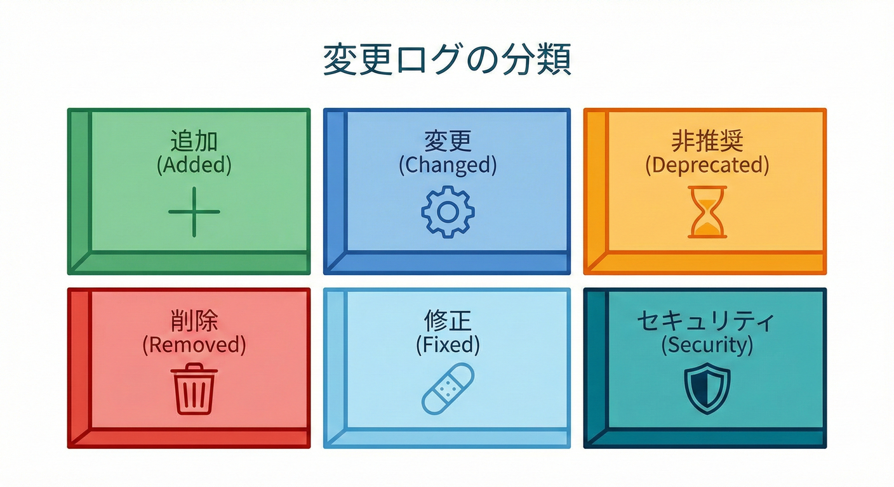
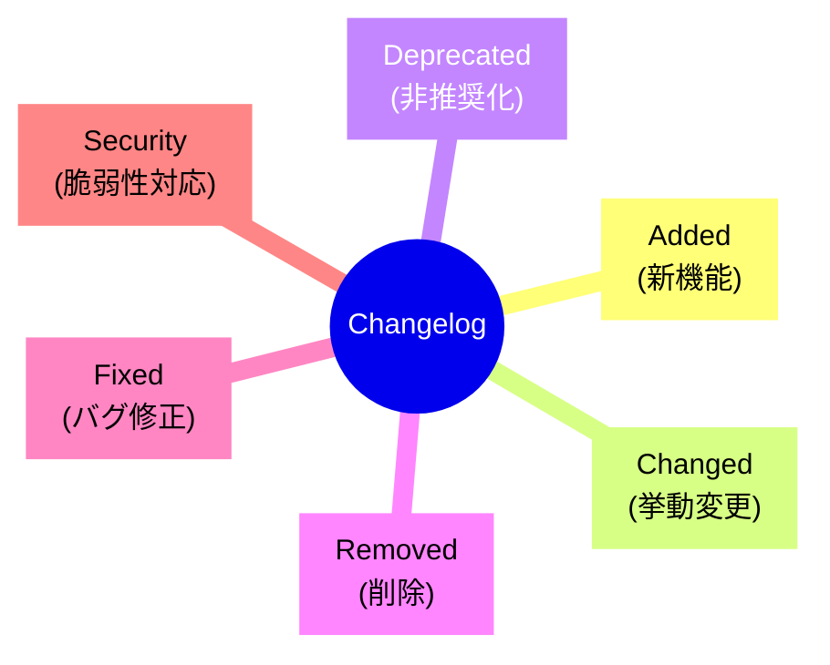

# 第20章：バージョニング実務②（変更ログとリリースノート）📰

## この章でできるようになること ✅🎓

* 「変更ログ（CHANGELOG）」と「リリースノート」を**目的別に書き分け**できるようになる🧠✨
* 利用者が最短で直せるように、**“何が変わった？”→“影響は？”→“何をすればいい？”**をセットで書ける🧭💡
* GitHubの**自動生成リリースノート**を下書きにして、**人間が読む価値のある文章**に仕上げられる🤖📝 ([GitHub Docs][1])
* NuGetパッケージ向けに、**短く効く**リリースノート（PackageReleaseNotes）を書ける📦✍️ ([Microsoft Learn][2])

---

## 1) 変更ログとリリースノートの違い 🗂️✨

### 変更ログ（CHANGELOG）📚

* 「このプロダクトは、**版ごとに何が変わったか**」を**時系列で残す**ファイル
* “後から見返しても迷子にならない”のが正義👑
* 形式は「Keep a Changelog」の型が超使いやすい（人間向け・分類・リンク可能・最新版が上）📌 ([Keep a Changelog][3])

### リリースノート 📰

* 「**今回のリリースで、利用者は何を知ればいい？何をすればいい？**」の1回分
* “読む人が今すぐ動ける”のが正義🏃‍♀️💨
* GitHubのReleaseページ、社内Wiki、配布ページなどに載ることが多いよ📣 ([GitHub Docs][1])

---

## 2) いちばん大事：読む人の気持ちを想像する 🧠💞

リリースノートって、読む人はだいたいこんな状態😇👇

* 「アップデートしていい？怖い？」😱
* 「自分のコード、直す必要ある？どこ？」🔧
* 「破壊的変更ある？あるなら回避策は？」🧯
* 「不具合直った？自分の症状に効く？」💊
* 「セキュリティ修正ある？優先度高い？」🔐

だから、書く順番はこれが最強💪✨

1. **Breaking / 重要注意**（あれば最上段）💥
2. **新機能**（嬉しい話）🆕
3. **修正**（困ってた人を救う）🩹
4. **移行手順**（どう直す？）🧭
5. **既知の問題**（あれば正直に）⚠️

---

## 3) “Keep a Changelog” の型を採用するとラクになる 🧱😊




Keep a Changelog の思想はシンプルだよ👇

* 変更ログは**人間のため**（コミット羅列はノイズになりやすい）🙅‍♀️
* 変更を **Added / Changed / Deprecated / Removed / Fixed / Security** に分けると読みやすい📌 ([Keep a Changelog][4])
* `Unreleased` を上に置くと、日々の追記→リリース時に移動、ができて運用がラク🧺✨ ([Keep a Changelog][4])
* SemVer（バージョン番号の意味付け）と相性がいい🔢 ([Semantic Versioning][5])

---

## 4) 実務で迷わない「書く手順」📝✨

### Step 0：素材を集める 🧺

* 直近のPR/Issue、コミット、差分、利用者からの問い合わせ、障害報告などをざっくり集める📌
* “書く価値があるのは、利用者に影響がある変更”だよ👀✨（内部リファクタだけで挙動が変わらないなら、基本は薄めでOK）

### Step 1：互換性チェック（ざっくりでOK）🔍

* **壊れる**：コンパイル通らない／例外が増えた／意味が変わった 💥
* **たぶん大丈夫**：追加（任意）・バグ修正・性能改善 🆗
* **注意**：既定値変更・挙動の微妙な変更・例外メッセージ変更など 😇

### Step 2：分類（6箱に投げる）📦

Keep a Changelog の箱に仕分けすると速いよ👇

* Added / Changed / Deprecated / Removed / Fixed / Security ([Keep a Changelog][3])

### Step 3：文章化（1行テンプレで量産）✍️

1件の変更は、まずこの1行でOK👇

* **何が**：何が変わった？
* **誰が影響**：誰が困る/嬉しい？
* **どうすれば**：何を直せばいい？（必要なら）

例：

* 「`Foo()` を `FooAsync()` に置き換え推奨（旧APIは非推奨）。利用側は置換してね🧭」

---

## 5) GitHub Release向け：リリースノートの“完成形テンプレ” 📰✨

```md
## vX.Y.Z - YYYY-MM-DD 🎉

## 💥 Breaking Changes（重要）
- （該当があれば）何が壊れる？
  - 影響：どんな利用者が該当？
  - 対応：何をどう変える？
  - 例：コード差分（短く）

## 🧭 Upgrade Guide（移行の最短ルート）
1. まずこれを変更 ✅
2. 次にここを変更 ✅
3. テストでここを見る ✅

## 🆕 Added（新機能）
- 何が増えた？どう嬉しい？✨
- 使い方サンプル（短く）

## 🔄 Changed（挙動変更）
- 変わった理由（1行でOK）
- 注意点（ハマりどころ）

## 🩹 Fixed（バグ修正）
- 直った症状（利用者目線）
- 再現条件（わかる範囲で）

## 🔐 Security（セキュリティ）
- 影響範囲（ざっくり）
- 推奨アクション（アップデートしてね等）

## ⚠️ Known Issues（既知の問題）
- 今回残ってる問題（あれば）
```

ポイントはこれ👇😊

* **Breaking** が無いなら、セクション自体を消しちゃってOK（空欄は読みにくい）🙅‍♀️
* **Upgrade Guide** は短くてもいいから“道”を作ると神扱いされる🧭✨
* 読む人は急いでるので、1項目は**2行以内**を基本にすると優しい💞

---

## 6) CHANGELOG.md：Keep a Changelogのテンプレ 📚✨

```md
## Changelog
All notable changes to this project will be documented in this file.
This project follows Semantic Versioning. 🔢

## [Unreleased]
## Added
- 
## Changed
- 
## Deprecated
- 
## Removed
- 
## Fixed
- 
## Security
- 

## [X.Y.Z] - YYYY-MM-DD
## Added
- 
## Fixed
- 
```

* `Unreleased` を先頭に置くと、日々の追記→リリース時の移動がスムーズ🧺✨ ([Keep a Changelog][4])
* SemVerの「番号に意味を持たせる」前提があると、利用側が判断しやすいよ🔢😊 ([Semantic Versioning][5])

---

## 7) NuGet向け：PackageReleaseNotes は “短文で刺す” 📦💘

NuGetは「リリースノートを毎回入れてね」って公式に推奨してるよ📌（特に Breaking / Features / Fixes） ([Microsoft Learn][2])

さらに、.csprojの `PackageReleaseNotes` は NuGet pack のプロパティとして扱える（`ReleaseNotes` ↔ `PackageReleaseNotes` の対応もあるよ）📦✨ ([Microsoft Learn][6])

### 理想の長さ 📏

* **3〜8行くらい**（長文はCHANGELOGやGitHub Releaseに逃がす）
* 箇条書きで、**利用者が行動できる**情報だけを書く✅

### .csproj 例（短いReleaseNotesを埋める）🛠️

```xml
<PropertyGroup>
  <PackageReleaseNotes>
- Fixed: Null入力時に例外が出る問題を修正
- Added: TryParseFoo(out ...) を追加
- Deprecated: Foo() は次のメジャーで削除予定 → FooAsync() を使用
  </PackageReleaseNotes>
</PropertyGroup>
```

コツ👇😊

* NuGet側は**リッチな表現が得意じゃない**ことがあるので（Markdown前提にしない）、プレーンな箇条書きが安定だよ🧘‍♀️ ([Stack Overflow][7])
* 詳細は GitHub Release / CHANGELOG に誘導（ただしここではURL直書きせず、リポジトリ側に整備するのが◎）

---

## 8) 自動生成を“下書き係”にする 🤖📝

### GitHubの自動生成リリースノート（UI）✨

GitHubは、PR一覧・貢献者・フルCHANGELOGへのリンクを含む「自動生成ノート」を作れるよ🧠 ([GitHub Docs][1])
ただし、そのままだと**利用者目線の“移行”が弱い**ことが多いので、次を足すのがコツ👇

* Breaking の有無
* Upgrade Guide（最短手順）
* 影響範囲（誰が困る？）

### GitHub CLI（コマンド）でも生成できる🧰

`gh release create` に `--generate-notes` を付けると自動生成できるよ✨ ([GitHub CLI][8])

```bash
gh release create v1.2.3 --generate-notes
```

---

## 9) 実習：v1.0.0 → v1.1.0 のリリースノートを書いてみよう 🧪💕

### お題（変更セット）🧩

* ✅ Added：`TryParseFoo(string, out Foo)` を追加
* ✅ Fixed：空文字のときに投げてた例外を修正
* ✅ Deprecated：`Foo.Parse()` を将来削除予定（代替は `TryParseFoo`）

### ① GitHub Release用（完成例）📰

```md
## v1.1.0 - 2026-02-04 🎉

## 🧭 Upgrade Guide
- 例外を避けたい場合は `Foo.Parse()` の代わりに `TryParseFoo(...)` を使ってね✅

## 🆕 Added
- `TryParseFoo(string, out Foo)` を追加✨（失敗を例外ではなく bool で扱えるよ）

## 🩹 Fixed
- 入力が空文字のときに例外が出る問題を修正🩹

## 🧓 Deprecated
- `Foo.Parse()` は将来のメジャーで削除予定📅 → `TryParseFoo(...)` へ移行してね🧭
```

### ② CHANGELOG.md用（完成例）📚

```md
## [1.1.0] - 2026-02-04
## Added
- Added TryParseFoo(string, out Foo) for exception-free parsing.

## Fixed
- Fixed an exception when input is empty string.

## Deprecated
- Deprecated Foo.Parse(); use TryParseFoo instead.
```

### ③ NuGet PackageReleaseNotes用（短縮版）📦

```text
- Added: TryParseFoo(string, out Foo)
- Fixed: empty string throws exception
- Deprecated: Foo.Parse() → use TryParseFoo
```

---

## 10) よくある事故あるある 😇💥（回避ワザつき）

* **事故①：変更の羅列だけで、利用者の行動が書いてない**
  → “対応：何を変える？” を1行でも入れる🧭✨

* **事故②：Breaking が埋もれて、誰かが本番で爆発**
  → Breaking は最上段＆太字相当の扱い（ここは見出しで強調）💥

* **事故③：「変更しました」だけで、何が嬉しいか不明**
  → “症状が直った/何ができるようになった” を利用者目線で🩹✨

* **事故④：Security修正がサラッと流される**
  → “推奨アクション：今すぐ更新” を明記🔐
  ※Visual Studio 2026 では Copilot 連携で依存関係の脆弱性対応支援もあるので、修正内容の把握にも役立つよ🤖🧰 ([Microsoft Learn][9])

---

## 11) AI活用：そのまま使えるプロンプト集 🤖✨

### A) 「PR一覧から、利用者向けリリースノート下書き」📰

```text
以下は vX.Y.Z に含まれるPR一覧です。
Keep a Changelog の分類（Added/Changed/Deprecated/Removed/Fixed/Security）で整理し、
利用者が取るべき行動（Upgrade Guide）を最初に書いたリリースノート案を作ってください。
Breaking changes があれば先頭にまとめ、影響範囲と具体的な移行手順も書いてください。

## PR一覧
- ...
```

### B) 「Breakingかどうか判定＆理由づけ」💥

```text
次の変更点が Breaking change に該当するか判定し、
(1) なぜそう言えるか
(2) 影響を受ける利用者の例
(3) 互換を保つ代替案（段階的廃止の案）
を箇条書きで出してください。

変更点:
- ...
```

### C) 「NuGet向けに3〜8行へ圧縮」📦

```text
次のリリースノートを NuGet の PackageReleaseNotes 向けに
3〜8行のプレーンな箇条書きに圧縮してください。
Breaking/Added/Fixed/Security の順で優先して残してください。

原文:
...
```

---

## この章の成果物（提出物）📦✨

* ✅ GitHub Release用：リリースノート 1つ（Upgrade Guide 付き）📰
* ✅ CHANGELOG.md：`Unreleased` と新バージョン節を更新📚 ([Keep a Changelog][4])
* ✅ NuGet：`PackageReleaseNotes`（短文）📦 ([Microsoft Learn][6])

[1]: https://docs.github.com/en/repositories/releasing-projects-on-github/automatically-generated-release-notes?utm_source=chatgpt.com "Automatically generated release notes"
[2]: https://learn.microsoft.com/en-us/nuget/create-packages/package-authoring-best-practices?utm_source=chatgpt.com "Package authoring best practices - NuGet"
[3]: https://keepachangelog.com/en/1.1.0/?utm_source=chatgpt.com "Keep a Changelog"
[4]: https://keepachangelog.com/ja/1.1.0/?utm_source=chatgpt.com "変更履歴を記録する - Keep a Changelog"
[5]: https://semver.org/?utm_source=chatgpt.com "Semantic Versioning 2.0.0 | Semantic Versioning"
[6]: https://learn.microsoft.com/en-us/nuget/reference/msbuild-targets?utm_source=chatgpt.com "NuGet pack and restore as MSBuild targets"
[7]: https://stackoverflow.com/questions/73095675/nuget-packagereleasenotes-as-link-instead-of-static-text?utm_source=chatgpt.com "Nuget PackageReleaseNotes as link instead of static text"
[8]: https://cli.github.com/manual/gh_release_create?utm_source=chatgpt.com "gh release create command"
[9]: https://learn.microsoft.com/en-us/visualstudio/releases/2026/release-notes?utm_source=chatgpt.com "Visual Studio 2026 Release Notes"
