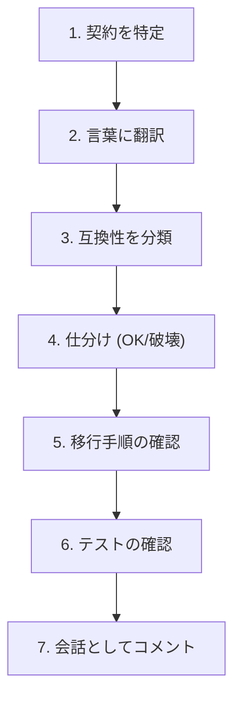
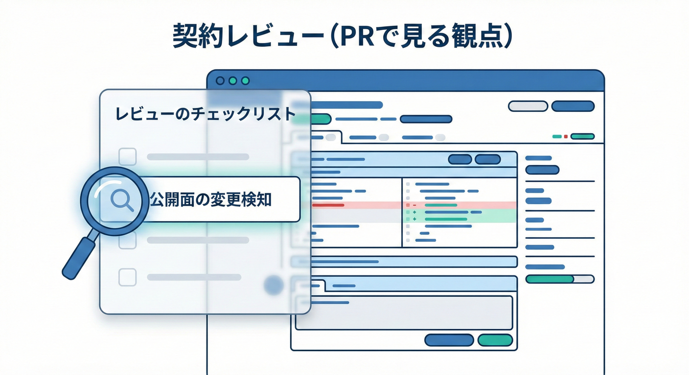
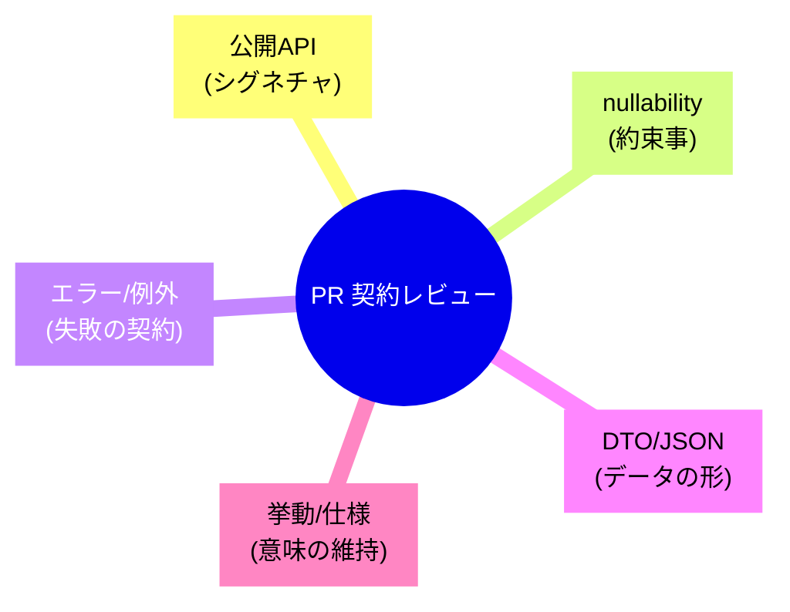

# 第21章：契約レビューの型（PRで見る観点）👀✨

## 21.0 この章のゴール🎯💖

この章を終えると、PR（Pull Request）を見たときに…

* 「これ、契約（外に約束してる形）変わってる？🤔」を即判定できる✅
* 影響範囲（誰が・どこで・どう壊れる？）を言葉にできる🗣️
* 直す/戻す/段階的に廃止する、の判断ができる🧭
* “レビューの型”をチェックリストで運用できる📋✨

---

## 21.1 「契約レビュー」ってなに？🔍🧩

コードレビューって、ついこうなりがち👇

* 命名・書き方・リファクタ・可読性👓
* パフォーマンス・例外処理・テスト🧪

もちろん大事！でも **契約レビュー** は、もっと別の話だよ😊✨

✅ 契約レビュー＝「この変更、利用者のコード/運用/期待を壊さない？」を最優先で見るレビュー👀

* ライブラリ利用者（社内/社外）
* 未来の自分（半年後の自分）
* APIの利用者（別サービス/フロント/バッチ）

**“動く/動かない” だけじゃなくて、意味が変わるのも契約違反**になりやすいよ😇💥
（互換性の考え方は .NET の「breaking change」系ガイドが超参考になるよ）([Microsoft Learn][1])

---

## 21.2 PRを開いた瞬間に見る「3つ」👀⚡

PRを開いたら、まずここだけ見て “方向” を決めるよ🧭✨

1. **公開面（public surface）に触れてる？**

* `public` / `protected` / DTO / 例外の種類 / HTTPレスポンス形式 / イベントスキーマ

2. **互換性が壊れる可能性ある？**

* シグネチャ変更、nullability強化、既定値変更、意味変更…

3. **バージョン/リリース情報が一緒に更新されてる？**

* SemVer（MAJOR/MINOR/PATCH）と整合する？([Semantic Versioning][2])

---

## 21.3 契約レビューの「型」：7ステップ🧠🧁




PRをレビューするとき、毎回この順番でいくとブレないよ✨

### Step 1：このPRの“契約”は何？を宣言する📌

* 変更対象は **ライブラリAPI**？ **DTO(JSON)**？ **エラー仕様**？ **イベント**？
* “内部実装だけ”のつもりに見えて、publicに触れてない？😳

### Step 2：変更点を「契約の言葉」に翻訳する📝✨

コードの差分を、そのまま“約束の変更”に言い換えるよ👇

* 「メソッドを追加した」→「利用者は新しい呼び方ができる」
* 「例外型を変えた」→「利用者のcatchが変わる」
* 「nullを返さなくした」→「利用者のifが不要になる…けど互換は？」

### Step 3：互換性の種類で分類する🧩

* **ソース互換**：利用側が再コンパイルしたら通る？
* **バイナリ互換**：再ビルドなしで動く？（MissingMethodException などが典型）([Microsoft Learn][1])
* **挙動互換**：動くけど意味が変わってない？（一番事故る😇）([Microsoft Learn][3])

### Step 4：変更を「互換OK / グレー / 破壊」に仕分ける✅⚠️💥

* 互換OK：基本 MINOR / PATCH
* 破壊：基本 MAJOR
  （NuGetのバージョニングはSemVerベースで考えると楽だよ）([Microsoft Learn][4])

### Step 5：利用者目線の“移行”が用意されてるか見る🧭💞

* 代替APIある？
* 段階的廃止（Obsoleteなど）できてる？
* 変更ログ/リリースノートに「どう直す？」が書いてある？📰

### Step 6：証拠（テスト/自動チェック）が揃ってるか見る🧪🛡️

* 契約テスト（戻り値形、例外、DTO、互換）
* API互換チェック（自動化できる）

### Step 7：レビューコメントは「指摘」じゃなく「契約の会話」にする💬✨

NG：

* 「この実装ダサい」🙅‍♀️
  OK：
* 「これ、public契約変わるけど、利用者の影響どれくらい？移行手段ある？」😊
* 「これはSemVer的にMAJORじゃない？」🔢

---

## 21.4 コピペで使える：契約レビュー・チェックリスト📋✅✨





PR本文に貼って運用できる形にするね💞

### A. 公開API（ライブラリ）🧱

* [ ] `public/protected` の追加・削除・署名変更はある？
* [ ] 既存メソッドの **引数追加/順序変更/型変更** はある？（破壊になりやすい）([Microsoft Learn][1])
* [ ] オーバーロード追加で、呼び出し解決が変わらない？（地味に事故る😇）
* [ ] `virtual/override` / 抽象化 / interface 変更はある？（影響デカめ）

### B. nullability（超・契約）☂️⚡

* [ ] `string?` → `string` に変えてない？（利用側の想定が変わる）
* [ ] 逆に `string` → `string?` は “許容範囲” が変わる（挙動互換に注意）

### C. 例外/エラー仕様🚧

* [ ] 例外型を変えた？（catchが壊れる）
* [ ] 例外メッセージに依存してる利用者はいない？（本当は依存しないのが理想）
* [ ] エラーの種類が増えた/減った/意味が変わった？

### D. DTO/シリアライズ（JSONなど）🍡

* [ ] フィールド削除/型変更はない？（破壊になりやすい）
* [ ] 追加はOK寄りだけど、既定値・未指定・null の扱いは決めた？
* [ ] enumの値追加/削除は？（利用側switchが死ぬことある）

### E. 挙動（最重要・最事故）🕳️

* [ ] 同じ入力で結果の意味が変わってない？
* [ ] 並び順・丸め・タイムゾーン・小数精度が変わってない？
* [ ] 例外→戻り値、戻り値→例外 に変えてない？

### F. バージョンと公開情報🔢📰

* [ ] SemVer的に MAJOR/MINOR/PATCH の整合はOK？([Semantic Versioning][2])
* [ ] 変更ログ/リリースノートに “利用者がどう直すか” がある？

---

## 21.5 事故りがちな変更 Top10💥😇

「やりがち」なのに、壊れやすいやつまとめ🥺

1. メソッド削除 / 名前変更（即死）💀
2. 引数を追加（既存呼び出しがバイナリで死ぬことも）([Microsoft Learn][1])
3. 既定値を変える（動くけど意味が変わる）🕳️
4. 例外型を変える（catchが壊れる）🚧
5. nullabilityを厳しくする（利用側がコンパイルで悲鳴）☂️
6. DTOの型変更（デシリアライズで爆発）🍡💥
7. enumの値追加（switch漏れ）🧨
8. 戻り値の並び順変更（テストが落ちないのにバグる）😇
9. ログ/メトリクスの名前変更（運用が困る）📉
10. “互換のつもり”でオーバーロード追加（解決が変わる）🫠

---

## 21.6 AI支援でレビューを速くする🤖✨（でも最後は人間が決める🧠）

### ① エディタ内のセルフレビュー（Copilot Code Review）🧑‍💻👀

Visual Studio 2026 では、Gitの画面から **Copilot Code Review** を動かして差分を見てもらう流れが紹介されてるよ✨([Microsoft for Developers][5])

* まず自分で直せるミスを先に潰す
* “契約っぽい変更”を拾ってもらう（見落とし防止）

### ② PRの要約を作って「見るべき点」を絞る🧾✨

GitHub Copilot には **Pull Request summary** があって、変更点や見るべき場所をまとめてくれるよ📌([GitHub Docs][6])
ただしAI要約は便利だけど、責任ある使い方（要約の限界や注意点）も書かれてるので、「鵜呑み禁止」でね🙅‍♀️([GitHub Docs][6])

### ③ AIに投げると強い“質問テンプレ”💬🤖

PR差分を貼って、こう聞くと契約レビューが速いよ✨

* 「この差分で public契約が変わる点を列挙して。互換/破壊も分類して」
* 「SemVer的に上げるべき番号は？根拠も」
* 「利用者の移行手段（Deprecated/代替API/ドキュメント）案を3つ」
* 「挙動互換が壊れそうな観点（既定値・例外・null・順序・精度）をチェックして」

---

## 21.7 “自動化”で契約を守る🛡️⚙️（PRの門番）

レビューは人間がやるけど、**破壊の検知**は機械が得意だよ✨

### A) .NETの「Package validation」📦✅

`.NET` の package validation は、パッケージの整合や **破壊的変更がないか** を検証できるよ🧪([Microsoft Learn][7])
`EnablePackageValidation` を `true` にして、pack後にチェックを走らせるのが基本イメージ✨([Microsoft Learn][8])

### B) API互換性ツール（ApiCompat）🧰🔍

API互換性チェックの仕組みとして、`Microsoft.DotNet.ApiCompat.Tool`（グローバルツール）も案内されてるよ🧰([Microsoft Learn][9])
「前の版と比べて壊してない？」を機械で見つけられるのが強い💪✨

### C) “public APIの差分”を見える化（Public API analyzers）📜👀

`Microsoft.CodeAnalysis.PublicApiAnalyzers` みたいに、public APIをテキスト化して差分で追う流れもあるよ📌([NuGet Gallery][10])
レビュー時に「何が契約として追加/変更されたか」が見やすくなるのが嬉しいポイント💖

### D) 依存パッケージの更新・脆弱性もレビュー対象にする🔐📦

Visual Studio 2026 のリリースノートでは、Copilotが NuGet 依存関係や脆弱性対応を助ける話（NuGet MCP server）も出てるよ🧯([Microsoft Learn][11])
契約レビューって「自分のAPI」だけじゃなく、**依存更新で挙動が変わる**のも地味に怖いから、PRで一緒に見る癖がつくと強い✨

---

## 21.8 実習：擬似PRレビューごっこ🎭📝✨

あなたはレビュア！次のPRを見て、契約レビューしてみよう😊💞
（ライブラリ `MiniCalc` の v1 を v1.1 にするつもり、という設定）

### PR差分（抜粋）

```csharp
// v1
public class MiniCalc
{
    public int Add(int a, int b) => a + b;

    // 0除算のときは DivideByZeroException を投げる
    public int Divide(int a, int b) => a / b;

    // 入力が空なら null を返す（利用側で判定している前提）
    public string? NormalizeName(string? name)
        => string.IsNullOrWhiteSpace(name) ? null : name.Trim();
}
```

```csharp
// PR（v1.1にしたい…という主張）
public class MiniCalc
{
    // 引数名変更（契約？）
    public int Add(int left, int right) => left + right;

    // 0除算のとき、例外ではなく 0 を返すよう変更
    public int Divide(int a, int b)
        => b == 0 ? 0 : a / b;

    // nullを返さない方が便利なので空なら空文字を返す
    public string NormalizeName(string? name)
        => string.IsNullOrWhiteSpace(name) ? "" : name.Trim();
}
```

### 課題①：契約変更を列挙しよう🧩

* どれが **互換OK / グレー / 破壊**？
* “挙動互換”が壊れてるところはどれ？😇

### 課題②：バージョンはどうする？🔢

* v1.1（MINOR）でいい？それとも v2（MAJOR）？

### 課題③：レビュコメントを3つ書こう💬

* 「何が問題で」「どう直せばよいか」を書くよ😊✨

---

## 21.9 模範回答（レビューの例）🧑‍🏫💖

### A) 契約変更の指摘🧩

1. `Add(int a, int b)` → `Add(int left, int right)`

* **引数名だけ**なら多くのケースで互換は保たれるけど、ドキュメント/生成コード/名前付き引数を使う利用者がいると影響が出る可能性あり⚠️

2. `Divide` が **例外 → 0返却** に変わった

* **挙動互換の破壊**（利用者が例外で分岐してたらロジックが変わる）💥
* .NETの互換性観点でも「動くけど意味が変わる」が一番危ないタイプ😇([Microsoft Learn][3])

3. `NormalizeName` が **null返却 → 空文字返却** へ

* これも **挙動互換の破壊**（利用者の `if (x is null)` が成立しなくなる）💥

### B) バージョン判断🔢

このPR内容なら、**v1.1（MINOR）は危険**で、基本は **v2（MAJOR）** を検討するのが自然。
SemVerは「公開API（契約）を宣言して、それを守る」前提があるよ📌([Semantic Versioning][2])

### C) “直し方”の提案（移行しやすくする）🧭

* `Divide` は挙動変更じゃなくて、**新メソッド追加**にする案：

  * `TryDivide` / `DivideOrDefault` を追加（MINORでOK寄り）
  * 旧 `Divide` はそのまま（互換維持）
* `NormalizeName` も同じ：

  * `NormalizeNameOrEmpty` を追加
  * 旧仕様は維持
* どうしても挙動を変えるなら：

  * MAJORにする
  * 変更ログに移行手順を書く
  * テストを追加して “意図した変更” を証明する🧪

### D) レビューコメント例💬

* 「`Divide` の0除算時の挙動が例外→0返却に変わっていて、利用側の分岐が壊れそうです。互換を守るなら新API追加（例：`TryDivide`）にしませんか？」
* 「`NormalizeName` の null→空文字も利用側のnull判定が変わるので破壊的です。`NormalizeNameOrEmpty` 追加＋既存維持の方が安全です」
* 「この変更が仕様として必要なら、SemVer的にMAJOR（v2）相当だと思います。リリースノートに移行例も入れたいです」([Semantic Versioning][2])

---

## 21.10 まとめ🍰✨

* 契約レビューは「利用者が壊れない？」を最優先で見るレビュー👀
* 迷ったら **7ステップ**で機械的に確認📋
* **挙動互換**の破壊が一番こわい😇
* AIは「差分の要約」「観点の洗い出し」に強いけど、判断は人間が責任を持つ🧠💞
* 自動化（Package validation / ApiCompat / Public API差分）をPRの門番にすると事故が減るよ🛡️([Microsoft Learn][7])

[1]: https://learn.microsoft.com/en-us/dotnet/standard/library-guidance/breaking-changes?utm_source=chatgpt.com "Breaking changes and .NET libraries"
[2]: https://semver.org/?utm_source=chatgpt.com "Semantic Versioning 2.0.0 | Semantic Versioning"
[3]: https://learn.microsoft.com/en-us/dotnet/core/compatibility/library-change-rules?utm_source=chatgpt.com "NET API changes that affect compatibility"
[4]: https://learn.microsoft.com/en-us/nuget/concepts/package-versioning?utm_source=chatgpt.com "NuGet Package Version Reference"
[5]: https://devblogs.microsoft.com/visualstudio/streamlining-your-git-workflow-with-visual-studio-2026/?utm_source=chatgpt.com "Streamlining your Git workflow with Visual Studio 2026"
[6]: https://docs.github.com/en/copilot/responsible-use/pull-request-summaries?utm_source=chatgpt.com "Responsible use of GitHub Copilot pull request summaries"
[7]: https://learn.microsoft.com/en-us/dotnet/fundamentals/apicompat/package-validation/overview?utm_source=chatgpt.com "NET Package Validation"
[8]: https://learn.microsoft.com/ja-jp/dotnet/fundamentals/apicompat/package-validation/overview?utm_source=chatgpt.com "NET パッケージの検証"
[9]: https://learn.microsoft.com/ja-jp/dotnet/fundamentals/apicompat/overview?utm_source=chatgpt.com "API 互換性ツール - .NET"
[10]: https://www.nuget.org/packages/Microsoft.CodeAnalysis.PublicApiAnalyzers/?utm_source=chatgpt.com "Microsoft.CodeAnalysis.PublicApiAnalyzers 3.3.4"
[11]: https://learn.microsoft.com/en-us/visualstudio/releases/2026/release-notes?utm_source=chatgpt.com "Visual Studio 2026 Release Notes"
