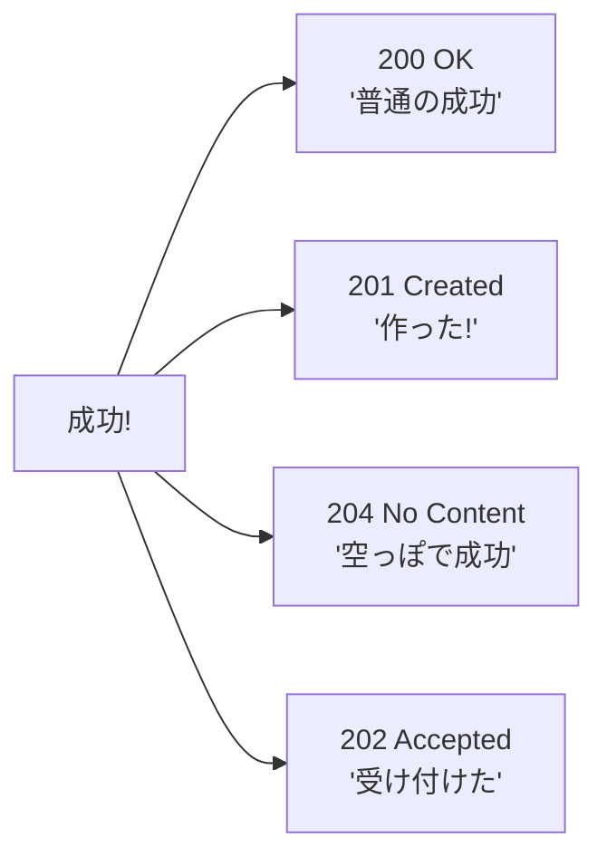

# 第22章：Web API契約①（成功レスポンスの約束）🍀

## 22.1 この章でできるようになること🎯✨

* 「成功したときの返し方（レスポンス）」を **チームのルールとして固定**できる😊📌
* 200 / 201 / 204 などの **成功ステータスを迷わず選べる**✨
* JSON の **形（フィールド名・型・意味）をブレさせない**ように設計できる🍡
* C#（Minimal API）で **“契約が伝わる”実装**（TypedResults / OpenAPIメタデータ）にできる🧰✨ ([Microsoft Learn][1])

---

## 22.2 まず結論：成功レスポンスで「絶対に決める5点」🧩✅

成功レスポンスの契約は、最低これだけ決めると事故が激減するよ😊✨

1. **ステータスコード**（200/201/204…）🔢
2. **Content-Type**（基本 `application/json`）🧾
3. **レスポンスボディの形**（JSONの構造）🍱
4. **各フィールドの意味**（省略OK？null OK？単位は？）📚
5. **ヘッダー**（Location / Cache / Pagination系…必要なら）🏷️

> “実装が正しい”だけじゃなくて、**利用者が安心して使える**のがゴールだよ〜😊💕

---

## 22.3 成功ステータスの基本（ここは暗記でOK）🔖😺




### 200 OK：いちばん普通の成功🎉

* **GET** の取得成功はだいたいこれ
* **PUT/PATCH** で「更新後の内容も返す」なら 200 もよく使う😊

### 201 Created：新しいリソースを作った🎂

* **POST で作成**したときの王道
* 重要ポイント：**Location ヘッダーで “作ったリソースのURI” を返す**のが推奨✨

  * 仕様として、作成された主要リソースは **Location** か（無ければ）ターゲットURIで識別される、って書かれてるよ📘 ([RFCエディタ][2])
  * POSTで作成したら **201 + Location** を返すのが推奨、って流れも明記されてるよ🧭 ([RFCエディタ][2])

### 204 No Content：成功したけど本文はいらない🧼

* **DELETE** 成功、**PUT** 成功（本文返さない方針）でよく使う✨
* PUT は成功時に **200 か 204** を返すべき、って仕様にも書いてあるよ📘 ([RFCエディタ][2])

### 202 Accepted：受け付けた（処理はこれから）⏳

* 重い処理を非同期でやるとき
* “作業中” を表すリソース（ジョブ）を返す設計と相性がいい😊

---

## 22.4 ルート + メソッドの約束（成功レスポンスとセット）🛣️🧠

成功レスポンスは、**どのURLで、何をした結果なのか**とセットで契約になるよ✨

* コレクション：`/api/todos`（複数形にしがち）📚
* 単体：`/api/todos/{id}`（識別子）🏷️
* 動詞をURLに入れすぎない（`/createTodo` とかは避けがち）🙅‍♀️

  * 理由：**HTTPメソッドが動詞の役目**をしてくれるからだよ😊

---

## 22.5 JSONの「形」を固定する🍱✨（成功レスポンス最大のキモ）

成功レスポンスで一番トラブルになるのは、だいたいココ😇⚡
**フィールド名が変わる／型が変わる／意味が変わる** が地雷！

### ① 返す形は2パターンに絞る🍡

**A. そのまま返す（シンプル）**

* 単体：`TodoDto`
* 一覧：`TodoDto[]`
* メリット：軽い・分かりやすい✨
* デメリット：ページング情報などを載せにくい😵

**B. 包む（Envelope）**

* 一覧：`{ items: [...], nextCursor: "...", total: 123 }`
* メリット：拡張しやすい、メタ情報を足せる✨
* デメリット：ちょい冗長🙃

👉 公開APIや一覧が多いなら **B** が安定しやすいよ😊🍀

### ② フィールド名の大文字小文字（camelCase）を揃える🐫

Web API では **camelCase** が一般的。
ASP.NET Core の JSON でも、既定が camelCase で、設定で PascalCase に変えられる（＝逆に言うと、ここは契約として固定しようね！）って公式にも書かれてるよ📘 ([Microsoft Learn][3])

### ③ “省略” と “null” を混ぜない☂️🧼

たとえば `nickname` が無いとき…

* **省略**（フィールド自体が無い）
* **null**（`nickname: null`）

どっちにするかを決めないと、利用側が混乱するよ🥲
（この深掘りは DTO 章でガッツリやるけど、成功レスポンスの時点でルール化が大事！）🍡✨

---

## 22.6 成功レスポンスの「代表レシピ」🍳✨（迷ったらコレ）

### GET（一覧）✅

* **200 + JSON（配列 or Envelope）**
* フィルタ・ソート・ページングをやるなら、成功時にメタ情報を返すのが親切😊

例（Envelope）：
`{ items: [...], nextCursor: "abc", hasMore: true }`

### GET（単体）✅

* **200 + JSON（単体）**
* （存在しない場合の話は次章で🚧）

### POST（作成）✅

* **201 + Location + JSON（作成したもの）** が超定番🎂

  * “作ったリソースのURIは Location で返す” が仕様の流れに合うよ📘 ([RFCエディタ][2])

### PUT（置き換え）✅

* **200（更新後を返す）** or **204（本文なし）**

  * 仕様でも成功時は 200 or 204 が述べられてるよ📘 ([RFCエディタ][2])

### DELETE（削除）✅

* **204** が多い（消えたものを返さない）🧼✨

---

## 22.7 実装で“契約が伝わる”書き方（Minimal API）🧰✨

Minimal API は「返り値の型」を工夫すると、**人にもツールにも契約が伝わる**よ😊
公式でも、Minimal API の返り値として `IResult` や `Results<T...>`、そして TypedResults が紹介されてるよ📘 ([Microsoft Learn][1])

### ここが嬉しいポイント💡

* TypedResults を返すと、成功コードが読みやすい（`Ok(...)` / `Created(...)`）🍀
* OpenAPI（次の章でやる仕様書）にも **メタデータが載りやすい**✨

  * 最小APIでメタデータを集めてOpenAPI生成する話も公式にあるよ📘 ([Microsoft Learn][4])

---

## 22.8 ハンズオン：成功レスポンス契約つき “Todo API” を作る🛠️💕

ここでは **成功パターン（200/201/204）** をきれいに固定するよ😊✨
（失敗レスポンスの統一は次章で🚧）

## ステップ1：DTO（返す形）を決める🍱

* `TodoDto`：クライアントに返す形
* `CreateTodoRequest`：作成の入力（今回は超シンプル）

```csharp
public sealed record TodoDto(
    int Id,
    string Title,
    bool Done
);

public sealed record CreateTodoRequest(
    string Title
);
```

## ステップ2：インメモリで保存（学習用）📦

```csharp
var todos = new List<TodoDto>();
var nextId = 1;
```

## ステップ3：GET（一覧）…200 OK✅

```csharp
app.MapGet("/api/todos", () =>
{
    // 成功契約：200 + JSON（配列）
    return TypedResults.Ok(todos);
});
```

## ステップ4：POST（作成）…201 Created + Location🎂

```csharp
app.MapPost("/api/todos", (CreateTodoRequest req) =>
{
    var todo = new TodoDto(
        Id: nextId++,
        Title: req.Title,
        Done: false
    );

    todos.Add(todo);

    // 成功契約：201 + Location + JSON（作成物）
    return TypedResults.Created($"/api/todos/{todo.Id}", todo);
});
```

* `201 Created` は「新しいリソースが作られた」を表すステータスだよ🎂
* Location で “作ったURI” を返すのが推奨されてるよ📘 ([RFCエディタ][2])

## ステップ5：PUT（更新）…204 No Content🧼

今回は「更新後の本文は返さない」方針にするよ😊

```csharp
public sealed record UpdateTodoRequest(string Title, bool Done);

app.MapPut("/api/todos/{id:int}", (int id, UpdateTodoRequest req) =>
{
    var index = todos.FindIndex(t => t.Id == id);
    if (index < 0)
    {
        // 失敗の統一は次章で扱うよ🚧
        return TypedResults.NotFound();
    }

    todos[index] = new TodoDto(id, req.Title, req.Done);

    // 成功契約：204（本文なし）
    return TypedResults.NoContent();
});
```

PUT の成功時に 200 か 204 を返す、という流れは HTTP 仕様にも沿ってるよ📘 ([RFCエディタ][2])

---

## 22.9 “契約”として文章に落とすテンプレ（そのまま使える）📝✨

APIの成功レスポンス契約は、こう書くとブレないよ😊

* `GET /api/todos`

  * **200 OK**
  * `application/json`
  * Body: `TodoDto[]`

* `POST /api/todos`

  * **201 Created**
  * Header: `Location: /api/todos/{id}`
  * `application/json`
  * Body: `TodoDto`

* `PUT /api/todos/{id}`

  * **204 No Content**
  * Body: なし

（この“文章の契約”があるだけで、将来の破壊変更をかなり防げるよ😊💪）

---

## 22.10 Copilot / AIでやると速いところ🤖✨（でも必ず人間が最終判断）

AIは「下書き係」にすると強いよ〜😊💕

### 使える指示例✍️

* 「`POST /api/todos` を 201 + Location で返す Minimal API を書いて。DTOは `TodoDto(Id, Title, Done)`」
* 「PUT は 204 方針。更新後の本文は返さない形で」
* 「成功レスポンス契約を箇条書きでまとめて」

でも、**ステータスコードとJSON形は契約そのもの**だから、最後は必ず目で見て決めようね👀✨

---

## 22.11 ミニクイズ（成功レスポンス）🎓🍀

1. 作成成功で「作ったリソースのURI」も伝えたい。ステータスは？🎂
2. PUT 更新は成功したけど、本文を返したくない。ステータスは？🧼
3. GET 一覧で、配列を返す。ステータスは？✅

---

## 22.12 まとめ📌💕

* 成功レスポンスは「動けばOK」じゃなくて、**利用者が安心できる約束**だよ😊
* 迷ったら

  * GET：200
  * POST：201 + Location
  * PUT/DELETE：204（本文なし方針なら）
* Minimal API は TypedResults を使うと **契約がコードに埋め込める**✨ ([Microsoft Learn][1])
* そして次章で、失敗レスポンス（エラー形式）も統一して “完成形” にするよ🚧✨

[1]: https://learn.microsoft.com/en-us/aspnet/core/fundamentals/minimal-apis/responses?preserve-view=true&view=aspnetcore-10.0 "Create responses in Minimal API applications | Microsoft Learn"
[2]: https://www.rfc-editor.org/rfc/rfc9110.html "RFC 9110: HTTP Semantics"
[3]: https://learn.microsoft.com/ja-jp/aspnet/core/web-api/advanced/formatting?view=aspnetcore-10.0&utm_source=chatgpt.com "ASP.NET Core Web API の応答データの書式設定"
[4]: https://learn.microsoft.com/en-us/aspnet/core/fundamentals/openapi/include-metadata?view=aspnetcore-10.0 "Include OpenAPI metadata in an ASP.NET Core app | Microsoft Learn"
