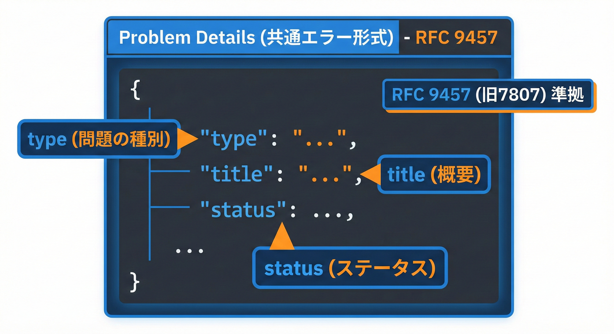
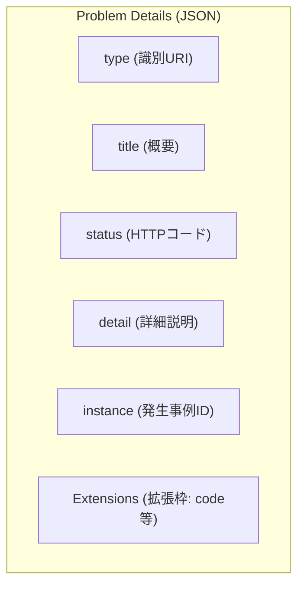

# 23章：Web API契約②（失敗レスポンスの約束）🚧

## この章でできるようになること🎯✨

* 失敗レスポンスを「APIの契約」として、**ブレないルール**で設計できるようになる😊
* **ステータスコード**を“なんとなく”じゃなく、意味で選べるようになる📮
* エラー形式を **Problem Details（application/problem+json）** に統一して、クライアントが楽になる💡 ([RFCエディタ][1])
* .NET 10 の Minimal API で、**例外・バリデーション・404** などをまとめて整える実装ができる🧰 ([Microsoft Learn][2])

---

## 1) 失敗レスポンスは「仕様書そのもの」📘⚡

成功レスポンスはみんな丁寧に作るのに、失敗側は「とりあえず 400」になりがち😵
でも実務だと、困るのはだいたい失敗側…！

* フロント（利用者）：「どこが悪いの？どう直すの？」😢
* サーバー（提供者）：「問い合わせに答えたい」「原因を追いたい」🔍
* 監視（運用）：「同じ事故をまとめたい」📈

だから失敗レスポンスは、**人間にも機械にも優しい**のが正義だよ😊✨

---

## 2) まず“器”を統一：Problem Details 🍱📌





エラーの共通フォーマットとして、IETFの標準「Problem Details」があります。古い RFC 7807 を置き換える形で RFC 9457 が現行です。([RFCエディタ][1])
JSONで返すときのメディアタイプは **"application/problem+json"**。([RFCエディタ][1])

## Problem Details の基本フィールド🧩

* **type**：問題タイプを識別するURI（これが“機械向けの主キー”）([RFCエディタ][1])
* **title**：人向けの短い説明（画面に出してもOK）
* **status**：HTTPステータスコード（省略もあるけど入れると親切）
* **detail**：人向けの詳しい説明（※内部情報は入れすぎ注意）
* **instance**：この発生事例の識別子（問い合わせ・追跡に便利）

## “title/detail”は多言語にもできる🌍

Problem Details は、タイトルなどの言語を **Accept-Language** でネゴシエーションできる考え方が書かれています。([RFCエディタ][1])
（ただし実務では「基本は日本語固定＋必要なら英語」みたいに、運用ルールで決めることが多いよ😊）

---

## 3) ステータスコードの選び方🍀（迷子にならない早見）

「どれを返すの？」は、**意味**で決めるのが大事✨
（一覧の根拠は HTTP の標準と IANA レジストリだよ）([iana.org][3])

| 状況              | よく使うコード | ざっくり意味       | “ありがちな事故”                             |
| --------------- | ------: | ------------ | ------------------------------------- |
| 入力が変（形式・型・必須不足） |     400 | リクエストが不正     | detailが曖昧で直せない😵                      |
| 認証が必要/失敗        |     401 | 認証が必要        | 401なのにWWW-Authenticateが無い等（認証方式の設計ミス） |
| 権限がない           |     403 | 許可されない       | 404に偽装する方針と混ざる😇                      |
| そのリソースがない       |     404 | 見つからない       | “検索条件が悪い”のに404にしてしまう                  |
| 重複・状態競合         |     409 | 競合してできない     | “すでに存在”を400にしてしまう                     |
| 仕様上はOKだが内容が不正   |     422 | 解釈できるが処理できない | 400と422の使い分けが曖昧になる                    |
| レート制限           |     429 | リクエスト多すぎ     | リトライ方法が分からない😵                        |
| サーバー側の想定外       |     500 | 内部エラー        | stack trace を返して情報漏えい😱               |
| 一時的に無理          |     503 | 一時的に利用不可     | 復旧目安が分からない                            |

※ 422/429 は IANA レジストリ上も参照RFC付きで整理されています（422はRFC 9110、429はRFC 6585参照）。([iana.org][3])

---

## 4) “エラーコード（code）”を作ると運用が激ラク🏷️✨

HTTPステータスだけだと、粒度が粗いよね。

例：同じ 409 でも

* 「メールアドレスが重複」
* 「すでに退会済み」
* 「ロック中」
  …全部 409 になりがち😵

だから、Problem Details の拡張フィールドとして **"code"** を入れるのがおすすめ💡
Problem Details は拡張フィールドを載せていい前提の仕様だよ。([RFCエディタ][1])

## “code”のルール（おすすめ）✅

* **英小文字スネーク**で固定（例：`validation_failed` / `email_already_exists`）
* **破壊的変更しない**（後から名前を変えるとクライアントが死ぬ💥）
* 表示用の文章は **title/detail** に寄せる（codeは機械用）

---

## 5) バリデーション失敗の設計🍡（この章のメイン実習！）

## どんな形にする？（理想）✨

* 「どの項目が」「どうダメか」が分かる
* 複数エラーをまとめて返せる
* クライアントが画面に出しやすい

RFC 9457 の例でも、422 と "errors" 拡張で複数の入力エラーを表すパターンが出ています。([RFCエディタ][1])

---

## 6) 実装：.NET 10 Minimal API で “失敗レスポンス統一”🧰⚙️

ここからは、**全部の失敗を同じ型（Problem Details）** で返す構成にするよ😊

ポイントは3つ👇

1. **AddProblemDetails** で Problem Details を有効化
2. **UseExceptionHandler** で未処理例外→Problem Details に変換
3. **AddValidation** で DataAnnotations バリデーションを自動化（失敗時 400 を返す）([Microsoft Learn][2])

Microsoft公式ドキュメントでも、AddProblemDetails を呼ぶと例外・ステータスコードページ等が Problem Details を生成する流れが説明されています。([Microsoft Learn][2])

---

## 実習：ユーザー登録APIで失敗レスポンスを揃える🧪✨

## 仕様（この章のミニ契約）📌

* POST /users
* 成功：201 + JSON
* 失敗：

  * 400：入力エラー（バリデーション）
  * 409：メール重複
  * 500：想定外（詳細は漏らさない）

---

## ① Program.cs（最小構成サンプル）🧱

```csharp
using System.ComponentModel.DataAnnotations;
using Microsoft.AspNetCore.Diagnostics;
using Microsoft.AspNetCore.Mvc;

var builder = WebApplication.CreateBuilder(args);

// ✅ 失敗レスポンスの器を Problem Details に統一
builder.Services.AddProblemDetails(options =>
{
    options.CustomizeProblemDetails = context =>
    {
        // traceId を載せて、問い合わせ→ログ追跡を一発にする✨
        // （ProblemDetails.Extensions は拡張フィールド置き場）
        var traceId = context.HttpContext.TraceIdentifier;
        context.ProblemDetails.Extensions["traceId"] = traceId;

        // “code” を入れたい場合：ExceptionHandler側で入れるのが分かりやすいよ😊
    };
});

// ✅ 例外→ProblemDetails
builder.Services.AddExceptionHandler<ApiExceptionHandler>();

// ✅ .NET 10: Minimal API の組み込みバリデーション（DataAnnotations）
builder.Services.AddValidation();

builder.Services.AddSingleton<UserStore>();

var app = builder.Build();

app.UseExceptionHandler();     // 例外をここで捕まえる
app.UseStatusCodePages();      // 404 など body が無いエラーに Problem Details を付けやすい

// -------------------- endpoints --------------------

app.MapPost("/users", (CreateUserRequest req, UserStore store) =>
{
    // ここに来た時点で req の DataAnnotations は検証済み（AddValidationのおかげ）✨

    if (store.ExistsByEmail(req.Email))
    {
        throw new DomainException(
            code: "email_already_exists",
            title: "そのメールアドレスは既に使われています",
            status: StatusCodes.Status409Conflict,
            detail: "別のメールアドレスで登録してください。");
    }

    var user = store.Create(req.Name, req.Email);
    return Results.Created($"/users/{user.Id}", user);
});

app.MapGet("/users/{id:int}", (int id, UserStore store) =>
{
    var user = store.Find(id);
    return user is null
        ? Results.NotFound()
        : Results.Ok(user);
});

app.Run();

// -------------------- models --------------------

public sealed record CreateUserRequest(
    [Required(ErrorMessage = "名前は必須です")] string Name,
    [Required(ErrorMessage = "メールは必須です")]
    [EmailAddress(ErrorMessage = "メール形式が正しくありません")] string Email);

// -------------------- store (仮) --------------------

public sealed class UserStore
{
    private int _id = 0;
    private readonly Dictionary<int, UserDto> _users = new();
    private readonly HashSet<string> _emails = new(StringComparer.OrdinalIgnoreCase);

    public bool ExistsByEmail(string email) => _emails.Contains(email);

    public UserDto Create(string name, string email)
    {
        var id = ++_id;
        var user = new UserDto(id, name, email);
        _users[id] = user;
        _emails.Add(email);
        return user;
    }

    public UserDto? Find(int id) => _users.TryGetValue(id, out var u) ? u : null;
}

public sealed record UserDto(int Id, string Name, string Email);

// -------------------- domain exception --------------------

public sealed class DomainException : Exception
{
    public string Code { get; }
    public string Title { get; }
    public int Status { get; }
    public string? Detail { get; }

    public DomainException(string code, string title, int status, string? detail = null)
        : base(title)
    {
        Code = code;
        Title = title;
        Status = status;
        Detail = detail;
    }
}

// -------------------- exception handler --------------------

public sealed class ApiExceptionHandler : IExceptionHandler
{
    private readonly IProblemDetailsService _problemDetails;

    public ApiExceptionHandler(IProblemDetailsService problemDetails)
        => _problemDetails = problemDetails;

    public async ValueTask<bool> TryHandleAsync(
        HttpContext httpContext,
        Exception exception,
        CancellationToken cancellationToken)
    {
        // ① ドメイン例外（想定内）
        if (exception is DomainException de)
        {
            httpContext.Response.StatusCode = de.Status;

            var pd = new ProblemDetails
            {
                Status = de.Status,
                Title = de.Title,
                Detail = de.Detail,
                Type = $"https://example.com/problems/{de.Code}" // ←本番は自分のドメインで管理すると最高✨
            };
            pd.Extensions["code"] = de.Code;

            await _problemDetails.WriteAsync(new ProblemDetailsContext
            {
                HttpContext = httpContext,
                ProblemDetails = pd
            });

            return true;
        }

        // ② 想定外（500）※詳細を漏らさない！
        httpContext.Response.StatusCode = StatusCodes.Status500InternalServerError;

        var unknown = new ProblemDetails
        {
            Status = StatusCodes.Status500InternalServerError,
            Title = "サーバー内部でエラーが発生しました",
            Type = "about:blank"
        };
        unknown.Extensions["code"] = "unexpected_error";

        await _problemDetails.WriteAsync(new ProblemDetailsContext
        {
            HttpContext = httpContext,
            ProblemDetails = unknown
        });

        return true;
    }
}
```

* **AddProblemDetails + UseExceptionHandler** の組み合わせは、ASP.NET Core の推奨構成として紹介されています。([Microsoft Learn][2])
* **AddValidation** による Minimal API の組み込み検証は .NET 10 で追加され、失敗時は 400 を返す動きが明記されています。([Microsoft Learn][4])

---

## 7) 返ってくる失敗レスポンス例（これが“契約”）📨✨

## ① 400：入力エラー（バリデーション）🧾

（AddValidation が 400 を返す）([Microsoft Learn][4])

```json
{
  "type": "https://example.com/problems/validation_failed",
  "title": "入力に誤りがあります",
  "status": 400,
  "errors": {
    "Email": [
      "メール形式が正しくありません"
    ]
  },
  "traceId": "00-...."
}
```

## ② 409：メール重複💥

（409 は IANA のレジストリでも RFC 9110 参照として整理）([iana.org][3])

```json
{
  "type": "https://example.com/problems/email_already_exists",
  "title": "そのメールアドレスは既に使われています",
  "status": 409,
  "detail": "別のメールアドレスで登録してください。",
  "code": "email_already_exists",
  "traceId": "00-...."
}
```

## ③ 500：想定外😱（でも漏らさない）

```json
{
  "type": "about:blank",
  "title": "サーバー内部でエラーが発生しました",
  "status": 500,
  "code": "unexpected_error",
  "traceId": "00-...."
}
```

---

## 8) 失敗レスポンス設計のチェックリスト✅💕

* [ ] 失敗時の Content-Type が統一されてる？（"application/problem+json"）([RFCエディタ][1])
* [ ] status と HTTP ステータスコードが一致してる？
* [ ] code は **機械用**で安定してる？（後から変えない）
* [ ] traceId でログ追跡できる？🔍
* [ ] 500 に内部情報（例外メッセージ・スタックトレース）を入れてない？😱
* [ ] 400/409/404/429 などが“意味”で選ばれてる？（IANA 参照）([iana.org][3])

---

## 9) AI活用（下書き係として使う）🤖📝

GitHub Copilot や OpenAI 系ツールに投げるときは、**“契約（エラー形式）を固定してから”** がコツだよ😊✨

## 使えるプロンプト例🎀

```text
あなたはC#/.NET 10のAPI設計者です。
Problem Details(application/problem+json)で失敗レスポンスを統一したいです。
- code を必ず入れる
- traceId を Extensions に入れる
- バリデーションは 400 + errors を返す
- ドメインエラーは 409/404/403 など意味で使い分ける

この方針で、Minimal API の例外ハンドラ(IExceptionHandler)の実装例を作ってください。
```

---

## この章の“ゴール成果物”📦✨

* APIの失敗レスポンスが **Problem Details で統一**されている
* バリデーション失敗が **400 で機械可読**に返せる
* ドメインエラーが **409 + code** で判定できる
* 想定外が **500 + traceId** で追える

（Problem Details は IETF の標準で、HTTPの4xx/5xxに自然にフィットする、と説明されています。）([RFCエディタ][1])

[1]: https://www.rfc-editor.org/rfc/rfc9457.html "RFC 9457: Problem Details for HTTP APIs"
[2]: https://learn.microsoft.com/en-us/aspnet/core/fundamentals/error-handling-api?view=aspnetcore-10.0 "Handle errors in ASP.NET Core APIs | Microsoft Learn"
[3]: https://www.iana.org/assignments/http-status-codes "Hypertext Transfer Protocol (HTTP) Status Code Registry"
[4]: https://learn.microsoft.com/en-us/aspnet/core/fundamentals/minimal-apis?view=aspnetcore-10.0 "Minimal APIs quick reference | Microsoft Learn"
