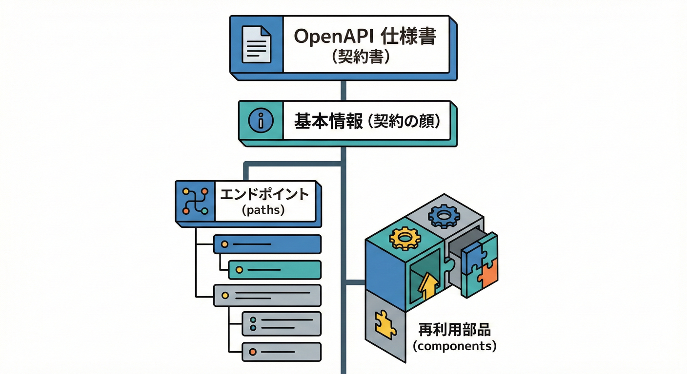
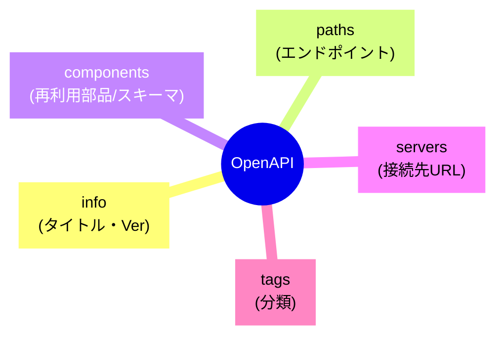

# 第24章：OpenAPI契約①（仕様書を作る）📘

## この章でできるようになること🎯

* OpenAPI（仕様書）を **「契約書」** として作って、チームや利用者に渡せるようになる🫶
* ASP.NET Core で **OpenAPI 3.1** の仕様書を自動生成して、**見やすく整える**✨ ([Microsoft Learn][1])
* **JSON / YAML** の両方で出力できるようにする🧾 ([Microsoft Learn][1])
* 仕様書を **リポジトリに固定（コミット）** して、契約変更を追跡できる形にする📌 ([Microsoft Learn][1])

---

## 24.1 OpenAPIってなに？どうして「契約書」なの？🤝📄

OpenAPI は、HTTP API の「できること」を **言語に依存せず** 書ける標準の仕様書フォーマットだよ🧩
仕様書がちゃんとしていると、利用側はソースコードを読まなくても「どう呼べばいいか」「何が返るか」を理解できるのが強み✨ ([OpenAPI Initiative Publications][2])

さらに OpenAPI 3.1 は **JSON Schema 2020-12 と完全互換** になって、スキーマ表現が強くなったよ💪（例：型や制約をより正確に書ける） ([openapis.org][3])

> つまり：OpenAPI =「人も機械も読める契約書」📘🤖
> これがあると、**クライアント生成**・**差分チェック**・**テスト**がやりやすくなるよ✨

---

## 24.2 仕様書の中身、ざっくり構造を覚えよう🧠🗂️





OpenAPI の基本パーツはこんな感じ👇

* **info**：タイトル・説明・バージョン（契約の顔！）
* **servers**：ベースURL（本番/検証など）
* **paths**：エンドポイント一覧（GET/POST…）
* **components**：再利用部品（schemas / securitySchemes など）
* **tags**：分類（Todo系、User系…みたいに整理）

このうち **Part 5（Web APIの契約）** で大事なのは、特に👇

* paths（何がある？）
* request/response（何を渡して、何が返る？）
* schema（型・必須・制約）
* error（失敗の形）

---

## 24.3 “契約書として強いOpenAPI”にするための必須ポイント✅✨

## ① operationId（操作のID）を安定させる🆔

クライアント生成や差分比較で効いてくるよ！
Minimal API だと **WithName** で operationId を付けられるよ✨ ([Microsoft Learn][4])

## ② summary / description をちゃんと書く📝💕

* summary：一言で「何するAPI？」
* description：詳しい説明（注意点・制約・例）

Minimal API なら **WithSummary / WithDescription** で設定できるよ✨ ([Microsoft Learn][4])

## ③ tags で分類する🏷️

タグがあるとドキュメントが読みやすくなる！
Minimal API なら **WithTags** が使えるよ✨ ([Microsoft Learn][1])

## ④ 例（example）を入れる🧁

「この形で送ってね」「こう返るよ」が一発で伝わるから、事故が減る✨
.NET の OpenAPI でも **例やメタデータを足して意味を持たせよう** って話が公式で出てるよ🫶 ([Microsoft for Developers][5])

---

## 24.4 ハンズオン①：OpenAPI 3.1 を “自動生成” して見てみよう👀✨

## 24.4.1 OpenAPI を出す最小構成（Minimal API）🧩

ASP.NET Core では、組み込みの OpenAPI 生成が用意されていて、**AddOpenApi** と **MapOpenApi** で JSON を出せるよ✨ ([Microsoft Learn][6])

```csharp
using Microsoft.AspNetCore.OpenApi;

var builder = WebApplication.CreateBuilder(args);

builder.Services.AddOpenApi();

var app = builder.Build();

if (app.Environment.IsDevelopment())
{
    app.MapOpenApi(); // /openapi/v1.json が出る
}

app.MapGet("/", () => "Hello OpenAPI!");

app.Run();
```

起動したら、ブラウザで **/openapi/v1.json** を開いてみてね📄✨
（このパスは既定で /openapi/{documentName}.json で、documentName の既定は v1 だよ） ([Microsoft Learn][1])

---

## 24.4.2 YAML でも出せるよ🧾✨

「人間が読む」なら YAML の方が好きって人も多いよね😊
ルートをこうすれば YAML で出せるよ👇 ([Microsoft Learn][1])

```csharp
if (app.Environment.IsDevelopment())
{
    app.MapOpenApi("/openapi/{documentName}.yaml");
}
```

---

## 24.5 ハンズオン②：Swagger UI（見た目）を付けて “眺めやすく” する🧁🔍

ここ注意⚠️
組み込みの OpenAPI 生成は **仕様書は出せるけど、UIは同梱じゃない** よ。UI を出すなら別ツールを足す感じ🧰 ([Microsoft Learn][7])

## 24.5.1 Swagger UI を足す（開発環境だけ）🧪

Microsoft Learn の例だと、Swagger UI は **Swashbuckle.AspNetCore.SwaggerUi** を使って、/swagger で表示するよ✨ ([Microsoft Learn][7])

```csharp
using Microsoft.AspNetCore.OpenApi;

var builder = WebApplication.CreateBuilder(args);
builder.Services.AddOpenApi();

var app = builder.Build();

if (app.Environment.IsDevelopment())
{
    app.MapOpenApi();

    app.UseSwaggerUI(options =>
    {
        options.SwaggerEndpoint("/openapi/v1.json", "v1");
    });
}

app.MapGet("/", () => "Hello OpenAPI!");

app.Run();
```

そして超大事ポイント💥
Swagger UI みたいな「触れるUI」は **開発環境だけで有効にするのが推奨** だよ（情報漏えい防止）🔐 ([Microsoft Learn][7])

---

## 24.6 ハンズオン③：“契約として読める” メタデータを盛ろう🌸✨

ここからが「契約設計」っぽさ出るところだよ〜！🥳

## 24.6.1 operationId を固定（WithName）🆔

```csharp
app.MapGet("/todoitems", () => new[] { "buy milk", "read book" })
   .WithName("GetTodoItems");
```

## 24.6.2 summary / description を付ける📝

WithSummary / WithDescription が使えるよ✨ ([Microsoft Learn][4])

```csharp
app.MapGet("/todoitems/{id:int}", (int id) => Results.Ok(new { id, title = "buy milk" }))
   .WithName("GetTodoItem")
   .WithSummary("TODOを1件取得する")
   .WithDescription("idで指定したTODOを返します。存在しない場合は404を返します。");
```

## 24.6.3 タグで分類（WithTags）🏷️

```csharp
app.MapGet("/todoitems", () => Results.Ok(Array.Empty<object>()))
   .WithTags("Todo");
```

タグでグルーピングできるよ✨ ([Microsoft Learn][1])

---

## 24.7 ハンズオン④：DTO（スキーマ）に “制約” を載せよう🍡⚡

「型は合ってるのに、何入れていいか分からない😵」を防ぐには、制約が効くよ✨
例えば：必須、最大長、範囲、フォーマット（メール等）📌

## 24.7.1 Minimal API でも “制約メタデータ” は載るけど…⚠️

重要！
Minimal API では DataAnnotations などは **スキーマ（OpenAPI）には反映できる** けど、**自動バリデーションは別途必要** だよ（フィルターやロジックで検証する）🧪 ([Microsoft Learn][4])

例：リクエストDTOを record で作る（属性は property を付けるのがコツ）🧷 ([Microsoft Learn][4])

```csharp
using System.ComponentModel.DataAnnotations;

public sealed record CreateTodoRequest(
    [property: Required]
    [property: StringLength(50, MinimumLength = 1)]
    string Title
);
```

これで「Title は必須」「1〜50文字」みたいな情報が契約に載るイメージだよ✨ ([Microsoft Learn][4])

---

## 24.8 仕様書を “固定する” 2つのやり方📌🧾

契約は「その時の実装」じゃなくて、**合意したドキュメント** が大事だよね🤝
なので仕様書を **成果物として保存** しよう✨

## やり方A：実行中の /openapi/v1.json を保存する（お手軽）🍬

* APIを起動
* /openapi/v1.json を取得して、docs/openapi/v1.json として保存
* リポジトリにコミット📌

（シンプルで分かりやすい💡）

## やり方B：ビルド時に OpenAPI を生成して保存する（堅い）🧱

ASP.NET Core では、ビルド時生成もできるよ。
Microsoft.Extensions.ApiDescription.Server を入れると、ビルドで OpenAPI JSON が出力される✨ ([Microsoft Learn][1])

* 仕様書を **ソース管理にコミット** したい
* **specベースのテスト** に使いたい
* 静的に配信したい

こういうときに強いよ💪 ([Microsoft Learn][1])

---

## 24.9 よくある事故ポイント💥（ここだけは避けよ！）

* **operationId が毎回変わる** → クライアント生成や差分が地獄😇（WithNameで固定しよ） ([Microsoft Learn][4])
* **summary/description が空** → “何が保証されてるか”伝わらない🥲 ([Microsoft Learn][4])
* **Swagger UI を本番で公開** → 情報漏えいリスク🔐（開発環境だけ推奨） ([Microsoft Learn][7])
* **制約だけ書いて、検証してない** → “契約に書いてるのに通る”問題が起きる😵（Minimal APIは検証を別途） ([Microsoft Learn][4])

---

## 24.10 AI活用ミニ🍀（下書き係にして賢く使う）🤖✍️

## 使えるプロンプト例（コピペOK）🧁

* 「このエンドポイントの summary と description を、利用者目線で短く書いて。入力の制約と失敗時の挙動も1行で添えて」
* 「このDTOのフィールドごとに、例（example）と説明文（description）を提案して」
* 「このAPIの成功/失敗レスポンス例を JSON で3パターン（正常/404/400）作って」

👉 ただし最終チェックは人間がやろうね（“契約”だから）🫶

---

## 24.11 ミニ確認クイズ✅✨

1. OpenAPI 3.1 が強い理由の1つは、何の仕様と互換になったから？🧩 ([openapis.org][3])
2. Minimal API で summary/description を付ける代表的な方法は？📝 ([Microsoft Learn][4])
3. 組み込み OpenAPI だけだと、何が付いてこない？🍩 ([Microsoft Learn][7])

---

## 24.12 提出課題🎒✨（成果物）

## 課題A（必須）📌

* /openapi/v1.json が出る状態にする
* 少なくとも3つのエンドポイントに

  * operationId（WithName）
  * summary / description
  * tags
    を付ける✨ ([Microsoft Learn][1])

## 課題B（できたら）🍰

* YAML でも出せるようにする🧾 ([Microsoft Learn][1])
* 仕様書を docs/openapi/ 配下に保存してコミット📌（固定！） ([Microsoft Learn][1])
* Swagger UI を開発環境だけ有効化して /swagger で見られるようにする🔍 ([Microsoft Learn][7])

---

次の章では、この仕様書を **差分でレビュー** して「破壊的変更を早期発見」する流れに進むよ🔁🛑

[1]: https://learn.microsoft.com/en-us/aspnet/core/fundamentals/openapi/aspnetcore-openapi?view=aspnetcore-10.0 "Generate OpenAPI documents | Microsoft Learn"
[2]: https://spec.openapis.org/oas/v3.1.0.html?utm_source=chatgpt.com "OpenAPI Specification v3.1.0"
[3]: https://www.openapis.org/blog/2021/02/18/openapi-specification-3-1-released?utm_source=chatgpt.com "OpenAPI Specification 3.1.0 Released"
[4]: https://learn.microsoft.com/en-us/aspnet/core/fundamentals/openapi/include-metadata?view=aspnetcore-10.0&utm_source=chatgpt.com "Include OpenAPI metadata in an ASP.NET Core app"
[5]: https://devblogs.microsoft.com/dotnet/dotnet9-openapi/?utm_source=chatgpt.com "OpenAPI document generation in .NET 9"
[6]: https://learn.microsoft.com/en-us/aspnet/core/fundamentals/openapi/overview?view=aspnetcore-10.0 "Overview of OpenAPI support in ASP.NET Core API apps | Microsoft Learn"
[7]: https://learn.microsoft.com/ja-jp/aspnet/core/fundamentals/openapi/using-openapi-documents?view=aspnetcore-10.0 "生成された OpenAPI ドキュメントを使用する | Microsoft Learn"
