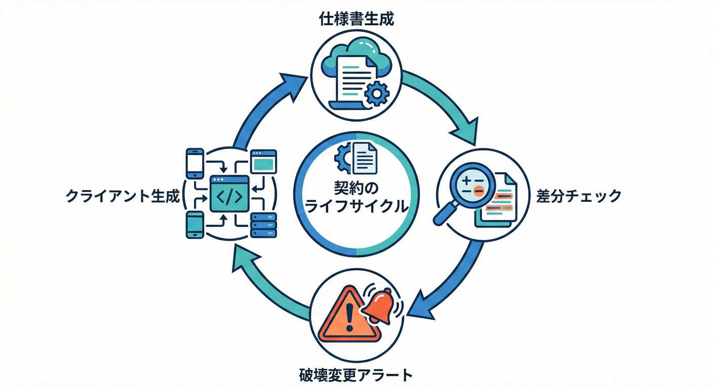
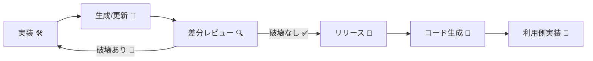

# 第25章：OpenAPI契約②（運用：差分・生成・レビュー）🔁📘🧪

## この章でできるようになること🎯✨

* OpenAPI（仕様書）の**差分**から「破壊的変更」を早めに見つけられる👀🛑
* OpenAPIから**クライアントコード生成**して、ズレを減らせる🤖🧩
* PRレビューで「契約が壊れた/壊れてない」を**迷わず判断**できるようになる✅💬
* 仕様書の**lint（お作法チェック）**をCIに入れて品質を安定させられる🧹⚙️

---

## 1. なぜ「運用」が主役なの？🧠💡




    C -- "破壊あり 🛑" --> A
    D --> E[コード生成 🤖]
    E --> F[利用側実装 🧩]
```

OpenAPIって、作った瞬間がゴールじゃなくて **“育て続ける契約書”** なんだよね📘🌱
機能追加や修正のたびに、仕様書は少しずつ変わる。問題はここ👇

* 仕様の差分を見ないと…

  * 「いつの間にかクライアントが壊れる」😇💥
  * 「変更点が伝わらない」😵‍💫📰
* でも差分をちゃんと運用すると…

  * **壊れる変更をPRで止められる**🛑
  * **変更ログが勝手に作れる**📝
  * **クライアント生成でズレが減る**🧩

---

## 2. まず“差分を取れる形”に固定しよう📌🗂️

差分運用のコツはシンプルで、OpenAPIを「毎回同じ場所に」「同じ手順で」出力できるようにすること✨

### 2.1 実行時生成 vs ビルド時生成（運用はどっちが楽？）🤔

* 実行時に `/openapi/v1.json` みたいに出す（APIが動けば取れる）
* ビルド時にファイルを生成する（CIでも安定して取れる）

ビルド時生成は、仕様書を**ソース管理にコミット**したり、**仕様ベースの統合テスト**に使ったり、**静的ホスティング**したりできて運用が強いよ💪📦 ([Microsoft Learn][1])

### 2.2 ビルド時にOpenAPIファイルを自動生成する🛠️✨

ASP.NET Coreは組み込みOpenAPIがあり、実行時は `Microsoft.AspNetCore.OpenApi`、ビルド時は `Microsoft.Extensions.ApiDescription.Server` を追加するとOKだよ📦 ([Microsoft Learn][1])

#### 手順（.NET CLI / PowerShell）🪄

```powershell
dotnet add package Microsoft.Extensions.ApiDescription.Server
dotnet build

## 生成されたOpenAPIを確認（例：obj\{ProjectName}.json）
type obj\{ProjectName}.json
```

このパッケージは **ビルド中にOpenAPIを自動生成**して、**出力ディレクトリに配置**してくれるよ📌 ([Microsoft Learn][1])

> 💡おすすめ運用：
> `openapi\base.json`（本番相当の基準）をリポジトリに置いて、PRでは新しい生成物と比較する📁✅

---

## 3. “破壊的変更”を差分で止める🛑🔍

差分の見方は2種類あるよ👇

* **Diff（差分一覧）**：どこがどう変わったか全部見る👀
* **Breaking（破壊だけ）**：壊れる変更だけに絞って止める🧨

ここでは、差分の自動検知に強い `oasdiff` を使うよ（OpenAPI仕様の比較と破壊的変更検出に特化）✨
`oasdiff` は breaking/changelog/diff などのコマンドがあって、出力形式もJSON/Markdown/HTML/JUnit/XML/GitHub注釈など色々できるよ🧰 ([GitHub][2])

---

## 4. oasdiffでローカル差分チェック（超基本）🧪🧰

### 4.1 用意するもの📄

* `openapi\base.json`（前回リリース時の仕様）
* `openapi\revision.json`（今回ビルドで生成した仕様）

### 4.2 破壊的変更だけ検出する🛑

```powershell
## 破壊的変更だけ（Breaking Changes）
oasdiff breaking openapi\base.json openapi\revision.json

## 重要な変更まとめ（Breaking + Non-breaking）
oasdiff changelog openapi\base.json openapi\revision.json

## 全部の差分（詳細）
oasdiff diff openapi\base.json openapi\revision.json
```

`oasdiff` は “breaking / changelog / diff” が主役コマンドだよ📌 ([GitHub][2])

---

## 5. GitHub ActionsでPRに「契約アラート」を出す📣🤖

CIで差分チェックすると、**壊れる変更がPRの時点で見える**から事故が激減するよ😇✨
`oasdiff-action` は `oasdiff` を使ったGitHub Actionで、差分や破壊的変更チェックを簡単に組み込めるよ⚙️ ([GitHub][3])

### 5.1 例：Diffレポートを走らせる🧾

```yaml
- name: Running OpenAPI Spec diff action
  uses: oasdiff/oasdiff-action/diff@main
  with:
    base: 'specs/base.yaml'
    revision: 'specs/revision.yaml'
```

このスニペットがREADMEに載ってるよ📌 ([GitHub][3])

### 5.2 実戦のコツ💡

* `base` は main ブランチの `openapi\base.json`
* `revision` は PR ブランチで生成した `openapi\revision.json`
* 破壊的変更が出たら **CIを赤にして止める**（止められるのが正義）🛑✅

---

## 6. 生成（Codegen）で「ズレ」を減らす🤝🧩

差分だけ見てても、利用側が手で書いてるとズレやすい…！
だから **OpenAPIからクライアントを生成**して「仕様＝コード」に近づけるのが強いよ💪✨

### 6.1 代表的な選択肢🧰

* **Kiota**：OpenAPIから強い型付きクライアントを生成するCLI（複数言語対応）🧠💻 ([Microsoft Learn][4])
* **OpenAPI Generator**：OpenAPI Spec からSDKやスタブを生成する定番ツール（C#クライアントも対応）🧱✨ ([GitHub][5])

> どっちがいい？🤔
>
> * 「Microsoft寄りの体験で、型付きSDKっぽくしたい」→ Kiota
> * 「生成オプションを細かく調整して、色んな方式で吐きたい」→ OpenAPI Generator

---

## 7. ここが地雷！差分レビューで見るべきポイント💥👀

PRでOpenAPIが変わったら、まずここを見よう👇✅

### 7.1 ルート/メソッドの変更🌐

* Path削除：ほぼ破壊🧨
* メソッド変更（GET→POST等）：破壊🧨
* Path追加：基本セーフ🍀（ただし既存と衝突しないこと）

### 7.2 リクエストの変更📩

* **必須パラメータ追加**：破壊になりやすい🧨
* 任意パラメータ追加：基本セーフ🍀
* 型変更（string→int等）：破壊🧨
* enumを狭める：破壊🧨（受け付け範囲が減る）

### 7.3 レスポンスの変更📤

* レスポンス項目の削除：破壊🧨
* 項目の型変更：破壊🧨
* **必須項目追加**：クライアントが落ちやすい⚡
* 任意項目追加：基本セーフ🍀

### 7.4 “OpenAPIのバージョン”にも注意🧾

ASP.NET Coreの組み込みOpenAPIは **OpenAPI 3.1 を既定**にできて、必要なら 3.0 に切り替えもできるよ🔁 ([Microsoft Learn][6])

もし「コード生成ツールが3.1に弱い」みたいな時は、OpenAPI 3.0に寄せるのが現実的な回避策になるよ🛟✨ ([Microsoft Learn][6])

---

## 8. Lint（仕様書のお作法チェック）で品質を揃える🧹✨

差分で壊れを止めるのが「安全」だとしたら、Lintは「読みやすさ・統一感」担当💄✨

`Spectral` はOpenAPI/JSON Schema向けに作られたルールエンジンで、CLIやnpmでも使えるよ🧹 ([stoplight.io][7])
ASP.NET CoreのOpenAPIまわりでも `Spectral` を使ったチェックの話が出てくるよ📘

---

## 9. AI活用：差分レビューを爆速にするプロンプト例🤖💬

AIは「判断」じゃなくて「下書き係」にするのがコツだよ📝✨

### 9.1 差分の要約（PR説明用）📰

* 「このOpenAPI差分を、利用者向けに3行で要約して」
* 「破壊的変更だけ抽出して、影響と回避策を箇条書きで」

### 9.2 互換性判定の補助🧠

* 「この変更は後方互換？理由は？互換にする代替案も出して」
* 「必須追加を避けて拡張する案を3つ出して」

### 9.3 リリースノート下書き📝

* 「changelogの内容から、利用者が最短で対応できる手順を書いて」

> ⚠️注意：AIは“それっぽい嘘”も混ぜることがあるから、**OpenAPIの実物**と**実挙動**で必ず照合ね✅😇

---

## 10. ミニ実習🎓🧪：「差分→生成→レビュー」一連を回す

### ゴール🏁

* 仕様差分で「破壊がない」ことを確認し、クライアント生成で利用側が追従できる状態にする✨

### ステップ🪜

1. OpenAPIをビルド時生成する設定を入れる（前の手順）📦 ([Microsoft Learn][1])
2. `openapi\base.json` を用意（前回版）📁
3. 新しいビルドで `openapi\revision.json` を作る🧾
4. `oasdiff breaking` を実行して破壊がないかチェック🛑 ([GitHub][2])
5. `oasdiff changelog` を出してPR説明を作る📰 ([GitHub][2])
6. OpenAPIからクライアント生成（Kiota or OpenAPI Generator）🤖🧩

   * Kiota：OpenAPIから型付きクライアント生成のCLIだよ✨ ([Microsoft Learn][4])
   * OpenAPI Generator：C#クライアント生成のドキュメントがあるよ📘 ([OpenAPI Generator][8])
7. 生成クライアントで“利用側プロジェクト”をビルドして動作確認✅

---

## まとめ🍰✨（この章の持ち帰り）

* OpenAPIは「作る」より「運用で守る」が本番💪📘
* ビルド時生成＋差分ツールで、破壊をPRで止められる🛑🧪 ([Microsoft Learn][1])
* クライアント生成でズレが減って、保守が楽になる🤝🤖 ([Microsoft Learn][4])
* Lint（Spectral）で仕様の品質と統一感をキープ🧹✨ ([stoplight.io][7])

[1]: https://learn.microsoft.com/ja-jp/aspnet/core/fundamentals/openapi/aspnetcore-openapi?view=aspnetcore-10.0 "OpenAPI ドキュメントを生成する | Microsoft Learn"
[2]: https://github.com/oasdiff/oasdiff "GitHub - oasdiff/oasdiff: OpenAPI Diff and Breaking Changes"
[3]: https://github.com/oasdiff/oasdiff-action "GitHub - oasdiff/oasdiff-action: GitHub action for comparing and detect breaking changes in OpenAPI specs"
[4]: https://learn.microsoft.com/ja-jp/openapi/kiota/overview "Welcome to Kiota | Microsoft Learn"
[5]: https://github.com/OpenAPITools/openapi-generator "GitHub - OpenAPITools/openapi-generator: OpenAPI Generator allows generation of API client libraries (SDK generation), server stubs, documentation and configuration automatically given an OpenAPI Spec (v2, v3)"
[6]: https://learn.microsoft.com/en-us/aspnet/core/fundamentals/openapi/using-openapi-documents?view=aspnetcore-10.0 "Use the generated OpenAPI documents | Microsoft Learn"
[7]: https://stoplight.io/open-source/spectral "Spectral: Open Source API Description Linter | Stoplight"
[8]: https://openapi-generator.tech/docs/generators/csharp/ "Documentation for the csharp Generator | OpenAPI Generator"
