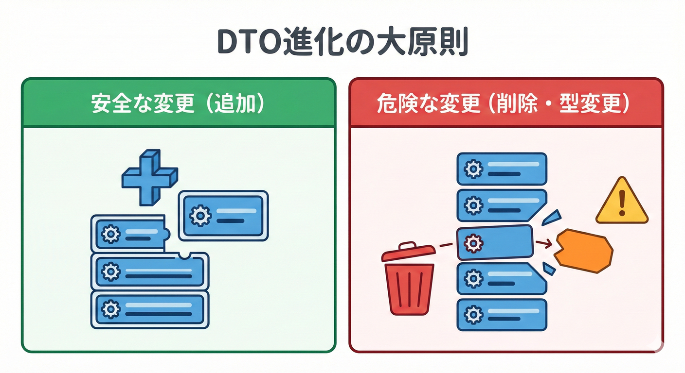
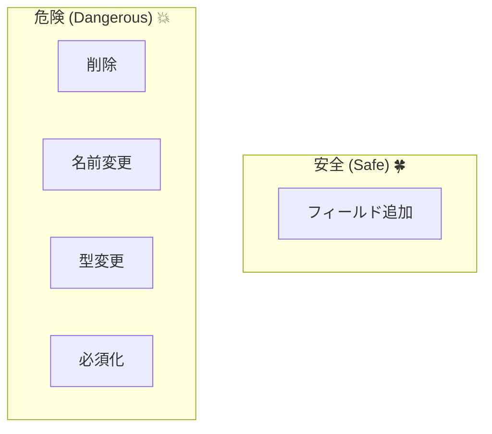
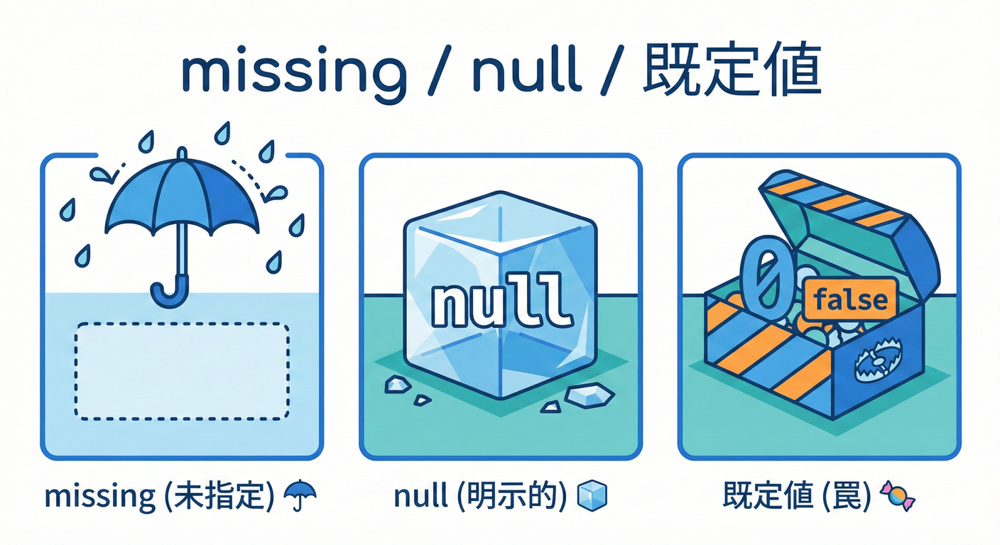
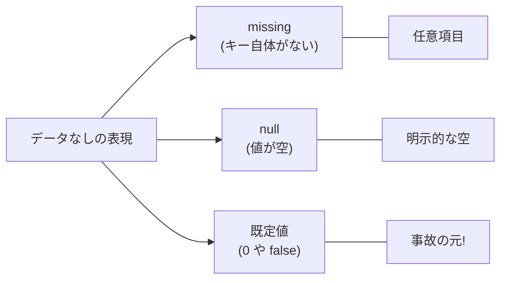

# 第26章：DTO（JSON）進化ルール🍡（互換性のコア）

## この章のゴール🎯✨

* DTO（= JSONの形）を **v1 → v1.1 に“安全に”進化**させられるようになる😊
* 「追加はOK」「削除・型変更は危険⚡」を **理由つきで説明**できるようになる
* **missing / null / 既定値**の扱いを統一して、事故を減らす🧯
* OpenAPI（仕様書）で **“契約”を目に見える形**にして、ズレに気づけるようになる📘([Microsoft Learn][1])

---

## 1) DTOってなに？なんで“契約の中心”なの？🍩

DTOは「通信で渡すデータの形（JSONの形）」だよ😊
この形を変えると、**相手のアプリが壊れる**ことがある💥
だからDTOは、API契約のど真ん中🍡✨

---

## 2) まず押さえる“互換性の2方向”↔️

DTO変更は、だいたいこの2方向で事故るよ😇

* **古いクライアント → 新しいサーバ**（古いJSONが送られてくる）
* **新しいクライアント → 古いサーバ**（新しいJSONが送られる）

そして **System.Text.Json（ASP.NET Coreの既定）** は、Web向けの既定として

* プロパティ名をcamelCase寄り
* 大文字小文字をあまり気にせず読み取り
* `"123"`みたいな「文字列の数字」も読めちゃう
  …みたいに、わりと“寛容”に動くよ🫶（便利だけど、ズレが隠れることも⚠️）([Microsoft Learn][2])

---

## 3) DTO進化の大原則🍡✨（最重要）




        B1[削除]
        B2[名前変更]
        B3[型変更]
        B4[必須化]
    end
```

## ✅ 安全になりやすい変更（だいたいOK）

* **フィールド追加（ただし“任意”として追加）** ➕
* **新しい値（enum相当）追加（ただし受け側が未知値に耐える設計なら）** 🧩
* **オブジェクト内に“任意の拡張データ置き場”を足す**（後述）🧺

## ❌ 危険な変更（だいたいNG）

* フィールド削除 🗑️
* フィールド名変更 ✍️➡️💥
* 型変更（string→int、int→object など）🔁💥
* 意味変更（型は同じでも意味が変わる）😇💥
* **必須フィールド追加**（後方互換を壊しやすい）🚨

---

## 4) “追加は基本OK”の条件🍀（ここがコツ！）

「追加OK」は、**“任意として追加”できたときだけ**だよ😊

## 追加する新フィールドはこうする✨

* **nullable** にする（`string?` / `int?` など）☂️
* もしくは「なくても困らない」既定値で意味が破綻しない設計にする🍬
* **サーバ側は“来なくても受け取れる”**ようにする（古いクライアント対応）📩

---

## 5) “削除・名前変更”が危険な理由🧨

* 削除すると、古いクライアントが参照してたら即死💀
* 名前変更は、相手から見ると **「削除＋追加」** と同じ💥

## 安全なやり方（段階的に廃止）🧓➡️🧑

* いきなり消さない
* まず **残したまま非推奨**（ドキュメント＆OpenAPIで告知）📘
* クライアント移行期間を置く📅
* **メジャーバージョン**で削除🧱

---

## 6) “型変更”が危険な理由🔁💥

例：`age: "20"`（string）→ `age: 20`（number）
見た目は近いけど、受け側のパースが死ぬ😵‍💫

しかもASP.NET Coreの既定は「文字列の数字」も読めちゃうので、
型ズレが“表面化しないまま”混ざる危険もあるよ⚠️([Microsoft Learn][2])

## 安全な回避策🧯

* 型を変えたいなら **新しいフィールドを追加**して、古いのは残す

  * `age`（旧）を残しつつ `ageNumber`（新）を追加、とか🍡
* しばらく両対応して、移行できたらメジャーで整理🧱

---

## 7) missing / null / 既定値 を“契約”として固定する☂️🧊🍬




ここがDTO事故の温床〜！😇

## 3つの違い🧠

* **missing（未指定）**：JSONにキーが無い
* **null**：`"name": null` みたいに明示的にnull
* **既定値**：C#の `int` は missing だと `0` になったりする（判別不能🤯）

## 事故りやすい例😵

「`quantity` が missing だったのに 0 扱いになって、無料になった…」みたいな🫠

## ルール例（おすすめ）💡

* **意味がある数値は nullable にする**（`int?`）→ missing と 0 を区別✨
* 文字列は「missing＝未入力」「null＝明示的に無い」「""＝空文字」…みたいに、チームで統一📏

## どうしても“必須”にしたいとき🚨

System.Text.Json には **必須を表す属性**があるよ。
`[JsonRequired]` を付けたプロパティが JSON に無いと、逆シリアル化で失敗（例外）させられる💥([Microsoft Learn][3])

ただし！
**「新フィールドにいきなり必須」を付けると、古いクライアントが即死**なので注意⚡（v1.1では基本しない）

---

## 8) “未知のフィールド”はどう扱う？🧩

DTOを進化させると、新しいクライアントは **新しいフィールドを送る**よね📮
古いサーバがそれに遭遇したときどうするか、方針が必要！

## 既定は“無視（寛容）”😊

System.Text.Json は、既定で「知らないプロパティは無視」しがち。
だから **追加が生きやすい**🍀

## でも“厳密にしたい”場合もある🧨

.NET 8 以降は、**未知フィールドが来たら例外**にできる（Disallow）！
`JsonUnmappedMemberHandling` を使うよ🛑([Microsoft Learn][4])

例（厳密モード）👇

```csharp
using System.Text.Json.Serialization;

[JsonUnmappedMemberHandling(JsonUnmappedMemberHandling.Disallow)]
public sealed class StrictDto
{
    public required int Id { get; init; }
}
```

**どっちが正解？**

* 外部公開APIや長期運用 → **寛容（追加に強い）**が基本🍀
* 内部だけ、バグを早期に炙り出したい → **厳密**もアリ🛑

---

## 9) OpenAPIで“DTOの契約”を見える化📘✨

OpenAPIは「このAPIはこのJSONを返す/受けるよ」っていう契約書📘
.NET 9 以降、ASP.NET Coreには **組み込みのOpenAPIサポート**があるよ（Microsoft.AspNetCore.OpenApi）([Microsoft Learn][1])

## 最小構成（組み込みOpenAPI）🧁

```csharp
var builder = WebApplication.CreateBuilder(args);

builder.Services.AddOpenApi(); // OpenAPI生成を有効化

var app = builder.Build();

app.MapOpenApi(); // /openapi/v1.json などを公開（構成によりパスは変えられる）

app.Run();
```

（OpenAPI生成とカスタマイズの考え方は公式にまとまってるよ📘）([Microsoft Learn][5])

---

## 10) 実習🧪：v1 DTO → v1.1 DTO を“安全に増やす”🍡➕

ここからはミニAPIで体験しよ〜！😊✨
テーマ：**注文API**（Order）📦

---

## 10-1) v1：DTOを作る（最小）🌱

## ① v1 リクエストDTO📩

```csharp
public sealed record CreateOrderRequestV1(
    string CustomerName,
    int Quantity
);
```

## ② v1 レスポンスDTO📤

```csharp
public sealed record CreateOrderResponseV1(
    string OrderId,
    string CustomerName,
    int Quantity,
    string Status
);
```

## ③ エンドポイント（POST /orders）🧩

```csharp
using Microsoft.AspNetCore.Http.HttpResults;

var app = WebApplication.CreateBuilder(args).Build();

app.MapPost("/orders", (CreateOrderRequestV1 req) =>
{
    // ここではDBなしの簡易版😊
    var res = new CreateOrderResponseV1(
        OrderId: Guid.NewGuid().ToString("N"),
        CustomerName: req.CustomerName,
        Quantity: req.Quantity,
        Status: "Created"
    );
    return TypedResults.Ok(res);
});

app.Run();
```

---

## 10-2) v1 クライアント（古い側）を作る🧑‍💻📞

```csharp
using System.Net.Http.Json;

var http = new HttpClient { BaseAddress = new Uri("https://localhost:5001") };

var req = new
{
    customerName = "Mika",
    quantity = 2
};

var res = await http.PostAsJsonAsync("/orders", req);
res.EnsureSuccessStatusCode();

var body = await res.Content.ReadFromJsonAsync<CreateOrderResponseV1>();
Console.WriteLine(body);
```

---

## 10-3) v1.1：DTOにフィールド追加➕（安全なやり方）

追加したいもの：

* `couponCode`（クーポン）🎫：**任意**
* `note`（備考）📝：**任意**（nullでもmissingでもOKにしたい）

## ✅ v1.1 DTO（“任意”として追加）☂️

```csharp
public sealed record CreateOrderRequestV1_1(
    string CustomerName,
    int Quantity,
    string? CouponCode, // NEW ➕（任意）
    string? Note        // NEW ➕（任意）
);
```

## ✅ サーバ側の受け口はどうする？🧠

ここでのポイントは2つ👇

1. **古いクライアント（v1 JSON）**が送ってきても受けられる
   → `CouponCode` と `Note` は missing になりがち。だから `string?` にしておく☂️

2. **新しいクライアント（v1.1 JSON）**も受けられる
   → 追加フィールドが来てもOK👍（既定は寛容なことが多い）

---

## 10-4) “v1のまま動く”をテストで固定✅🧪

DTO進化は、**テストがあると急に平和になる**よ😊💕

## 例：JSONサンプルを1つ固定しておく📌

* `samples/create-order.v1.json` を作って、いつでもPOSTできるようにする
* これが「契約の生き証人」になる👻✨

---

## 11) 進化でやりがちな事故集😇💥（回避ワザつき）

## 事故1：新フィールドを non-nullable にした🍨💥

`string` にすると、missing時の扱いがややこしい（nullが入ったり、別の層で落ちたり）
→ **追加はまず nullable** が安全☂️

## 事故2：必須（required / JsonRequired）を新規追加した🚨

古いクライアントはそのフィールドを送れない → 即死💀
→ **必須化はメジャーで**、移行期間を用意📅([Microsoft Learn][3])

## 事故3：未知フィールドをサーバがエラーにした🛑

追加に弱くなる（進化しにくい）
→ 公開APIならまず寛容で、必要ならログで検知がおすすめ📒
（厳密化もできるのは覚えておく）([Microsoft Learn][4])

---

## 12) AI（Copilot / Codex系）に頼る“よい頼り方”🤖✨

## DTO進化のときに効くプロンプト例🍡

* 「v1 DTO にフィールドを追加する。後方互換を壊さないルールで提案して」
* 「missing / null / default の扱いを契約として文章化して」
* 「固定JSONサンプルを使った契約テスト（xUnit）を作って」
* 「OpenAPIの変更点を読みやすい箇条書きにして（破壊的変更があれば警告も）」([Microsoft Learn][1])

---

## 13) 今日のチェックリスト✅🍡

* [ ] 追加フィールドは **任意（nullable）**にした？☂️
* [ ] missing / null / 既定値の意味を **文章で固定**した？📝
* [ ] 削除・名前変更・型変更を **してない**？（やるなら段階的？）🧱
* [ ] 固定JSONサンプル or 契約テストで **壊れてないのを保証**できる？🧪
* [ ] OpenAPIで **契約が見える**ようになってる？📘([Microsoft Learn][5])

---

## 14) ミニクイズ🎓✨（3問）

1. v1 DTOにフィールドを足すとき、いきなり `required` にしてOK？ ✅/❌
2. `price: 100` を `price: "100"` に変えるのは互換？ ✅/❌（ヒント：既定が寛容でも危険）([Microsoft Learn][2])
3. 未知フィールドが来たら例外にしたい。使える仕組みは？（名前を答えてね）([Microsoft Learn][4])

[1]: https://learn.microsoft.com/en-us/aspnet/core/fundamentals/openapi/aspnetcore-openapi?view=aspnetcore-10.0&utm_source=chatgpt.com "Generate OpenAPI documents"
[2]: https://learn.microsoft.com/en-us/dotnet/standard/serialization/system-text-json/migrate-from-newtonsoft?utm_source=chatgpt.com "Migrate from Newtonsoft.Json to System.Text.Json - .NET"
[3]: https://learn.microsoft.com/ja-jp/dotnet/api/system.text.json.serialization.jsonrequiredattribute?view=net-8.0&utm_source=chatgpt.com "JsonRequiredAttribute クラス (System.Text.Json.Serialization)"
[4]: https://learn.microsoft.com/en-us/dotnet/standard/serialization/system-text-json/missing-members?utm_source=chatgpt.com "Handle unmapped members during deserialization - .NET"
[5]: https://learn.microsoft.com/ja-jp/aspnet/core/fundamentals/openapi/aspnetcore-openapi?view=aspnetcore-10.0&utm_source=chatgpt.com "OpenAPI ドキュメントを生成する - ASP.NET Core"
