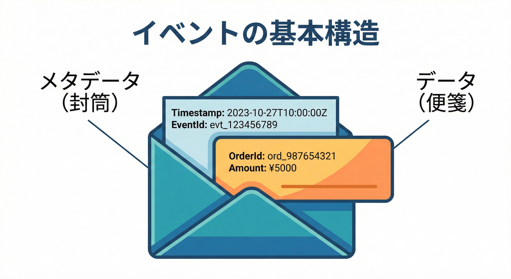
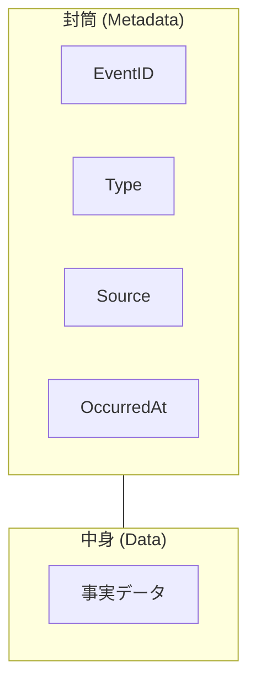

# 27章：イベント契約入門📨（「起きた事実」を運ぶ）

---

## この章でできるようになること🎯✨

* 「イベント＝何か」「なぜ契約が超重要か」を説明できる😊
* “壊れにくい”イベントの形（メタデータ＋データ）を作れる📦
* C#でイベントを **作る側（Producer）→受け取る側（Consumer）** まで小さく実装できる🧪
* 将来の拡張（フィールド追加など）に強い読み方ができる🛡️

---

## 27.1 イベントってなに？📣 〜「通知」より「記録」〜

イベントは、ざっくり言うと **「起きた事実の記録」** だよ📸✨
たとえば👇

* ✅ 注文が確定した（OrderPlaced）
* ✅ 支払いが完了した（PaymentCompleted）
* ✅ ユーザーが登録した（UserRegistered）

イベント駆動の仕組みでは、**発行する人（Producer）** がイベントを流して、**受け取る人（Consumer）** が反応するよ🔁
この形を「イベント駆動アーキテクチャ」と呼ぶことが多いよ🌐✨（Producer / Consumer / チャネル（ブローカー等）で構成される、という説明が定番）([Microsoft Learn][1])

---

## 27.2 なぜイベントは「契約」が超重要なの？😱💥

イベントは、APIみたいに「その場で失敗したからやり直し」が効きにくいことが多いのがポイント💦
さらに、イベントは **“後から増える利用者（Consumer）”** が出やすいのも特徴だよ👥

イベントが契約として難しくなる理由👇

* **一度流したイベントは取り消せない**（ログやキューに残る）🧾
* **複数のConsumerが同じイベントを読む**（影響範囲が見えにくい）👀
* **「あとで再生（Replay）」される可能性がある**（将来の自分も読む）⏪
* （発展）イベントを「履歴」として蓄積して状態を復元する考え方もあるよ📚（イベントソーシング）([Microsoft Learn][2])

だからこそ、イベントは **“公開する契約”** として、最初から丁寧に扱うのが大事なの🫶✨

---

## 27.3 良いイベント名の付け方📝✨（過去形・事実・ドメインの言葉）

イベント名は「何をしたいか」じゃなくて、**「何が起きたか」** を表すのがコツだよ😊

## ✅ イベント名のコツ

* **過去形・完了形**（〜した、〜された）で「事実」にする📌
* **ドメインの言葉**（業務で通じる言葉）を使う💬
* 「更新した」みたいな曖昧より、**何がどう変わったか** を出す✨

例👇

* ❌ `UpdateUser`（命令っぽい）
* ✅ `UserEmailChanged`（起きた事実っぽい）
* ✅ `OrderCanceled`（何が起きたかが一発で分かる）

---

## 27.4 イベントの基本構造📮✨（封筒＝メタデータ／中身＝データ）





イベントはだいたい **「封筒（metadata）」＋「中身（data）」** で考えると上手くいくよ📦💕

そして、この「封筒」を標準化する代表例が **CloudEvents** だよ🌩️✨
CloudEvents は、イベントを共通フォーマットで表現して相互運用しやすくするための仕様なの📘([GitHub][3])

CloudEvents では、少なくとも以下が必須になるのが基本だよ👇

* `id` / `source` / `specversion` / `type`（必須のコンテキスト属性）([Microsoft Learn][4])

クラウド側のイベント基盤でも CloudEvents はよく出てくるよ。たとえば Azure Event Grid は CloudEvents v1.0 の JSON 実装をネイティブサポートしてるの🧩([Microsoft Learn][5])
（Event Grid 独自形式もあるけど、推奨は CloudEvents、という説明もあるよ）([Microsoft Learn][6])

---

## 27.5 “まずこれだけ”入れるイベント契約の最小セット✅✨

ここでは CloudEvents に寄せつつ、超実務で困りにくい **最小フィールド** を作るよ😊

## ① 封筒（メタデータ）🧾

* **EventId**：イベントの一意ID（GUIDなど）🆔
* **Type**：イベント種別（例 `order.paid` / `OrderPaid`）🏷️
* **Source**：発行元（サービス名やアプリ識別子）📍
* **OccurredAt**：発生時刻（`DateTimeOffset` 推奨）⏰
* **Subject**：主語（例：`orders/{orderId}`）🧠
* **Version**：イベント契約のバージョン（発展は次章でやるけど導入だけ）🔢
* **Trace/Correlation**：追跡用（ログとつなぐ）🧵

## ② 中身（データ）🍙

* **そのイベントで“確定した事実”** だけを入れる📌
* 「画面表示用の文章」みたいな“都合のデータ”は入れない方が安全💡
* **個人情報は最小限**（イベントは広く流れがちだから）🔒

---

## 27.6 ミニ実習🧪✨：イベントを1つ定義して、購読側で処理する

## ゴール🎯

* Producer がイベント（JSON）を作る
* Consumer が受け取ってデシリアライズして処理する
* 将来フィールドが増えても壊れにくい読み方にする🛡️

---

## ① イベントの型を作る（封筒＋データ）📦✨

ポイントは👇

* **record** で「不変っぽいデータ」を表現しやすくする
* 将来フィールドが増えても受け取り側が落ちないように、**拡張データ枠**を用意する（後述）🧺

```csharp
using System.Text.Json;
using System.Text.Json.Serialization;

public sealed record CloudLikeEvent<TData>
{
    // --- envelope (metadata) ---
    public required string Id { get; init; }              // unique event id
    public required string Type { get; init; }            // event type
    public required string Source { get; init; }          // producer identifier
    public required string SpecVersion { get; init; } = "1.0";
    public DateTimeOffset Time { get; init; }             // occurred at
    public string? Subject { get; init; }                 // e.g. "orders/123"
    public int Version { get; init; } = 1;                // simple contract version

    // --- body (data) ---
    public required TData Data { get; init; }

    // --- forward compatibility bucket (unknown fields) ---
    [JsonExtensionData]
    public Dictionary<string, JsonElement>? Extensions { get; init; }
}

public sealed record OrderPaidData
{
    public required string OrderId { get; init; }
    public required int AmountYen { get; init; }
    public required string PaidMethod { get; init; } // "CreditCard" etc
}
```

`[JsonExtensionData]` を付けた辞書には、**型に存在しないJSONプロパティ** を入れて保持できるよ🧺✨（キーは string、値は `JsonElement` か `object` が条件）([Microsoft Learn][7])

---

## ② Producer：イベントJSONを作って「送ったことにする」📤✨

ここでは超簡単に「送信＝文字列を渡す」にするよ😊
（本物のキューやブローカーは次章以降で広げられるよ）

```csharp
using System.Text.Json;

static string Produce()
{
    var ev = new CloudLikeEvent<OrderPaidData>
    {
        Id = Guid.NewGuid().ToString("D"),
        Type = "order.paid",
        Source = "billing-service",
        Time = DateTimeOffset.UtcNow,
        Subject = "orders/123",
        Version = 1,
        Data = new OrderPaidData
        {
            OrderId = "123",
            AmountYen = 4980,
            PaidMethod = "CreditCard"
        }
    };

    var json = JsonSerializer.Serialize(ev, new JsonSerializerOptions
    {
        WriteIndented = true
    });

    return json;
}
```

---

## ③ Consumer：受け取って処理する📥✨（壊れにくさ重視🛡️）

大事なのは **「未知フィールドを許す」** ことが多い、という点だよ😊
イベントは後からフィールド追加されがちだからね➕✨

System.Text.Json は、基本的に **クラスにないJSONプロパティはデフォルトで無視** してくれるよ（互換性に強い）([Microsoft Learn][8])
さらに .NET 8 以降は「無視するか、未知を禁止して例外にするか」を設定できるようになってるよ（`UnmappedMemberHandling`）([Microsoft Learn][8])

```csharp
using System.Text.Json;
using System.Text.Json.Serialization;

static void Consume(string json)
{
    var options = new JsonSerializerOptions
    {
        // forward compatibilityを優先するなら通常は「未知を許す」方向が楽
        // （既定動作でも未知プロパティは無視される）:contentReference[oaicite:9]{index=9}
        PropertyNameCaseInsensitive = true
    };

    var ev = JsonSerializer.Deserialize<CloudLikeEvent<OrderPaidData>>(json, options)
             ?? throw new InvalidOperationException("event is null");

    // ここで契約として大事な項目だけチェックする（最低限）
    if (string.IsNullOrWhiteSpace(ev.Id)) throw new InvalidOperationException("missing id");
    if (string.IsNullOrWhiteSpace(ev.Type)) throw new InvalidOperationException("missing type");
    if (string.IsNullOrWhiteSpace(ev.Source)) throw new InvalidOperationException("missing source");

    Console.WriteLine($"✅ Received: {ev.Type} ({ev.Subject}) at {ev.Time:O}");
    Console.WriteLine($"   OrderId={ev.Data.OrderId}, Amount={ev.Data.AmountYen}, Method={ev.Data.PaidMethod}");

    // 将来増えた拡張フィールドがあれば、落ちずに保持できる🧺
    if (ev.Extensions is { Count: > 0 })
    {
        Console.WriteLine($"   📎 Extensions count = {ev.Extensions.Count}");
    }
}
```

---

## ④ 動かす（超ミニ）▶️😊

```csharp
var json = Produce();
Console.WriteLine("=== Produced JSON ===");
Console.WriteLine(json);

Console.WriteLine("\n=== Consume ===");
Consume(json);
```

---

## 27.7 受け取り側の鉄則🛡️✨（“未来の変更”に強くなる）

## ✅ 鉄則1：未知フィールドで落ちない（追加に強く）➕

イベントは **「フィールド追加」が最も起こりやすい進化** だよ📈
System.Text.Json は既定で未知プロパティを無視できるから、追加に強い読み方がしやすいの🫶([Microsoft Learn][8])
（必要なら「未知禁止」もできるけど、イベントでは“進化しやすさ”が勝つ場面が多いよ）([Microsoft Learn][9])

## ✅ 鉄則2：必須と任意を分ける🎚️

* **必須**：処理の意味が崩れるもの（例：`Id` / `Type` / `Source` / `Data` の主要キー）
* **任意**：あったら便利・後から足すもの（例：`subject` / `trace` / `extensions`）

## ✅ 鉄則3：“過去の事実”は書き換えない🧊

イベントは「履歴」になり得るよ📚
だから **“同じイベントIDの中身を後から変える”** みたいな運用は、事故の温床になりやすい⚠️
（イベント履歴で状態を復元するような設計では特に）([Microsoft Learn][2])

---

## 27.8 AI活用ミニ🍰🤖（下書き係にして、最後は人間が決める）

## 💡イベント名・フィールド案を出してもらう

* 「この業務で“起きた事実”のイベント名を過去形で10個出して」
* 「このイベントのDataに入れるべき“確定した事実”だけ列挙して」

## 💡契約チェック観点を作ってもらう

* 「このイベント契約が壊れやすいポイントを5つ挙げて」
* 「Consumer視点で“必須”にすべきフィールドを提案して」

---

## 27.9 練習問題✍️✨

## 問1✅：これはイベント？コマンド？

1. `CreateOrder`
2. `OrderCreated`
3. `UserEmailChanged`

## 問2✅：Dataに入れていいのはどっち？

A) 「画面表示用メッセージ」
B) 「支払い金額」「支払い方法」「注文ID」

## 問3✅：Consumerが壊れにくいのはどっち？

A) 未知フィールドが来たら例外で落とす
B) 未知フィールドは無視し、必須だけ検証する

（答え：1)コマンド 2)イベント 3)イベント / 問2=B / 問3=B😊✨）

---

## まとめ🎀

* イベントは **「起きた事実」** を運ぶ📨
* 契約は **未来のConsumer** も守る🛡️
* 「封筒＋中身」で考えると設計しやすい📦
* CloudEvents みたいな標準に寄せると相互運用が楽になりやすい🌩️([GitHub][3])
* C#では、未知フィールドを無視する（または保持する）設計で **進化に強いConsumer** を作りやすいよ🧺✨([Microsoft Learn][7])

[1]: https://learn.microsoft.com/en-us/azure/architecture/guide/architecture-styles/event-driven?utm_source=chatgpt.com "Event-Driven Architecture Style - Azure Architecture Center"
[2]: https://learn.microsoft.com/en-us/azure/architecture/patterns/event-sourcing?utm_source=chatgpt.com "Event Sourcing pattern - Azure Architecture Center"
[3]: https://github.com/cloudevents/spec/blob/main/cloudevents/spec.md?utm_source=chatgpt.com "spec/cloudevents/spec.md at main"
[4]: https://learn.microsoft.com/en-us/azure/event-grid/namespaces-cloud-events?utm_source=chatgpt.com "Event Grid Namespaces - support for CloudEvents schema"
[5]: https://learn.microsoft.com/en-us/azure/event-grid/cloud-event-schema?utm_source=chatgpt.com "CloudEvents v1.0 schema with Azure Event Grid"
[6]: https://learn.microsoft.com/ja-jp/azure/event-grid/event-schema?utm_source=chatgpt.com "Azure Event Grid イベント スキーマ"
[7]: https://learn.microsoft.com/ja-jp/dotnet/api/system.text.json.serialization.jsonextensiondataattribute?view=net-8.0&utm_source=chatgpt.com "JsonExtensionDataAttribute クラス (System.Text.Json. ..."
[8]: https://learn.microsoft.com/en-us/dotnet/standard/serialization/system-text-json/missing-members?utm_source=chatgpt.com "Handle unmapped members during deserialization - .NET"
[9]: https://learn.microsoft.com/ja-jp/dotnet/api/system.text.json.jsonserializeroptions.unmappedmemberhandling?view=net-10.0&utm_source=chatgpt.com "JsonSerializerOptions.UnmappedMemberHandling ..."
