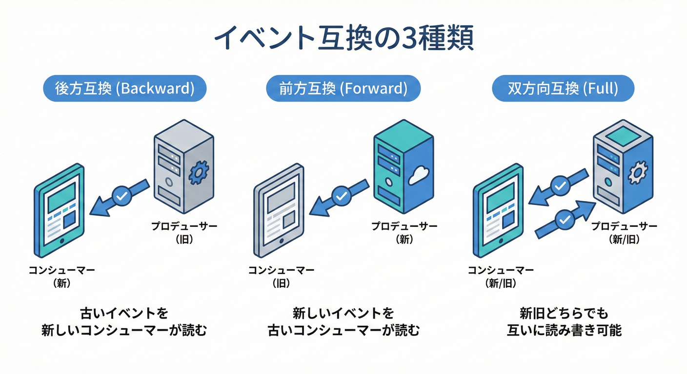
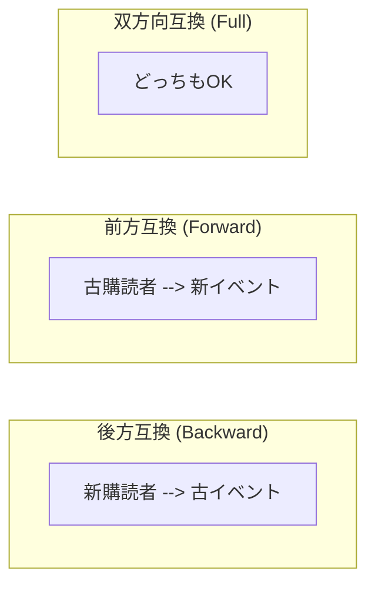

# 第28章：イベント互換の設計（バージョン付き・進化戦略）🧱📨

## この章でできるようになること🎯✨

* 「イベントを進化させても壊れない」ための **互換ルール** を作れる🧠💡
* **バージョンの付け方**（名前／フィールド／スキーマ）を選べる🔢🧩
* C#で **“古いイベントも読める” Consumer**（Upcaster付き）を組める🛠️🎀
* リリース時の **安全な順番**（Consumer先行など）を説明できる🚦🧑‍🏫

---

## 1. まず大前提：イベントは「取り戻せない」📨😱

イベントって、送った瞬間に「どこかへ流れて」「どこかに保存されて」「後から再生される」ことがあります。
つまり、**一度公開したイベントは“過去ログ”として未来に残りやすい**のが特徴🕰️📦

だからこそ、イベントはAPI以上に「互換性」を気にしないと事故りやすい…！💥

---

## 2. イベント互換の3種類（これが超コア）👩‍🏫🔑





イベントの互換性は、ざっくりこの3つで考えると整理しやすいです👇

### 2.1 後方互換（Backward）🔙✅

**新しいConsumerが、古いイベントも読める**

* リリース戦略：Consumerを先に更新してOKになりやすい🚦

### 2.2 前方互換（Forward）🔜✅

**古いConsumerが、新しいイベントも読める**

* これができるとProducer先行でも壊れにくい✨
* ただし現実は難しめ（“必須フィールド追加”が地雷）💣

### 2.3 双方向互換（Full）🔁✅

**新旧どっちもいける**

* 強いけど、設計ルールが厳しめ＆テスト必須🧪

この考え方は、Schema Registry の「互換モード（BACKWARD/FORWARD/FULL）」としてそのまま機能になってることが多いよ📚⚙️
例：Confluent の Schema Registry、Amazon Web Services の AWS Glue Schema Registry など。([everythingdevops.dev][1])

---

## 3. “封筒（Envelope）” を固定すると、一気に強くなる📩🛡️

イベントは「データ本体」だけじゃなくて、メタ情報（いつ/どこ/何が起きた）も超重要です✨
この“封筒”を標準化する代表例が **CloudEvents** 🎁

CloudEvents はイベントを共通形式で表現する仕様で、必須属性（id / source / specversion / type など）が決まってるよ📌([GitHub][2])
Azure Event Grid なども CloudEvents v1.0 をサポートしてます☁️✨([Microsoft Learn][3])
（CloudEvents のリリースタグも継続更新されてるよ）([GitHub][4])

### 3.1 CloudEvents風のイベント例（JSON）🧾✨

```json
{
  "specversion": "1.0",
  "id": "c0c2e1c0-7a65-4c09-8e4d-0af9d9f2f4f1",
  "source": "/users-service",
  "type": "com.example.user.registered",
  "time": "2026-02-04T09:30:00+09:00",
  "datacontenttype": "application/json",
  "dataschema": "https://schemas.example.com/user.registered/1",
  "data": {
    "userId": "U123",
    "email": "alice@example.com"
  }
}
```

* specversion / id / source / type が「封筒の必須級」💎([GitHub][2])
* dataschema に「この data はどのスキーマ？」を指させると、バージョン運用がめちゃ楽📎✨

---

## 4. バージョンの付け方：3つの代表パターン🔢🧩

### パターンA：イベント名（type）に v1 / v2 を入れる🏷️

例：

* com.example.user.registered.v1
* com.example.user.registered.v2

✅メリット：一目で分かる👀✨
⚠️注意：イベント種類が増える（運用は整理が必要）📚

---

### パターンB：データに schemaVersion を入れる🧱

例：data の中に schemaVersion: 1 を入れる
✅メリット：type が増えない🌱
⚠️注意：Consumer側が「version分岐」を書く必要がある🌀

---

### パターンC：Schema Registry で “スキーマの世代” を管理する📚⚙️

スキーマを登録して、互換モード（BACKWARD/FORWARD/FULL）を設定して、
新スキーマ登録時に「互換違反なら弾く」🚫

* Confluent Schema Registry：互換モードあり([everythingdevops.dev][1])
* AWS Glue Schema Registry：互換モードが複数用意されてる([AWS ドキュメント][5])
* Azure Event Hubs の Schema Registry（概念）：スキーマ管理の考え方が整理されてる([community.sap.com][6])

---

### パターンD：Topic/Queue を分ける（orders-v1 / orders-v2）📮

✅メリット：完全分離できる🧯
⚠️注意：配線（購読・ルーティング）が増える🕸️

---

## 5. “互換な変更 / 非互換な変更” 早見ルール表📌✅❌

### 5.1 だいたい互換になりやすい変更✅

* フィールド追加（**任意**・既定値あり）➕
* 新しいイベント種類を追加（既存はそのまま）🆕
* data の中に “拡張情報” を増やす（Consumerが無視できる形）🌱

### 5.2 破壊になりやすい変更❌💥

* フィールド削除🗑️
* フィールド名変更（リネーム）✂️
* 型変更（int→string、string→object など）🔁
* 意味変更（同じフィールド名で意味が変わる）😇

---

## 6. C#で “前方互換” を取りに行くコツ（未知フィールドを無視する）🧸✨

イベントは「古いConsumerが読む」可能性があるから、
Consumer側は **知らないフィールドが来ても落ちない** のが理想です💗

System.Text.Json は、.NET 8以降「未知（マッピング不能）なプロパティ」を **Skip（無視）/ Disallow（例外）** で選べます。([Microsoft Learn][7])

* Skip：前方互換に強い（新フィールドが来ても落ちにくい）🌷
* Disallow：契約テストでは強い（想定外が来たらすぐ検知）🧪🚨

---

## 7. 実装の型：Consumerに “Upcaster” を置く🧙‍♀️🛠️

「古いイベント」→「最新モデル」に変換してから処理するのが王道です✨
これで Consumer の本体ロジックが **最新版だけ** を相手にできるよ🎀

### 7.1 例：UserRegistered イベントの進化🍰

* v1：userId, email
* v2：userId, email, marketingOptIn（追加）

#### 受け取り側（Envelope + Upcaster）例🧩

```csharp
using System.Text.Json;
using System.Text.Json.Serialization;

public sealed record CloudEventEnvelope(
    string SpecVersion,
    string Id,
    string Source,
    string Type,
    DateTimeOffset? Time,
    string? DataSchema,
    JsonElement Data
);

public sealed record UserRegisteredV2(
    string UserId,
    string Email,
    bool MarketingOptIn
);

public static class UserRegisteredUpcaster
{
    public static UserRegisteredV2 ToV2(CloudEventEnvelope e)
    {
        // dataschema の末尾が "/1" なら v1 とみなす（簡易例）
        var isV1 = e.DataSchema?.EndsWith("/1", StringComparison.OrdinalIgnoreCase) == true;

        if (!isV1)
        {
            // v2 以降：そのまま読む（未知フィールドは無視できる設定が理想）
            return JsonSerializer.Deserialize<UserRegisteredV2>(e.Data.GetRawText())!;
        }

        // v1 → v2 へ変換
        var v1 = JsonSerializer.Deserialize<UserRegisteredV1>(e.Data.GetRawText())!;
        return new UserRegisteredV2(
            UserId: v1.UserId,
            Email: v1.Email,
            MarketingOptIn: false // v1 には無いので既定値で補う
        );
    }

    private sealed record UserRegisteredV1(string UserId, string Email);
}
```

ポイント🌟

* “変換の責務” を Consumer側に寄せると、Producerの変更が楽になることが多い🧁
* ただし、全員が最新版へUpcastする設計は「運用ルール」が必要（後述）📜

---

## 8. 「段階的リリース」の鉄板手順（事故らない順番）🚦✨

### 8.1 追加（互換）リリース：v1 → v1.1 みたいな感じ➕

1. Consumer を先に更新（新フィールドが来ても読める状態）👂✨
2. Producer を更新（新フィールドを送る）📨➕
3. モニタリングで「古いConsumerが落ちてない」確認🔭✅

### 8.2 破壊リリース：v1 → v2（意味が変わる/型が変わる）💥

おすすめはこのどれか👇

* 新しい type（v2）を追加して並走🛤️
* Topic/Queue を分けて並走📮📮
* 期間を切って v1 を廃止（Deprecated）🧓➡️🧑（第18章の戦略）

---

## 9. Schema Registry を使うと「勝手に壊す」が減る🧯📚

Schema Registry は、ざっくり言うと
「イベントの設計図（スキーマ）を保管して、互換性チェックもしてくれる箱」📦✨

* Confluent Schema Registry：互換性モード（Backward/Forward/Full）を持つ([everythingdevops.dev][1])
* AWS Glue Schema Registry：互換性モードが複数あり、登録時にルール適用([AWS ドキュメント][5])
* Azure Event Hubs Schema Registry：スキーマ管理の考え方（概念）が整理されてる([community.sap.com][6])

さらに、Google Cloud Pub/Sub はスキーマ運用の中で「互換性」や「リビジョン」を意識した使い方が紹介されてるよ📘([Google Cloud Documentation][8])

---

## 10. AI活用（“下書き係”にして爆速にする）🤖💗

ここは GitHub Copilot や OpenAI 系ツールが強いところ✨
（ただし最後の判断は人間がやる！🧑‍🏫🧠）

### 10.1 互換ルール表を作らせるプロンプト🧾

* 「UserRegistered の v1→v2 の変更案を3案。互換/非互換を分類し、移行手順も付けて」
* 「Schema Registry の BACKWARD を守るために禁止すべき変更を、このイベント例に当てはめて列挙して」

### 10.2 Upcaster を書かせるプロンプト🛠️

* 「dataschema の末尾でバージョン判定して v1 を v2 にUpcastする C# コードを書いて。既定値も決めて」

### 10.3 テストを作らせるプロンプト🧪

* 「v1 JSON と v2 JSON のサンプルをそれぞれ3つ作り、Upcaster の単体テスト（xUnit）も作って」

---

## 11. ミニ実習🧁（30〜45分めやす）⏰✨

### 実習A：v1 のイベントを作る📨

* UserRegistered v1 を JSON で出力（コンソールでOK）🧾
* “封筒＋data” の形にする🎁

### 実習B：v2 を追加して、Consumerを壊さない💗

* v2 で marketingOptIn を追加
* Consumer に Upcaster を実装
* v1 と v2 の両方を食べて、同じ処理が動くことを確認✅

### 実習C：契約テストの雰囲気を入れる🧪

* 「この JSON は受理」「これは拒否」みたいなサンプルを用意
* System.Text.Json の Skip/Disallow を切り替えて挙動を観察👀([Microsoft Learn][9])

---

## 12. PRレビュー用チェックリスト（イベント互換 編）👀✅

* これ、**互換変更？破壊変更？** どっち？（明言されてる）🧭
* フィールド追加は **任意** になってる？既定値は？➕🎁
* 型変更／意味変更してない？（してたら v2 案になってる？）💥
* Consumer は「古いイベント」も読める？Upcaster/分岐ある？🧙‍♀️
* スキーマ（またはサンプルJSON）が repo に残ってる？📦
* 移行手順（どの順に出すか）が書かれてる？🚦

---

## まとめ🧁✨

イベント互換は、コツさえ掴めば「怖いもの」じゃなくなります😊
やることはシンプルで👇

* 封筒（メタ情報）を固定🎁（CloudEventsなど）([GitHub][2])
* 互換ルールを決める📜（Backward/Forward/Full）([everythingdevops.dev][1])
* Consumerに Upcaster を置いて “最新版に寄せる”🧙‍♀️🛠️
* リリース順を守って事故を防ぐ🚦💗

[1]: https://www.everythingdevops.dev/blog/schema-evolution-in-kafka?utm_source=chatgpt.com "Schema Evolution in Kafka - EverythingDevOps"
[2]: https://github.com/cloudevents/spec/blob/main/cloudevents/spec.md?utm_source=chatgpt.com "spec/cloudevents/spec.md at main"
[3]: https://learn.microsoft.com/en-us/azure/event-grid/cloud-event-schema?utm_source=chatgpt.com "CloudEvents v1.0 schema with Azure Event Grid"
[4]: https://github.com/cloudevents/spec/releases "Releases · cloudevents/spec · GitHub"
[5]: https://docs.aws.amazon.com/glue/latest/dg/schema-registry.html?utm_source=chatgpt.com "AWS Glue Schema registry"
[6]: https://community.sap.com/t5/application-development-and-automation-blog-posts/cloudevents-at-sap/ba-p/13620137?utm_source=chatgpt.com "CloudEvents at SAP"
[7]: https://learn.microsoft.com/en-us/dotnet/standard/serialization/system-text-json/missing-members?utm_source=chatgpt.com "Handle unmapped members during deserialization - .NET"
[8]: https://docs.cloud.google.com/pubsub/docs/schemas-valid?utm_source=chatgpt.com "Parse messages from a topic with a schema | Pub/Sub"
[9]: https://learn.microsoft.com/en-us/dotnet/api/system.text.json.serialization.jsonunmappedmemberhandling?view=net-10.0&utm_source=chatgpt.com "JsonUnmappedMemberHandling Enum (System.Text.Json ..."
