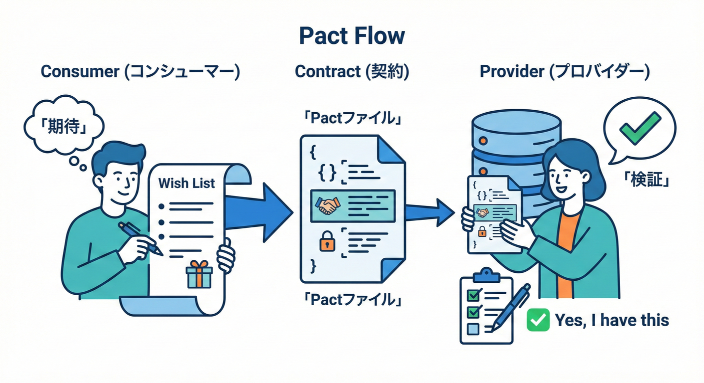
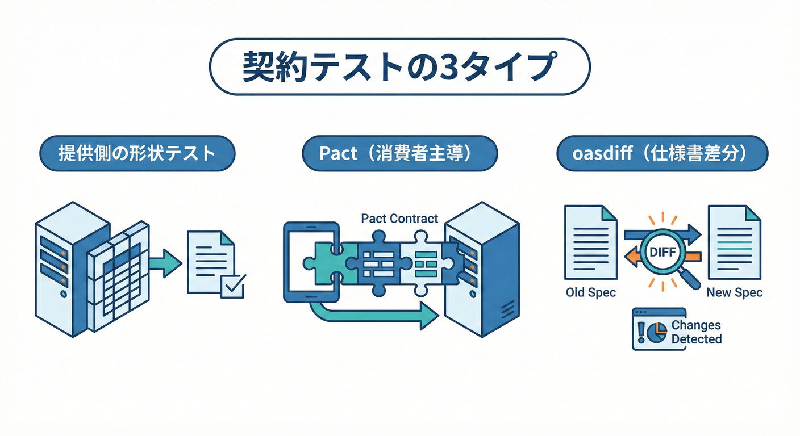
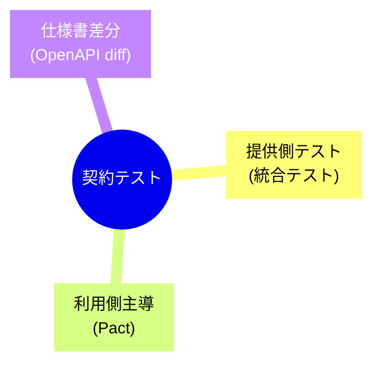
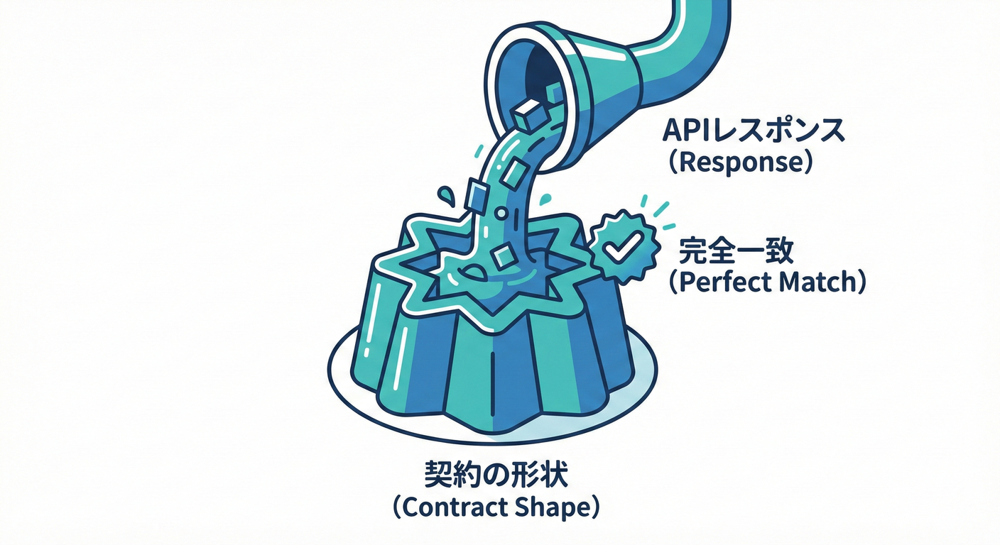
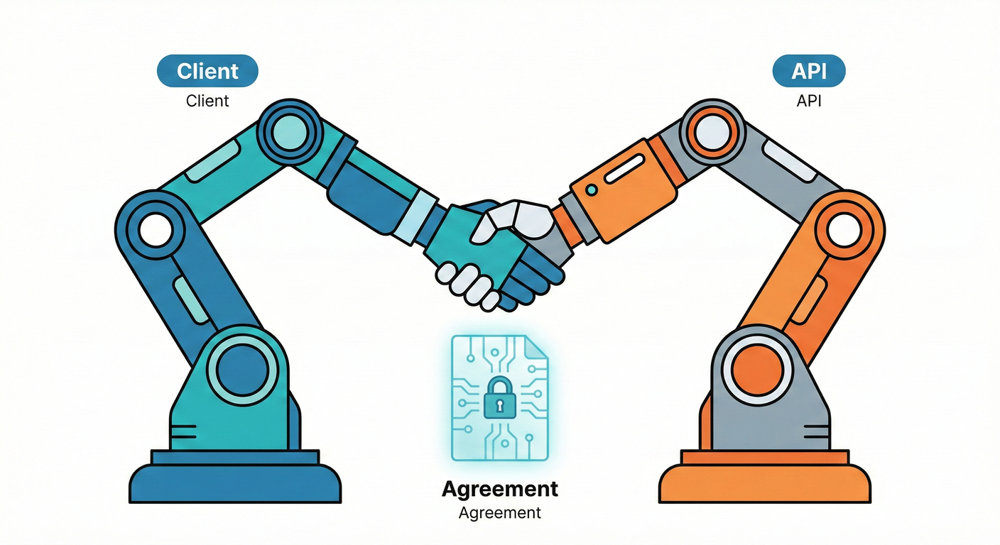
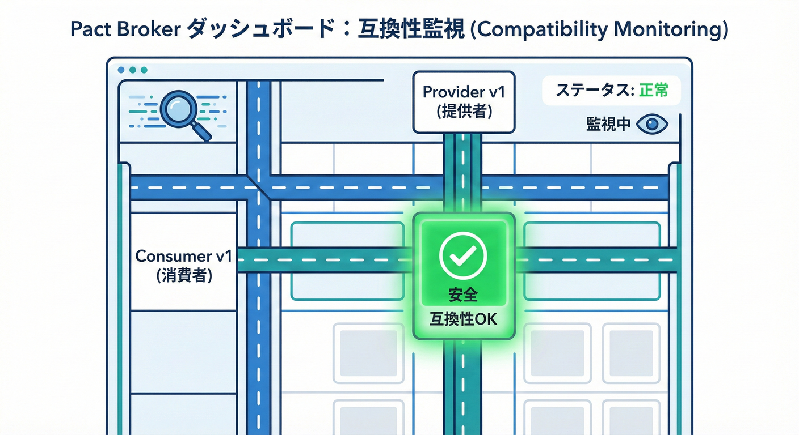
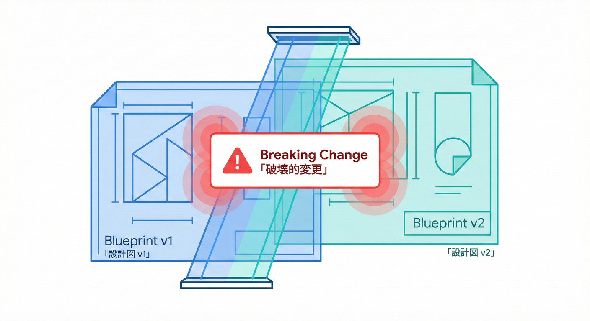

# 第29章：契約テスト（守れてるかを自動で保証）🧪

## 29.1 この章のゴール🎯✨

この章が終わると、こんなことができるようになります💪😊

* 「契約（約束）」が破られてないかを **テストで自動チェック**できる🧪✅
* **提供側（Provider）** と **利用側（Consumer）** の両方で、ズレを早期発見できる👀⚡
* OpenAPI や DTO の変更で **破壊的変更（Breaking Change）** を食らう前に止められる🛑💥
* Pact みたいな「契約ファイル」を使って、**“利用者の期待” を形にできる**📜✨ ([GitHub][1])

---

## 29.2 契約テストってなに？🤝💡

契約テストはひとことで言うと…

**「外に約束してる“形・意味・エラー”が、変更後も守れてるかを確認するテスト」**です🧡

たとえば Web API なら👇

* URL（ルート）🧭
* HTTPメソッド（GET/POST…）🔁
* ステータスコード（200/404/400…）🚦
* JSONのフィールド名・型・意味（DTO）🍡
* エラー形式（統一されてる？）🚧

これらがズレると、利用側が壊れます😵💦
だから **テストで「約束」を守る**のが契約テストです🧪✨

---

## 29.3 まず覚える！契約テストの3タイプ🧩✨






この章では、特に実務で効く3つを扱います😊

1. **提供側の契約テスト（Provider側）**

   * 返す JSON の形・必須フィールド・エラー形式を固定する🧱
   * ASP.NET Core の統合テストでやりやすい（WebApplicationFactory）🧪 ([Microsoft Learn][2])

2. **利用側主導の契約テスト（Consumer-Driven / Pact）**

   * 利用側が「こう返ってくるはず」をテストで宣言📣
   * その結果が **契約ファイル（pact）** になり、提供側がそれを検証する📜✅ ([GitHub][1])

3. **OpenAPI差分チェック（仕様書＝契約）**

   * OpenAPI を毎回生成して、差分から破壊を検知🔎
   * 破壊的変更検出ツール（oasdiff）などと相性よし🧨 ([GitHub][3])

---

## 29.4 ミニ題材：Books API 📚✨（この章の“契約”）

ここから実習っぽくいきます💃🧪

## 今回の契約（約束）📌

**GET /books/1** の成功レスポンスはこうする👇

* 200 OK 🚦
* JSONに **id（数値）**, **title（文字列）**, **author（文字列）** が必ず入る🍡
* Content-Type は JSON 🧾

存在しない本なら👇

* 404 Not Found 🚫
* エラー JSON は **code** と **message** を必ず持つ🚧

---

## 29.5 提供側の契約テスト：統合テストで“形”を固定する🧪🧱



ASP.NET Core は **テスト用ホスト＋インメモリのテストサーバー**で統合テストができます🧪✨ ([Microsoft Learn][2])
ここを使うと「返す JSON の形」をめちゃ守りやすいです😊

## ① 最小構成を作る（プロジェクト作成）🛠️

```powershell
dotnet new sln -n ContractTestingDemo

dotnet new web -n BooksApi
dotnet sln ContractTestingDemo.sln add .\BooksApi\BooksApi.csproj

dotnet new xunit -n BooksApi.ContractTests
dotnet sln ContractTestingDemo.sln add .\BooksApi.ContractTests\BooksApi.ContractTests.csproj

dotnet add .\BooksApi.ContractTests\BooksApi.ContractTests.csproj reference .\BooksApi\BooksApi.csproj
dotnet add .\BooksApi.ContractTests\BooksApi.ContractTests.csproj package Microsoft.AspNetCore.Mvc.Testing
```

---

## ② Books API（契約の対象）📚

**BooksApi/Program.cs**（超ミニ例）

```csharp
using Microsoft.AspNetCore.Http.Json;

var builder = WebApplication.CreateBuilder(args);

builder.Services.Configure<JsonOptions>(o =>
{
    // 例：ここでJSONのポリシー（camelCase等）を固定するのも契約の一部になりやすいよ🧠
});

var app = builder.Build();

app.MapGet("/books/{id:int}", (int id) =>
{
    if (id == 1)
    {
        return Results.Ok(new
        {
            id = 1,
            title = "Clean Contracts",
            author = "K. Komiyamma"
        });
    }

    return Results.NotFound(new
    {
        code = "BOOK_NOT_FOUND",
        message = $"Book {id} was not found."
    });
});

app.Run();

// WebApplicationFactory から参照するために必要（よくある定番）🧩
public partial class Program { }
```

---

## ③ 提供側の契約テスト（形チェック）🧪✅

**BooksApi.ContractTests/BooksContractTests.cs**

```csharp
using System.Net;
using System.Text.Json;
using Microsoft.AspNetCore.Mvc.Testing;
using Xunit;

public class BooksContractTests : IClassFixture<WebApplicationFactory<Program>>
{
    private readonly HttpClient _client;

    public BooksContractTests(WebApplicationFactory<Program> factory)
    {
        _client = factory.CreateClient();
    }

    [Fact]
    public async Task GetBook_Existing_Returns_ContractShape()
    {
        var res = await _client.GetAsync("/books/1");
        Assert.Equal(HttpStatusCode.OK, res.StatusCode);

        var contentType = res.Content.Headers.ContentType?.ToString() ?? "";
        Assert.Contains("application/json", contentType);

        var json = await res.Content.ReadAsStringAsync();
        using var doc = JsonDocument.Parse(json);
        var root = doc.RootElement;

        Assert.True(root.TryGetProperty("id", out var id));
        Assert.Equal(JsonValueKind.Number, id.ValueKind);

        Assert.True(root.TryGetProperty("title", out var title));
        Assert.Equal(JsonValueKind.String, title.ValueKind);

        Assert.True(root.TryGetProperty("author", out var author));
        Assert.Equal(JsonValueKind.String, author.ValueKind);
    }

    [Fact]
    public async Task GetBook_Missing_Returns_404_And_ErrorContract()
    {
        var res = await _client.GetAsync("/books/999");
        Assert.Equal(HttpStatusCode.NotFound, res.StatusCode);

        var json = await res.Content.ReadAsStringAsync();
        using var doc = JsonDocument.Parse(json);
        var root = doc.RootElement;

        Assert.True(root.TryGetProperty("code", out var code));
        Assert.Equal("BOOK_NOT_FOUND", code.GetString());

        Assert.True(root.TryGetProperty("message", out var message));
        Assert.False(string.IsNullOrWhiteSpace(message.GetString()));
    }
}
```

この形は「契約の最小コア」です🧱✨
フィールド名を変えたり、エラー形式を変えたら **即赤になる**ので、事故が減ります🛡️😊

> 💡ポイント
> DTO を型で Deserialize して確認するだけだと「名前変更」を見落とすことがあるので、**JsonDocument で“キー名”も確認**すると契約っぽさが上がります🍡✨

---

## 29.6 利用側テスト：モックで“期待”を先に固める🧪🎯（補助テク）

契約テスト本番（Pact）に行く前に、利用側が **「こう使う！」**を固めるのは超大事です😊✨

HTTP モックには WireMock.Net が便利です🧰（.NET向けモックサーバー） ([WireMock][4])

※これは「契約ファイル生成」ではないけど、**利用側の期待を明文化する**練習に最適です✍️💕

---

## 29.7 Consumer-Driven Contract Testing：Pactで“期待”を契約ファイルにする📜🤖✨



ここが契約テストの花形🌸
Pact は「利用側が契約を書く」タイプで、契約ファイル（pact）を共有して提供側が検証します🧠✨ ([GitHub][1])

## Pact の流れ（超ざっくり）🔁

1. 利用側テストで「こう返してね」を定義する📣
2. テストが pact ファイルを出力する📜
3. 提供側が pact を読み、実際のAPIで守れてるか検証する✅

---

## ① 利用側：PactNet を入れて契約を作る🧪📜

PactNet は .NET の Pact 実装です（5系のガイドあり） ([docs.pact.io][5])
NuGet の PactNet パッケージも提供されています📦 ([NuGet Gallery][6])

まず利用側テスト用プロジェクト（例：BooksConsumer.PactTests）を作ります👇

```powershell
dotnet new xunit -n BooksConsumer.PactTests
dotnet sln ContractTestingDemo.sln add .\BooksConsumer.PactTests\BooksConsumer.PactTests.csproj
dotnet add .\BooksConsumer.PactTests\BooksConsumer.PactTests.csproj package PactNet --version 5.0.1
```

### 利用側クライアント（例）📡

```csharp
using System.Net.Http.Json;

public class BooksApiClient
{
    private readonly HttpClient _http;

    public BooksApiClient(Uri baseUri)
    {
        _http = new HttpClient { BaseAddress = baseUri };
    }

    public async Task<BookDto> GetBook(int id)
    {
        var res = await _http.GetAsync($"/books/{id}");
        res.EnsureSuccessStatusCode();
        return (await res.Content.ReadFromJsonAsync<BookDto>())!;
    }
}

public record BookDto(int id, string title, string author);
```

### 利用側 Pact テスト（契約生成）🧪📜

PactNet の README の流れに沿った最小例です（Arrange/Act/Assert で pact を作って検証） ([GitHub][1])

```csharp
using System.Net;
using PactNet;
using PactNet.Infrastructure.Outputters;
using Xunit;

public class BooksConsumerPactTests
{
    private readonly IPactBuilderV4 _pactBuilder;

    public BooksConsumerPactTests()
    {
        var pact = Pact.V4("Books Consumer", "Books API", new PactConfig
        {
            // 生成された pact ファイルの置き場所（好きに変更OK）
            PactDir = Path.Combine(AppContext.BaseDirectory, "..", "..", "..", "pacts"),
            Outputters = new List<IOutput> { new ConsoleOutput() }
        });

        _pactBuilder = pact.WithHttpInteractions();
    }

    [Fact]
    public async Task GetBook_WhenBookExists_ReturnsExpectedShape()
    {
        _pactBuilder
            .UponReceiving("A GET request to retrieve book 1")
                .WithRequest(HttpMethod.Get, "/books/1")
                .WithHeader("Accept", "application/json")
            .WillRespond()
                .WithStatus(HttpStatusCode.OK)
                .WithHeader("Content-Type", "application/json; charset=utf-8")
                .WithJsonBody(new
                {
                    id = 1,
                    title = "Clean Contracts",
                    author = "K. Komiyamma"
                });

        await _pactBuilder.VerifyAsync(async ctx =>
        {
            var client = new BooksApiClient(ctx.MockServerUri);

            var book = await client.GetBook(1);

            Assert.Equal(1, book.id);
            Assert.Equal("Clean Contracts", book.title);
        });
    }
}
```

これで pact ファイルが生成されます📜✨
（「Books Consumer-Books API.json」みたいな名前で出ることが多いです）

---

## ② 提供側：pact を読み込んで本物の API を検証する✅🧪

提供側検証は超重要ポイントがあります⚠️

> **WebApplicationFactory（インメモリ TestServer）では Provider 検証が失敗する**ことがあります。
> PactNet の内部（Rust/ネイティブ）が “本物のTCPソケット” にアクセスできないためです。
> Provider 検証は **必ず TCP でホストしたAPI**に向けます📡✅ ([GitHub][1])

### Provider 検証用のテスト（最小イメージ）🧪

PactNet の README の Provider 例をミニ題材に合わせた形です ([GitHub][1])

```csharp
using PactNet;
using PactNet.Verifier;
using Xunit;

public class BooksApiPactVerificationTests
{
    [Fact]
    public void Provider_Honours_Pact()
    {
        var serverUri = new Uri("http://localhost:9223");

        using var server = BooksApiTcpHost.Start(serverUri); // 下のヘルパー（例）

        var pactPath = Path.Combine("..", "..", "..", "..",
            "BooksConsumer.PactTests", "pacts", "Books Consumer-Books API.json");

        using var verifier = new PactVerifier("Books API", new PactVerifierConfig());

        verifier
            .WithHttpEndpoint(serverUri)
            .WithFileSource(new FileInfo(pactPath))
            .Verify();
    }
}

public static class BooksApiTcpHost
{
    public static IDisposable Start(Uri uri)
    {
        var builder = WebApplication.CreateBuilder();
        var app = builder.Build();

        app.Urls.Clear();
        app.Urls.Add(uri.ToString());

        app.MapGet("/books/{id:int}", (int id) =>
        {
            if (id == 1)
                return Results.Ok(new { id = 1, title = "Clean Contracts", author = "K. Komiyamma" });

            return Results.NotFound(new { code = "BOOK_NOT_FOUND", message = $"Book {id} was not found." });
        });

        app.Start();
        return app;
    }
}
```

> 💡補足
> Pact には Provider States（Given）という仕組みもあります。「この状態を用意してね」って合図で、DB準備などができます🧰✨（大きい現場ほど効く） ([GitHub][1])

---

## 29.8 Pact Broker と Can I Deploy（CIで超強い）🚦🏁



契約ファイル（pact）を「どこに置くの？」問題、CIで「今デプロイして大丈夫？」問題…ありますよね🥺

そこで Pact Broker が便利です📦✨

* 契約（pacts）と検証結果を集約して見える化👀
* どのバージョン同士が安全に組めるかを判断できる🧠 ([docs.pact.io][7])

そして Can I Deploy は、CIで「安全ならデプロイOK」の判断を exit code で返せます🚦
例：

* デプロイ前に can-i-deploy ✅
* デプロイ後に record-deployment 📝 ([docs.pact.io][8])

---

## 29.9 OpenAPI を“契約書”としてテストする📘🔎✨



Web API だと OpenAPI はかなり強い契約書です📘✨

ASP.NET Core には OpenAPI 生成の仕組み（OpenAPI 3.1 / JSON Schema 2020-12 など）があります🧾 ([Microsoft Learn][9])
そして Swashbuckle も OpenAPI 3.1 対応や ASP.NET Core 10 対応の流れが続いています📦 ([GitHub][10])

## “差分で破壊検知”する道具：oasdiff 🧨

oasdiff は OpenAPI の差分から **breaking changes を検知**したり、変更ログを出せたりします🧾✨ ([GitHub][3])

### 例：Docker でサクッと差分（イメージ）🐳

```powershell
docker run --rm -t tufin/oasdiff breaking .\openapi_old.yaml .\openapi_new.yaml
```

> 🔥ここが強い
> “人がレビューで見落とす破壊”を機械で止められるのが最高です🛡️✨

---

## 29.10 テストを強くするコツ（初心者がハマりがち）🧠🧪

## ✅ コツ1：契約は「必要最小限」だけ固定する

* 固定しすぎるとテストが脆い😵
* 固定しなさすぎると意味がない😇
  Pact は「強力なマッチング」で脆さを減らす設計です✨ ([GitHub][1])

## ✅ コツ2：エラー形式を統一して、そこを契約にする🚧

エラーが毎回バラバラだと、利用側が泣きます😭
だから **error DTO（code/message/details…）** を固定するのがめちゃ効きます💥

## ✅ コツ3：DB絡みは “現物” を立てたほうが安全なこともある🧱

インメモリだけで誤魔化すと、本番で爆発することがある💣
そのときは Testcontainers みたいに “本物コンテナ” をテストで立てるのが強いです🐳🧪 ([Testcontainers][11])

---

## 29.11 ミニ実習：契約を「テストで守る」までやる✅🎓✨

やることはこの3ステップです😊

## Step A：提供側の契約テストを通す🧪✅

* GET /books/1 が契約通り
* GET /books/999 が 404 + error JSON

（29.5 のテストでOK）

## Step B：利用側 Pact テストで pact を生成📜

* 利用側テストを実行
* pact ファイルが生成されることを確認✨

## Step C：提供側で pact 検証🧪✅

* Provider を TCP で起動して PactVerifier で検証
* 成功したら「契約は守れてる」🙆‍♀️✨ ([GitHub][1])

---

## 29.12 まとめ🧁✨

* 契約テストは「約束（形・意味・エラー）」を **自動で守る仕組み**🧪🤝
* **提供側テスト**で “返す形” を固定できる（統合テストは超使える）🧱 ([Microsoft Learn][2])
* Pact は **利用側の期待を契約ファイルにして**、提供側がそれを検証できる📜✅ ([GitHub][1])
* OpenAPI は仕様書＝契約📘、差分ツールで破壊検知ができる🔎🧨 ([GitHub][3])

次の第30章では、この仕組みをまとめて **v1 → v1.1 → v2** のリリース運用まで通します🎓🚀

[1]: https://github.com/pact-foundation/pact-net "GitHub - pact-foundation/pact-net: .NET version of Pact. Enables consumer driven contract testing, providing a mock service and DSL for the consumer project, and interaction playback and verification for the service provider project."
[2]: https://learn.microsoft.com/en-us/aspnet/core/test/integration-tests?view=aspnetcore-10.0 "Integration tests in ASP.NET Core | Microsoft Learn"
[3]: https://github.com/oasdiff/oasdiff "GitHub - oasdiff/oasdiff: OpenAPI Diff and Breaking Changes"
[4]: https://wiremock.org/docs/solutions/dotnet/?utm_source=chatgpt.com "WireMock and .NET"
[5]: https://docs.pact.io/implementation_guides/net/docs/upgrading-to-5 "Upgrading to PactNet 5.x | Pact Docs"
[6]: https://www.nuget.org/packages/PactNet/ "
        NuGet Gallery
        \| PactNet 5.0.1
    "
[7]: https://docs.pact.io/pact_broker "Introduction | Pact Docs"
[8]: https://docs.pact.io/pact_broker/can_i_deploy "Can I Deploy | Pact Docs"
[9]: https://learn.microsoft.com/en-us/aspnet/core/fundamentals/openapi/aspnetcore-openapi?view=aspnetcore-10.0 "Generate OpenAPI documents | Microsoft Learn"
[10]: https://github.com/domaindrivendev/Swashbuckle.AspNetCore/releases "Releases · domaindrivendev/Swashbuckle.AspNetCore · GitHub"
[11]: https://testcontainers.com/guides/getting-started-with-testcontainers-for-dotnet/?utm_source=chatgpt.com "Getting started with Testcontainers for .NET"
