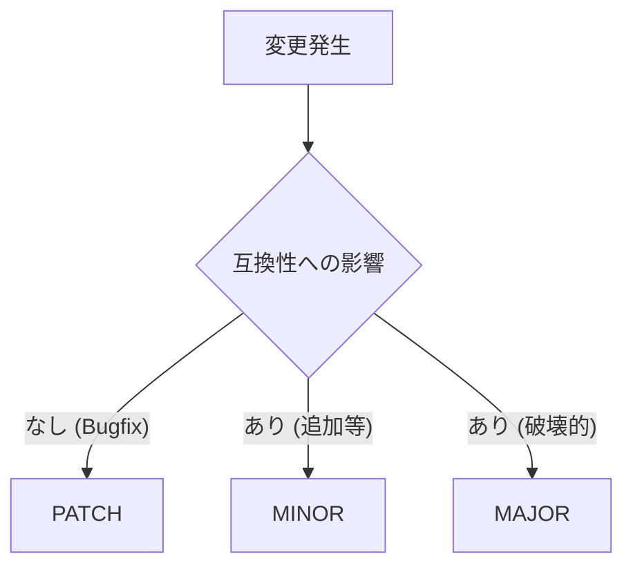

# 第30章：総合演習🎓（v1 → v1.1 → v2 を作ってリリースまで）

## この章でできるようになること✨

* 「契約（Contract）」を **v1 → v1.1 → v2** と安全に育てられる🌱➡️🌳
* **後方互換（壊さない変更）** と **破壊的変更（壊す変更）** を、手順で判断できる✅
* **SemVer（MAJOR/MINOR/PATCH）** を“迷わず”上げられる🔢（NuGetもSemVer 2.0.0準拠だよ）([Microsoft Learn][1])
* 変更を **テスト＆自動チェック（CI）** で守って、リリースノートまで出せる🧪⚙️📰
* さらに、GitHub Copilot 連携（NuGet MCP）で依存更新や脆弱性対応も“半自動”にできる🤖🧰([Microsoft Learn][2])

---

## 今日つくるミニプロダクト🍰📦

「送料見積もり（Shipping Quote）」を題材にするよ🚚💨
**契約**は2種類に分けて育てるのがポイント✨

* **ライブラリ契約（NuGet）**：`Shipping.Contracts`
* **Web API契約（HTTP + OpenAPI）**：`Shipping.Api`（/v1 と /v2 を持つ）

> バージョンは **1.0.0 → 1.1.0 → 2.0.0** で進めるよ🔢
> （SemVerの基本は公式に沿うのが安心👍）([Semantic Versioning][3])

---

## リポジトリ構成（完成形イメージ）📁

* `src/Shipping.Contracts/` … DTOと公開インターフェース（＝契約の中心）💎
* `src/Shipping.Api/` … Minimal API（/v1//quote と /v2/quote）🌐
* `src/Shipping.Consumer/` … 呼び出し側（簡単なConsole）🧑‍💻
* `test/Shipping.Contracts.Tests/` … 契約テスト🧪
* `artifacts/openapi/` … OpenAPI JSONの保存先📘
* `.github/workflows/ci.yml` … CI（破壊検知・依存チェック）⚙️

---

## 0️⃣ SemVerの“決め方”を1分で確認🔢




* **PATCH**：バグ修正（利用者のコードを壊さない）🩹
* **MINOR**：後方互換の機能追加（例：フィールド追加、エンドポイント追加）➕
* **MAJOR**：破壊的変更（例：必須化、削除、型変更、意味変更）💥

NuGetはSemVer 2.0.0のルールで考えるのが基本だよ📦([Microsoft Learn][1])

---

## 1️⃣ v1.0.0：最小の契約で「動く」を作る🌱

### 1-1. 契約（DTO）を“拡張しやすい形”で作る🧩

ポイントはここ👇

* **DTOは position の record（コンストラクタ引数）で固定しない**
  → 後からフィールド追加すると互換が壊れやすい😇
* **init プロパティ方式**にして、追加に強くする💪

```csharp
// src/Shipping.Contracts/V1/QuoteRequestV1.cs
namespace Shipping.Contracts.V1;

public sealed record QuoteRequestV1
{
    public decimal WeightKg { get; init; }
    public string Prefecture { get; init; } = "";
    public bool IsCool { get; init; }
}

// src/Shipping.Contracts/V1/QuoteResponseV1.cs
namespace Shipping.Contracts.V1;

public sealed record QuoteResponseV1
{
    public decimal PriceYen { get; init; }
    public int EstimatedDays { get; init; }
}
```

### 1-2. 公開インターフェース（＝ライブラリ契約の顔）😺

```csharp
// src/Shipping.Contracts/V1/IShippingQuoteServiceV1.cs
namespace Shipping.Contracts.V1;

public interface IShippingQuoteServiceV1
{
    QuoteResponseV1 GetQuote(QuoteRequestV1 request);
}
```

### 1-3. 実装はAPI側に置く（契約プロジェクトは薄く）🍃

```csharp
// src/Shipping.Api/Services/ShippingQuoteServiceV1.cs
using Shipping.Contracts.V1;

namespace Shipping.Api.Services;

public sealed class ShippingQuoteServiceV1 : IShippingQuoteServiceV1
{
    public QuoteResponseV1 GetQuote(QuoteRequestV1 request)
    {
        // 超シンプルな送料ロジック（演習用）
        var basePrice = 500m;
        var weightFee = 100m * request.WeightKg;     // 1kgあたり100円
        var coolFee = request.IsCool ? 200m : 0m;

        var estimatedDays = request.Prefecture switch
        {
            "沖縄" => 4,
            "北海道" => 3,
            _ => 2
        };

        return new QuoteResponseV1
        {
            PriceYen = basePrice + weightFee + coolFee,
            EstimatedDays = estimatedDays
        };
    }
}
```

### 1-4. Web API（v1エンドポイント）🌐

ASP.NET Core では OpenAPI を出すための仕組みが用意されてるよ📘（Minimal API + `AddOpenApi`/`MapOpenApi`）([Microsoft Learn][4])

```csharp
// src/Shipping.Api/Program.cs
using Shipping.Api.Services;
using Shipping.Contracts.V1;

var builder = WebApplication.CreateBuilder(args);

// OpenAPI生成（Minimal API）
builder.Services.AddOpenApi(); // OpenAPI docs generation:contentReference[oaicite:6]{index=6}

builder.Services.AddSingleton<IShippingQuoteServiceV1, ShippingQuoteServiceV1>();

var app = builder.Build();

if (app.Environment.IsDevelopment())
{
    // OpenAPI JSON: /openapi/{documentName}.json 形式で出せる:contentReference[oaicite:7]{index=7}
    app.MapOpenApi("/openapi/v1.json");
}

app.MapPost("/v1/quote", (QuoteRequestV1 req, IShippingQuoteServiceV1 svc) =>
{
    var res = svc.GetQuote(req);
    return Results.Ok(res);
});

app.Run();
```

### 1-5. Consumer（呼ぶ側）を作って“契約のありがたみ”を体感🧑‍💻

```csharp
// src/Shipping.Consumer/Program.cs
using System.Net.Http.Json;
using Shipping.Contracts.V1;

var http = new HttpClient { BaseAddress = new Uri("https://localhost:5001") };

var req = new QuoteRequestV1 { WeightKg = 2.5m, Prefecture = "東京", IsCool = true };

var res = await http.PostAsJsonAsync("/v1/quote", req);
res.EnsureSuccessStatusCode();

var body = await res.Content.ReadFromJsonAsync<QuoteResponseV1>();
Console.WriteLine($"送料: {body!.PriceYen}円 / 目安: {body.EstimatedDays}日");
```

### 1-6. v1.0.0 の「保存物」📌

* OpenAPI JSON を `artifacts/openapi/v1.0.0.json` に保存📘
  （例：PowerShellで `Invoke-RestMethod` してファイルへ、みたいな感じでOK👍）

---

## 2️⃣ v1.1.0：後方互換のまま拡張する➕✨

### 2-1. 互換を壊さない変更例（超おすすめ）🍡

* **Requestに任意フィールド追加（nullable / default）**
* **Responseに任意フィールド追加**
* **エンドポイント追加（v1のまま新ルートを足す）**

今回は「保険（任意）」を追加してみよう🛡️✨

```csharp
// src/Shipping.Contracts/V1/QuoteRequestV1.cs（追加）
public sealed record QuoteRequestV1
{
    public decimal WeightKg { get; init; }
    public string Prefecture { get; init; } = "";
    public bool IsCool { get; init; }

    // v1.1で追加（任意）
    public decimal? InsuranceYen { get; init; } // nullなら保険なし
}

// src/Shipping.Contracts/V1/QuoteResponseV1.cs（追加）
public sealed record QuoteResponseV1
{
    public decimal PriceYen { get; init; }
    public int EstimatedDays { get; init; }

    // v1.1で追加（任意）
    public string? CampaignMessage { get; init; }
}
```

API実装も、nullなら無視するだけでOK😊

```csharp
// ShippingQuoteServiceV1 の差分イメージ
var insuranceFee = request.InsuranceYen is > 0 ? 50m : 0m;

return new QuoteResponseV1
{
    PriceYen = basePrice + weightFee + coolFee + insuranceFee,
    EstimatedDays = estimatedDays,
    CampaignMessage = request.InsuranceYen is > 0 ? "保険つきで安心✨" : null
};
```

### 2-2. ここで“SemVer判断”🔢

これは **後方互換の機能追加** だから **MINOR（1.1.0）** だよ✅
SemVerの考え方とも一致する👍([Semantic Versioning][3])

### 2-3. v1.1.0 の「リリースノート」📰（短くてOK）

テンプレ例👇

```md
## 1.1.0
- Added: QuoteRequestV1.InsuranceYen (optional)
- Added: QuoteResponseV1.CampaignMessage (optional)
- Behavior: InsuranceYen が指定された場合、保険手数料を加算
```

### 2-4. AI（Copilot）に頼るポイント🤖✨

* リリースノートの下書き📝
* “互換性が壊れてない？”のレビュー観点出し👀
* DTOの追加が「任意」になってるかチェック✅

さらに Visual Studio 2026 だと、Copilot Chat から **NuGet MCP** を有効化して依存関係の更新や脆弱性修正もできるよ🧰✨([Microsoft Learn][2])

---

## 3️⃣ v2.0.0：破壊変更＋段階的廃止＋移行ガイド🧭💥

### 3-1. v2で「壊す」理由を作る（設計の筋トレ）🏋️‍♀️

今回は、v1の `Prefecture` が雑すぎる問題を直すよ😅

* v1：`Prefecture: "東京"`（日本前提すぎ）
* v2：`Destination { CountryCode, PostalCode }` にして、世界対応🌏✨

さらに、重量も `WeightKg(decimal)` → `WeightGrams(int)` にする（現場っぽい）⚖️

これは **DTO形状の変更（必須項目構造の変更 + 型変更）** なので **MAJOR（2.0.0）** だよ💥([Semantic Versioning][3])

### 3-2. v2 DTO を新設（/v2 ルートで提供）🧱

```csharp
// src/Shipping.Contracts/V2/QuoteRequestV2.cs
namespace Shipping.Contracts.V2;

public sealed record Destination
{
    public string CountryCode { get; init; } = "JP"; // 例: JP
    public string PostalCode { get; init; } = "";
}

public sealed record QuoteRequestV2
{
    public int WeightGrams { get; init; }
    public Destination Destination { get; init; } = new();
    public bool IsCool { get; init; }
    public int? DeclaredValueYen { get; init; } // 任意：申告価格
}

public sealed record QuoteResponseV2
{
    public int PriceYen { get; init; }
    public int EstimatedDays { get; init; }
    public string? Notes { get; init; }
}
```

### 3-3. v1は残して、v2を追加（段階的廃止の型）🧓➡️🧑

* `/v1/quote`：残す（でも“非推奨”扱いにする）
* `/v2/quote`：新しく追加（これが新標準✨）

```csharp
// src/Shipping.Api/Program.cs（v2追加イメージ）
using Shipping.Contracts.V2;

app.MapPost("/v2/quote", (QuoteRequestV2 req) =>
{
    // ここも演習用の超シンプル計算
    var basePrice = 600;
    var weightFee = req.WeightGrams / 10; // 10gあたり1円
    var coolFee = req.IsCool ? 250 : 0;

    var estimatedDays = req.Destination.CountryCode switch
    {
        "JP" => 2,
        _ => 5
    };

    return Results.Ok(new QuoteResponseV2
    {
        PriceYen = basePrice + weightFee + coolFee,
        EstimatedDays = estimatedDays,
        Notes = "v2 へようこそ🎉"
    });
});
```

### 3-4. 移行ガイド（Consumer目線で書く）🧭

最低限これを書けば勝ち🏆✨

* 何が変わった？（DTOの差分）
* どう直す？（置き換え手順）
* 互換期間は？（v1はいつまで？）

例（短くてOK）👇

```md
## v1 → v2 移行ガイド

### 変更点
- QuoteRequestV1.Prefecture (string) は廃止
- QuoteRequestV2.Destination (object) を使用
- WeightKg (decimal) → WeightGrams (int)

### 移行手順（Consumer）
1) /v1/quote → /v2/quote に変更
2) WeightKg を grams に変換: grams = (int)(kg * 1000)
3) Destination を作成して CountryCode / PostalCode を設定
```

### 3-5. OpenAPI を保存して「差分」を見える化📘🔍

* `artifacts/openapi/v1.1.0.json`
* `artifacts/openapi/v2.0.0.json`

OpenAPIは **契約書そのもの** だから、差分チェックにめちゃ強い💪
ASP.NET Core の OpenAPI 生成や `MapOpenApi` の挙動は公式にまとまってるよ📘([Microsoft Learn][4])

---

## 4️⃣ CI（自動化）：破壊的変更っぽいのを検知→バージョン＆ノートへ⚙️🤖

### 4-1. 依存関係の健全性チェック（.NET 10 の新コマンド順）🧹

.NET 10 から `dotnet package list` で、復元も含めて一覧・脆弱性チェックしやすいよ🧰
（`--vulnerable` や `--outdated` が便利✨）([Microsoft Learn][5])

例👇

```bash
dotnet package list --outdated
dotnet package list --vulnerable --include-transitive
```

さらに Visual Studio 2026 の Copilot Chat なら、NuGet MCP でこう打つだけで更新案が出るよ🤖✨

* `Fix my package vulnerabilities`
* `Update all my packages to the latest compatible versions` ([Microsoft Learn][2])

### 4-2. ライブラリ契約の破壊検知（ApiCompat）🧪

公開APIの互換性チェックには **ApiCompat** が使えるよ🛡️
（公式のツール説明＆使い方がある）([Microsoft Learn][6])

※ここはチームごとに流儀あるけど、演習では

* 「前回リリースしたDLL（1.1.0）」と
* 「今回ビルドしたDLL（2.0.0候補）」
  を比較して、差分が出たら“破壊かも”として止める、でOK👍

### 4-3. Web API契約の破壊検知（OpenAPI diff）🔍

OpenAPI JSON 同士を比較して、**破壊的変更** を検知するツール（例：oasdiff系）をCIで回すと強い💪([GitHub][7])
（「v1のOpenAPI」と「v2のOpenAPI」を比較して、破壊が出たら MAJOR を要求、みたいにできる✨）

---

## 5️⃣ Copilotに投げる“定番プロンプト”集🤖💬

コピペで使えるやつ置いとくね🧸✨

### 互換性レビュー👀

* 「このPRの変更で、利用者のコードが壊れる可能性がある点を列挙して。特にDTOの必須化・型変更・削除に注目して」
* 「SemVer的に、今回の変更は PATCH/MINOR/MAJOR のどれ？理由も添えて」

### 移行ガイド🧭

* 「v1→v2 の移行ガイドを、利用者が最短で直せる手順で書いて」
* 「破壊点を“検索しやすい見出し”でまとめて」

### リリースノート📰

* 「変更点を Added/Changed/Deprecated/Removed/Fixed の箇条書きにして」

---

## 6️⃣ “できたら合格✅”チェックリスト🧡

* [ ] v1.0.0：/v1/quote が動いて、Consumerが呼べる🚚
* [ ] v1.1.0：InsuranceYen を **省略しても動く**（＝後方互換）🍡
* [ ] v2.0.0：/v2/quote が動いて、移行ガイドがある🧭
* [ ] OpenAPI JSON を **バージョンごとに保存** できた📘
* [ ] `dotnet package list --outdated / --vulnerable` を実行して結果を読めた🧹([Microsoft Learn][5])
* [ ] （できれば）ApiCompat / OpenAPI diff をCIで回す雛形を作れた⚙️([Microsoft Learn][6])

---

## まとめ🍀

* v1は「最小」🌱
* v1.1は「足す（任意で）」➕
* v2は「壊す（でも移行を用意）」🧭💥
* そして **OpenAPI / 自動チェック / リリースノート** まで揃うと、契約設計が“現場仕様”になるよ✨

ちなみにC# 14 は Visual Studio 2026 / .NET 10 SDK で試せる機能として整理されてるから、言語機能の変化も“最新前提”で学んでOKだよ🧪✨([Microsoft Learn][8])

[1]: https://learn.microsoft.com/en-us/nuget/concepts/package-versioning?utm_source=chatgpt.com "NuGet Package Version Reference"
[2]: https://learn.microsoft.com/en-us/visualstudio/releases/2026/release-notes "Visual Studio 2026 Release Notes | Microsoft Learn"
[3]: https://semver.org/?utm_source=chatgpt.com "Semantic Versioning 2.0.0 | Semantic Versioning"
[4]: https://learn.microsoft.com/ja-jp/aspnet/core/fundamentals/openapi/overview?view=aspnetcore-10.0&utm_source=chatgpt.com "ASP.NET Core API アプリでの OpenAPI サポートの概要"
[5]: https://learn.microsoft.com/en-us/dotnet/core/tools/dotnet-package-list "dotnet package list command - .NET CLI | Microsoft Learn"
[6]: https://learn.microsoft.com/en-us/dotnet/fundamentals/apicompat/overview?utm_source=chatgpt.com "API compatibility tools - .NET"
[7]: https://github.com/oasdiff/oasdiff?utm_source=chatgpt.com "oasdiff/oasdiff: OpenAPI Diff and Breaking Changes"
[8]: https://learn.microsoft.com/ja-jp/dotnet/csharp/whats-new/csharp-14?utm_source=chatgpt.com "C# 14 の新機能"
