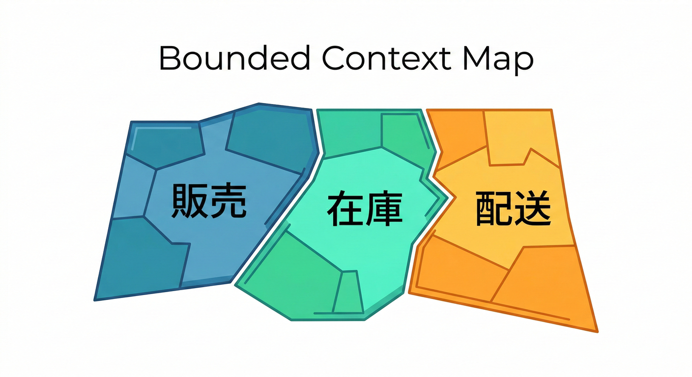
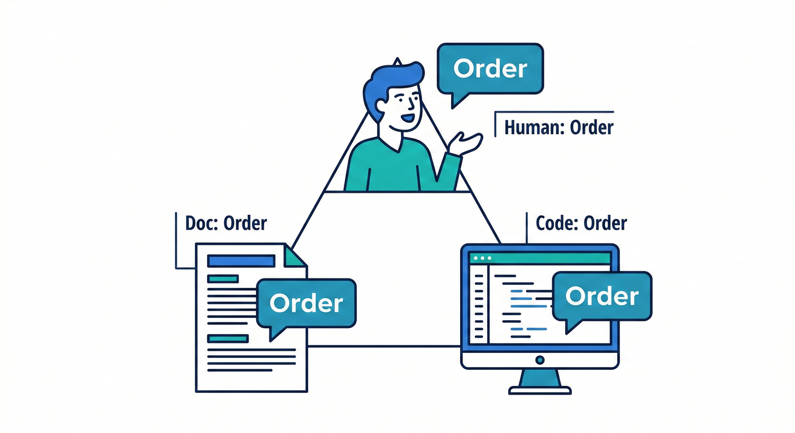
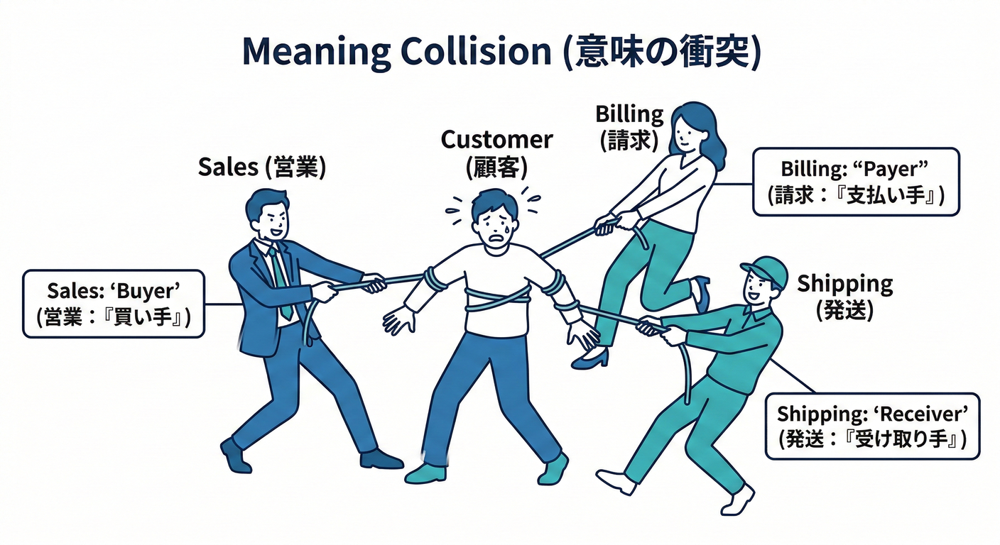
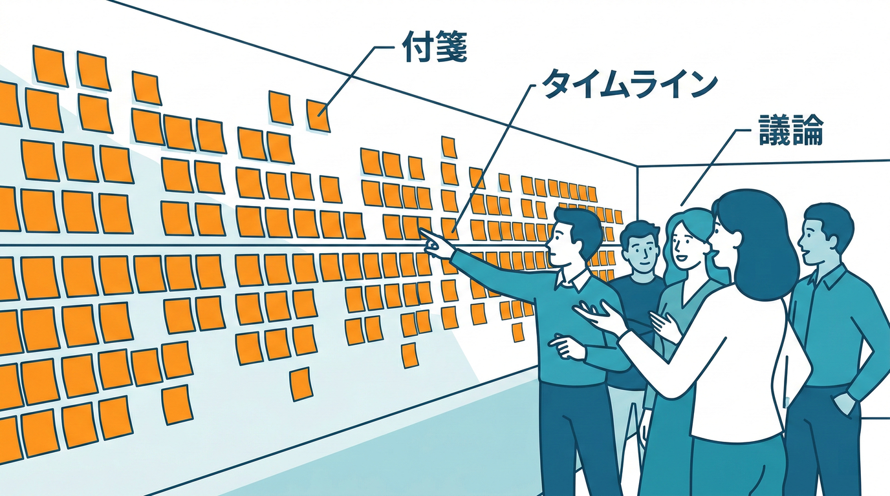
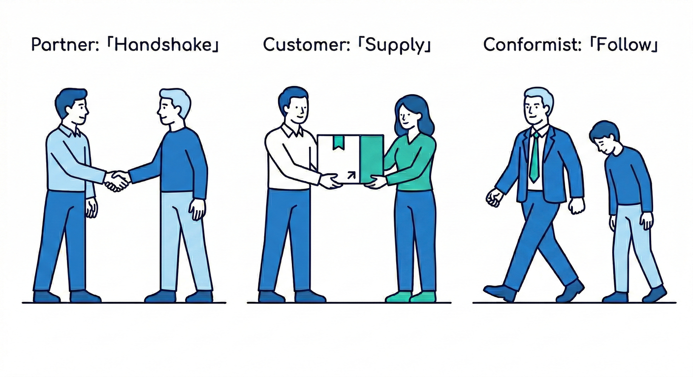
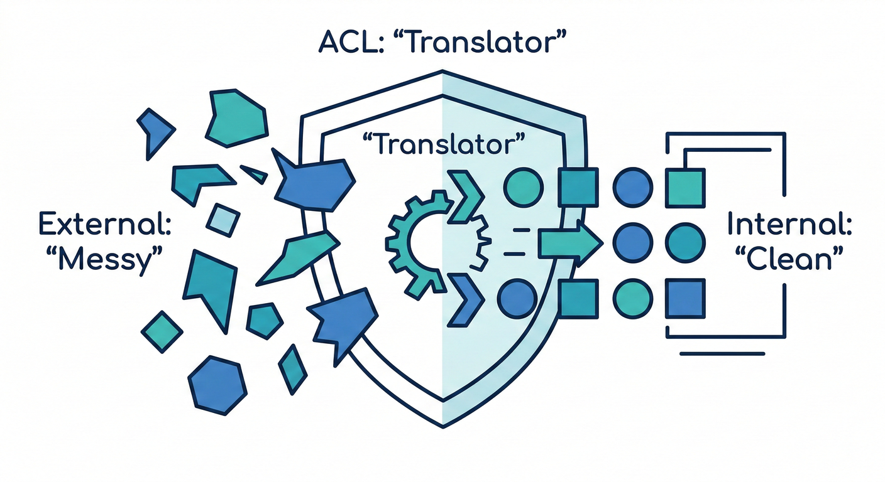
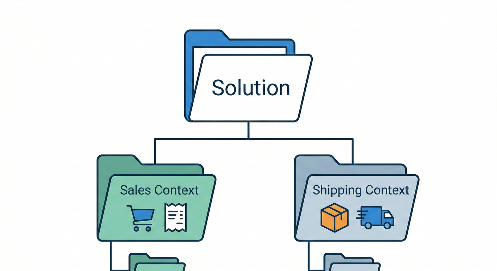

# 境界づけられたコンテキスト 40章アウトライン🗺️✨

## 全体の進め方（ざっくり）🧭✨

* 前半：**“なぜBCが必要か”**を体験で理解🔥
* 中盤：**“境界の見つけ方”**を手順で覚える🔍
* 後半：**“境界を守る実装”**をC#で形にする💻🔒
* 最後：**演習で1本つなげる**🎮✅

## Part 1：まず「境界」って何？（導入〜イメージづくり）🌱

### 第01章：この教材でできるようになること🎯

* ゴール：BCを見つけて、分けて、守れるようになる💪
* “設計こわい”を“設計たのしい”へ変える話😊
* 今日の学び方：例→気づく→手順→実装→演習📚✨

### 第02章：題材紹介（ミニECで進めるよ）🛒

* 登場する世界：注文・在庫・配送・請求📦💳🚚
* “同じ言葉”が衝突しやすい舞台になってるよ😵‍💫
* 章ごとに少しずつ改善していく流れ🌸

### 第03章：DDDの地図（超入門）🧭

* DDDって何のため？（業務の複雑さに勝つため）🧠
* DDDの中でBCはどこ？（“言葉の意味の範囲”担当）🗺️
* 深追いしない約束：今日はBCが主役👑

### 第04章：モデルって何？（クラス図じゃなくてOK）🧩

* モデル＝“業務の見方”をコードにしたもの👀
* ルール（制約）をコードの形で守るのが設計✨
* “データ袋”から一歩進む感覚🧺➡️🧠

### 第05章：ユビキタス言語って何？🗣️✨

* そのチーム/領域で通じる“同じ言葉”📖
* 仕様書より会話を大事にする理由💬
* 用語集（ミニ辞書）を作る準備📒

### 第06章：Bounded Contextを1行で言うと📝

* BC＝**言葉とモデルの意味が一貫する範囲**✅
* 境界の外では、同じ単語でも別物でOK🙆‍♀️
* “混ぜない勇気”が大事💪✨

---

## Part 2：衝突を体験して「必要性」を腹落ちさせる🔥

### 第07章：事故例①「顧客」が3人いる👤👤👤

* 会員としての顧客／請求先／配送先…別物だよね？
* 1つのCustomerに詰めるとどうなる？💥
* “意味のズレ”を言語化する練習🗣️

### 第08章：事故例②「注文」が部署で別物📦

* 受注・出荷・請求で“注文の定義”がズレる😇
* 状態（ステータス）を1本にすると地獄になる話🔥
* 何が混ざってるかをメモする📝

### 第09章：事故例③「万能Userクラス」爆誕💣

* プロパティ増殖・if増殖・影響範囲が読めない🙅‍♀️
* “便利そう”が一番危ない罠⚠️
* 責任が混ざる＝境界が無いサイン🚨

### 第10章：変更が怖くなる正体（設計初心者向け）😵‍💫

* 変更理由が違うものが同居すると壊れる💥
* テストが書けない/直せないが起きる理由🧪❌
* BCで「壊れる範囲」を狭める発想🛡️

---

## Part 3：境界の見つけ方（手順を覚えるゾーン）🔍✨

### 第11章：境界発見の全体手順（テンプレ）📌

* ①業務を言葉にする → ②イベントにする → ③固まりを見る
* ④関係性を描く → ⑤実装で守る
* 迷ったらこのチェックリストに戻る🔁

### 第12章：材料集め（業務を“会話”にする）💬

* 仕様を「誰が」「何を」「いつ」へ分解🧩
* 例：カスタマーが注文する→支払い→出荷…
* 文章を短くするだけで見える世界✨

### 第13章：イベントストーミング準備編🧰🌩️

* “イベント”＝起きた事実（過去形）📌
* 粒度の目安（細かすぎ問題を避ける）📏
* まずは10〜20個でOK👌

### 第14章：イベントストーミング実施編🧩🌩️

* イベントを時系列に並べる⏳
* 似たものを固める（グルーピング）🧺
* そこで使われる言葉を横に書く📝

### 第15章：読み取り編（境界の“匂い”を探す）👃🔍

* 固まりごとに“目的”が違うなら境界候補✅
* イベントの間が重い（調整・確認）が境界サイン⚡
* “衝突しそうな単語”に印を付ける🖊️

### 第16章：ズレ探しA「同じ単語・意味が違う」🧨

* 注文／顧客／金額／住所…同名異義を見つける🔍
* “誰の視点か”で意味が変わるよね👀
* 用語の衝突メモを作る📝

### 第17章：ズレ探しB「同じ意味・言い方が違う」🌀

* 例：会員IDと顧客番号、請求先と決済先…
* 同じものを別名で呼ぶと、統合で事故る😇
* 用語統一 or 境界分離の判断ポイント⚖️

### 第18章：ズレ探しC「データは似てるけど責務が違う」📦

* 住所＝配送の住所 vs 請求の住所（責任が違う）
* 金額＝注文合計 vs 請求金額（計算ルールが違う）
* “責任の違い”を言語化する練習🗣️

### 第19章：変更理由で切る（SoCの感覚）✂️

* どこが一番よく変わる？（割引、送料、在庫ルール）🔁
* 変更の波が違うなら分けると楽🌊
* “変更の波メモ”を作る📒

### 第20章：サブドメイン入門A（直感でOK）🧭🍰

* コア/支援/汎用のざっくり理解
* 何に力を入れるべきかが見える👀✨
* “全部コア”はだいたい嘘😇

### 第21章：サブドメイン入門B（BCとの関係）🔗

* サブドメインとBCは1対1じゃない🙅‍♀️
* まずは境界の候補を出す→後で整える👌
* チーム・リリース都合も境界に影響する🏃‍♀️

### 第22章：境界候補の絞り込みチェックリスト✅

* 用語が一貫してる？／責任が一貫してる？
* 変更の波は同じ？／テスト単位にできる？🧪
* “いったん仮置き”の勇気も大事🧡

---

## Part 4：境界を決める（粒度・共有・一貫性）📏🔒

### 第23章：粒度の基本（小さすぎvs大きすぎ）📏

* 小さすぎ：連携地獄😵‍💫／大きすぎ：衝突地獄💥
* “会話のまとまり”が最初の目安💬
* まずは3〜6個のBCが現実的👌

### 第24章：境界の命名ルール（ここ超大事）🏷️✨

* “注文BC”みたいな雑名は危険⚠️
* 役割が分かる名前にする（例：OrderManagementなど）
* 境界名＝会話の速さ🚀

### 第25章：共有DBが境界を壊す（超あるある）🧱💥

* 共有テーブル＝意味が混ざる近道😇
* “読めるけど触らない”ルールの考え方👀🔒
* まずは“所有者”を決める🏠

### 第26章：境界と一貫性（トランザクションの気持ち）🔁

* どこまでを“同時に正しい”にする？✅
* 境界をまたぐと“すぐ一致しない”が起きる🕒
* ユーザー体験として許せるズレを決める😊

### 第27章：ケーススタディでBC案を確定（仮でOK）🛒📦🚚

* 例：受注管理／在庫管理／配送管理（＋請求）
* 境界ごとの用語集（ミニ）を作る📒
* “ここから育てる”宣言🌱✨

---

## Part 5：Context Map（境界どうしの付き合い方）🗺️🤝

### 第28章：Context Mapとは？（描けるようになろう）🗺️

* BC同士の関係を1枚にする
* 依存の向きが見えると事故が減る✅
* “図にできない関係”はだいたい危険⚠️

### 第29章：関係A Customer/Supplier（供給と利用）🧑‍🤝‍🧑

* 供給側がルールを持つ／利用側が合わせる
* 仕様変更の影響を読む練習📖
* “誰が主導権？”を決める👑

### 第30章：関係B Conformist（合わせきる）🙇‍♀️

* “相手に合わせる”と割り切るパターン
* メリット：速い／デメリット：相手都合が刺さる⚡
* どこまで合わせるかの境界線📏

### 第31章：ACL入門A（なぜ必要？）🛡️

* 外部や別BCの“クセ”を中に入れない
* ドメインを守る防波堤🌊🧱
* “翻訳”って何を翻訳するの？📖

### 第32章：ACL入門B（どう作る？）🔧

* DTO⇔ドメイン型の変換
* 命名・単位・欠損値・真偽値の揺れを吸収
* 変換が肥大化したら設計見直しサイン🚨

### 第33章：ACL入門C（テスト＆運用）🧪

* ACLは壊れると連鎖するのでテスト重要✅
* “変換ルール”を仕様として固定する📌
* 変更通知が来たときのチェック手順🔁

### 第34章：Published Language（公開する言葉）📢

* 境界を越えるときの“契約の言葉”
* API/イベント/DTOの語彙を揃える🧾
* 後方互換の考え方を超入門で☘️

---

## Part 6：C#で境界を守る（Windows＋最新環境想定）💻🔒

### 第35章：プロジェクト構成A（まず置き場所）🏗️

* Visual Studioでソリューションを切る
* “BCごとにプロジェクト”の基本案📦
* まずはモジュラーモノリスでOK👌

### 第36章：プロジェクト構成B（参照ルールを固定）📐

* どこがどこを参照していい？（依存の向き）➡️
* “共通”プロジェクト乱立の危険⚠️
* 境界を守るための最小共通化🥺→控えめに！

### 第37章：namespaceとフォルダ設計（見ただけで分かる）📁✨

* Contextごとに名前空間を分ける
* “同名クラス禁止”で衝突を見える化👀
* 迷ったら「用語集」と一致させる📒

### 第38章：公開範囲で守る（public/internalの感覚）🔒

* 境界外に見せていいもの・ダメなもの
* “ドメイン型を持ち出さない”の基本姿勢🙅‍♀️
* 境界越えは契約（DTO）で📨

### 第39章：境界越えのデータ設計（DTOとバージョンの超入門）📦📨

* DTOを薄くするコツ（必要最小限）🥗
* 後方互換を壊さない追加の仕方➕
* “破壊変更”を避ける段取り（段階的に）🚧

### 第40章：総合演習（BC分割→Context Map→実装修正）🎮✅

* 分割前コードを読む（地雷探し）🧨
* BC案を決めて、用語集＆関係図を作る🗺️📒
* 実装を分割して、DTO/ACLで守る🔒
* テストで“境界が崩れてない”を確認🧪
* 最後にレビュー観点チェック✅（言葉の一貫性・依存の向き・共有の扱い）

---

## 各章に毎回つける「お助けAIプロンプト」例🤖✨（共通テンプレ）

* 「この文章から、同じ単語で意味が変わる箇所を列挙して」🔍
* 「イベント（過去形）として箇条書きにして」🌩️
* 「イベントの固まりごとに“目的”を1行で付けて」🏷️
* 「境界候補を3案出して、メリデメも書いて」⚖️
* 「DTOにするなら必要最小のフィールド案を出して」📨

---

必要なら次は、この40章をベースにして

* **各章：説明（やさしく）＋図（文章で）＋ミニ演習＋つまずきポイント**🧩
  まで“第1章から順に”本文化していけるよ😊✨
