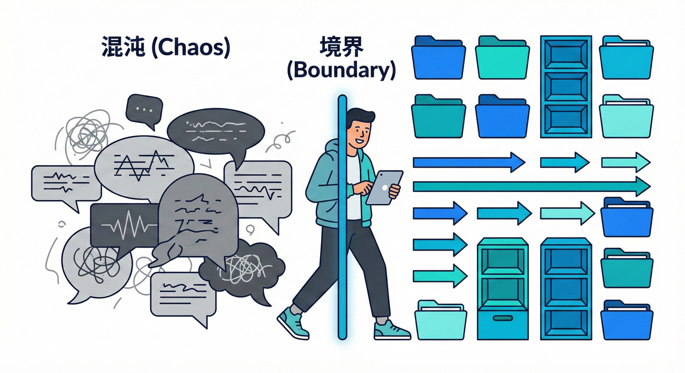
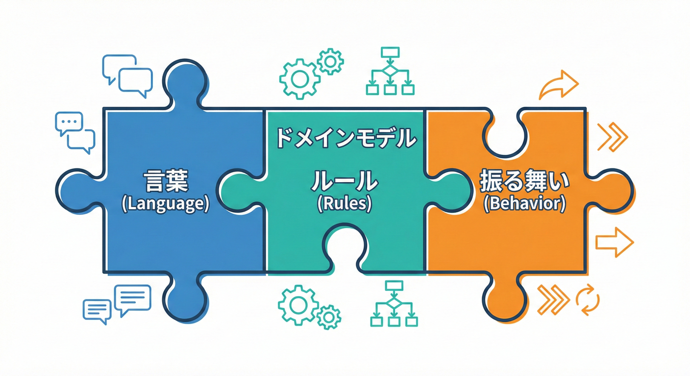
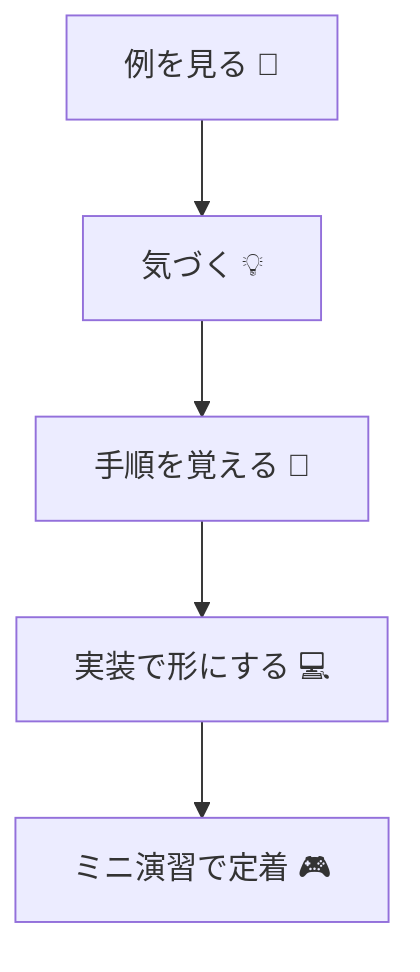

# 第01章：この教材でできるようになること🎯

## 1) この章のゴール（今日の到達点）✅😊

この章を終えたら、まずここまでできればOKだよ〜！🌸

* 「境界づけられたコンテキスト（Bounded Context / BC）」を **“学ぶ理由”** がふんわりじゃなく説明できる🗣️✨
* 40章の旅の全体像をつかんで、**迷子になりにくい** 状態になる🗺️🧭
* これから毎章やる **学び方の型**（例→気づく→手順→実装→演習）を覚える🔁📚
* “設計こわい😵‍💫” を “設計おもしろいかも😊” に変える、最初の一歩を踏み出す👣💖

---

## 2) この教材の最終ゴール（40章の終着点）🏁🎉

最終的に「BC」を使って、こんなことができるようになるよ💪✨

* 1つの業務（ミニEC）を、**“言葉の意味がぶつからない”** ように分けられる🧩🧠
* 分けた境界どうしの関係を、**Context Map** で説明できる🗺️🤝
* コードでも境界を守れる（依存の向き・公開範囲・DTO/ACL）🔒💻
* 変更が来ても、壊れる範囲を小さくして **直しやすくする** 🛠️✨

---

## 3) そもそも、BCを学ぶと何がうれしいの？😍

BCって、むずかしい理論というより **“トラブルを減らす境界線”** の話なんだ〜🚧✨

* 「同じ単語なのに意味が違う」せいで起きる事故を減らせる💥➡️😮‍💨
* 変更が怖いコード（どこに影響するか不明）を、怖くない方向にできる😵‍💫➡️😊
* チームで会話するとき、**言葉がスッと通る** ようになる🗣️💞
* テストも書きやすくなって、直すのが速くなる🧪⚡

---

## 4) この教材の「学び方の型」📌✨（ここ超大事！）

毎章だいたいこの流れで進むよ〜！🌈

1. **例を見る** 👀
   「ありがちなヤバい状態」をわざと見て、まず体験する🧨
2. **気づく** 💡
   「何が混ざってる？」「どこがつらい？」を言葉にする📝
3. **手順を覚える** 🧭
   “やり方のテンプレ” を持つ（迷ったら戻れる）🔁
4. **実装で形にする** 💻
   境界を “設計図だけじゃなくコード” にする🔒
5. **ミニ演習で定着** 🎮✅
   小さくやって「できた！」を積む💖

---

## 5) AI（コパイロット/コデックス）を“学習ブースト”にするコツ🤖💞

AIが使える環境だと、学習がめちゃ速くなるよ〜！🚀✨
ただし **“丸投げ”** じゃなくて、**“一緒に考える相棒”** にするのがコツ🧠🤝

* まず自分の言葉で「何が分からないか」を1行で言う🗣️
* AIには「定義して」「例を出して」「差分で直して」みたいに **お願いを具体化** する🧾✨
* 出てきた答えは、**なぜそうなる？** を1回は追問する🔍💬

GitHub の Copilot には、IDE内の提案（補完）やチャット（Copilot Chat）などの機能があり、IDEやターミナルなど色々な場所で使えるよ。([GitHub Docs][1])
Visual Studio の Copilot Chat は、チャット画面だけじゃなく **エディタ内（インライン）** でも質問→差分で適用、みたいな流れができるよ🧩✨([Microsoft Learn][2])

OpenAI の Codex IDE拡張もあって、VS Code系でサイドバーから使える感じだよ🧰✨ ただし Windows は “experimental” とされていて、Windowsでの体験を良くするなら WSL ワークスペース利用が案内されてるよ🐧🪟([OpenAI Developers][3])

---

## 6) “最新”の開発環境メモ（2026/2/2時点）🗓️✨

学習中に「私の画面と違う！」ってなったときのための目印だけ置いておくね📌

* Visual Studio 2026（安定チャネル）は **18.2.1（2026/1/20）** が掲載されてるよ🧰✨([Microsoft Learn][4])
* .NET は 2026年1月の更新で、例として **.NET 10.0.2 / 9.0.12 / 8.0.23** などが案内されてるよ🔧✨([Microsoft for Developers][5])
  （章が進んで実装するとき、ここがズレると “動かない😭” の原因になりがち！）

---

## 7) 今日のミニ演習：まずは「言葉がぶつかる感覚」を手に入れる🧠💥➡️🧘‍♀️

ここではまだBCを分けないよ！
**“ぶつかりポイントを見つける目”** を作る練習だよ👀✨

### 演習テーマ：ミニECの世界🛒📦

これから扱う世界には、ざっくりこういう登場人物/出来事があるよ〜！

* 注文する📝
* 在庫を引き当てる📦
* 配送する🚚
* 請求する💳

### ステップA：衝突しそうな単語を10個書く📝✨

例：

* 顧客 / 注文 / 住所 / 金額 / ステータス / キャンセル / 返品 / 支払い / 発送 / 在庫 …などなど

### ステップB：「同じ単語だけど意味が違いそう」を3つ選ぶ🎯

たとえば（まだ正解とかじゃないよ！）👇

* **住所**：配送先の住所？請求先の住所？🏠📮
* **金額**：注文合計？請求金額？割引後？💰🧾
* **顧客**：会員？配送先の人？請求先の名義？👤👤👤

### ステップC：それぞれに “別名” を付けてみる🏷️✨

例：

* 住所 → 「配送先住所」「請求先住所」
* 金額 → 「注文合計」「請求金額」
* 顧客 → 「会員」「配送先受取人」「請求先名義」

👉 ここで大事なのは **「混ざるとヤバそう」って気づけること**！💡😊

---

## 8) AIに手伝ってもらう用（コピペOKのプロンプト）🧠🤖✨

そのまま貼って使える形だよ〜！📋💞

* 「次の短い業務説明から、“同じ単語で意味が変わりそうな言葉” を列挙して。各 शब्द（用語）について、考えられる意味を2〜3個ずつ書いて：『（ここにミニECの説明文）』」🔍
* 「“住所”“金額”“顧客” みたいな衝突語を、衝突しない別名にリネーム案を10個出して。命名の意図も一言で」🏷️✨
* 「この用語リストを、会話で使いやすい “ミニ辞書” 形式に整形して」📒✨

---

## 9) よくあるつまずき（最初に知っておくと安心）🧸💡

* 「正しいBCを当てにいく」→ まだやらないでOK🙆‍♀️✨（まずは候補を出すだけ）
* 「クラス図が描けない」→ いらないよ〜！🧩（言葉の整理が先）
* 「DDD全部を理解しなきゃ」→ しなくてOK🙅‍♀️（この教材はBCが主役👑）

---

## 10) まとめ（今日持ち帰るもの）🎁✨

* BCは “難しい設計技法” というより、**言葉の意味が一貫する範囲を守る** 発想🌱
* まずは **衝突しそうな単語を見つける目** を作る👀✨
* 学び方は「例→気づく→手順→実装→演習」🔁📚

* AIは “答え製造機” じゃなくて、**気づきを増やす相棒** にする🤖💞

---

## 次章へのつなぎ🛒✨

次は、ミニECの題材をもう少し具体化して「どこで言葉が衝突しやすいか」をわざと見える化していくよ〜📦💳🚚

[1]: https://docs.github.com/en/copilot/get-started/features "GitHub Copilot features - GitHub Docs"
[2]: https://learn.microsoft.com/en-us/visualstudio/ide/visual-studio-github-copilot-chat?view=visualstudio "About GitHub Copilot Chat in Visual Studio - Visual Studio (Windows) | Microsoft Learn"
[3]: https://developers.openai.com/codex/ide/ "Codex IDE extension"
[4]: https://learn.microsoft.com/ja-jp/visualstudio/releases/2026/release-history "Visual Studio のリリース履歴 | Microsoft Learn"
[5]: https://devblogs.microsoft.com/dotnet/dotnet-and-dotnet-framework-january-2026-servicing-updates/ ".NET and .NET Framework January 2026 servicing releases updates - .NET Blog"
