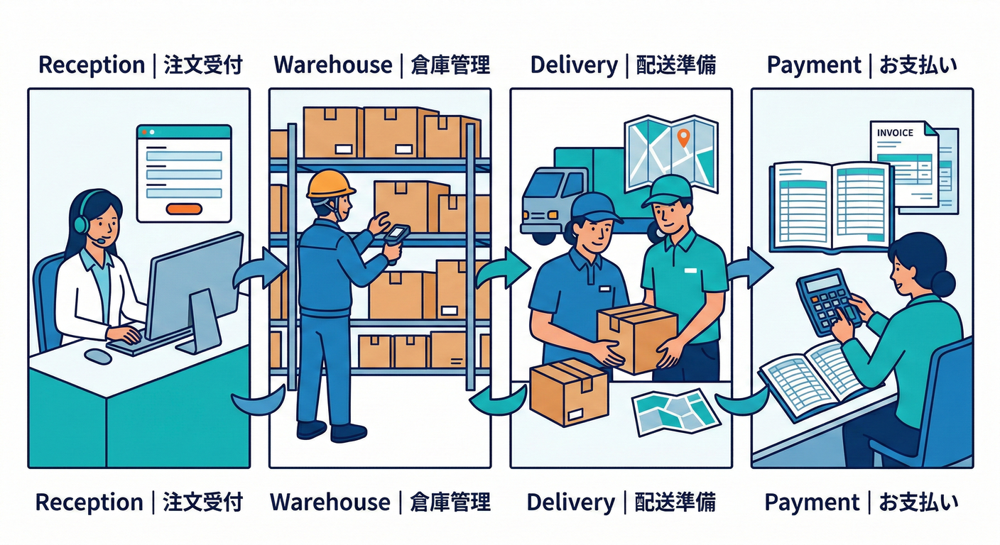
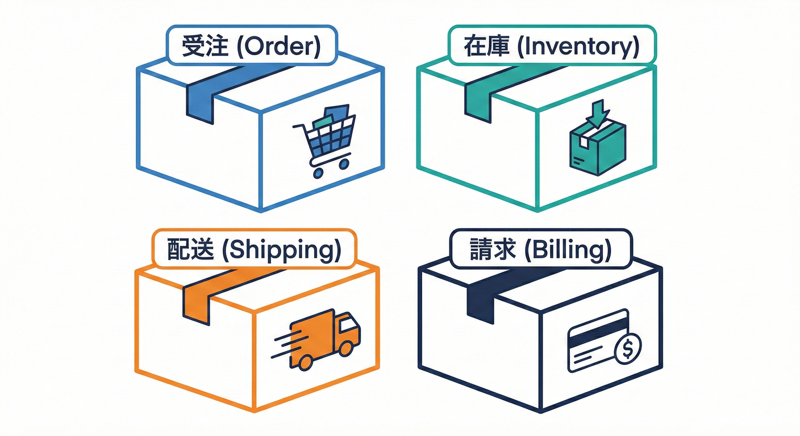
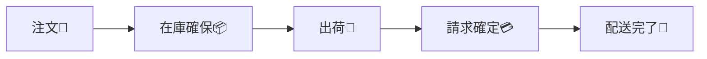
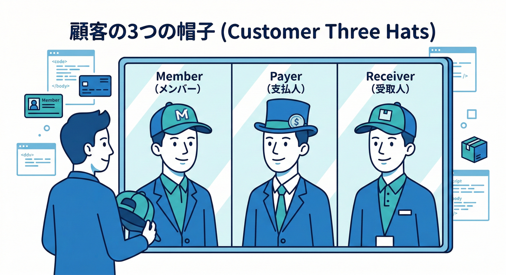
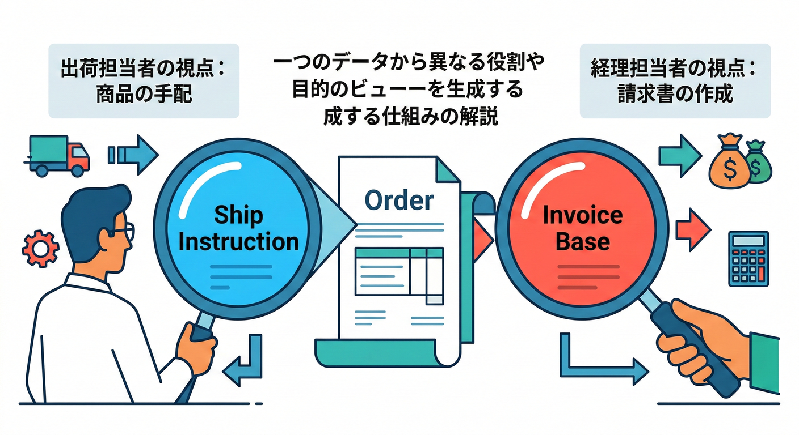
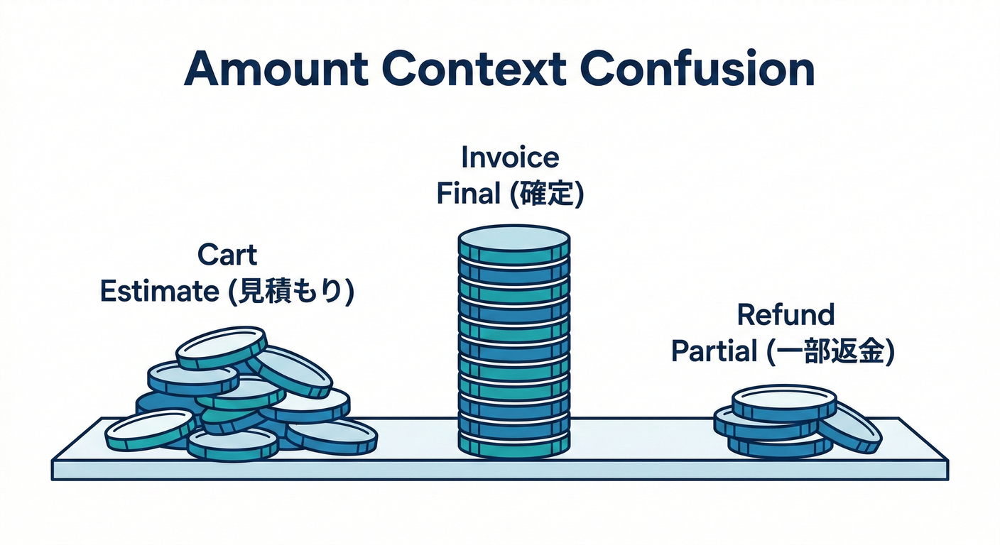
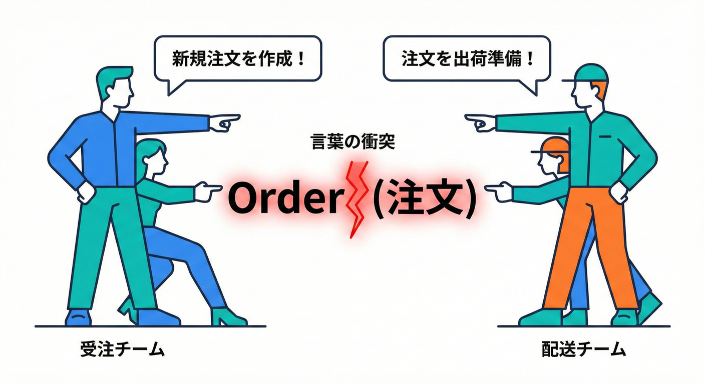
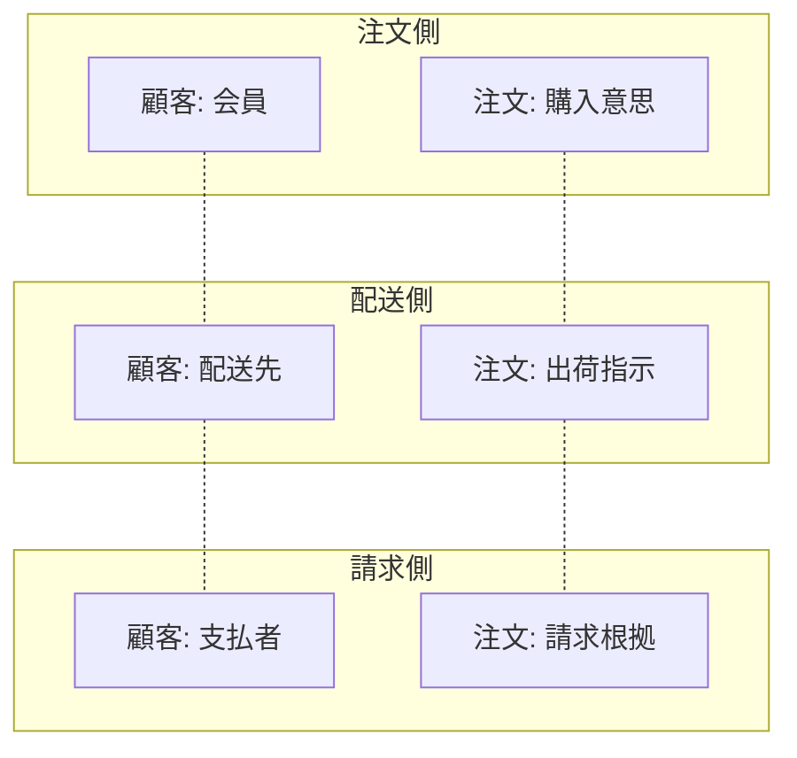
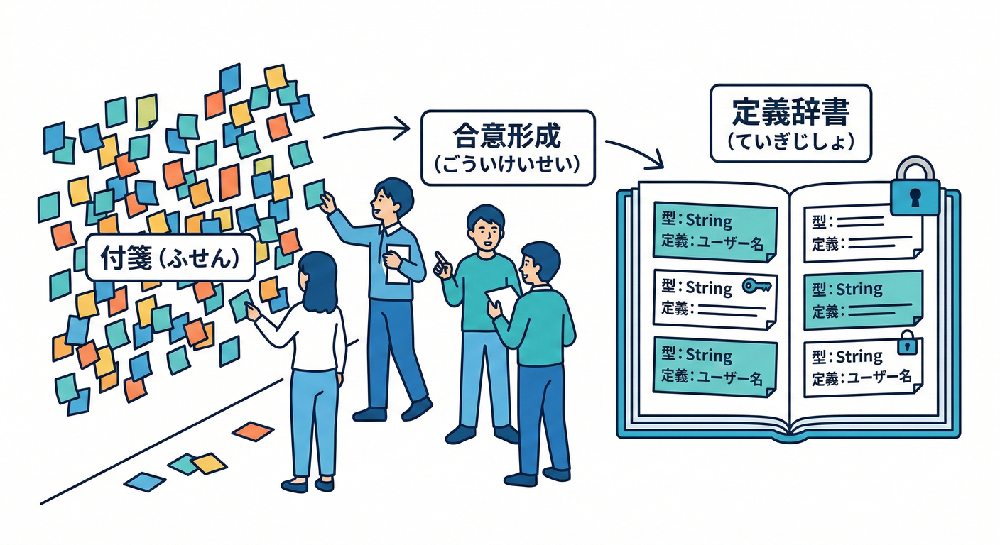
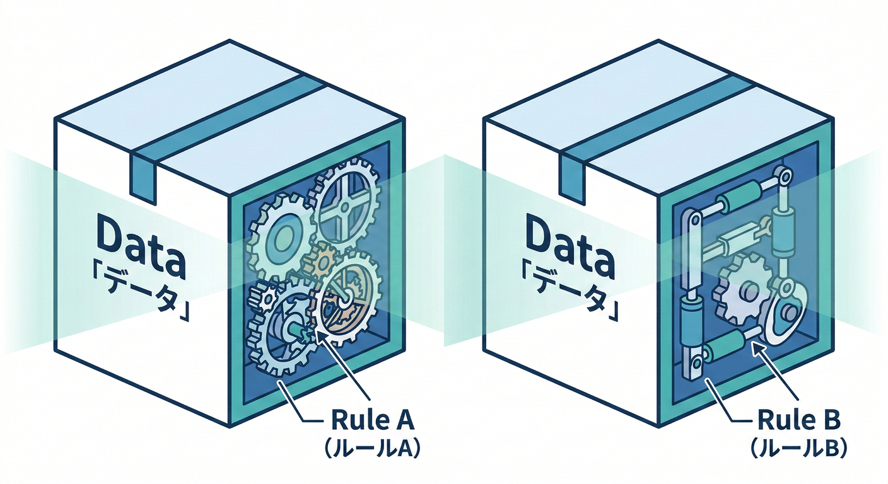

# 第02章：題材紹介（ミニECで進めるよ）🛒

## この章でわかること🎯

* この教材で使う **ミニECの世界**（注文・在庫・配送・請求）をつかむ📦💳🚚
* どうしてECは **「同じ言葉の衝突」** が起きやすいのかをイメージできる😵‍💫
* これからの章で、どんなふうに **少しずつ改善**していくのかが見える🌸

---

## 1. ミニECの世界観（ざっくりストーリー）📖🛍️

あなたは小さめの通販サイトを運営してる…という設定だよ😊
売ってるのはグッズでもお菓子でも何でもOK🍪🎁（中身は重要じゃない）

お客さんが「買う！」ってなると、裏側でこんなことが起きる👇



* 注文を受ける（注文受付）🧾
* 在庫を確保する（在庫引当）📦
* 送る準備をする（出荷・配送手配）🚚
* お金を確定する（請求・決済・入金）💳

…これ、全部ひとまとめに作ると **言葉が混ざりやすい** のがポイント⚠️
DDDでは、言葉とモデルの意味が一貫する範囲（＝境界）をはっきりさせて、大きいモデルを分けて扱うのが大事だよ📍🗺️ ([martinfowler.com][1])

---

## 2. 4つのエリア（この教材の主役たち）🎭✨



この教材では、ミニECを次の4エリアで見ていくよ👇

## 🧾 注文（Order / Order Management）

* お客さんがカートで買って、注文が作られるところ
* キャンセル、変更、注文状態の管理など

## 📦 在庫（Inventory）

* 倉庫に何個ある？取り置きできる？欠品は？
* 「在庫を減らす」タイミングのルールが重要

## 🚚 配送（Shipping / Delivery）

* いつ発送？どの便？追跡番号は？住所は正しい？
* 「出荷できる条件」が絡むと一気に難しくなる

## 💳 請求（Billing / Payment）

* 決済が成功した？請求は確定？返金は？
* 税・送料・割引など、お金の計算ルールが集まる

この4つは現実の会社でも担当が分かれやすくて、だからこそ **同じ単語が別の意味** になりがちなんだよね😇

---

## 3. いちばん基本の流れ（1本の線で見る）🧵✨

まずは「ECってこう動くよね！」を一本線で押さえよう👇


1. お客さんが注文する🛒
2. 注文内容を確定する（注文作成）🧾
3. 在庫を確保する（引当）📦
4. 出荷できるなら発送する🚚
5. 請求を確定して決済する💳
6. 配送完了📮✨



文章だけでもOKだけど、図っぽくするとこんな感じ👇

* **注文** → **在庫確保** → **出荷** → **請求確定** → **配送完了**
  （※実際は「決済→在庫」だったり、例外がいっぱいあるよ😵‍💫）

---

## 4. 「同じ言葉」が衝突しやすいポイント😵‍💫💥

DDDでよく言われるのが、**同じ言葉が複数の意味を持つと事故る** ってこと。だから「この言葉はこの範囲でだけこの意味ね！」を決めるのが大事だよ🗺️✨（それが境界づけの感覚） ([Rants on Software Design][2])

ここでは、ミニECで特に衝突しやすい単語を紹介するね👇

## 4.1 「顧客（Customer）」👤

* 注文側：「注文した人（会員）」
* 請求側：「お金を払う人（請求先）」
* 配送側：「荷物を受け取る人（配送先）」

ぜんぶ同じ「顧客」に見えるけど、**責任も必要情報も違う** のが罠😇



## 4.2 「注文（Order）」🧾

* 注文側：「購入意思が確定した1件」
* 配送側：「出荷指示の対象」
* 請求側：「請求・決済の根拠」

“注文の状態”も部署で違ったりするよね（例：請求はOKでも出荷はNGなど）🔥



## 4.3 「金額（Amount）」💰

* 注文側：「カート合計（見積り）」
* 請求側：「請求確定額（税・送料・割引が確定した結果）」
* 返金側：「返金対象額（条件で変わる）」

「金額」って言っても、どの金額！？ってなるやつ😵‍💫


どこの「同じ名前だけど、中身が違う」状態が、放っておくと大きな混乱を招くんだよね。😵‍💫



## 言葉が衝突すると、何が起きる？🧨
## 4.4 「住所（Address）」🏠

* 配送側：「荷物を届ける住所（配送ルールが絡む）」
* 請求側：「請求書の宛先（会計ルールが絡む）」

同じ形のデータでも、**責任が違う** のがポイント✨



---

## 5. “用語の衝突”を見える化してみよう👀🖊️

ここ、めちゃ大事だから表にするね📒✨

| 単語 | 注文の世界🧾 | 在庫の世界📦     | 配送の世界🚚 | 請求の世界💳 |
| -- | ------- | ----------- | ------- | ------- |
| 顧客 | 注文者     | （あまり主役じゃない） | 受取人     | 支払者     |
| 注文 | 注文レコード  | 引当の対象       | 出荷指示の対象 | 請求根拠    |
| 金額 | 見積り合計   | （基本持たない）    | 送料の条件   | 請求確定額   |
| 住所 | 変更可能な入力 | （基本持たない）    | 配送先住所   | 請求先住所   |

「同じ単語でも、意味が一貫する範囲（境界）が違う」って感覚がつかめればOKだよ🙆‍♀️✨
（この“意味が適用される範囲”をはっきりさせるのが境界づけの基本📍） ([Microsoft Learn][3])

---

## 6. この教材での“改善のしかた”（少しずつ育てる🌱）

この教材は、いきなり正解を当てにいかないよ😊
最初はわざと “よくある混ぜ方” をして、そこから直していく流れ🌸

## よくある最初の状態（混ざりがち）💣

* 1つの巨大なモデル（例：万能Order / 万能Customer）に詰め込む
* いろんな意味が同居して、変更が怖くなる😵‍💫
* “言葉のズレ” がテストや修正を苦しめる🧪💥

## ここからどう良くしていく？✨

* まず「起きた出来事（イベント）」を並べて、固まりを見つける🌩️
  （Event Stormingは、ドメインをみんなで探検するためのワーク手法として広く使われるよ🧭）

 ([VMware Blogs][4])
* 固まりごとに「この範囲ではこの言葉はこういう意味！」をそろえる📚✨
  （同じチーム内で使う言葉を、モデルに合わせて統一する考え方が有名だよ） ([Domain Language][5])
* そして境界をまたぐところは、契約（DTOなど）でやり取りして混ざりを防ぐ🔒📨

---

## 7. ミニ演習（5〜10分）📝✨

## 演習①：このECで起きる「出来事」を過去形で書いてみよう🌩️

例：「注文された」「在庫が引き当てられた」みたいに、**起きた事実**で！

* 5〜10個でOK👌
* 正解は1つじゃないよ🙆‍♀️

## 演習②：「注文」という言葉の意味を、2つに分けて説明してみよう🧾🧠

* 注文の世界の「注文」
* 配送の世界の「注文」
  それぞれ一文でOK✨

## 演習③：衝突しそうな単語に印をつけよう🖊️⚡

「顧客」「住所」「金額」「ステータス」などから3つ選んで、
“なぜ衝突しそうか” を一言で書いてみよう😊

---

## 8. 解答例（チラ見せ）👀✨

## 演習①の例🌩️

* 注文が作成された
* 決済が承認された
* 在庫が引き当てられた
* 出荷が指示された
* 追跡番号が発行された
* 配送が完了した
* 請求が確定した
* 返金が実行された（※返品がある場合）

## 演習②の例🧾

* 注文の世界：お客さんの購入意思が確定した1件
* 配送の世界：倉庫が出荷するために必要な指示の単位

---

## 9. つまずきポイント（ここで迷ってOK）😵‍💫🧡

* **「全部つながってるのに分けるの？」**
  → 分けるのは「意味」と「責任」。連携はするけど、混ぜないのがコツ🔒
* **「同じデータなのに別物なの？」**
  → 見た目が同じでも、守るルール（責任）が違うと別物になりやすいよ📦✨


* **「最初から境界を完璧に決めたい…！」**
  → 最初は仮でOK🙆‍♀️ “ズレが出る場所” を見つけたら勝ち🏁

---

## 10. お助けAIプロンプト🤖✨（コピペOK）

※そのまま貼って使えるよ💬

```text
あなたはDDDのファシリテーターです。
次の「ミニECの流れ」から、ドメインイベント（過去形）を10個まで箇条書きにしてください。
さらに、似ているイベントを3〜5個のグループに分け、各グループに「目的」を1行で付けてください。

【ミニECの流れ】
注文 → 在庫確保 → 出荷 → 請求確定 → 配送完了
```

```text
次の単語について、注文/在庫/配送/請求のそれぞれで「意味が変わる可能性」を指摘してください。
各コンテキストでの意味を1文ずつ、衝突ポイントを1文で書いてください。

【単語】
顧客、注文、金額、住所、ステータス
```

```text
次の表を作ってください：
列は「単語」「コンテキストAでの意味」「コンテキストBでの意味」「衝突すると起きる事故」「対策案」。
単語は「顧客」「注文」「金額」の3つでお願いします。
コンテキストは「注文」と「請求」で固定してください。
```

---

## まとめ🎀✨

ミニECは、注文・在庫・配送・請求が連携するぶん、**同じ言葉が別の意味になりやすい** 世界だよ🛒💥
だからこそ、意味が一貫する範囲（境界）を意識して、混ざりを防ぐのが大事になるの😊🗺️✨ ([Microsoft Learn][3])

[1]: https://www.martinfowler.com/bliki/BoundedContext.html?utm_source=chatgpt.com "Bounded Context"
[2]: https://vladikk.com/2016/04/05/tackling-complexity-ddd/?utm_source=chatgpt.com "Tackling Complexity in the Heart of DDD"
[3]: https://learn.microsoft.com/en-us/azure/architecture/microservices/model/domain-analysis?utm_source=chatgpt.com "Using domain analysis to model microservices"
[4]: https://blogs.vmware.com/tanzu/event-storming/?utm_source=chatgpt.com "Event Storming - Tanzu"
[5]: https://www.domainlanguage.com/wp-content/uploads/2016/05/DDD_Reference_2015-03.pdf?utm_source=chatgpt.com "Domain-‐Driven Design Reference"
