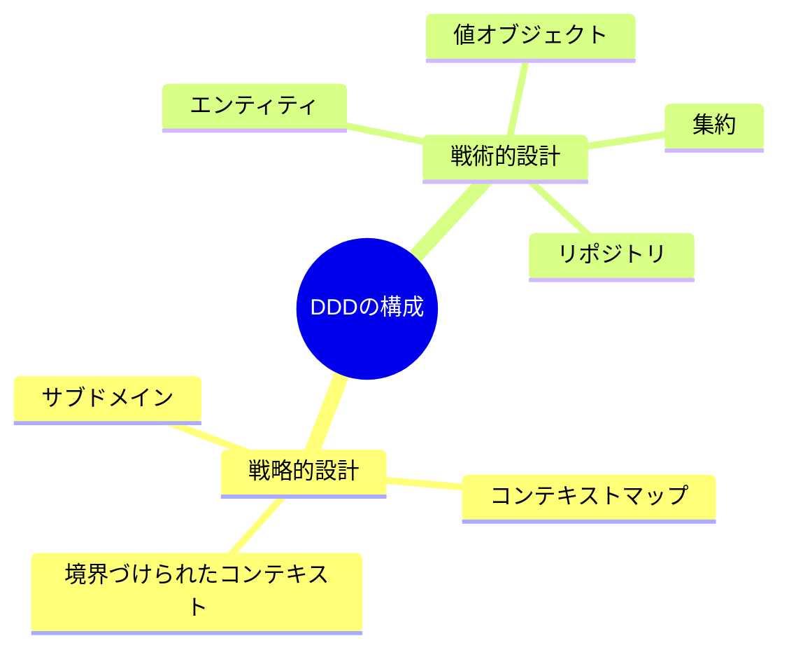
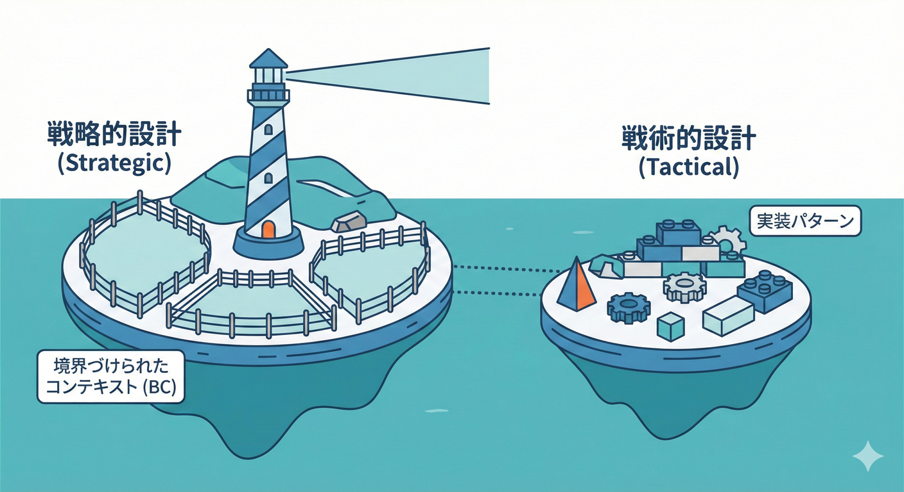

# 第03章：DDDの地図（超入門）🧭

## この章でつかむこと🎯💡

* DDDが「何と戦うための考え方」なのかがわかる🧠⚔️
* DDDの全体像（地図）を1枚でイメージできる🗺️✨
* Bounded Context（BC）がDDDのどこ担当なのかが腹落ちする👑🔍

---

## 1) DDDって何のため？🧩💥

DDD（ドメイン駆動設計）は、ざっくり言うと
**「業務がややこしいときに、ソフトを壊れにくく育てるための設計の考え方」**だよ🌱💻

たとえばECだと👇

* 「注文」って一言でも、部署や画面で意味が変わる📦😵‍💫
* 「顧客」も “会員” なのか “請求先” なのか “配送先” なのかで別モノ👤💳🚚
* ルール（割引・在庫・配送）も頻繁に変わる🔁⚡

こういう “意味のズレ” が増えてくると、コードがだんだん👇みたいになるの🧨

* 1つのクラスが万能化（if地獄）💣
* 変更すると別の画面が壊れる😇
* 「この言葉って結局どれ？」が増える🌀

DDDは、ここに真正面から勝ちにいくための地図🗺️🔥

---

## 2) DDDの地図：大きく2つに分かれるよ🗺️✌️

DDDはよく **2つの領域** に分けて説明されるよ👇

## A. 戦略（Strategic Design）🧭🏰

「**大きい話**」担当✨

* **どこで意味が変わる？（境界はどこ？）**
* **チームやシステムをどう分ける？**
* **境界どうしはどう付き合う？**

ここに **Bounded Context（BC）** がいるよ👑🔍
BCは、DDDの戦略パートのど真ん中の主役級✨（後で詳しく！）

## B. 戦術（Tactical Design）🛠️🧱

「**コードの中身の話**」担当💻✨

* Entity / Value Object / Aggregate…みたいな、コードの型やルールを整える話

でも！この教材はまず **BCが主役**だから、戦術は深追いしないよ🚫🏃‍♀️💨
（戦術が必要になる場面は後半で “必要な分だけ” 触れるよ👌）

※ DDDの出発点として有名なのが Domain-Driven Design: Tackling Complexity in the Heart of Software（Eric Evans）だよ📚✨（概念の整理に役立つ定番！）

---

## 3) じゃあBCはDDDのどこ？👑🗺️

## BCの担当はこれ！👇✨

**「言葉とモデルの “意味が一貫する範囲” を決める」**📝✅

イメージはこんな感じ🌈

* **同じ単語でも、BCが違えば別モノでOK**🙆‍♀️
* **BCの中では、その単語の意味をブレさせない**🧠🔒

Martin Fowler も、BCをDDDの中心パターンとして説明していて、
「大きいモデルをBCに分けて、関係性を明確にする」ことが重要だよ〜って話してるよ📌🗺️([martinfowler.com][1])

---

## 4) “地図”を一枚で：DDDとBCの位置関係🗺️✨

文章で図にするとこんな感じ👇

* DDD（全体）

  * 戦略（Strategic）🧭

    * **Bounded Context（境界を決める）**👑
    * Context Map（境界同士の関係を描く）🗺️🤝
    * サブドメイン（力を入れる場所の見分け）🎯
  * 戦術（Tactical）🛠️

    * コードでルールを守る型（Entityなど）🧱

この教材はまず「戦略のBC」を最優先でやるよ🔥
だってBCが決まってないと、戦術をがんばっても混ざりやすいから😇🌀

---

## 5) ミニECで体感：同じ「注文」が3種類ある話📦📦📦

たとえば「注文」という単語が出てきたとして…👀

## ① 受注管理の「注文」🛒

* お客さんが買う行為
* カート・注文確定・キャンセル
* 割引やクーポンが絡む🎟️✨

## ② 出荷/配送の「注文」🚚

* 送るための指示
* 梱包・出荷・追跡番号
* 配送先住所が超大事🏠📦

## ③ 請求の「注文」💳

* お金の請求の根拠
* 請求金額・税・支払い状況
* 締め日・返金・請求書番号📄💡

ここで大事なのは👇
**「注文」という日本語が同じでも、見てる世界が違う＝意味が違う**ってこと😵‍💫
だから **BCを分ける** と、混ざらなくなる🧠🔒

---

## 6) BCを分けると、何が嬉しいの？🎁✨

## ✅ 嬉しいこと①：会話がスムーズになる💬🚀

* 「注文」って言ったら、今どの意味？が減る
* 仕様の確認が速くなる📌

## ✅ 嬉しいこと②：壊れる範囲が小さくなる🛡️

* 請求の仕様変更で、配送画面が壊れる…が減る
* テストも “この範囲だけ” で考えやすい🧪✨

## ✅ 嬉しいこと③：チーム分割やリリースにも強い🏃‍♀️🏃‍♂️

* 境界があると、並行作業がしやすい
* 依存関係の向きも整理しやすい➡️

---

## 7) この章では「深追いしない」約束🤝🌸

ここでいったん線引き！✂️✨
この章は **DDDの地図** が目的だから、次は一旦お休み👇

* Aggregateって何？（今は保留）🧱⏸️
* Repositoryの正解は？（今は保留）📦⏸️
* CQRSやイベントソーシング？（今は保留）🌩️⏸️

今は **「BC＝言葉の意味の範囲」** だけ、強く持ち帰ろう💪👑

---

## 8) ミニ演習：衝突しそうな単語を探してみよう🔍📝

ミニECの文章を想像してね👇（頭の中でOK！）🧠✨
「注文が確定したら、在庫を引き当てて、出荷して、請求を立てる」

## ステップ🌸

1. 単語を5〜8個抜き出す（例：注文、顧客、住所、金額、在庫…）📝
2. それぞれに「誰の視点？」を3つくらい当ててみる👀
3. “意味が変わりそう” なら **★マーク** をつける⭐
4. ★が多い単語は、BCで分ける候補になりやすい👑✅

## 目安✅

* ★が付く＝同名異義になりやすい
* “計算ルールが違う金額” とかは特に匂い強い👃⚡

---

## 9) お助けAIプロンプト（コピペOK）🤖✨

開発中のチャット（IDE内のAIでもOK）に、こんな感じで投げると便利だよ💬✨
※ GitHub や OpenAI 系のAI支援はIDE統合が進んでるので、文章整理の相棒にしやすいよ🧠💻([The GitHub Blog][2])

* 「この文章に出てくる単語で、部署によって意味が変わりそうなものを列挙して。理由も添えて」🔍
* 「“注文”という単語の意味が変わりそうな視点を3つ出して、別名案も出して」🏷️
* 「イベント（過去形）にして10個に分解して」🌩️
* 「衝突してる用語を “受注/配送/請求” の3つにグルーピングして」🧺

---

## 10) 章末チェック（3問クイズ）🧠✅

## Q1：BCの役割をひとことで言うと？📝

→ **言葉とモデルの意味が一貫する範囲を決めること**👑✅

## Q2：同じ単語が、BCをまたいだらどうなる？🌀

→ **同じ単語でも別物でOK**🙆‍♀️（ただし混ぜない！🔒）

## Q3：DDDの地図でBCはどっち側？🧭🛠️

→ **戦略（Strategic Design）側**🧭✨([martinfowler.com][1])

---

## 11) 現代C#開発の小ネタ（最新環境の空気感）💻✨

DDDそのものは言語やIDEに依存しない考え方だけど、実務では環境が進化してるよ🚀
たとえば **.NET 10 はLTSとして 2025-11-11 リリース**で、2028-11-14までサポートの枠が見えるのが嬉しいポイント📅🛡️([Microsoft][3])
そして **Visual Studio 2026** のリリースノートも公開されていて、AI支援（Copilot統合など）も前提にした開発が当たり前になってきてるよ🤖✨([Microsoft Learn][4])

---

## まとめ🌸✨

* DDDは「業務の複雑さ」に勝つための地図🗺️🔥
* 地図はざっくり **戦略（境界を決める）** と **戦術（コードを整える）** に分かれる🧭🛠️
* BCは戦略の中心で、**“言葉の意味が一貫する範囲”** を作るのが仕事👑✅

次章は「モデルって何？」へ進んで、**“業務の見方をコードにする感覚”** をつかむよ🧩👀

[1]: https://www.martinfowler.com/bliki/BoundedContext.html?utm_source=chatgpt.com "Bounded Context"
[2]: https://github.blog/changelog/2025-12-03-github-copilot-in-visual-studio-november-update/?utm_source=chatgpt.com "GitHub Copilot in Visual Studio — November update"
[3]: https://dotnet.microsoft.com/en-us/platform/support/policy/dotnet-core?utm_source=chatgpt.com "NET and .NET Core official support policy"
[4]: https://learn.microsoft.com/en-us/visualstudio/releases/2026/release-notes?utm_source=chatgpt.com "Visual Studio 2026 Release Notes"
