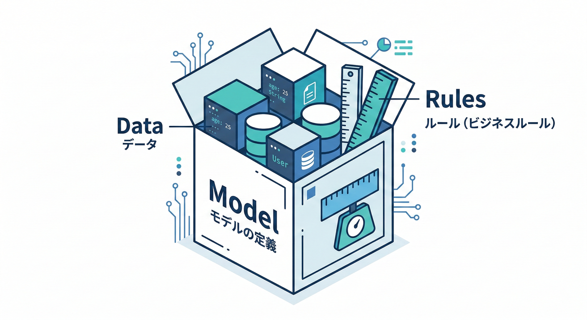
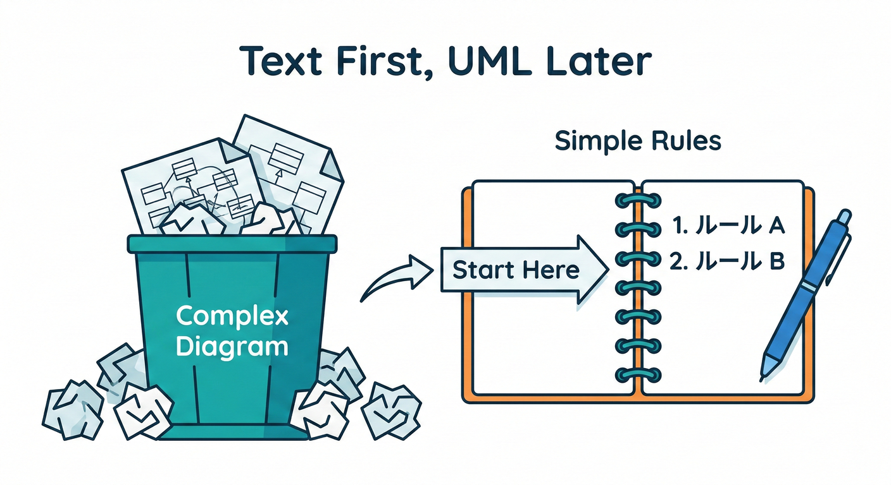
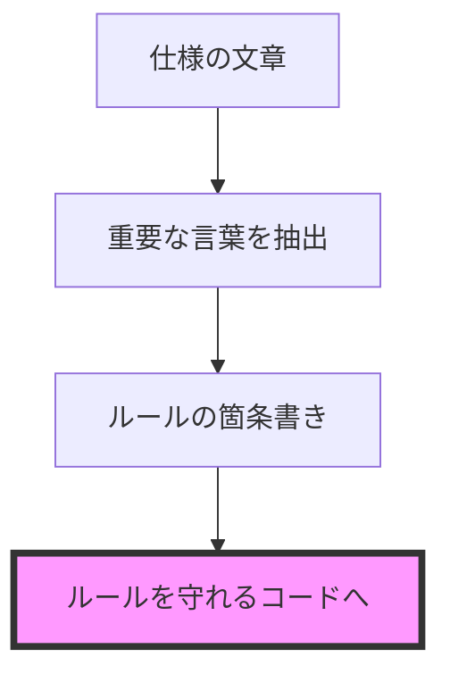
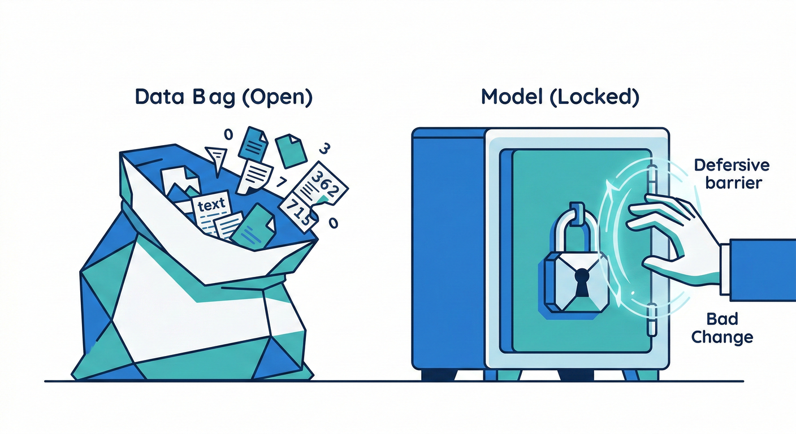
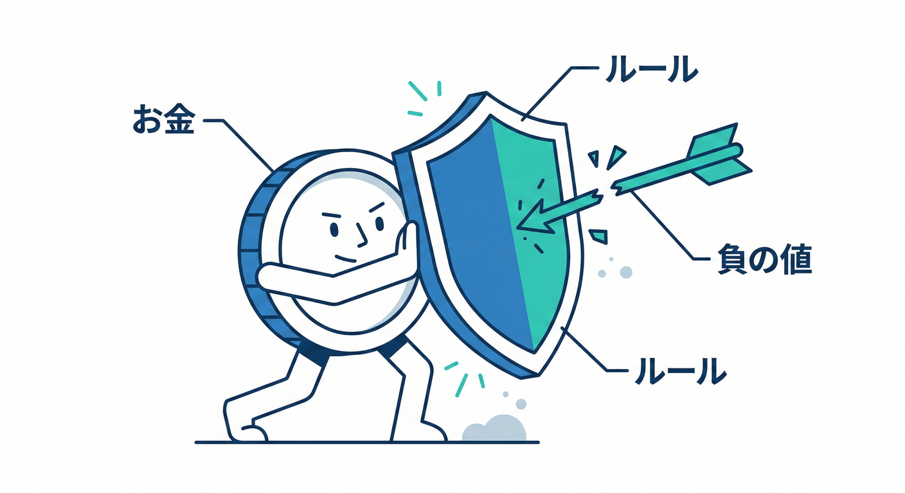
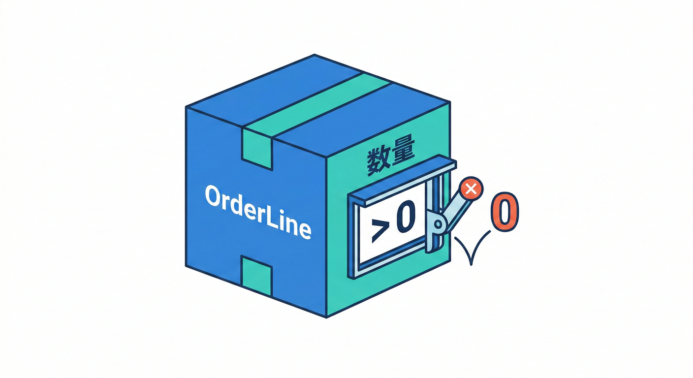
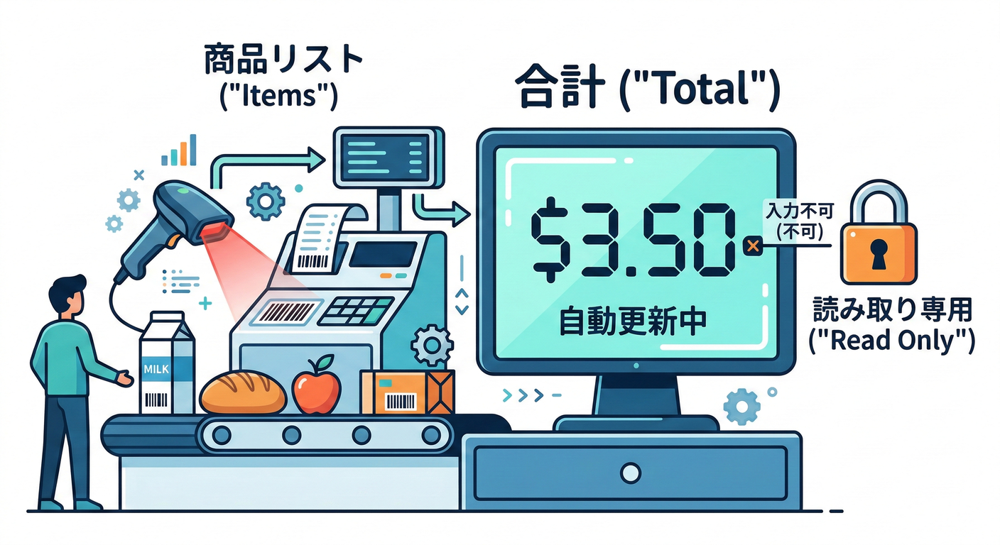
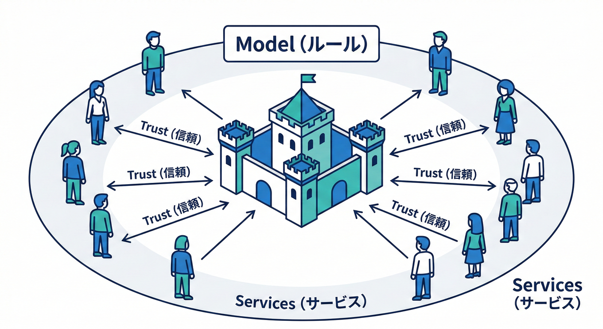
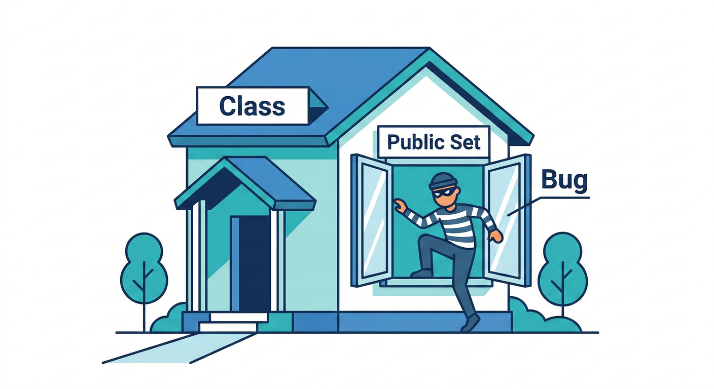

# 第04章：モデルって何？（クラス図じゃなくてOK）🧩

## この章でわかること🎯

* **モデル**って、ただの「クラス」や「データの形」じゃなくて、**業務の見方（ルール込み）**だよ〜！👀✨
* 「プロパティを並べるだけ」から一歩進んで、**ルールを守れるコード**にしていく感覚がつかめるよ💪💖
* 後の章で出てくる **ユビキタス言語**や **Bounded Context** の土台になるよ🗺️🌱

---

## 1) そもそも「モデル」って何？🧠✨

モデル＝**“業務の見方”を、言葉とルールごとコードにしたもの**だよ🧩


つまり「データの入れ物」だけじゃなくて、**その世界での正しさ（制約）**も一緒に持つのがポイント！✅

たとえば、ミニECなら🛒

* 注文は **0個の商品で成立しない** 🙅‍♀️
* 数量は **1以上** 📦
* 金額は **マイナスにならない** 💰
* 状態は **勝手に飛ばない**（例：未払い→発送済みはダメ）🚚⚠️

こういう「当たり前」を、**人の注意力**じゃなくて **コードの仕組み**で守るのが、モデルの役目だよ😊✨
ポイントは、**「どれか1つでも抜けたら、それはただのデータ構造だよ」**ってこと！✅


## 4) ミニECの「配送先」で見比べてみよう🛒🚚

---

## 2) 「クラス図」じゃなくてOKな理由📌

クラス図（UML）って、描けたら便利だけど…
**最初から図で固めようとすると、だいたい事故る**ことが多いよ😇💥



理由はカンタン👇

* まず大事なのは **“何が正しいか（ルール）”** ✅
* 図は「形」は見えるけど、**ルールの気持ち**が抜けやすい🥺
* だから最初は、**文章→ルール→コード**でOK！

---

## 3) モデルを作るコツは「3点セット」🧺➡️🧠✨


モデルはこの3つがそろうと強いよ💪

1. **言葉（用語）**🗣️
2. **ルール（制約）**📏
3. **振る舞い（やり方）**🎮

文章で図にするとこんな感じ👇

* 仕様（文章）📝
  ↓
* 重要な言葉を拾う🗣️（注文、商品、数量、金額…）
  ↓
* ルールを箇条書きにする✅（数量は1以上、注文は空NG…）
  ↓
* ルールを守れる形でコードにする💻🔒



---

## 4) 「データ袋」から一歩進む🧺➡️🧠✨

## ❌ よくある“データ袋”スタイル（つらい）😵‍💫



* `public set;` だらけで、どこからでも値が書き換えできる
* ルールは画面側やサービス側の `if` に散らばる
* 気づいたら「正しくないデータ」が混入する💥

## ✅ “モデル”スタイル（強い）🛡️✨

* **作る瞬間にチェック**して、不正なら止める✋
* **変更ルートを限定**して、勝手に壊せないようにする🔒
* ルールが「コードの中心」に集まる🧠✨

---

## 5) ミニECで体験：注文モデルを作ってみよ🛒📦✨

ここでは「注文（Order）」を題材にするよ😊
まず、ルールをメモしよう📝✨

## 注文のルール例✅

* 注文は **明細が1件以上**必要
* 明細の数量は **1以上**
* 価格は **0以上**
* 合計金額は **各明細の合計**で決まる（勝手に手入力しない）💰

---

## 6) C#で「ルールを守れるモデル」例💻🔒

## (A) 値をそのまま `decimal` にしない：Money を作る💰✨

金額って、ただの数じゃなくて「意味」があるよね😊
だから **Money** みたいな “意味つきの型” にすると、ミスが減るよ🛡️



```csharp
public readonly record struct Money(decimal Amount, string Currency)
{
    public Money
    {
        if (Amount < 0) throw new ArgumentOutOfRangeException(nameof(Amount), "金額は0以上だよ🫶");
        if (string.IsNullOrWhiteSpace(Currency)) throw new ArgumentException("通貨は必須だよ🪙", nameof(Currency));
    }

    public static Money Zero(string currency) => new(0, currency);

    public Money Add(Money other)
    {
        if (Currency != other.Currency) throw new InvalidOperationException("通貨が違う金額は足せないよ💥");
        return new Money(Amount + other.Amount, Currency);
    }
}
```

> ちなみに今どきの **C# 14 は .NET 10 以降でサポート**されてるよ📌（言語バージョンの対応表が公式にまとまってる）([Microsoft Learn][1])

---

## (B) 注文明細：OrderLine（数量ルールを閉じ込める）📦✨

```csharp
public sealed class OrderLine


{
    public string ProductId { get; }
    public int Quantity { get; private set; }
    public Money UnitPrice { get; }

    public OrderLine(string productId, int quantity, Money unitPrice)
    {
        if (string.IsNullOrWhiteSpace(productId)) throw new ArgumentException("商品IDは必須だよ🏷️");
        if (quantity < 1) throw new ArgumentOutOfRangeException(nameof(quantity), "数量は1以上だよ📦");
        ProductId = productId;
        Quantity = quantity;
        UnitPrice = unitPrice;
    }

    public Money Subtotal()
        => new Money(UnitPrice.Amount * Quantity, UnitPrice.Currency);

    public void ChangeQuantity(int newQuantity)
    {
        if (newQuantity < 1) throw new ArgumentOutOfRangeException(nameof(newQuantity), "数量は1以上だよ📦");
        Quantity = newQuantity;
    }
}
```

---

## (C) 注文：空の注文を禁止＆合計は計算で作る🛒💰✨

```csharp
public sealed class Order
{
    private readonly List<OrderLine> _lines = new();

    public string OrderId { get; }
    public IReadOnlyList<OrderLine> Lines => _lines;

    public Order(string orderId)
    {
        if (string.IsNullOrWhiteSpace(orderId)) throw new ArgumentException("注文IDは必須だよ🧾");
        OrderId = orderId;
    }

    public void AddLine(OrderLine line)
    {
        _lines.Add(line);
    }

    public void EnsureValid()
    {
        if (_lines.Count == 0) throw new InvalidOperationException("注文は明細が1件以上必要だよ🛒💥");
    }

    public Money Total(string currency)
    {
        EnsureValid();
        var total = Money.Zero(currency);
        foreach (var line in _lines)
        {
            total = total.Add(line.Subtotal());
        }
        return total;
    }
}
```

ここが大事だよ〜！💡

* 合計を `public set;` で持たない
* **合計は“計算で決まる”**にする（手入力NG）🙅‍♀️💰


  → こうすると「矛盾」が入りにくい✨

---

## 7) 「モデルが守る」ってこういうこと🛡️✨

モデルがあると、こうなるよ👇

* **間違った値が入る前に止まる**✋💥
* ルールが「1か所」に集まる🧠
* 読む人が「この世界の正しさ」を理解しやすい📖✨

逆に、ルールが外に散ってると…



* 画面Aはチェックしてるけど画面Bは忘れてた😇
* バッチ処理が素通しして壊れた💥
  みたいな“あるある事故”が起きるよ〜😭

---

## 8) ミニ演習🎮✅（手を動かすと一気にわかる！）

## 演習1：ルールを日本語で3つ書く📝✨

次の仕様から、**ルール（制約）**を3つ抜き出してね👇

* 「注文は商品明細が必要」
* 「数量は1以上」
* 「金額は0以上」
* 「通貨が違う金額は合算しない」

✅ できたら、「そのルールを**どのクラスに置く？**」も考えてみよ🧠💖
（例：数量ルール→OrderLine、通貨ルール→Money）

---

## 演習2：不正データを入れて、止まるのを確認🧪💥

* 数量0で `OrderLine` を作る
* マイナス金額で `Money` を作る
* 通貨が違う `Money` を足す

「ちゃんと例外で止まる」＝**モデルが守れてる**だよ✅✨

---

## 9) つまずきポイント集🧯😵‍💫

## つまずき①：とりあえず全部 `public set;` にしちゃう🔓



→ **壊し放題**になっちゃうよ💥
**変更はメソッド経由**にして、入口を絞ろう🔒✨

## つまずき②：ルールを全部サービス層の `if` に置く🌀

→ ルールが散って、把握できなくなる😇
**ルールは、その意味の持ち主（MoneyやOrderLine）に寄せる**とスッキリするよ🧠✨

## つまずき③：「モデル＝クラスの一覧」だと思う📚

→ 一覧より大事なのは **“正しさが守れるか”** ✅
プロパティより先に、**ルールの箇条書き**が超効く📝✨

---

## 10) お助けAIプロンプト例🤖✨（この章専用）

* 「この仕様から “名詞（モデル候補）” と “ルール（制約）” を分けて箇条書きにして📝」
* 「数量・金額・通貨のルールを守れる C# の型（Value Object）案を出して💰🪙」
* 「“合計金額は計算で決まる” を壊しにくい Order 設計にして。サンプルコードも💻🔒」
* 「不正ケース（数量0、負の金額、通貨違い）をテストするコードを書いて🧪✨」

---

## ちょい最新メモ📌✨

* **C# 14 の新機能まとめ**は公式に整理されてるよ🧁([Microsoft Learn][2])
* **Visual Studio 2026** も公式リリースノートが更新されてるよ🧰✨([Microsoft Learn][3])
* **.NET 10（LTS）** のサポートや最新パッチ情報は公式ポリシーで追えるよ🛡️([dotnet.microsoft.com][4])

[1]: https://learn.microsoft.com/en-us/dotnet/csharp/language-reference/language-versioning?utm_source=chatgpt.com "Language versioning - C# reference"
[2]: https://learn.microsoft.com/en-us/dotnet/csharp/whats-new/csharp-14?utm_source=chatgpt.com "What's new in C# 14"
[3]: https://learn.microsoft.com/en-us/visualstudio/releases/2026/release-notes?utm_source=chatgpt.com "Visual Studio 2026 Release Notes"
[4]: https://dotnet.microsoft.com/en-us/platform/support/policy/dotnet-core?utm_source=chatgpt.com "NET and .NET Core official support policy"
