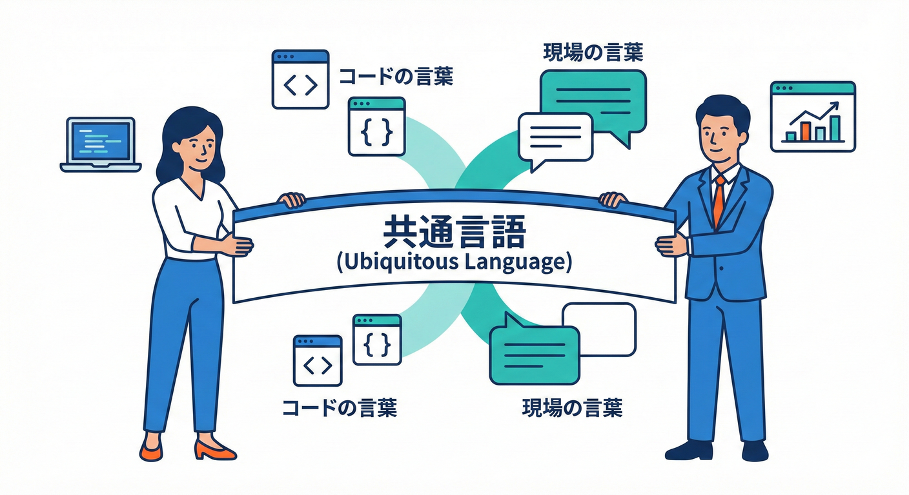
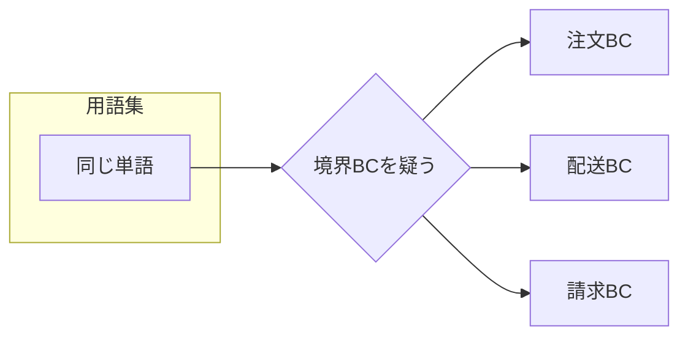

# 第05章：ユビキタス言語って何？🗣️✨

## 0. 今日のゴール🎯✨

* 「ユビキタス言語（Ubiquitous Language）」＝**チーム内で“同じ意味”で通じる共通語彙**だと説明できる😊
* ミニEC（注文・在庫・配送・請求）を題材に、**用語集（ミニ辞書）を1枚作れる**📒✨
* 「同じ単語なのに意味が違う😵‍💫」を発見して、**“混ぜない”判断**ができるようになる💪

---

## 1. ユビキタス言語＝「みんなが同じ意味で使う言葉」📖🗣️✨



DDDでは、業務の話をするときに使う語彙を **ユビキタス言語** と呼ぶよ🧠✨
ポイントはこれ👇

* **言葉（用語）と、その意味（定義）をセットにする**📌
* **会話・資料・コード**で同じ言葉を使う（言い換えでブレない）🧩
* “同じ言葉”でも、**範囲（境界）によって意味が違ってOK**（それがBounded Contextにつながる）🗺️✨ ([Microsoft Learn][1])

> ざっくり言うと…
> **「仕様書の言葉」じゃなくて「会話で通じる言葉」を、コードにも持ち込む**って感じ😊💬💻

---

## 2. なんで必要？（ないと起きる事故💥）🚑😇

ユビキタス言語がないと、こんな事故が起きやすいよ👇

### 事故①：同じ単語なのに意味が違う（同名異義）🧨

例：**「顧客」**

* 注文の世界：注文した人（会員とは限らないかも）🛒
* 請求の世界：支払う人（法人・部署・経理担当かも）💳
* 配送の世界：受け取る人（家族・代理受取・ギフト）📦

この状態で `Customer` クラス1個に押し込むと…
プロパティが増える➡️ifが増える➡️誰も直せない沼😇💥

### 事故②：言い換えが多すぎて、別物に見える🌀

例：**会員ID / 顧客番号 / userId / memberCode**
同じものを別名で呼ぶと、結合時に「どれが正？」で時間が溶ける⌛💦

### 事故③：コードが“日本語の翻訳ゲーム”になる🎮💦

会話： “請求金額”
コード： `TotalPrice`（送料込？税抜？割引前？）
こういう「意味のズレ」が、バグの温床になるよ🐛😵‍💫

---

## 3. ユビキタス言語は「用語集（ミニ辞書）」で作る📒✨

いきなり完璧にしないでOK👌
まずは **A4 1枚の用語集**から始めるのが最強🧡

### 用語集テンプレ（これだけでOK）✅

用語集は、最低この5つがあれば十分だよ👇

1. **用語**（例：注文）
2. **定義（1〜2文）**（例：顧客が購入意思を確定し、受注として登録されたもの）
3. **例**（例：注文番号=2026-000123）
4. **同義語 / 言い換え**（使っていい・ダメも）
5. **注意**（混同しやすい別概念、境界のヒント）

---

## 4. ミニECで作ってみよう🛒📦💳🚚（用語集の例）

まずは“仮”でいいから、形にしよう😊✨
（※ここでは「受注管理」っぽい世界を想定して例を書くよ）

| 用語                    | 定義（短く！）                | 例                | 同義語/禁止          | 注意（混同しがち）            |
| --------------------- | ---------------------- | ---------------- | --------------- | -------------------- |
| 注文（Order）             | 顧客が購入を確定し、受注として登録されたもの | 注文番号 2026-000123 | OK: 受注 / NG: 発注 | 出荷指示や請求とは別（境界候補）     |
| 注文明細（Order Line）      | 注文に含まれる商品ごとの行          | 商品A×2            | OK: 明細          | 在庫引当や出荷明細とは別かも       |
| 支払い（Payment）          | 注文に対する決済の結果（成功/失敗）     | カード承認OK          | OK: 決済          | 請求（Invoice）と混ぜない     |
| 請求書（Invoice）          | 請求として発行されるドキュメント/記録    | 請求書No INV-9      | OK: インボイス       | “支払う”とは別。締めや税のルールがある |
| 配送先（Shipping Address） | 商品を届ける住所               | 東京都…             | OK: お届け先        | 請求先住所と別物（ギフト）        |
| 在庫（Stock）             | 出荷可能な数量（倉庫視点）          | 商品A 在庫12         | NG: 注文残         | 受注の引当や予約と混ぜると地獄      |

この表を見て、「あ、これ同じ言葉だけど別世界っぽい👀」が出てきたら大当たり🎯
そこが **Bounded Context の匂い**だよ👃✨



---

## 5. “良い定義”のコツ3つ🧠✨

### コツ①：1文目で「何か」を言い切る📝

* ❌「注文は注文です」
* ✅「注文は、購入確定後に受注として登録された記録」

### コツ②：数字・税・送料など“揉める要素”は明記する💰📌

* 「合計金額」は **税込？税抜？送料込？割引後？** を必ず言葉にする
  ここをサボると未来のバグが増えるよ🐛💦

### コツ③：禁句（使わない言い方）を決める🚫

* 例：「注文」と「受注」を同義にするなら、**どっちかに統一**する
* 逆に、部署で違うなら「受注（営業）」「注文（EC）」みたいに**分けてOK**🙆‍♀️

---

## 6. 会話→資料→コードを揃える💻🗣️📄（超大事）

ユビキタス言語は「辞書を作って終わり」じゃないよ😇
**コード側にも“同じ言葉”を置く**のがコア✨

たとえば、用語集で「配送先＝Shipping Address」って決めたら…

```csharp
public sealed record ShippingAddress(
    string PostalCode,
    string Prefecture,
    string City,
    string Line1,
    string? Line2
);
```

* クラス名を `DeliveryAddress` / `SendTo` / `Address2` みたいにブレさせない🙅‍♀️
* **言葉が揃うと、レビューが一気に楽になる**👀✨
  「この `BillingAddress` が注文側に出てきたの変じゃない？」って気づける💡

---

## 7. AIで“用語ブレ”を減らす🤖✨（実務でめちゃ効く）

AIは「用語のブレ探し」と「用語集の叩き台づくり」が得意だよ🔍📒✨
たとえば GitHub のCopilotは、IDE内でチャットやエージェント的な支援も提供されてるので、**用語統一タスク**に向いてるよ🧑‍💻✨ ([Visual Studio][2])
また OpenAI のCodex系IDE拡張は、VS Code系IDEで使える形で案内されているよ🧩✨ ([OpenAI Developers][3])

> ⚠️補足：エディタ拡張は統合・整理の流れが出ることがあるので、導入時は公式の案内を確認しようね🧯（特にVS Codeまわり） ([code.visualstudio.com][4])

### すぐ使える「お助けAIプロンプト」例🪄

* 「この仕様文から、用語（名詞）を抽出して用語集の列（用語/定義/例/注意）を埋めて」📒
* 「“注文/受注/出荷/請求”の言葉が混ざってる箇所を指摘して、分ける案を3つ」🧨
* 「このC#コード内の “言い換え” を列挙して、統一候補名を出して」🧹✨

---

## 8. ミニ演習🧩✨（15〜25分でOK）

### 演習：用語集を“10語”作る📒🖊️

1. 仕様を短い文にする（例：「顧客が注文する」「支払いが成功する」）✂️
2. 名詞だけ丸で囲む（注文、顧客、支払い、配送先、請求書…）⭕
3. 上のテンプレ表で、**10語**だけ埋める✍️
4. 「同じ単語で意味がズレそう」なものに🚨マークを付ける
5. 🚨が多い塊は「境界候補」メモ（例：請求まわりは別世界っぽい…）🗺️✨

### 提出物イメージ（できあがり）✅

* 用語集10語（表）📒
* 🚨マーク付き用語 3〜5個🧨
* 境界候補メモ 2〜3個（1行でOK）📝✨

---

## 9. つまずきポイント集😵‍💫➡️😊

* **定義が長い**：2文までに削る✂️（詳細は注意欄へ）
* **“全部の用語を最初に決めよう”として止まる**：まず10語でOK👌
* **英語名に悩む**：先に日本語の定義を固めてからでOK（順番大事）🧠
* **部署で言葉が違う**：無理に統一せず、境界を疑う🗺️✨

---

## 10. まとめ📌✨

* ユビキタス言語は **チーム内で意味がズレない共通語彙**🗣️✨ ([Microsoft Learn][1])
* 形にする最短ルートは **用語集（ミニ辞書）**📒
* 🚨「同じ単語なのに意味が違う」が見えたら、Bounded Contextのヒント🗺️✨
* 会話・資料・コードの言葉を揃えると、変更が怖くなくなる😊💻✅

[1]: https://learn.microsoft.com/en-us/archive/msdn-magazine/2009/february/best-practice-an-introduction-to-domain-driven-design?utm_source=chatgpt.com "Best Practice - An Introduction To Domain-Driven Design"
[2]: https://visualstudio.microsoft.com/github-copilot/?utm_source=chatgpt.com "Visual Studio With GitHub Copilot - AI Pair Programming"
[3]: https://developers.openai.com/codex/ide/?utm_source=chatgpt.com "Codex IDE extension"
[4]: https://code.visualstudio.com/blogs/2025/11/04/openSourceAIEditorSecondMilestone?utm_source=chatgpt.com "Open Source AI Editor: Second Milestone"
