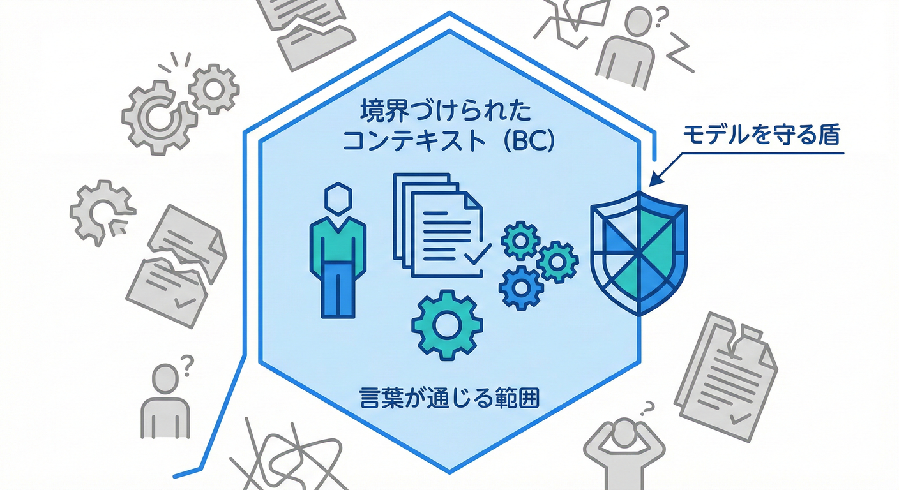
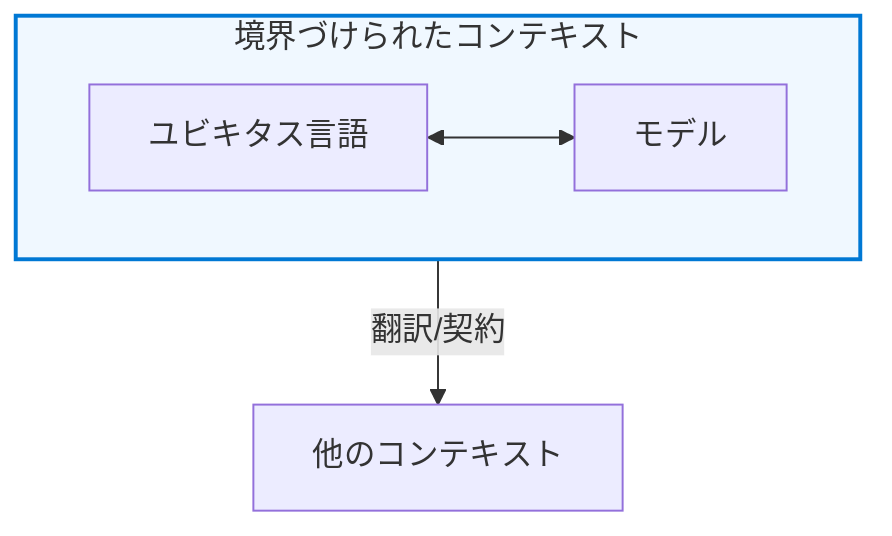

# 第06章：Bounded Contextを1行で言うと📝✨

## 1行でいうと✅



Bounded Context（BC）＝**「この境界の中では、このモデルと言葉が“正しい意味”で通じる」範囲**だよ😊🫶
公式っぽく言うなら、**「あるモデルが定義され、適用できる境界の説明」**って感じ📌 ([Domain Language][1])

---

## どうしてBCが必要なの？💥➡️🛟

BCが無い（または曖昧）だと、こうなるよ😵‍💫💦

* 同じ単語なのに、部署や人で**意味がズレる**（例：「顧客」「注文」）🌀
* みんなが「自分の意味のつもり」で話して、**仕様がねじれる**🧨
* コードでは「1つのクラスに全部詰める」になって、**if地獄**＆**変更が怖い**😇🔥

BCはこの事故を、**“境界で止める”**ための考え方だよ🛡️✨
「境界の内側は一貫、外側は別物でもOK🙆‍♀️」がポイント！ ([martinfowler.com][2])

---

## BCの主役は「言葉」と「モデル」🗣️🧩

BCを構成する主役はこの2つだよ👇

* **言葉（ユビキタス言語）**：チーム内で「その意味」で通じる単語セット📖
* **モデル**：その言葉の意味を、ルール込みで表したもの（コード）🧠💻

そして、BCはこういう約束を作る👇

* ✅ 境界の内側：**言葉の意味がブレない**
* ✅ 境界の内側：**ルール（制約）もブレない**
* ✅ 境界の外側：同じ単語でも**別の意味でOK**（混ぜない！）🙅‍♀️

この「境界の中だけ保証する」って発想がめちゃ大事だよ🥰 ([martinfowler.com][2])



---

## 図でつかむBC（文章図）🫧🗺️

同じ「顧客」でも、BCが違うと意味が違ってOK！

```text
🫧【請求BC】Billing Context
  「顧客」＝支払い責任者（請求先・税情報・請求ルール）

🫧【配送BC】Shipping Context
  「顧客」＝荷物の受取人（配送先住所・受取可否・置き配ルール）

同じ単語「顧客」でも、意味が違う。
→ だから、混ぜた瞬間に事故る💥
```

BCは「言葉の辞書が切り替わる境界」だと思うと分かりやすいよ📚✨
そして、境界をまたぐときは「翻訳」や「契約」が必要になる（これは後半でやるよ）📨🛡️ ([martinfowler.com][2])

---

## ミニEC題材で“衝突”を想像してみよ🛒📦💳🚚

この教材のミニECには、だいたいこの登場人物（領域）がいるよね😊

* 受注（注文を受ける）📦
* 在庫（数を確保する）📦📉
* 配送（届ける）🚚
* 請求（お金を請求する）💳

ここで「注文（Order）」が衝突しがち😇

* 受注の「注文」＝**お客様との約束（何を買う？いくら？）**
* 配送の「注文」＝**出荷の指示（いつ出す？どこに？）**
* 請求の「注文」＝**請求の根拠（課税・締め・入金）**

「注文って1つでしょ？」ってまとめると、意味が混ざって地獄🔥
BCで「この注文はどの世界の注文？」を固定するのが目的だよ✅ ([Domain Language][1])

---

## よくある誤解ベスト4😇⚠️

### 誤解1：BC＝DB（テーブル）の境界？🧱

違うよ〜！BCの中心は**言葉とモデル**🗣️🧩
DBは結果として分かれることもあるけど、「まずDBで切る」は事故りやすい⚠️ ([Domain Language][1])

### 誤解2：BC＝必ずマイクロサービス？🧩➡️🧩🧩

「そうなることが多い」はあるけど、**必ず1対1じゃない**よ🙆‍♀️
最初はモジュール分割（モジュラーモノリス）でも全然OK👌 ([Microsoft Learn][3])

### 誤解3：BCは最初から完璧に決めるべき？💎

完璧主義は捨てよ〜😆🫶
BCは「学びながら育てる」もの。仮置きして改善でOK🌱 ([Microsoft Learn][4])

### 誤解4：BCの境界は“フォルダ”だけで守れる？📁

フォルダは目印にはなるけど、守りは別途必要になりがち🙅‍♀️
（参照ルール、公開範囲、契約DTO…このへんは後半でガッツリ✨）

---

## 本章のミニ演習🎮✨（10〜15分）

### 演習A：1行定義を作る📝

次の単語を、**それぞれのBCで1行定義**してみてね😊✨

* 「顧客」：請求BC / 配送BC
* 「住所」：請求BC / 配送BC
* 「金額」：受注BC / 請求BC

コツ：**“誰の目的？”**を先に書くとブレにくいよ👀🎯

### 演習B：混ざってるサインを探す🔍🚨

次のサインが出たら「BC曖昧かも？」って疑ってOK👇

* クラス名が **User / Customer / Order** みたいに万能化してる💣
* プロパティが増殖して「関係ない情報」まで同居してる📈
* 状態（Status）が部署ごとの意味を全部背負ってる😇

---

## C#で“境界を見える化”する超ミニ例💻✨

同じ単語でも、BCが違えば「別の型」でOK🙆‍♀️
まずは **名前空間で境界を見える化**する例だよ👇

```csharp
namespace MiniEc.Billing; // 🫧請求BC

public sealed class Customer
{
    public required string BillingName { get; init; }   // 請求名義
    public required string TaxId { get; init; }         // 税情報（例）
}

namespace MiniEc.Shipping; // 🫧配送BC

public sealed class Customer
{
    public required string RecipientName { get; init; } // 受取人
    public required string AddressLine { get; init; }   // 配送先住所
}
```

ポイントはこれ👇🥰

* 「Customer」という**同じ単語**が、BCごとに**別物**として存在してる✅
* これだけで「混ぜると危ない」がコードで見える👀⚠️
* もっと進むと「境界を越えるときはDTOで渡す」が基本になる📨✨

（ちなみに今のC#はC# 14／.NET 10が最新世代だよ📌） ([Microsoft Learn][5])

---

## つまずきポイント救急箱🧰💞

* 「BCって結局“どこで切るの？”」→ まずは**単語の意味がズレる場所**からでOK🗣️🧨
* 「同じ単語は統一しないとダメ？」→ **境界が違えば別物でOK**🙆‍♀️（むしろ無理に統一すると事故）
* 「切りすぎが怖い」→ 最初は**3〜6個くらい**の候補で仮置きが現実的👌 ([Microsoft Learn][6])

---

## 本章まとめ🌸✅

* BCは **「言葉とモデルの意味が一貫する範囲」**🫧
* 同じ単語でも、**境界が違えば別物でOK**🙆‍♀️
* 事故の原因は「混ざること」→ BCはそれを**境界で止める**🛡️✨ ([Domain Language][1])

---

## お助けAIプロンプト🤖✨（第6章）

* 「この文章の“同じ単語で意味が変わっている”箇所を列挙して🔍」
* 「“顧客”“注文”“住所”を、請求BCと配送BCでそれぞれ1行定義して📝」
* 「ミニECの説明から、BC候補を3つ出して、各BCの目的を1行で付けて🏷️」
* 「“混ざってるサイン”が出てるクラス名を挙げて、分離案も出して⚖️」

---

## 第07章：事故例①「顧客」が3人いる👤👤👤

[1]: https://www.domainlanguage.com/wp-content/uploads/2016/05/DDD_Reference_2015-03.pdf?utm_source=chatgpt.com "Domain-‐Driven Design Reference"
[2]: https://www.martinfowler.com/bliki/BoundedContext.html?utm_source=chatgpt.com "Bounded Context"
[3]: https://learn.microsoft.com/en-us/dotnet/architecture/microservices/microservice-ddd-cqrs-patterns/ddd-oriented-microservice?utm_source=chatgpt.com "Designing a DDD-oriented microservice - .NET"
[4]: https://learn.microsoft.com/en-us/azure/architecture/microservices/model/domain-analysis?utm_source=chatgpt.com "Using domain analysis to model microservices"
[5]: https://learn.microsoft.com/en-us/dotnet/csharp/whats-new/csharp-14?utm_source=chatgpt.com "What's new in C# 14"
[6]: https://learn.microsoft.com/en-us/azure/architecture/guide/architecture-styles/microservices?utm_source=chatgpt.com "Microservices Architecture Style - Azure Architecture Center"
