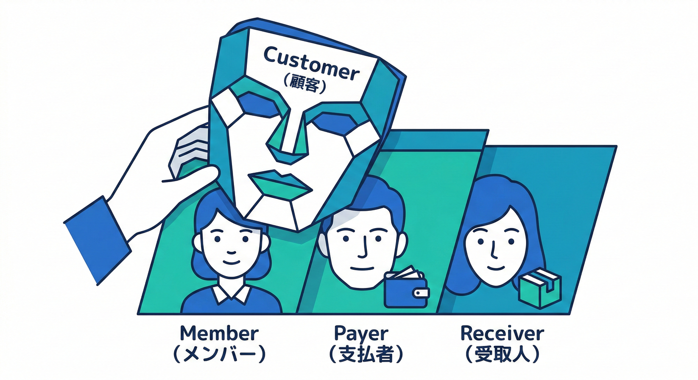
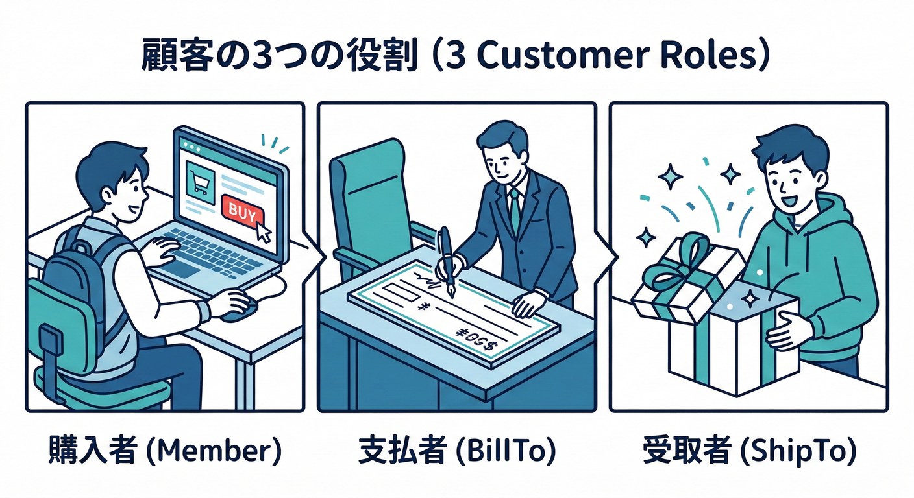
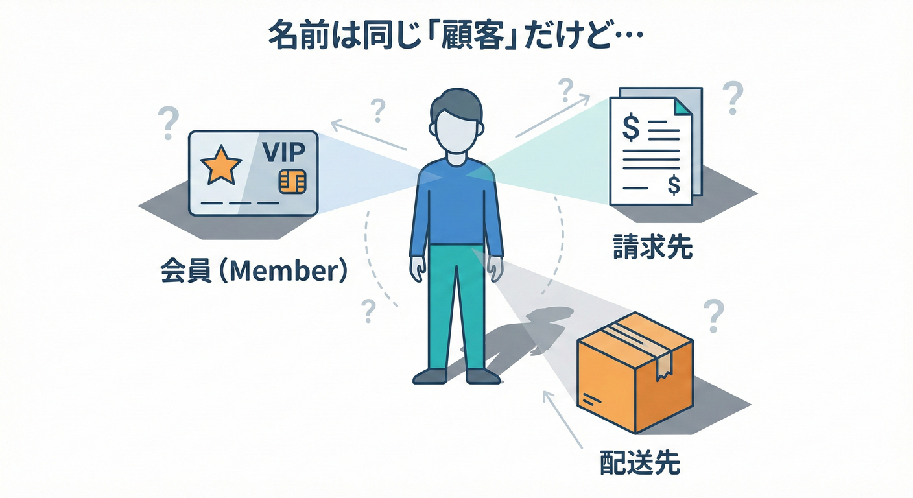
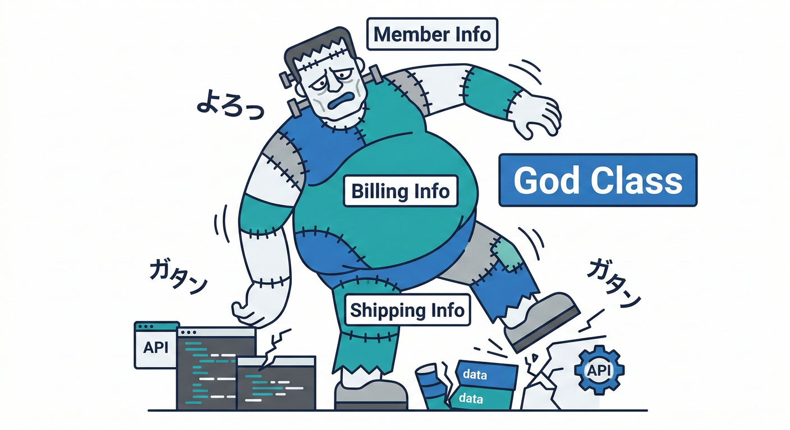
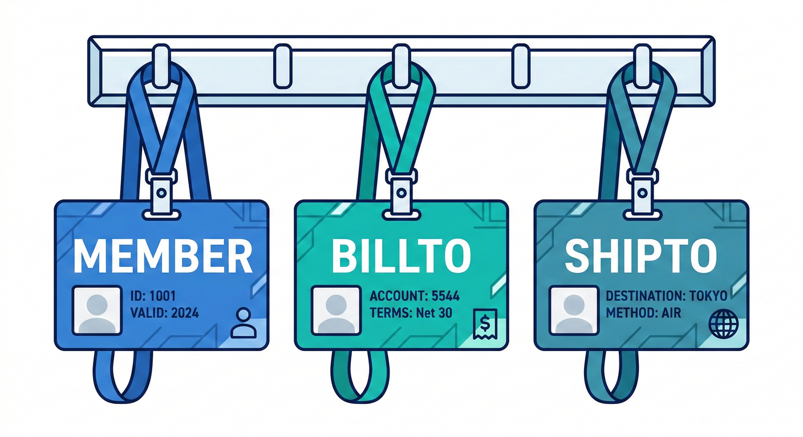
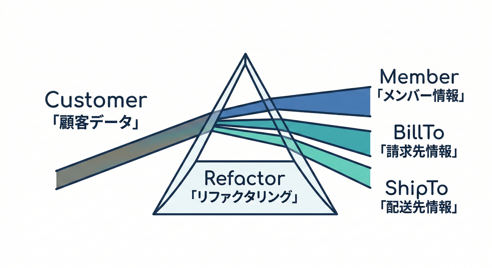
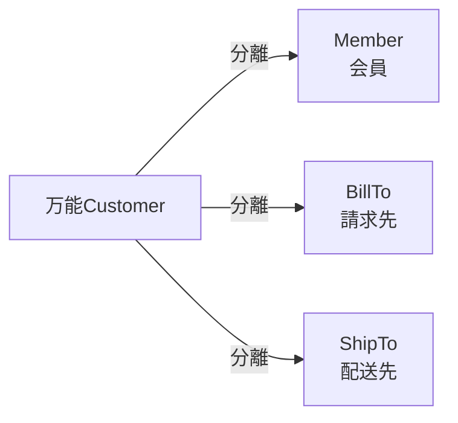

# 第07章：事故例①「顧客」が3人いる👤👤👤

## 1. 今日のテーマ🎯✨

同じ「顧客」という言葉が、現場では **ぜんぜん別の人** を指していることがあるよ〜って話😊💥


これを **1つの `Customer` クラス** に押し込むと、コードも会話も壊れやすくなる…という事故を体験する章だよ🧯🔥

---

## 2. まずは事故が起きるミニECの世界🛒📦💳🚚

たとえば、こんな注文があるよ👇

* 👩‍🎓 会員としてログインして買う（会員ポイントを使う）
* 🧾 請求書は「会社」に切りたい（経費精算）
* 🎁 配送先は「友だち」へ（プレゼント）

このとき “顧客” って誰？🤔💭
実は、**3人いる** んだよね👤👤👤



### 「顧客」が3種類に分裂する例🧨



1. **会員としての顧客**：ログインする人／ポイント持ってる人🔑✨
2. **請求先としての顧客**：お金を払う人／請求書の宛名の人🧾💳
3. **配送先としての顧客**：荷物を受け取る人／住所の持ち主📦🏠

ここで「全部Customerでしょ！」って1つにまとめると、事故が始まるよ😇💥

---

## 3. 事故のはじまり：「万能Customer」爆誕💣

### ありがちな設計（悪い意味でリアル）🙃

「顧客情報まとめとけば便利じゃん！」でこうなる👇

* `Customer.Email`（会員メール）
* `Customer.BillingAddress`（請求先住所）
* `Customer.ShippingAddress`（配送先住所）
* `Customer.CompanyName`（法人名）
* `Customer.MemberId`（会員ID）
* `Customer.PaymentTerms`（支払い条件）
* `Customer.Points`（ポイント）
* `Customer.IsGift`（ギフト…？）

もう **誰の何の情報なのか** が、じわじわ崩れていく😵‍💫🌀



---

## 4. 実際に「壊れる」ポイント🧯💥

### 壊れ方①：必須チェックが破綻する✅❌

* 会員なら `MemberId` 必須だよね？🔑
* 請求先が会社なら `CompanyName` 必須だよね？🏢
* 配送先が別なら `ShippingAddress` 必須だよね？📦

…これを1つの `Customer` に入れると
「場合によって必須」だらけになって、`if` と `null` の海🌊😇

### 壊れ方②：ルールが衝突する⚔️

* **割引**は「会員」に適用したい🎟️✨
* **請求の税区分**は「請求先（法人/個人）」で変わるかも🧾
* **配送不可地域**は「配送先住所」で判定したい🚚⛔

なのに、全部 `Customer` だと
「どの住所？どの人？どのルール？」って混線する📞🔥


### 壊れ方③：名前が会話を壊す🗣️💥

チーム内でこうなる👇

* 「Customerの住所ってどれ？」
* 「請求先のCustomerだよ」
* 「え、会員Customerじゃないの？」
* 「配送Customerの住所の話してたんだけど…」

**言葉が通じない** = 設計が崩れやすいサイン🚨

---

## 5. 体験：ダメなコードを書いて“気持ち悪さ”を掴む🧪😇

### 5.1 プロジェクト作成のヒント🧰

* Visual Studio 2026 で「Console」プロジェクトを作成して、ターゲットは **.NET 10** を選ぶとOKだよ💻✨
  （.NET 10 は 2025年11月にGA、2026年1月時点で 10.0.2 が提供されてるよ）([Microsoft][1])
* C# は **C# 14** を使える前提で進めるね🧠✨([Microsoft Learn][2])
* Visual Studio で Copilot を使うなら、拡張は統合版で入れられるよ（要 Visual Studio 17.10+）🤖🧩([Visual Studio][3])

### 5.2 “万能Customer”の例💣

（※わざとツラい設計にしてるよ！学習用！）

```csharp
using System;

public class Customer
{
    // 会員としての情報
    public string? MemberId { get; set; }
    public string? Email { get; set; }
    public int? Points { get; set; }

    // 請求先としての情報
    public string? CompanyName { get; set; }
    public string? BillingAddress { get; set; }
    public string? PaymentTerms { get; set; }

    // 配送先としての情報
    public string? ShippingName { get; set; }
    public string? ShippingAddress { get; set; }
    public bool IsGift { get; set; }
}

public class Order
{
    public Customer Customer { get; set; } = new();
    public decimal TotalAmount { get; set; }
}

class Program
{
    static void Main()
    {
        var order = new Order
        {
            TotalAmount = 12000m,
            Customer = new Customer
            {
                // ログイン会員（本人）
                MemberId = "M-001",
                Email = "member@example.com",
                Points = 500,

                // 請求先（会社）
                CompanyName = "ABC株式会社",
                BillingAddress = "東京都千代田区…",
                PaymentTerms = "月末締め翌月末",

                // 配送先（友だち）
                ShippingName = "山田花子",
                ShippingAddress = "大阪府大阪市…",
                IsGift = true
            }
        };

        Console.WriteLine("注文作成OKっぽいけど…このCustomer、誰？😇");
        Console.WriteLine($"MemberId: {order.Customer.MemberId}");
        Console.WriteLine($"CompanyName: {order.Customer.CompanyName}");
        Console.WriteLine($"ShipTo: {order.Customer.ShippingName}");
    }
}
```

このコード、動くけど…


**「Customerって誰？」に答えられない** のがポイント😵‍💫💥

---

## 6. “意味のズレ”を言語化する練習🗣️📝✨

ここがこの章のいちばん大事💖
混線してるときは、まず **言葉を分解** するよ✂️✨

### 6.1 「顧客」を3つの役割に分けて名前をつける🏷️

おすすめの呼び分け（例）👇

* 👤 **Member**（会員）
* 🧾 **BillTo**（請求先）
* 📦 **ShipTo**（配送先）

「Customer」をやめる勇気💪✨
**名前を変えるだけで会話が通る** こと、ほんとに多いよ😊



### 6.2 衝突メモを作る📝💥

仕様書や会話から拾って、こうメモする👇

* 「顧客」＝ログインする人（ポイント・会員ランク）
* 「顧客」＝請求書の宛名（法人名・支払い条件）
* 「顧客」＝荷物の受取人（配送先住所・受取不可ルール）

これができると、「境界が必要な匂い」👃🔍 が分かってくる！

---

## 7. “境界づけられたコンテキスト”の入口🚪🗺️✨

Bounded Context 的にはこう考えるよ👇

* 会員の世界（会員ID/ポイント/ランク）🎫✨
* 請求の世界（支払い条件/請求書/税区分）🧾💳
* 配送の世界（配送先/受取人/配送ルール）📦🚚

同じ単語が出てきても、**世界が違えば意味が違ってOK**🙆‍♀️✨
むしろ、混ぜる方が危ない⚠️

---

## 8. じゃあどう直す？“まずの一歩”だけ見せるよ🌱✨

まだ本格分割（プロジェクト分割とか）に行かなくても、
**クラスを分けるだけ** で一気に読みやすくなる😊🧡

```csharp
public record MemberAccount(string MemberId, string Email, int Points);

public record BillingParty(string Name, string BillingAddress, string PaymentTerms);

public record ShippingRecipient(string Name, string ShippingAddress, bool IsGift);

public class OrderV2
{
    public required MemberAccount Member { get; init; }
    public required BillingParty BillTo { get; init; }
    public required ShippingRecipient ShipTo { get; init; }
    public decimal TotalAmount { get; init; }
}
```

これで会話がこう変わるよ👇✨



* 「この注文の **Member** は誰？」🔑
* 「**BillTo** は会社？」🧾
* 「**ShipTo** は別住所？」📦

“顧客”でケンカしない世界🌈😊



---

## 9. ミニ演習🎮✅（手を動かすやつ！）

### 演習1：3人の「顧客」を見つけよう🔍👤👤👤

次の文章の「顧客」が誰なのか、`Member / BillTo / ShipTo` でラベルを付けてみてね📝✨

* 「顧客はログインしてポイントを使った」
* 「顧客宛に請求書を発行する」
* 「顧客の住所に翌日配送する」

### 演習2：万能Customerに詰めると何が起きる？💥

万能 `Customer` で必須チェックを書くとしたら、どんな `if` が増えそう？😇
（例：「CompanyNameがあるならPaymentTerms必須」みたいなやつ）

### 演習3：名前を変えるだけリファクタ✂️✨

あなたのコードや頭の中で「Customer」と呼んでるものを、
`Member / BillTo / ShipTo` のどれかに置き換えてみてね😊
置き換えた瞬間「説明しやすさ」が上がったら、それが境界のサイン🚨✨

---

## 10. つまずきポイント集🧱🥺

* 「クラス増えるの怖い…」→ 大丈夫！増えるのは **複雑さじゃなくて明確さ**✨
* 「どれが正しい名前？」→ 正しさより **通じること** が最優先🗣️💞
* 「Customerのままでも動くし…」→ 動くけど、変更が来たとき壊れやすい⚠️💥

---

## 11. お助けAIプロンプト🤖✨（この章専用）

* 「この仕様文の “顧客” が指している人物を、Member/BillTo/ShipToで分類して」🔍
* 「万能Customerクラスが抱えている責務を箇条書きにして、混ざってる理由も説明して」🧨
* 「Customerという名前を避けて、誤解が起きにくいクラス名候補を10個出して」🏷️✨
* 「今のコードのnull地獄ポイントを指摘して、最小変更で3つの型に分ける案を出して」🧩

---

## 12. まとめ🎁✨

* 「顧客」は現場では **1人じゃない** ことがある👤👤👤
* 1つの `Customer` に詰めると、**必須条件・ルール・会話が混線** して壊れる😵‍💫💥
* まずは **役割で名前を分ける**（Member / BillTo / ShipTo）だけで、設計が一気にラクになる😊💞

[1]: https://dotnet.microsoft.com/en-US/download/dotnet/10.0?utm_source=chatgpt.com "Download .NET 10.0 (Linux, macOS, and Windows) | .NET"
[2]: https://learn.microsoft.com/ja-jp/dotnet/csharp/whats-new/csharp-14?utm_source=chatgpt.com "C# 14 の新機能"
[3]: https://visualstudio.microsoft.com/github-copilot/?utm_source=chatgpt.com "Visual Studio With GitHub Copilot - AI Pair Programming"
