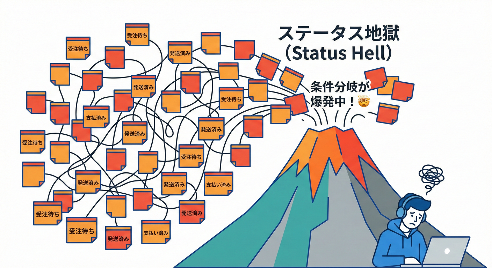
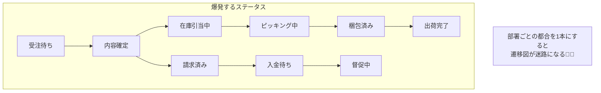

# 第08章：事故例②「注文」が部署で別物📦😇

## この章でできるようになること🎯✨

* 「同じ“注文”なのに、部署で意味が違う」事故の正体がわかる🧠💥
* “ステータスを1本化”すると何が起きるか、体感できる🔥
* 「混ざってるものメモ📝」で、境界候補を言葉にできるようになる💪📒

---

## 1. 事故の舞台：ミニECの3部署🏢🛒

今回は、ミニECをこの3つの“部署”で回してる想定だよ〜📦💳🚚

* **受注（Order Desk）**：お客さんから注文を受け付ける📩
* **出荷（Fulfillment）**：倉庫でピッキング→梱包→発送📦🚛
* **請求（Billing）**：請求書→入金確認→督促💳📨

ここで地雷💣
**「注文（Order）」って言葉、3部署で“見てる世界”が違う**のに「支払い待ちだけど、配送はもう準備してよくて、在庫は引当済み…」なんて状態が見分けられなくなるんだね😇


## 2. “注文”が部署で別物になる例👀🧩

## 受注にとっての「注文」📩

* 目的：**受け付けて、内容を確定し、キャンセル・変更に耐える**
* 気にすること：顧客情報、購入意思、割引、住所の入力ミス、支払い方法など📝

## 出荷にとっての「注文」📦

* 目的：**モノを正しく出す（欠品・梱包・配送）**
* 気にすること：在庫引当、倉庫ロケーション、ピッキングリスト、梱包サイズ、送り状、配送業者🚚

## 請求にとっての「注文」💳

* 目的：**お金を正しく回収する（請求・入金・返金）**
* 気にすること：請求書番号、締め日、税計算、入金消込、返金、与信、督促📨

同じ「注文」でも、**見てる“責任”が別**なんだよね🌪️

---

## 3. 一番やりがちな事故：「状態（ステータス）を1本にする」🔥😵‍💫

## よくある“万能ステータス”地獄例💣



「OrderStatusを1つにして、全部ここで表せばOKでしょ！」ってやると…

* 受注：受付中 / 確認中 / キャンセル
* 出荷：ピッキング中 / 梱包中 / 出荷済み / 配達中
* 請求：請求書発行 / 入金待ち / 入金済み / 返金済み / 督促中

ぜんぶ混ぜると、こうなる👇😇

* ステータスが増殖して止まらない📈💥
* 「この状態のとき、このプロパティは必須」みたいな条件分岐が増殖🌿🌿🌿
* ありえない組み合わせ（矛盾状態）が自然に生まれる🧟‍♀️

  * 例：**「入金済み」なのに「未出荷」？**（あるかも）
  * 例：**「出荷済み」なのに「受付前」？**（それは無い😇）



---

## 4. “図（文章）”で見る：1つにすると何が混ざる？🗺️💥

## 1つのOrderに詰め込む世界（危険⚠️）

* Orderの中に、受注・出荷・請求の情報が同居
* 受注の変更が、出荷や請求のコードまで巻き込む
* 1ヶ所直すと、別部署ロジックが壊れる（副作用）💥

イメージ（文章図）👇

* Order

  * 受注の関心：CustomerName / OrderLines / Discount / AddressInputState …
  * 出荷の関心：PickingState / PackageSize / TrackingNumber …
  * 請求の関心：InvoiceNo / TaxRule / PaymentReconcilationState …

**「責任の違うものが同じ部屋に住んでる」**状態🏠😵‍💫

---

## 5. ミニ実験：わざと“ステータス地獄”を作って体験しよう🧪🔥

## Step 1：最小コードを用意する🛠️

Visual Studioでクラスライブラリ＋テスト（xUnit）を作って、次のような“ありがち設計”を置くよ📦

### ありがちステータス（例）

```csharp
public enum OrderStatus
{
    // 受注っぽい
    Received,
    Confirmed,
    Cancelled,

    // 出荷っぽい
    Picking,
    Packed,
    Shipped,
    Delivered,

    // 請求っぽい
    Invoiced,
    PaymentPending,
    Paid,
    Refunded,
    Dunning
}
```

### ありがち万能Order（例）

```csharp
public sealed class Order
{
    public Guid OrderId { get; init; } = Guid.NewGuid();

    // 受注関心
    public string CustomerName { get; set; } = "";
    public string ShippingAddress { get; set; } = "";
    public decimal DiscountAmount { get; set; }

    // 出荷関心
    public string? TrackingNumber { get; set; }
    public string? PackageSize { get; set; }

    // 請求関心
    public string? InvoiceNumber { get; set; }
    public DateOnly? InvoiceDate { get; set; }
    public DateOnly? PaidDate { get; set; }

    public OrderStatus Status { get; private set; } = OrderStatus.Received;

    public void ChangeStatus(OrderStatus next)
    {
        // とりあえず「後で厳密に」…のつもりが
        Status = next;
    }
}
```

## Step 2：3部署の“要求”を足していく🧩

次の要求を順番に追加してみてね👇

1. **受注**：「Confirmedになったらキャンセル不可」🚫
2. **出荷**：「Picking中は住所変更不可」📦
3. **請求**：「Invoiced後の割引変更は税計算が変わる」💳💥

→ これ、全部1つのOrderで守ろうとすると…

* ChangeStatusの中が if / switch だらけ😇
* 「今どの部署の都合で制約が増えたのか」わからなくなる🌀
* テストの観点も混ざって、テストが読みづらい🧪💦

## Step 3：追い打ち要件（ここで崩壊）💣🔥

次のどれかを入れると、一気に“ステータス設計”が割れるよ😇

* **部分出荷**（一部だけ先に送る）📦➡️📦
* **後払い**（出荷後に請求）💳🕒
* **与信NGで出荷止め**（請求都合が出荷を止める）🛑

この瞬間、「Status 1本」はだいたい破綻する…！🏚️💥

---

## 6. 何が混ざってるかをメモする📝✨（超重要）

この章のゴールはここ！🔥
“混ざり”を言葉にできると、次に境界（BC）へ進めるよ🏃‍♀️💨

## 混ざってるものメモ（テンプレ）📒

* 「注文」って言葉の意味（受注）：

  * 目的：
  * 重要な状態：
  * 絶対守りたいルール：

* 「注文」って言葉の意味（出荷）：

  * 目的：
  * 重要な状態：
  * 絶対守りたいルール：

* 「注文」って言葉の意味（請求）：

  * 目的：
  * 重要な状態：
  * 絶対守りたいルール：

## “混ざってるサイン”チェック✅🚨

* Statusが増え続けている📈
* Orderクラスに「部署ごとの都合」が集まっている🏢🏢🏢
* 「ある状態ではこの値必須」が増え続ける📌
* 変更が怖くて触れない領域ができる😱
* テストが“何のためのテスト”か曖昧になる🧪🌀

---

## 7. ここまでの結論：同じ単語でも、境界の外では別物でOK🙆‍♀️✨

この事故の本質はこれ👇

* **“注文”という言葉が、部署ごとに別のモデルを指している**
* だから、**1つのOrderに詰めるほど矛盾が増える**
* 特に **ステータス（状態）は責任ごとに分けないと爆発しやすい**💥

次のPart（境界の見つけ方）に行くと、ここで書いたメモを使って
「じゃあ、どこで区切ろう？」ができるようになるよ🗺️🔍

---

## 8. つまずきポイント集🥺🧯

* **「1本化すると見通しが良さそう」って思っちゃう**
  → 最初は良いけど、要件が増えた瞬間に破裂しやすい🎈💥
* **ステータス＝進捗の一覧、だと思ってしまう**
  → 進捗じゃなくて「ルールの境界」なんだよね📏
* **“万能Order”を作ると安心する**
  → 安心の代償で、変更のたびに全員が巻き込まれる😇
* **「とりあえずifで守ればいい」**
  → ifは最後に“もれなく破綻の地図”になる🗺️💀
* **用語の衝突に気づけない**
  → メモ📝が最強！まずは言葉にするだけで勝ち🏆✨

---

## 9. 章末ミニ演習🎮✅（10〜15分）

次の質問に、1行ずつでOKだから答えてみてね📝💕

1. 受注にとって「注文」とは何？（目的を1行）📩
2. 出荷にとって「注文」とは何？（目的を1行）📦
3. 請求にとって「注文」とは何？（目的を1行）💳
4. ステータスを1本にすると、どのルールが衝突しそう？⚔️
5. 「混ざってるものメモ」に、各部署の“絶対守りたいルール”を1つずつ書こう✅

---

## 10. お助けAIプロンプト集🤖✨（コピペOK）

※ 「GitHub Copilot」やAI拡張がVisual Studioで統合されて使える前提だよ（Visual Studio 17.10以降で統合拡張が案内されてるよ）([Visual Studio][1])

* 「この要件文の中で、“注文”という単語が別の意味になっている箇所を列挙して」🔍
* 「受注・出荷・請求それぞれの“目的”を1行で要約して」🏷️
* 「“ステータス1本化”で起きる矛盾状態を10個作って」💥
* 「混ざってるものメモのテンプレに沿って、埋めて」📝
* 「このOrderクラスのプロパティを、受注/出荷/請求に分類して。分類できないものは“境界の匂い”として理由も書いて」👃🔍

---

## 参考（この章の“最新土台”）📌✨

* .NET 10 は 2026-01-13 時点の最新更新が案内されているよ🧩([Microsoft サポート][2])
* C# 14 は .NET 10 でサポートされ、Visual Studio 2026 には .NET 10 SDK が含まれる案内だよ💻✨([Microsoft Learn][3])
* .NET 10 のサポート期間（終了日）も公開されているよ📅([Microsoft Learn][4])
* Visual Studio 2026 側でも C# 14 のツール対応が明記されているよ🧰([Microsoft Learn][5])
* Microsoft / GitHub

[1]: https://visualstudio.microsoft.com/github-copilot/?utm_source=chatgpt.com "Visual Studio With GitHub Copilot - AI Pair Programming"
[2]: https://support.microsoft.com/ja-jp/topic/-net-10-0-update-2026-%E5%B9%B4-1-%E6%9C%88-13-%E6%97%A5-64f1e2a4-3eb6-499e-b067-e55852885ad5?utm_source=chatgpt.com ".NET 10.0 Update - 2026 年 1 月 13 日 - Microsoft サポート"
[3]: https://learn.microsoft.com/en-us/dotnet/csharp/whats-new/csharp-14?utm_source=chatgpt.com "What's new in C# 14"
[4]: https://learn.microsoft.com/en-us/lifecycle/products/microsoft-net-and-net-core?utm_source=chatgpt.com "Microsoft .NET and .NET Core - Microsoft Lifecycle"
[5]: https://learn.microsoft.com/en-us/visualstudio/releases/2026/release-notes?utm_source=chatgpt.com "Visual Studio 2026 Release Notes"
