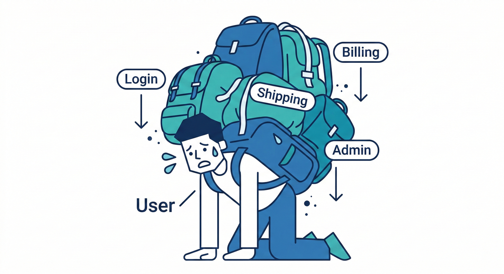
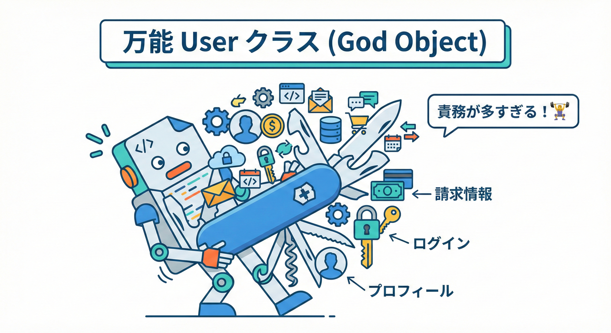
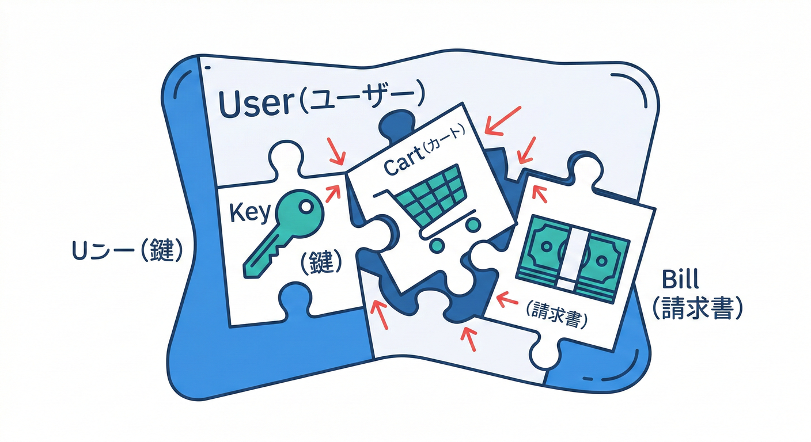
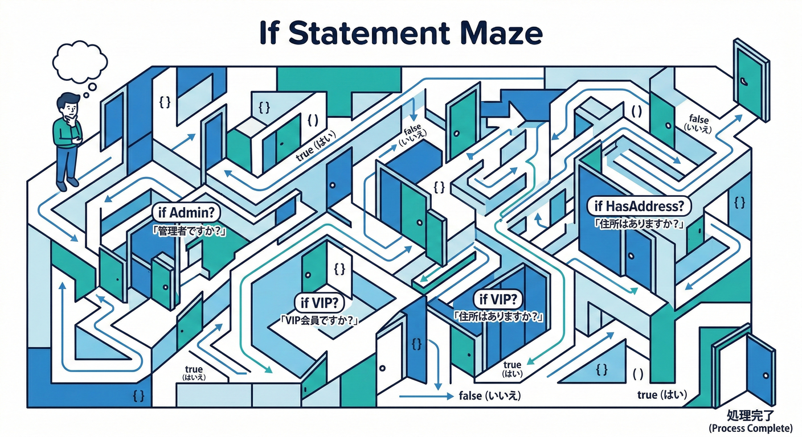
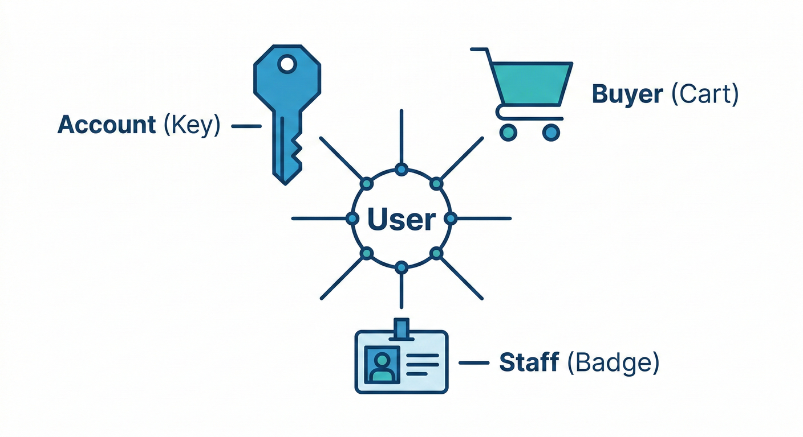
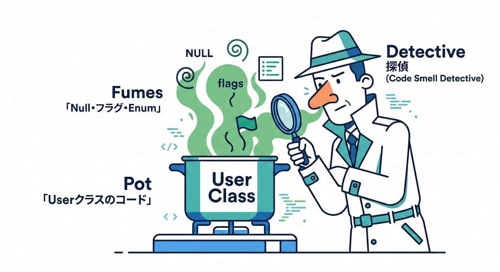
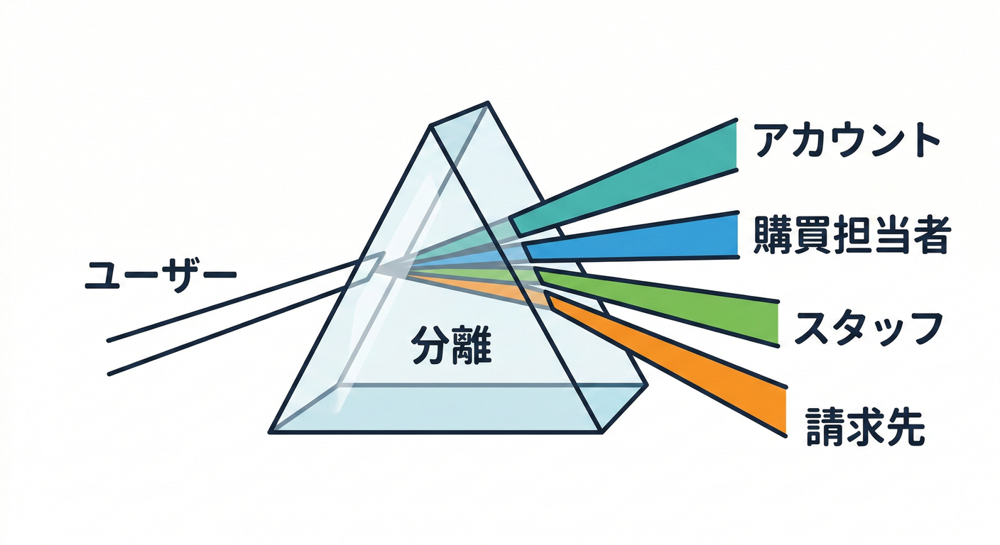
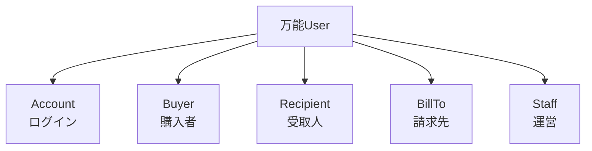
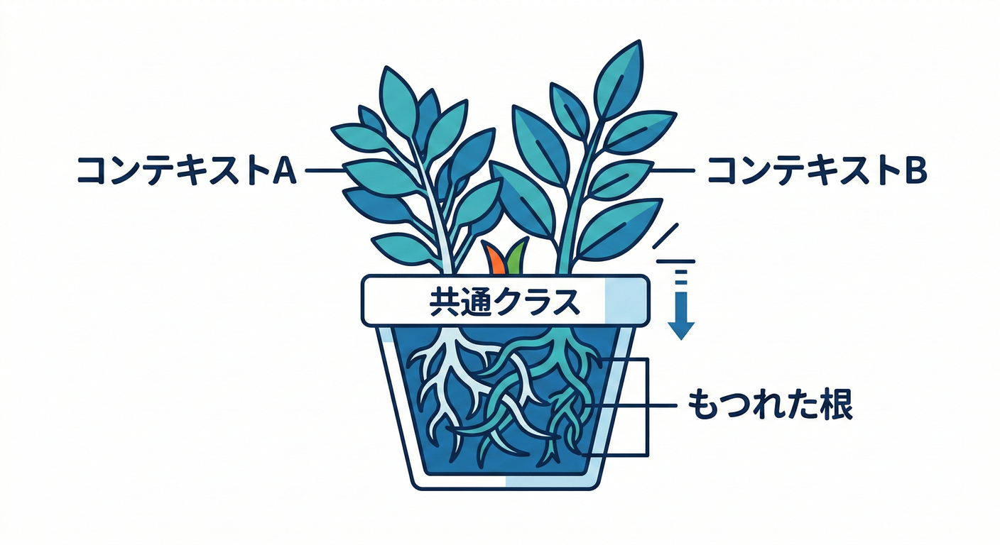

# 第09章：事故例③「万能Userクラス」爆誕💣

## 0. 今日のゴール🎯✨

この章では、ありがちな事故パターン👇を“体験”して、**境界（Bounded Context）が無いと何が起きるか**を腹落ちさせます😊🧠💥

* 「Userって便利だし、全部まとめちゃお♪」➡️ **最初は速い**🚀
* でも…機能が増えるほど **Userが何者なのか分からなくなる**😵‍💫
* 結果：変更が怖い／影響範囲が読めない／ifだらけ／テスト地獄🧪🔥

---

## 1. 事故のはじまり：「とりあえずUserで」🧨



ミニECの世界で、こんな要望が順番に来るとします🛒📦

1. ログインできる（会員）🔐
2. 配送先が持てる（お届け先）🏠📮
3. 請求情報が持てる（請求先）🧾💳
4. 管理画面の権限が必要（運営スタッフ）🧑‍💻🔧
5. サポート履歴も見たい（問い合わせ）☎️💬

ここでありがちなのが…👇

> 「全部“ユーザー”でしょ？Userクラスに追加しよっか☺️」

この瞬間、**“万能User”への道**が開通します🚧💣

---

## 2. 万能Userクラス、爆誕💥👤





最初はスッキリだったはずなのに、だんだんこうなります👇😇

```csharp
public class User
{
    // ログイン系（アカウントっぽい）
    public Guid Id { get; init; }
    public string Email { get; set; } = "";
    public string PasswordHash { get; set; } = "";
    public bool IsDisabled { get; set; }

    // 会員プロフィールっぽい
    public string DisplayName { get; set; } = "";
    public DateOnly? BirthDate { get; set; }
    public int LoyaltyPoints { get; set; }

    // 配送っぽい
    public string? DefaultShippingZip { get; set; }
    public string? DefaultShippingAddress1 { get; set; }
    public string? DefaultShippingAddress2 { get; set; }

    // 請求っぽい
    public string? InvoiceName { get; set; }
    public string? InvoiceAddress { get; set; }
    public string? TaxId { get; set; }

    // 管理者っぽい
    public bool IsAdmin { get; set; }
    public string? PermissionsJson { get; set; }

    // サポートっぽい
    public string? SupportNotes { get; set; }
}
```

見てほしいポイントはこれ👇🥺

* **「っぽい」項目が同居**してる（アカウント／会員／配送／請求／管理／サポート）🧩🧩🧩
* **nullだらけ**（使う場面が限定的＝文脈が違うサイン）⚠️
* 追加のたびに **既存機能に影響**しそうで怖い😱

---

## 3. “if増殖”が始まる😵‍💫🌱



万能Userはだいたい「条件分岐の巣」になります🕸️

```csharp
public static bool CanUseCoupon(User user)
{
    if (user.IsDisabled) return false;

    // 管理者はOK…？（え、注文の話なのに？）
    if (user.IsAdmin) return true;

    // 会員ランク…？ポイント…？誕生日…？
    if (user.LoyaltyPoints >= 1000) return true;

    // そもそも配送先が無いとダメ…？
    if (string.IsNullOrWhiteSpace(user.DefaultShippingAddress1)) return false;

    return true;
}
```

ここが地味に怖いところ👇😇

* **「注文のルール」なのに「管理者フラグ」が混ざる**（責任が混線）🧯🔥
* 変更要望が来るたびに、**別のifに刺さる**🪡
* 「どこを直せばいい？」が読めなくなる📉😵

---

## 4. 事故の正体：Userの“意味”が1つじゃない🌀



同じ「User」という単語でも、実はこんな別物が混ざってます👇✨

* 🔐 **ログインする人**（アカウント）
* 🛒 **買う人**（購入者）
* 🏠 **受け取る人**（受取人）
* 🧾 **請求される人/会社**（請求先）
* 🧑‍💻 **運営する人**（スタッフ）
* ☎️ **問い合わせる人**（問い合わせ主）

つまり、事故はこう言い換えられます👇💥

> “User”という1語に、**別々の世界（文脈）を押し込んでる**😵‍💫

これが **境界（Bounded Context）が無いサイン**です🚨

---

## 5. 「境界が無いサイン」チェックリスト✅🚨



万能Userの匂い、これで嗅ぎ分けられます👃🔍✨

* ✅ プロパティが増え続ける（しかも用途がバラバラ）📈
* ✅ `IsAdmin` / `IsVendor` / `IsSomething...` が増殖する🏷️
* ✅ nullが多い（画面・機能ごとに必要項目が違う）🕳️
* ✅ `UserType` enumが太る（種類が増えるたび修正）🍔
* ✅ 「この変更、どこに影響する？」が即答できない😨
* ✅ テストが書きづらい（前提条件が多すぎる）🧪💦

---

## 6. どう直す？：まず“呼び名”を分ける🏷️✨



まだBCを本格的に切る前でも、**言葉を分けるだけで世界が見えます**👀✨

例👇（同じ人でも、文脈で呼び名を変える）

* 🔐 `Account`（ログイン文脈）
* 🛒 `Buyer`（購入文脈）
* 🏠 `Recipient`（配送文脈）
* 🧾 `BillTo`（請求文脈）
* 🧑‍💻 `Staff`（運営文脈）

「User」って言葉を封印すると、混線が減ります🔒✨



---

## 7. “境界の雰囲気”だけ先に味わう：分けるとこうなる🍱✨

万能Userを「文脈ごと」に分けると、こういう形が自然に見えてきます👇

```csharp
public readonly record struct AccountId(Guid Value);
public readonly record struct BuyerId(Guid Value);

public class Account // 🔐ログインの世界
{
    public AccountId Id { get; init; }
    public string Email { get; private set; } = "";
    public string PasswordHash { get; private set; } = "";
    public bool IsDisabled { get; private set; }
}

public class BuyerProfile // 🛒注文の世界
{
    public BuyerId Id { get; init; }
    public string DisplayName { get; private set; } = "";
    public int LoyaltyPoints { get; private set; }
}
```

ここで大事なのは👇😊

* **同じ人物でも、モデルは別でOK**🙆‍♀️
* “境界を越える”ときは **IDやDTOで受け渡す**📨
* 「便利だから共有しよ」が事故の入口⚠️

C# 14 は .NET 10 上で使える最新のC#リリースとして整理されています（Visual Studio 2026 / .NET 10 SDK で試せるよ、という公式案内あり）([Microsoft Learn][1])
.NET 10 は 2025-11-11 にリリースされ、サポート表も公式に掲載されています([Microsoft][2])

---

## 8. つまずきポイント集🌀（初心者あるある）



### つまずき①：「DRYだから共有しなきゃ！」と思う🧻

* DRYは大事だけど、**“意味が違うのに同じ型で共有”**は逆効果😵‍💫
* 境界が違うなら、似てても分けるのが安全🛡️

### つまずき②：「Userが中心だから、全部Userで！」と思う👑

* “中心”に見えるのは罠🥺
* 実際は **機能ごとに“中心”が違う**（注文の中心は注文、請求の中心は請求）🧭✨

### つまずき③：「Roleで全部解決できそう」と思う🎭

* Roleは便利だけど、**モデルの意味の混線**まで解決しないことが多いよ⚡
* Roleで押し切ると、if増殖が再発しがち😇

---

## 9. ミニ演習🧩✍️（10〜15分）

### お題：この万能Userを“文脈”で仕分けしよう🎒

次の項目を、グループに分けてください👇（紙でもメモでもOK📝✨）

* Email / PasswordHash / IsDisabled
* DisplayName / LoyaltyPoints
* DefaultShippingAddress1 / DefaultShippingZip
* InvoiceName / TaxId
* IsAdmin / PermissionsJson
* SupportNotes

**ステップ**🎯

1. グループ名を付ける（例：ログイン、注文、配送、請求、運営、サポート）🏷️
2. 各グループで「この世界の主語は誰？」を1行で書く👀
3. 「同じ単語だけど意味が違う」候補を丸で囲む⭕（例：“住所”）

**答え合わせの観点**✅

* グループ間で、ルール（制約）の種類が違ってたら境界候補🌈
* nullが多い項目は「別世界の可能性」高い⚠️

---

## 10. お助けAIプロンプト🤖✨（Copilot/AI拡張でそのまま使える）

※ Visual Studio では GitHubアカウントで Copilot を有効化でき、無料で一部機能が使える案内もあります([Visual Studio][3])（運用はチーム方針に合わせてね😊）

* 「この `User` クラスのプロパティを“責任”でグルーピングして、グループ名も付けて」🧺
* 「`null` が多いプロパティを列挙して、“なぜ混ざっているサインか”を説明して」🕳️
* 「“注文の文脈”だけで必要な最小フィールドを提案して。不要なものは理由付きで除外して」🥗
* 「分割後に、境界を越えるDTO案（最小）を作って」📨

---

## まとめ🌸

万能Userクラスの事故は、「クラスが巨大」なのが問題というより…
**“別々の文脈（世界）を1つに押し込んだ”**のが本体です💥🗺️

次の章では、なぜこれが「変更が怖い」に直結するのか、もっとやさしく解剖していきます😵‍💫➡️😊✨

[1]: https://learn.microsoft.com/en-us/dotnet/csharp/whats-new/csharp-14 "What's new in C# 14 | Microsoft Learn"
[2]: https://dotnet.microsoft.com/en-us/platform/support/policy/dotnet-core ".NET and .NET Core official support policy | .NET"
[3]: https://visualstudio.microsoft.com/github-copilot/ "
	Visual Studio With GitHub Copilot - AI Pair Programming"
