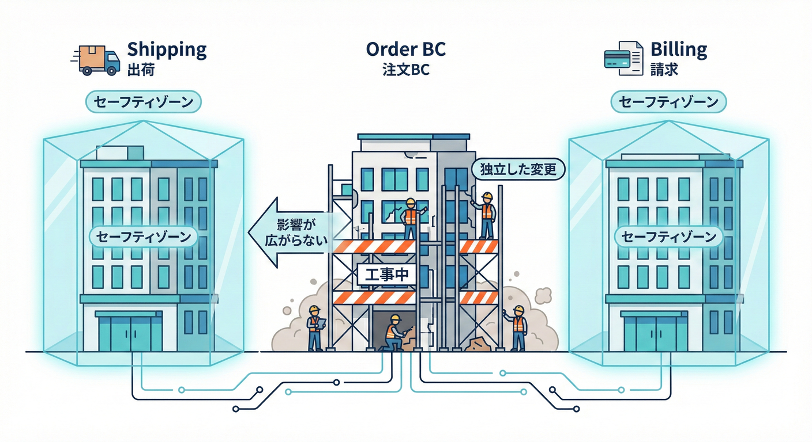
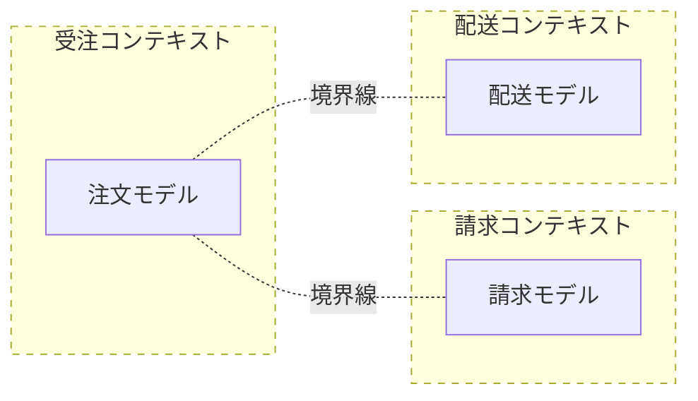

# 第10章：変更が怖くなる正体（設計初心者向け）😵‍💫🧠

## この章でできるようになること🎯✨

* 「なんで修正が怖いの？」の正体を、**言葉で説明**できるようになる🗣️💡
* 「どこが混ざってる？」を見抜く**チェック観点**が手に入る🔍✅
* Bounded Context（BC）がやってくれること＝**“壊れる範囲を小さくする”**を体感する🛡️🔥

---

## 1) まず結論：変更が怖いのは「どこが壊れるか分からない」から😨💥


変更が怖い状態って、だいたいこんな感じ👇

* ちょっと直しただけなのに、**別の画面が壊れる**😵
* 「ここ関係ないはず…」が通用しない🌀
* テストを書こうとしても、準備が大変すぎて諦める🧪❌
* 直すたびに、バグが増える気がする🧯🔥

この“怖さ”の正体は、気合い不足じゃないよ🙅‍♀️
**設計の構造として「混ざっている」**のが原因なんだ〜！🧩💣

---

## 2) 正体その①：変更理由が違うものが「同居」してる🏠💥

いちばん大事な合言葉はこれ👇

**「変更理由が違うものは、同じ場所に住ませない」**✂️✨

たとえばミニECだと、同じ“注文”でもチームによって意味が違うよね？📦

* 受注チーム：注文＝「注文を受け付けた記録」📝
* 配送チーム：注文＝「配送の対象」🚚
* 請求チーム：注文＝「請求の根拠」💳

なのに、全部を **1つの `Order` クラス** に詰め込むと…
「注文の仕様変更」が起きた瞬間に、**関係ない人まで巻き添え**になる😇💥

> これが「変更理由が違うものが同居して壊れる」ってことだよ🏚️⚡

---

## 3) 正体その②：同じ単語の「意味」が混ざってる🗣️🧨

設計初心者がハマりやすい罠はこれ👇

**同じ単語を、同じクラス名で、同じプロパティ名で扱う**😵‍💫

例：

* `Customer` が「会員」なのか「請求先」なのか「配送先」なのか混ざる👤🌀
* `Total` が「税込」なのか「税抜」なのか「送料込み」なのか混ざる💴🌀
* `Status` が「受注」「出荷」「請求」の状態を全部背負う📌🌀

この状態って、コード上は “正しそうに見える” のが怖いところ😇
でもし「受注の修正」が、受注BCの中だけで完結して、配送や請求に飛び火しなかったら？🔥➡️🛡️



## 4) 「混ぜない」ことで、テストが楽になる🧪💕

テストが書けないと「変更の安全確認」ができないよね😢
テストが書けないコードの典型はこれ👇

* 1つのクラスが、いろんな責任を持ちすぎ（データ＋計算＋DB＋API…）🍱💦
* 依存が多すぎて、**準備が地獄**になる🧩🧩🧩
* 変更の影響範囲が読めず、テストケースも決められない🌀

結果、こうなる👇
**「怖いから触らない」→「触らないから直らない」→「さらに怖い」**😵‍💫🔁

---

## 5) BCがくれるもの：壊れる範囲を小さくする「防火壁」🧱🔥

Bounded Context（BC）がやってくれる一番の価値はこれ👇

**「変更の火事」が広がらないように、壁で区切る**🧱🔥➡️🛟

* BCの中：言葉の意味が一貫してる✅
* BCの外：同じ単語でも別物でOK🙆‍♀️
* 境界を越えるとき：契約（DTO/API/イベント）でやり取り📨✨

だから、BCを分けるとこうなる👇

* 変更が起きても **“そのBCの中だけ”** で済むことが増える🔒
* テストも **BC単位** で書けるようになる🧪✅
「ここは配送の世界」「ここは請求の世界」って会話が整理される🗺️✨



---

## 6) ミニ体験：万能 `Order` が変更のたびに爆発する💣📦

ここから小さく体験してみよ〜！😊✨
（※コードは最小にしてるよ🍀）

## 6-1) 事故るパターン：1つの `Order` に全部入れる😇

### 仕様変更シナリオ📌

* 請求：`Total` は **税込** にしたい💳
* 配送：`Total` は **送料抜き** で見たい🚚
* 受注：割引ルールも追加したい🏷️

なのに `Order.Total` が1個しかないと…
誰かの希望を叶えると、誰かが困る😵‍💫💥

### 例：こういうコードが増えていく…🌀

```csharp
public class Order
{
    public decimal Subtotal { get; private set; }
    public decimal ShippingFee { get; private set; }
    public decimal TaxRate { get; private set; } // 0.1m とか

    // 「合計」が誰にとっての合計なのか曖昧😇
    public decimal Total => Subtotal + ShippingFee + (Subtotal * TaxRate);

    public Order(decimal subtotal, decimal shippingFee, decimal taxRate)
    {
        Subtotal = subtotal;
        ShippingFee = shippingFee;
        TaxRate = taxRate;
    }
}
```

この `Total`、請求には嬉しいけど配送には邪魔かも…？🥺
すると次にこうなる👇

* `TotalForBilling` を追加する💳
* `TotalForShipping` を追加する🚚
* `if (用途)` が増える😇
* プロパティが増殖する💥

まさに「変更が怖い」構造の出来上がり🍱💦

---

## 6-2) どう直す？：**“意味が違うなら分ける”**✂️✨

ここでBC的な発想👇

* 請求の世界では「請求用の注文」💳
* 配送の世界では「配送用の注文」🚚
* 同じ `Order` という単語でも **別物** でOK🙆‍♀️✨

たとえば、BCごとに名前空間（またはプロジェクト）を分けるだけでも効果大📁✨

```csharp
namespace BillingContext
{
    // 請求の世界の Order（請求のための意味）
    public class Order
    {
        public decimal Subtotal { get; }
        public decimal TaxRate { get; }

        public decimal BillingTotal => Subtotal + (Subtotal * TaxRate);

        public Order(decimal subtotal, decimal taxRate)
        {
            Subtotal = subtotal;
            TaxRate = taxRate;
        }
    }
}

namespace ShippingContext
{
    // 配送の世界の Order（配送のための意味）
    public class Order
    {
        public decimal Subtotal { get; }
        public decimal ShippingFee { get; }

        public decimal ShippingTotal => Subtotal + ShippingFee;

        public Order(decimal subtotal, decimal shippingFee)
        {
            Subtotal = subtotal;
            ShippingFee = shippingFee;
        }
    }
}
```

ポイントはこれ👇

* **同じクラス名でも、世界（コンテキスト）が違えば意味が違ってOK**🗺️✨
* 「請求の変更」は BillingContext の中で完結しやすい💳🔒
* 「配送の変更」は ShippingContext の中で完結しやすい🚚🔒

---

## 7) 変更が怖いコードの“匂い”チェックリスト👃⚠️

当てはまるほど「混ざってる」可能性大だよ😵‍💫

* 1つのクラスに **画面用・DB用・計算用** が同居してる📦🧮🗄️
* `Customer` / `Order` / `User` が **万能すぎる**🧠💥
* `Status` が増え続けて、説明が長い📌😇
* 「とりあえず `Common` プロジェクト」に集めがち📁🌀
* どこを直しても、別の人のテストが落ちる🧪💥
* 影響範囲が分からなくて、修正前に祈る🙏😵
* “同じ単語”の意味を聞くと、人によって答えが違う🗣️🌀
* 依存（参照）が蜘蛛の巣みたい🕸️😨
* 「このクラスは何の責任？」と聞かれて一言で言えない😇
* 仕様変更のたびに `if` が増える🌲🌲🌲

---

## 8) ミニ演習（今日の手応えづくり）📝✨

## 演習A：変更理由カードを作ろう🃏

次の3つを、**「変更理由」**として書き出してね👇

* 割引ルールが変わる🏷️
* 送料計算が変わる🚚
* 消費税ルールが変わる🧾

💡コツ：
「誰の都合で変わる？」を言葉にすると、境界が見えやすいよ👀✨

---

## 演習B：どこが混ざってる？を線で引こう🖊️

万能 `Order` があるとして、プロパティを想像してみて👇

* `ShippingAddress` 🏠
* `BillingAddress` 🧾
* `PaymentStatus` 💳
* `ShipmentStatus` 🚚
* `CampaignDiscount` 🎁

➡️ それぞれに「これは誰の世界？」のラベルを付けてね🏷️✨
（受注？配送？請求？）

---

## 演習C：壊れる範囲を“囲む”🟦

「消費税の仕様変更」が来たとき、壊れてほしくない範囲はどこ？😵‍💫

* 受注画面？🛒
* 配送？🚚
* 請求？💳

➡️ “税”が関係する世界を囲むと、BCの原型になるよ🛡️✨

---

## 9) つまずきポイント（ここで転びやすい😵‍💫）

## ❌ 「BC＝マイクロサービス」だと思う

BCはまず **“言葉とモデルの境界”** の話だよ🗺️✨
最初はモジュラーモノリス（同じアプリ内で分割）でぜんぜんOK👌

## ❌ 「分ける＝重複＝悪」だと思う

BCを分けると、似た概念が両方に出てくることがあるよ🪞
でもそれは **“意味が違うから別物”** で、事故防止になることが多い🙆‍♀️🧡

## ❌ 「共通化しとけば安心」で Common 地獄

共通化は境界を溶かしやすい🫠💥
“共通”は最小限にして、まずは **所有者（どのBCのもの？）** を決めるのが大事🏠🔒

---

## 10) 最新のC#開発環境メモ（この章で出てくる用語の整理）💻✨

* **.NET 10** はLTSで、3年サポート（2028年11月まで）として案内されているよ📌✨ ([Microsoft for Developers][1])
* **C# 14** が最新のC#リリースとして案内されていて、.NET 10でサポートされているよ🧠✨ ([Microsoft Learn][2])
* **Visual Studio 2026** のリリースノートが公開されていて、最新IDEとして案内されているよ🛠️✨ ([Microsoft Learn][3])
* Visual Studio では **GitHub Copilot の統合/導入** が案内されていて、17.10以降などの条件も示されているよ🤖✨ ([Visual Studio][4])

---

## お助けAIプロンプト🤖✨（第10章版）

* 「この `Order` クラスの責任を“変更理由”で分解して」✂️
* 「同じ単語（Order/Customer/Total）が別の意味になっている箇所を列挙して」🔍
* 「“請求の世界”と“配送の世界”で、必要なフィールドを最小にしてDTO案を作って」📨
* 「この変更（税率変更）が来たときの影響範囲を、依存の矢印で説明して」➡️
* 「テストが書きやすい形にするために、依存（DB/外部API）をどこで隔離すべきか提案して」🧪🛡️

[1]: https://devblogs.microsoft.com/dotnet/announcing-dotnet-10/?utm_source=chatgpt.com "Announcing .NET 10"
[2]: https://learn.microsoft.com/en-us/dotnet/csharp/whats-new/csharp-14?utm_source=chatgpt.com "What's new in C# 14"
[3]: https://learn.microsoft.com/en-us/visualstudio/releases/2026/release-notes?utm_source=chatgpt.com "Visual Studio 2026 Release Notes"
[4]: https://visualstudio.microsoft.com/github-copilot/?utm_source=chatgpt.com "Visual Studio With GitHub Copilot - AI Pair Programming"
