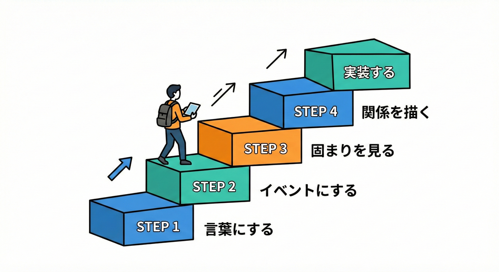
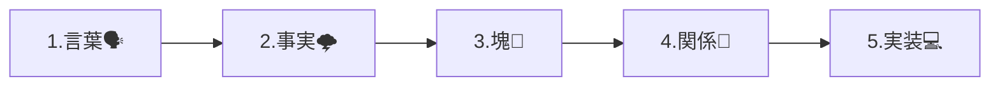

# 第11章：境界発見の全体手順（テンプレ）📌

この章は「境界（Bounded Context）って、どうやって見つけるの？」に **迷わないための型（テンプレ）** を覚える回だよ〜🧭💕

---

## まず結論：境界発見の“5ステップ”🧩✨



この順番で進めると、初心者でも迷子になりにくいよ🫶



Bounded Contextは「ある範囲の中では、モデルと言葉の意味が一貫してる」状態を作るための境界だよ📦🔒 ([Domain Language][1])

---

## 図でイメージ（文章の図）🗺️✨

ミニEC（注文・在庫・配送・請求）を例にすると…

* **言葉の収集**：みんなが使う言葉を集める📝
* **イベント化**：「〜された（過去形）」で時系列に並べる⏳
* **固まり**：イベントの“まとまり”が見えてくる🧺
* **関係**：固まり同士の依存（どっちが主導？）を描く🔗
* **守る**：コードで“混ぜない仕組み”にする🔒💻

---

## ステップ① 業務を言葉にする（会話ログ化）💬📝

## 目的🎯

**「同じ単語が、誰の視点でどういう意味か」** を拾うためだよ👀✨
Bounded Contextの核は「言葉の意味の一貫性」だから、最初は“言葉”を集めるのが超大事🗣️ ([Domain Language][1])

## やり方（初心者用の超シンプル版）🌸

業務を **短い文** に切るだけでOK！

* 誰が（主語）👤
* 何をする（動詞）🧠
* 何が変わる（結果）🔁

例🛒

* 「カスタマーが注文する」
* 「支払いが完了する」
* 「倉庫が在庫を引き当てる」
* 「配送が発送する」
* 「請求が確定する」

## コツ💡

* “正しさ”より“素材集め”が優先だよ🙆‍♀️
* 用語がブレててもOK（むしろブレが境界のヒント！）✨

---

## ステップ② イベントにする（過去形で事実化）🌩️📌

## 目的🎯

業務の流れを **「起きた事実」** で揃えると、部署や視点のズレが浮き出るよ👀✨
イベントストーミングは、この発見に強いワークショップ手法として広く使われてるよ🧩 ([codecentric AG][2])
（発案者として Alberto Brandolini がよく言及されるね🌩️）

## ルール（これだけ守ればOK）✅

* **過去形**：「〜された」「〜完了した」「〜失敗した」みたいに書く📌
* **業務の事実**：「ボタン押した」より「支払いが承認された」みたいなビジネス寄りが◎🧾
* **時系列**：左→右に並べる⏳

例（ミニEC）🛒

* 注文が作成された
* 支払いが承認された
* 在庫が引き当てられた
* 出荷指示が作成された
* 発送された
* 請求が確定した

---

## ステップ③ 固まりを見る（境界候補を“見える化”）🧺🔍

## 目的🎯

イベントを並べると、自然に **「目的が同じっぽい塊」** が出てくるよ✨
この塊が **Bounded Context候補** になりやすいの🧩

## 固まりの見つけ方（初心者向けチェック）✅

次のどれかが出たら、境界の匂い👃✨

* **使ってる言葉が変わる**（同じ単語でも意味が違いそう）🧨
* **責任が変わる**（誰が決める？誰が困る？）🧑‍⚖️
* **確認・調整が増える**（ここから他部署っぽい…）📞
* **ルール変更の理由が違う**（割引ルールと在庫ルールは変わる波が違う🌊）

※「ドメインやサブドメインとBCは1対1じゃない」って注意もあるよ〜🙅‍♀️（だから“塊＝仮置き”でOK） ([Mathias Verraes' Blog][3])

---

## ステップ④ 関係性を描く（Context Mapの入口）🗺️🤝

## 目的🎯

境界を作って終わりじゃなくて、**境界どうしの付き合い方** を決めるのが超大事！
関係を明示すると、事故が減るよ✅ ([martinfowler.com][4])
（この概念を広く解説してるのが Martin Fowler の記事だね）

## まず描くのはコレだけでOK（初心者版）✍️

* Aのコンテキストが、Bの情報を使う？
* 主導権はどっち？（Bの仕様変更でAが死ぬ？）⚡
* 連携は何で？（API / DB参照 / イベント）🔗

## 最低限おぼえる関係パターン（ざっくり）🧠✨

* **Customer / Supplier**：供給側が主導、利用側が合わせる👑
* **Conformist**：割り切って相手に合わせる🙇‍♀️
* **ACL（防波堤）**：相手のクセを中に入れない🧱🌊

（Context Mapのチェック観点として、関係パターンや統合点を明示する流れが紹介されてるよ✅） ([GitHub][5])

---

## ステップ⑤ 実装で守る（“混ぜない仕組み”にする）🔒💻

## 目的🎯

紙や図で「分けたつもり」でも、コードで混ぜたら終わり😇
だから **境界を壊しにくい形** を最初から作るよ✨

## 初心者でも効く！“守り方”3点セット🛡️

1. **プロジェクト/名前空間を分ける** 📦
2. **公開する型（DTO）を決める** 📨
3. **内部のドメイン型を外に出さない** 🙅‍♀️

「Bounded Contextの中で戦術的なモデルを育てる」って考え方は、DDDの基本説明でもよく触れられるよ📚 ([Pearson][6])
（参考：Implementing Domain-Driven Design）

## ミニ例：境界越えは“契約”だけ（超小さいサンプル）📨✨

```csharp
// Shipping（配送）コンテキストが外に見せてもいい「契約」DTO
public sealed record ShippingStatusDto(
    string OrderId,
    string Status,   // "Shipped" など（配送の言葉）
    DateTimeOffset UpdatedAt
);

// Shippingの内部ドメイン（外に出さない！）
internal sealed class Shipment
{
    public string OrderId { get; }
    public ShipmentState State { get; private set; }
    // ...配送独自のルールや制約...
}
```

ポイント：外に出すのは「必要最小の情報」だけ🥗✨（“配送の言葉”で表現）

---

## 迷ったら戻る：境界候補チェックリスト🔁✅

* **この範囲で、言葉の意味が一貫してる？** 📖
* **責任（決定権）が一貫してる？** 👑
* **変更の理由が同じ波？** 🌊
* **テスト単位として切れそう？** 🧪
* **他の塊と“翻訳”が必要そう？** 🈂️

Bounded Contextは「曖昧さを境界の内側から追い出す」発想だよ✨（定義としても“境界内でモデルが適用される”って説明されるよ） ([Domain Language][1])
（参考：Eric Evans／Domain-Driven Design Reference）

---

## ミニ演習🧩🎮（15〜25分）

題材：ミニEC（注文・在庫・配送・請求）🛒📦🚚💳

## ① 業務文を10本書く📝

例：「倉庫が在庫を引き当てる」みたいな短文を10本！

## ② 過去形イベントに変換（10〜20個）🌩️

例：「在庫が引き当てられた」

## ③ 似たイベントを3〜5個の塊に分ける🧺

塊に「目的ラベル」をつける🏷️
例：

* 受注を成立させる
* 在庫を確保する
* 荷物を届ける
* お金を確定させる

## ④ 塊どうしの矢印を描く➡️

「どっちが情報を渡す？」「主導はどっち？」をメモ✍️

## ⑤ “混ぜない宣言”を1行ずつ書く🔒

例：「配送は配送の状態だけを持ち、請求の状態は持たない」みたいに✨

---

## つまずきポイント集（あるある）😵‍💫➡️😊

## つまずき①：最初から“正しい境界”を探しちゃう

➡️ **仮置きでOK**！境界は育つ🌱（後で直す前提で動かすのが現実的）

## つまずき②：イベントが“操作”になっちゃう

➡️ 「ボタン押した」より「支払いが承認された」みたいに **事実** に寄せよう📌

## つまずき③：塊が“機能一覧”っぽくなる

➡️ 「目的」や「責任」でラベルを付けてね🏷️（“何のための塊？”）

## つまずき④：境界を分けたのにDB共有で混ざる

➡️ それは“境界が壊れる近道”になりやすいので、次の章以降で対策していくよ🧱💥

---

## お助けAIプロンプト（第11章用）🤖✨

コピペで使えるよ〜📋💕

* 「この業務説明文を、過去形のドメインイベントに変換して（10〜20個）」🌩️
* 「イベントを“目的が近い固まり”に3〜6個でグルーピングして、各固まりに1行の目的ラベルを付けて」🧺🏷️
* 「同じ単語だけど意味が変わってそうな用語を列挙して、どの固まりに属するかも書いて」🧨📝
* 「固まり同士の依存関係（矢印）を提案して。主導権がどっちかも」🗺️➡️
* 「境界を守るための“混ぜない宣言”を各固まり1行で作って」🔒✍️

---

この章で覚えたテンプレを、次の章からは手順どおりに“材料集め→イベント化→読み取り”って進めていくよ🧭✨

[1]: https://www.domainlanguage.com/wp-content/uploads/2016/05/DDD_Reference_2015-03.pdf?utm_source=chatgpt.com "Domain-‐Driven Design Reference"
[2]: https://www.codecentric.de/en/knowledge-hub/blog/eventstorming-meets-domain-driven-design-with-alberto-brandolini?utm_source=chatgpt.com "EventStorming meets Domain-Driven Design with Alberto ..."
[3]: https://verraes.net/2025/08/domain-and-bounded-contexts-dont-map-one-on-one/?utm_source=chatgpt.com "No, Your Domains and Bounded Contexts Don't Map 1 on 1"
[4]: https://www.martinfowler.com/bliki/BoundedContext.html?utm_source=chatgpt.com "Bounded Context"
[5]: https://github.com/masoud-bahrami/domain-driven-design-roadmap?utm_source=chatgpt.com "masoud-bahrami/domain-driven-design-roadmap"
[6]: https://ptgmedia.pearsoncmg.com/images/9780321834577/samplepages/0321834577.pdf?utm_source=chatgpt.com "Implementing Domain-Driven Design"
