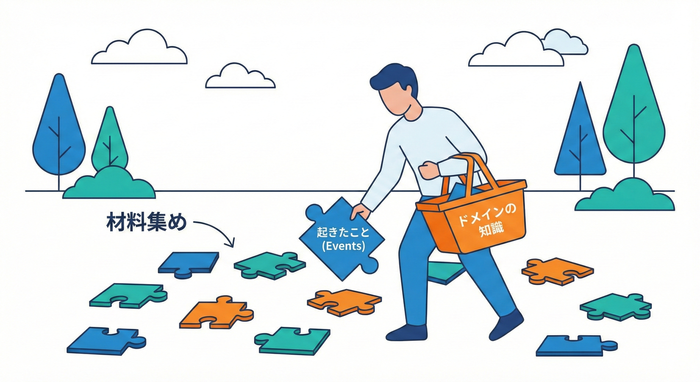
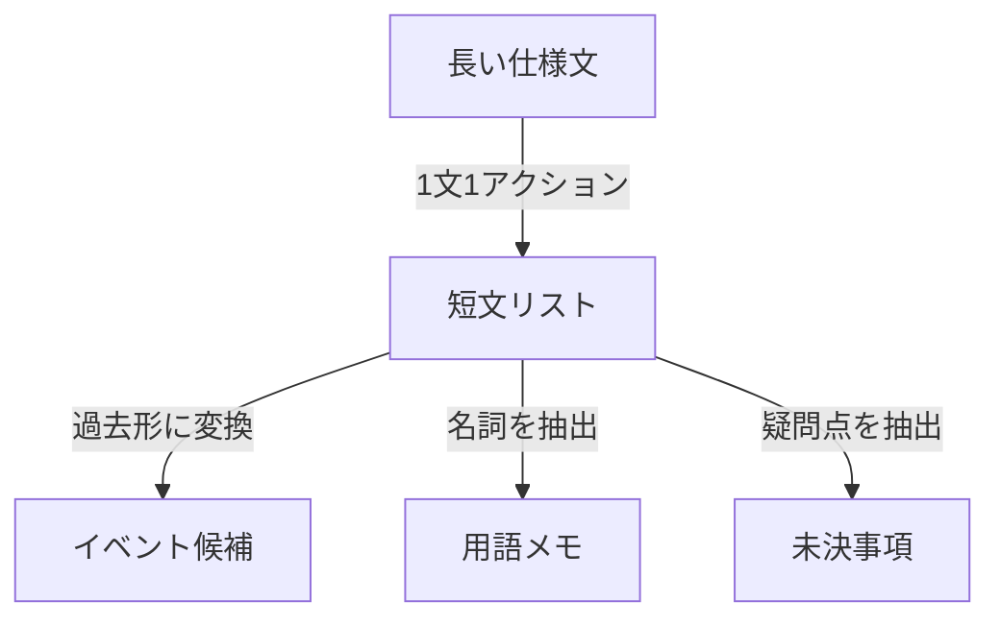
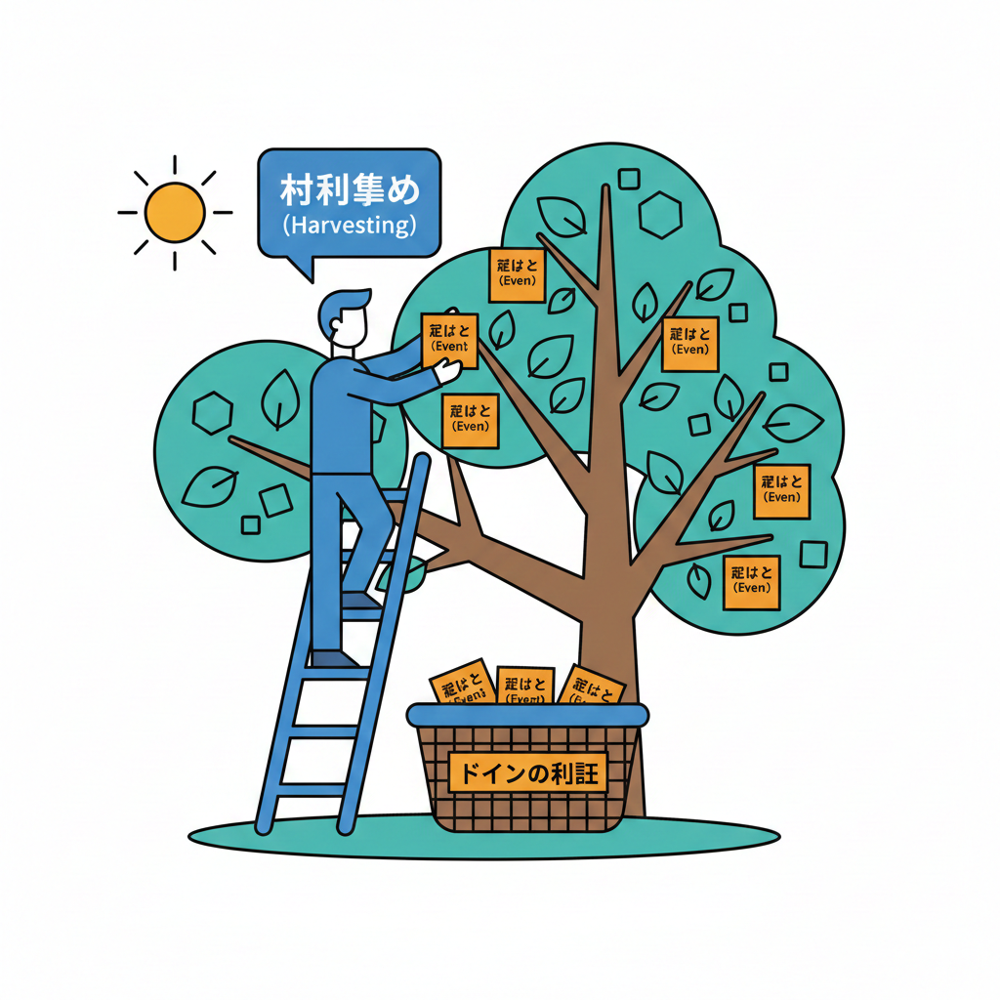

# 第12章：材料集め（業務を“会話”にする）💬🧺✨

## 12.1 なんで「材料集め」が先なの？🤔💡

境界づけられたコンテキスト（BC）は、ざっくり言うと「同じ言葉が、同じ意味で通じる範囲」でした🗺️✨
なので最初にやるべきは、**仕様を“文章”として読むことより、仕様を“会話”として集めること**なんだよね💬😊

会話として集めると👇

* 「誰が」「何を」「いつ」やるのかがハッキリする👀✨
* 同じ単語が別の意味で使われてる“ズレ”が見つかる🧨
* 次章（イベントストーミング準備）でイベントにしやすい🌩️

イベントストーミングは「複雑な業務を、みんなでイベント（起きた事実）として並べて理解する」ためのワークで、提唱者は Alberto Brandolini として紹介されることが多いよ📌🌩️ ([qlerify.com][1])
また、イベントは **過去形**で書くのが基本（例：アカウントが作成された）って説明されることが多いよ🧡📝 ([Bright IT][2])

---

## 12.2 今日つくる「材料セット」🎁✨




この章のゴールは、次章に渡せる材料を揃えることだよ💪😊
作るのはこの5つ👇

1. **短い仕様文リスト**（1文＝1アクション）📄✂️
2. **イベント候補リスト**（過去形）🌩️🧡
3. **用語メモ（ミニ辞書）**📒✨
4. **未決事項リスト**（質問したいこと）❓📝
5. **衝突しそうな単語メモ**（ズレの予感）⚠️🧨

---

## 12.3 会話を集めるときの“登場人物”🧑‍🤝‍🧑💬

会話って、ふわっと集めると情報が散らばるから😵‍💫
まずは「誰の視点の会話か」を固定して集めよう📌✨

ミニECなら例👇

* 注文を受ける人（受注・CS）🛒📞
* 在庫を見る人（倉庫・在庫担当）📦
* 支払いを見る人（請求・経理）💳
* 配送を進める人（配送担当）🚚

この“視点”が変わると、同じ単語でも意味が変わりやすいよ👀🌀（これがBCの匂い👃✨）

---

## 12.4 仕様を「誰が・何を・いつ」に分解するテンプレ🧩📝

会話や仕様文を見たら、まずこれに落とし込むよ👇

* **誰が（Actor）**：主役は誰？
* **何を（Action）**：やったことは何？（動詞で）
* **いつ（Timing/Trigger）**：いつ起きる？ 何がきっかけ？
* **結果（Outcome）**：何が確定する？何が変わる？
* **ルール（Rule）**：条件や例外はある？

ここで大事なのは、**1文を短く**すること✂️✨
長文は、BC探しの天敵だよ😇💦

---

## 12.5 短文化のルール（超重要）✂️✨

### ルールA：1文＝1アクション🧩

❌「カスタマーが注文して支払って出荷される」
✅「カスタマーが注文を確定する」
✅「カスタマーが支払いを完了する」
✅「倉庫が出荷を開始する」

### ルールB：主語を省略しない👀

❌「確認する」
✅「倉庫担当が在庫を確認する」

### ルールC：あいまい語を分解する🧨

❌「適切に処理する」
✅「在庫が足りない場合、注文を保留にする」
✅「支払い期限を過ぎた場合、注文をキャンセルする」

### ルールD：名詞を“勝手に増やさない”📛

「注文」「オーダー」「受注」みたいに呼び方が増えると、衝突が増えやすい😵‍💫
見つけたら用語メモへ📒✨

---

## 12.6 短文 → イベント候補（過去形）へ変換🌩️✨

イベントストーミングで使う「イベント」は、よく **過去形の事実**として書くよ🌩️🧡 ([Bright IT][2])
だから短文を作ったら、同時にイベント候補も作っちゃうのがラク😊✨

変換の型はこれ👇

* 短文（行動）：**誰かが何かをする**
* イベント（事実）：**何かが起きた**（過去形）

例🛒📦

* 短文：カスタマーが注文を確定する
  → イベント候補：注文が確定した 🌩️
* 短文：倉庫担当が在庫を引き当てる
  → イベント候補：在庫が引き当てられた 🌩️
* 短文：請求担当が請求書を発行する
  → イベント候補：請求書が発行された 🌩️

コツは「状態」じゃなく「起きた事実」に寄せること👀✨

* ❌「注文は確定状態」
* ✅「注文が確定した」

---

## 12.7 「用語メモ（ミニ辞書）」の作り方📒✨

BCは“言葉”が中心🗣️✨
だから、用語メモはこの章の主役級だよ👑

おすすめフォーマット👇

* **単語**：例「顧客」
* **この会話での意味**：会員？配送先？請求先？
* **具体例**：どの画面/どの帳票/どの操作で出る？
* **関連語**：顧客番号、会員ID、配送先ID…
* **未決事項**：同一人物で固定？複数OK？

ここで「同じ単語が複数の意味」を持ちはじめたら、BC候補の匂いがするよ👃⚠️

---

## 12.8 “未決事項リスト”は、むしろ宝物💎❓

設計初心者さんほど「分からない＝ダメ」って思いがちだけど🙅‍♀️💦
実は逆で、未決事項が出るほど会話が前に進んでる✨

未決事項の例👇

* 支払い完了の定義は？（決済成功？入金確認？）💳❓
* 在庫引当のタイミングは？（注文確定時？支払い後？）📦❓
* 出荷できない時はどうする？（保留？分割？キャンセル？）🚚❓

このリストがあると、次の章でイベントが増えるのも自然になるよ🌩️✨

---

## 12.9 文章でできる「ミニ図」📌🖼️

今日の作業は、この流れを作ること👇

仕様文（長い）😵‍💫
→ 短文（1文1アクション）✂️✨
→ イベント候補（過去形）🌩️🧡
→ 用語メモ（意味の固定）📒
→ 未決事項（質問箱）❓📦

これができると、次章のイベントストーミング準備がめちゃラクになるよ😊✨



---

## 12.10 ミニ演習（30〜45分）⌛📝✨

### お題：ミニEC「注文〜出荷」🛒📦🚚

次の仕様っぽい文章を、短文化してみよう💬✨

**仕様文（例）**
「カスタマーはカートの内容を確認して注文を確定する。注文後、支払いが完了したら倉庫で在庫を引き当て、引当できたら出荷する。在庫がなければ注文を保留にする。」

### ステップ1：短文化（最低10文）✂️

* カスタマーがカート内容を確認する
* カスタマーが注文を確定する
* カスタマーが支払いを完了する
* 倉庫担当が在庫を確認する
* 倉庫担当が在庫を引き当てる
* 倉庫担当が出荷を開始する
* 在庫が不足している場合、注文を保留にする
  …みたいに増やしてOK👌✨

### ステップ2：イベント候補（短文の数だけ）🌩️

* カート内容が確認された
* 注文が確定した
* 支払いが完了した
* 在庫が引き当てられた
* 出荷が開始された
* 注文が保留になった
  …みたいに過去形へ🧡📝

### ステップ3：用語メモ（最低5語）📒

例👇

* 注文：確定前も含む？確定後だけ？
* 支払い完了：決済成功？入金確認？
* 在庫引当：何を引当？数量？ロット？
* 保留：期限は？解除条件は？
* 出荷：送り状発行？発送完了？

### ステップ4：未決事項（最低5個）❓

「決めないと実装できない質問」を集めよう💎✨

---

## 12.11 C#で“材料を残す”ミニ（超かんたん）💻📝

会話の材料って、チャットや議事録に置きっぱなしだと流れる🥲
だから、**プロジェクト内に“材料ファイル”を置く**のおすすめだよ✨

C#は C# 14 が最新、.NET 10 でサポート、と案内されているよ（この章のコードもその前提でOK）💻✨ ([Microsoft Learn][3])
また Microsoft の案内では Visual Studio 2026 に .NET 10 SDK が含まれる、という説明もあるよ🧰✨ ([Microsoft Learn][3])

プロジェクト内に「材料メモ」クラスを置く例👇

```csharp
using System.Text.Json;

public sealed record ShortSentence(string Actor, string Action, string? When = null, string? Rule = null);

public sealed record EventCandidate(string Name, string? Trigger = null);

public sealed class DiscoveryNotes
{
    public List<ShortSentence> Sentences { get; } = new();
    public List<EventCandidate> Events { get; } = new();
    public Dictionary<string, string> Glossary { get; } = new(); // 単語 -> この文脈での意味
    public List<string> OpenQuestions { get; } = new();

    public string ToJson() => JsonSerializer.Serialize(this, new JsonSerializerOptions { WriteIndented = true });
}

public static class Sample
{
    public static void Run()
    {
        var notes = new DiscoveryNotes();

        notes.Sentences.Add(new ShortSentence("カスタマー", "注文を確定する"));
        notes.Events.Add(new EventCandidate("注文が確定した", "カスタマーが注文を確定する"));

        notes.Glossary["支払い完了"] = "決済成功の時点（入金確認は別扱い）※仮";
        notes.OpenQuestions.Add("在庫引当は支払い前でもOK？それとも支払い後だけ？");

        var json = notes.ToJson();
        File.WriteAllText("discovery-notes.json", json);
    }
}
```

ポイント👇

* 用語の意味に「※仮」って書いておくと、あとで直しやすい😊✨
* このファイルが“会話の成果物”になる📦💬

---

## 12.12 よくあるつまずき🥲🧯

* **文章が短くならない**：動詞を増やして分割してOK✂️✨
* **主語が消える**：「誰の仕事？」を毎回入れる👀
* **例外が多すぎる**：まず通常ルートだけ作る→例外は別リストで追加🧊➡️🔥
* **言葉が揺れる**：揺れを消すより、まずは、会話の中から「何が起きているか（事実）」を拾い集めるのが、DDDの材料集めの第一歩だよ🌱✨



---

## 5) まとめ🧡

## 12.13 チェックリスト✅✨

この章の終わりに、これが揃ってたら合格だよ🎓💕

* 短文が10〜30個ある✂️📝
* イベント候補が短文と同じくらいある🌩️🧡
* 用語メモが5〜20語ある📒✨
* 未決事項が5個以上ある❓
* 「同じ単語なのに意味が違いそう」が最低3つ見つかってる🧨👀

---

## 12.14 お助けAIプロンプト🤖✨

開発環境に GitHub の Copilot や、OpenAI の Codex 系が入ってる想定でOKだよ😉💻✨
（プロンプトはコピペして使ってね📋💕）

* 「この仕様文を、1文1アクションの短文に分解して」✂️📝
* 「短文を、過去形のイベント候補に変換して」🌩️🧡
* 「同じ単語で意味が変わっていそうな箇所を列挙して」🧨👀
* 「用語集（単語→この文脈での意味）を作って」📒✨
* 「未決事項（質問すべき点）を10個出して」❓📝
* 「イベント候補の粒度が細かすぎ/粗すぎをチェックして理由も書いて」📏🧠

---

[1]: https://www.qlerify.com/post/event-storming-the-complete-guide?utm_source=chatgpt.com "Event Storming – The Complete Guide"
[2]: https://www.bright.global/en/blog/guide-to-event-storming-workshop?utm_source=chatgpt.com "Guide: Event Storming Workshops"
[3]: https://learn.microsoft.com/en-us/dotnet/csharp/whats-new/csharp-14?utm_source=chatgpt.com "What's new in C# 14"
