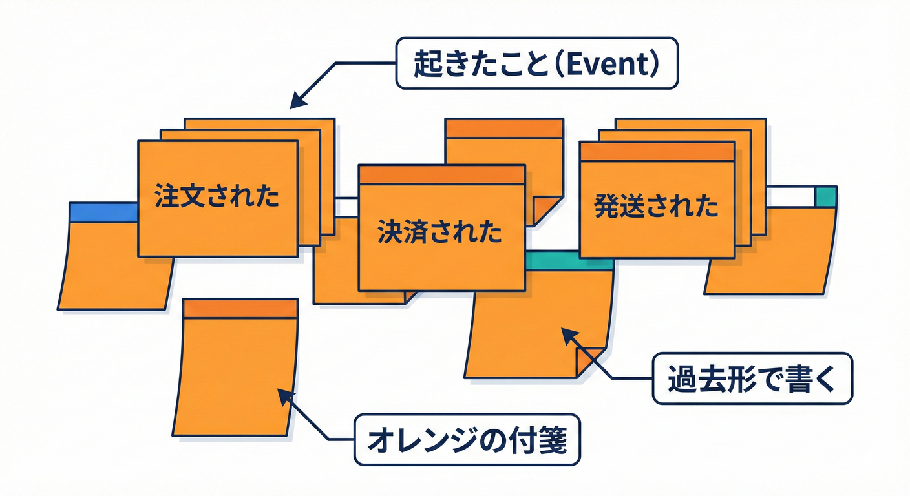
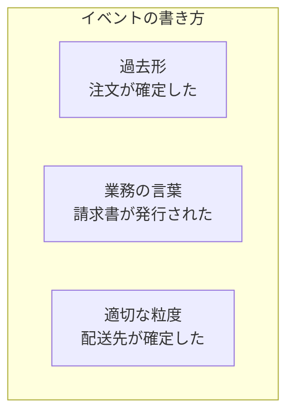

# 第13章：イベントストーミング準備編🧰🌩️

## 13.1 今日のゴール🎯✨

この章を終えたら、次ができるようになります😊💡

* 「イベント（起きた事実）」を**過去形**で書ける📝✅
* まずは**10〜20個のイベント**を無理なく出せる🌩️🌩️
* イベントストーミングを始める前に必要な**準備物・決めごと**が揃う🧰✨

---

## 13.2 そもそも「イベント」ってなに？📌

イベントストーミングで言う **イベント**は、

* **「起きた事実」**（もう起きたこと）
* だから **過去形**（〜した／〜された）で書く✍️
* “仕様”じゃなくて、“現場で起きること”を並べる✨

というものです🌩️
イベントストーミング自体も「ドメイン（業務）で何が起きているか」を、みんなで壁に出していくワークだよ〜という説明がされています。([ziobrando.blogspot.com][1])

---

## 13.3 まず決める！「今回どこまでやる？」（スコープ）🗺️✂️

いきなり全部をやろうとすると、イベントが爆発して詰みます😇💥
なので最初に「この範囲だけやる」を決めよう！

### スコープの決め方（超おすすめ）👌✨

1. **開始イベント**を決める（例：商品をカートに入れた）🛒
2. **終了イベント**を決める（例：請求が確定した／配送が完了した）📦
3. 最初は **例外を捨てる**（返品・在庫切れ・不正決済などは一旦あと！）🚧

> コツ：最初は “いちばんよくある流れ（ハッピーパス）” だけでOK😊🌸

---

## 13.4 参加メンバー（ひとりでもできるけど、複数が強い）👭👩‍💻👨‍💼

イベントストーミングは「質問できる人（開発側）」と「答えを知ってる人（業務側）」が一緒にいるのが大事、とよく説明されます。([ウィキペディア][2])

* 開発：質問して整理する役🧠🔍
* 業務（または業務に詳しい人）：現実を教える役🗣️✨
* 進行役（あなたでもOK）：止まらないように回す役⏱️

ひとりでやる時も、この“役割”を頭の中で分けると上手くいくよ😊🧩

---

## 13.5 用意するもの🧰✨（アナログでもデジタルでもOK）

イベントストーミングは「PCなしでもできる軽量ワーク」とされることが多く、壁＋付箋が基本です。([ウィキペディア][2])

### アナログ派📌🧡

* 横に長いスペース（壁／ホワイトボード／模造紙）🧱
* 付箋（最低でも複数色）🟧🟦🟨🟩🟪
* 太めのペン🖊️✨

付箋の色については、**オレンジがドメインイベント**という扱いが定番として説明されています。([ウィキペディア][2])

### デジタル派🖥️✨

* オンラインホワイトボード（付箋を並べられるやつ）🧩
* ショートカットで付箋を量産できると最高🚀

※この章では **オレンジ（イベント）だけ**使えればOKだよ🟧✅

---

## 13.6 付箋（イベント）の書き方ルール🟧📝

ここ、いちばん大事！！！💎✨

### ルール①：過去形にする（起きた事実）⏳

* ✅「注文が確定した」
* ✅「支払いが完了した」
* ❌「注文する」←これは命令/操作っぽい
* ❌「注文を作成する」←“やること”に見える

### ルール②：業務の言葉で書く（技術用語は封印）🔒

* ✅「請求書が発行された」
* ❌「DBにINSERTした」😇

### ルール③：粒度は“会話の1ターン”くらい📏

* でかすぎ：❌「注文処理が終わった」
* 細かすぎ：❌「配送先住所の郵便番号を保存した」
* ちょうどいい：✅「配送先が確定した」

---

## 13.7 色の伝説（でも、今日はイベントだけでOK）🎨✨

よくある色分けの例（流派はあるけど、初心者はこれでOK😊）

* 🟧 **ドメインイベント**（起きた事実）
* 🟦 コマンド（やる操作）
* 🟪 ポリシー（ルールで反応する）
* 🟨 集約/モデル（イベントの主役っぽいまとまり）
* 🟩 アクター/外部（人・外部システム）

こういう色の使い分け例が紹介されることがあります。([ドメイン駆動設計解説][3])

でも！この章の目的は **イベントを集めること**なので、まずは 🟧 だけでいこうね🌩️🟧

---

## 13.8 まずは「10〜20個」でOKな理由👌🌱

イベントは増やそうと思えば無限に増えます😇🌪️
だから最初は、

* “流れが見える最低限” を作る
* 次の章で並べながら増やす

この順番がラク😊✨
イベントストーミングも、まずはイベントを出していくところから始める説明が一般的です。([ウィキペディア][2])

---

## 13.9 ミニEC題材：イベントのたたき台（例）🛒📦💳

スコープ：**「注文〜配送まで（返品なし）」**でいくよ！

たとえば、こんなイベントが出せます🟧✨

1. 商品がカートに入れられた🛒
2. 注文が作成された🧾
3. 配送先が登録された🏠
4. 支払い方法が選択された💳
5. 支払いが完了した✅
6. 注文が確定した📦
7. 在庫が引き当てられた📦📉
8. 出荷指示が作成された📝
9. 荷物が出荷された🚚
10. 配送が完了した📬✅

ポイント🌟

* “やった操作”じゃなくて、“起きた事実”になってる？👀
* “技術の話”になってない？（HTTPとかDBとか）🙅‍♀️

---

## 13.10 ここでAIを使うと爆速🤖⚡（イベント出しサポート）

「文章→イベント化」はAIが得意です✨
IDEのチャットで、コードだけじゃなく文章整理にも使えるよ😊

* Copilot Chat は、コード提案だけじゃなく **説明・テスト生成・修正提案**なども頼める、と案内されています。([GitHub Docs][4])
* Visual Studio でも Copilot Chat をIDE内で使える（必要条件など）情報がまとまっています。([Microsoft Learn][5])
* VS Code には OpenAI の拡張（Codex/ChatGPT系）が提供されています。([Visual Studio Marketplace][6])

### お助けAIプロンプト（この章専用）🧙‍♀️✨

そのまま貼ってOK！👇

* 「次の文章を“過去形の業務イベント（10〜20個）”にして。技術用語は禁止：…」🟧
* 「イベントになってない（コマンドっぽい）行を指摘して、イベントに直して」🔍
* 「イベント名を、現場っぽい日本語にリネーム案3つずつ出して」🗣️
* 「粒度が細かすぎ/粗すぎのイベントを分類して」📏
* 「“同じ単語で意味がズレそう”な用語を抽出してメモ化して」🧨
* 「このイベント一覧を、開始〜終了が自然な時系列に並べ替えて」⏳

---

## 13.11 ミニ演習📝✨（手を動かすと一気に理解できる！）

### 演習A：文章→イベントへ変換🟧

次の文章を読んで、**イベントを12個**書いてみよう😊
（まずはハッピーパスだけ！）

> 会員が商品を選び、カートに入れる。
> 注文手続きをして配送先を入力する。
> クレジットカードで支払い、注文が確定する。
> 倉庫が在庫を引き当て、梱包して出荷する。
> 配送会社が届けて、配達完了になる。

✅チェック：全部「〜した／〜された」になってる？

### 演習B：イベントの質チェック✅

書いたイベントそれぞれに、○×をつけよう！

* 過去形？⏳
* 業務の言葉？🗣️
* “状態が変わった”感じがある？🔁
* 1枚に1つの事実？（2つ混ぜてない？）🧩

---

## 13.12 つまずきポイントあるある😵‍💫（先に潰そう！）

* **コマンドを書いちゃう**：「注文する」「支払う」→ “した”にする🟧
* **技術イベントが混ざる**：「API呼んだ」→ 業務の事実に戻す🧠
* **粒度がバラバラ**：でかいイベントと細かいイベントが混在📏
* **例外から入って迷子**：最初はハッピーパス固定が正義👑

---

## 13.13 今日の成果物📦✨（ここまでできたら勝ち！）

この章のゴールはこれ！🎯

* 🟧 イベント候補リスト（10〜20個）
* 📝 スコープ（開始〜終了）メモ
* 🧨 衝突しそうな用語メモ（気づいた分だけでOK）

次の章では、このイベントたちを **時系列に並べて、固まり（グループ）**を見つけていきます🌩️🧩

[1]: https://ziobrando.blogspot.com/2013/11/introducing-event-storming.html?utm_source=chatgpt.com "Introducing Event Storming"
[2]: https://en.wikipedia.org/wiki/Event_storming?utm_source=chatgpt.com "Event storming"
[3]: https://domain-driven-design-explained.pages.dev/event-storming?utm_source=chatgpt.com "Event Storming in DDD - Collaborative Domain Discovery"
[4]: https://docs.github.com/ja/copilot/how-tos/chat-with-copilot/chat-in-ide?utm_source=chatgpt.com "IDE で GitHub Copilot に質問する"
[5]: https://learn.microsoft.com/en-us/visualstudio/ide/visual-studio-github-copilot-chat?view=visualstudio&utm_source=chatgpt.com "About GitHub Copilot Chat in Visual Studio"
[6]: https://marketplace.visualstudio.com/items?itemName=openai.chatgpt&utm_source=chatgpt.com "Codex – OpenAI's coding agent"
