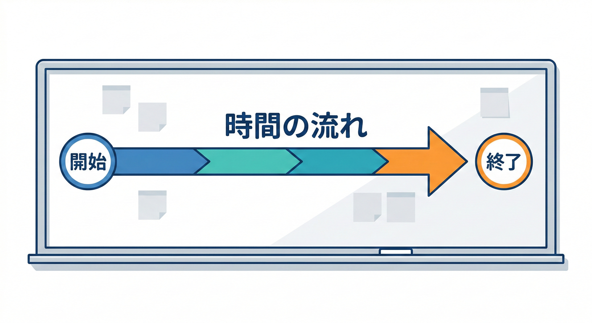
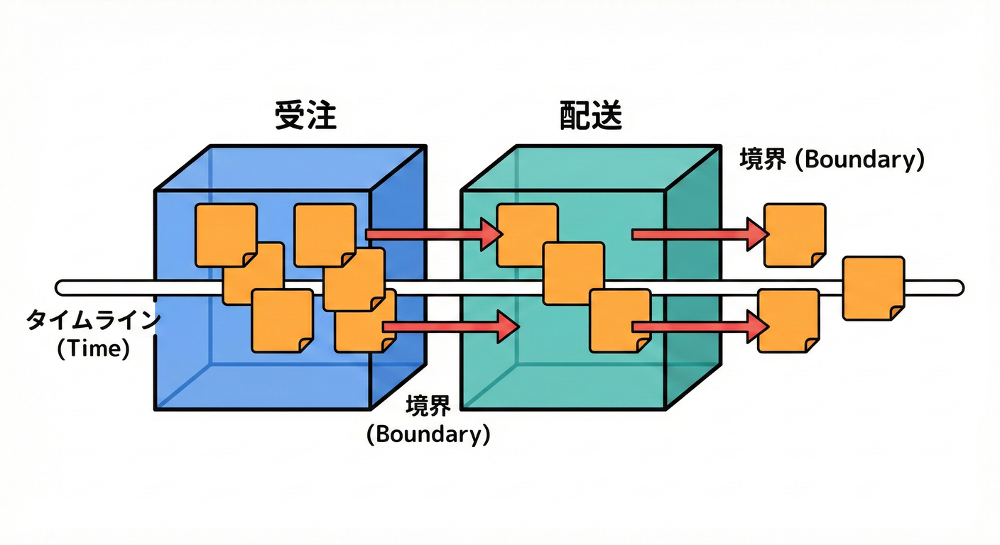
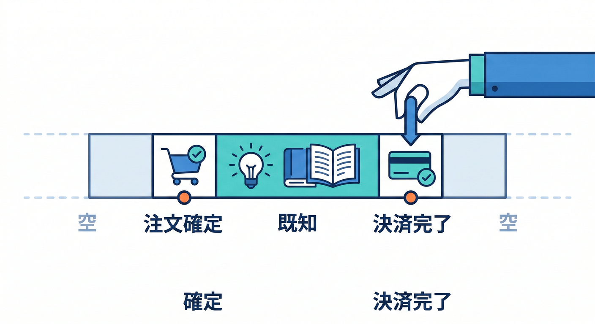
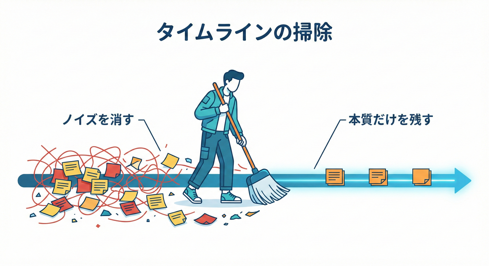
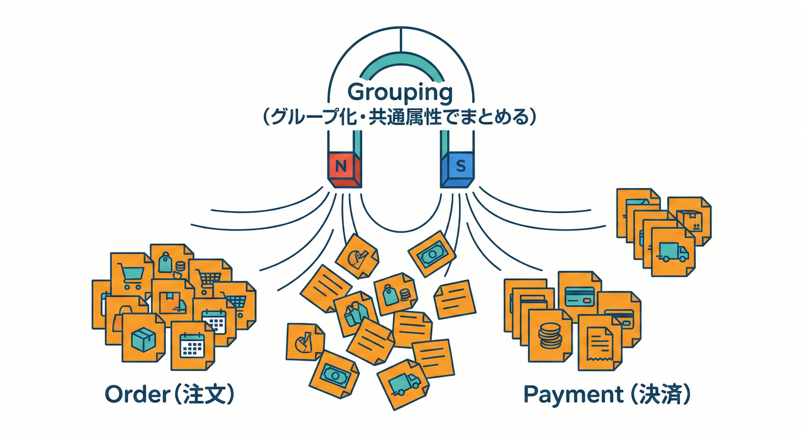
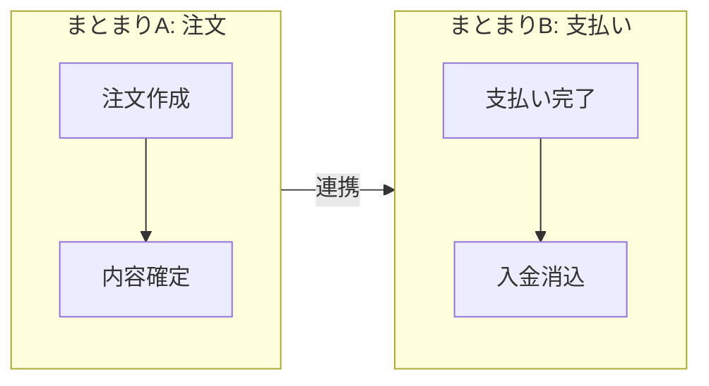
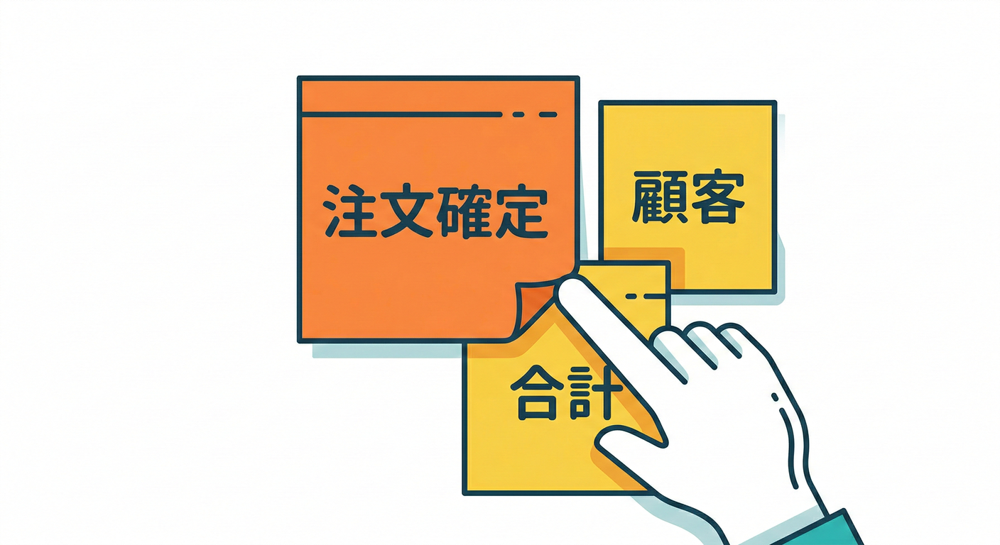
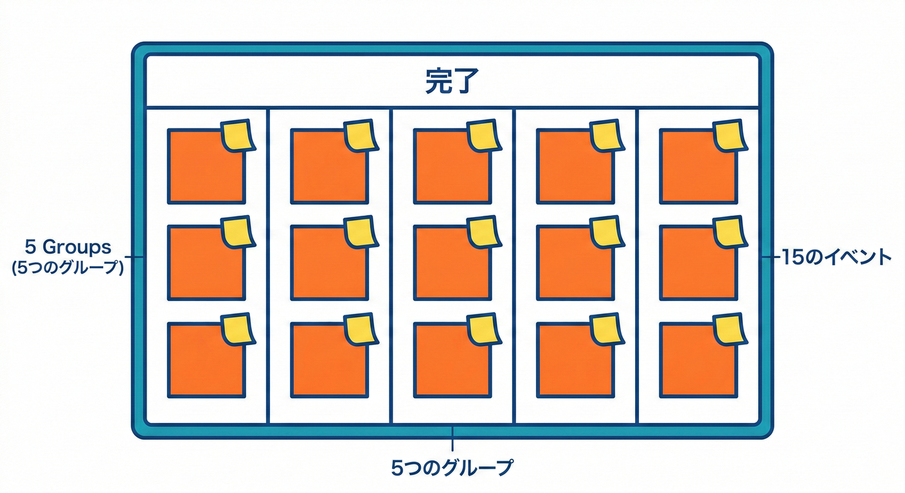

# 第14章：イベントストーミング実施編🧩🌩️

## この章のゴール🎯✨

この章が終わると、あなたは…

* イベント付箋を**時系列に並べられる**ようになる⏳✅
* 似たイベントを**グルーピング**できるようになる🧺✅
* その場で出てくる**用語（言葉）を横に書いて**“言葉のズレ”の種を集められる📝✅

---

## 1) まずは「盤面」を作ろう🧱✨

## 使うもの（リアルでもオンラインでもOK）🧡

* **長い横軸（タイムライン）**：左→右に時間が流れるようにする⏩
* 付箋（またはオンライン付箋）

  * **オレンジ：ドメインイベント**（起きた事実）🟧 ([Prooph Board Wiki][1])
  * **薄い黄色：用語・モノ（概念/オブジェクト）**🟨 ([Draft.io][2])
  * （任意）赤：困りごと/疑問/リスク🟥（あると超便利⚠️）

> オンラインでやるなら、Miro や Mural みたいなボードツールがよく使われます。([Event Storming Journal][3])

---

## 2) 実施の「大きい流れ」🌊✨

ビッグピクチャー型の基本はざっくりこう👇

1. イベントを出す🟧
2. **イベントを並べる（時系列）**⏳
3. **イベントを整理する（重複・言い方の揺れ・抜け）**🧹
4. 俳優（誰）や外部システムなどを足す（任意）👤🔌
5. ストーリーとして読み上げて検証する📖✅ ([Event Storming Journal][4])

この章は **2〜3** をメインにやるよ！🧡

---

## 3) ステップA：イベントを時系列に並べる⏳🟧

## ルールはこれだけ（超だいじ）✅

* 1枚に1イベント🟧
* イベントは「起きた事実」＝**過去形**（〜された／〜した）📌 ([Prooph Board Wiki][1])
* 迷ったら「その瞬間に“世界の状態”が変わった？」で判断👀✨

## 並べ方のコツ💡

いきなり完璧に並べなくてOK！

* **真ん中のイベント（だいたい山場）**を置く➡️そこから前後を埋めると早いよ🧠✨ ([Locastic][5])

  * 例：ミニECなら「注文が確定した」「支払いが完了した」あたりが山場になりやすい📦💳
* 大事なのは「会話が進む」ここで用語の揺れ（人によって言葉が違う）を見つけておくのが、後のBC分けで効いてくるよ！🧠💡

## 4) 次のステップ：BC（境界）の種を見つける🌱👀

---

## 4) ステップB：並べた後に“掃除”する🧹✨

ここで一気に見やすくなるよ！😳✨
タイムラインを整えるときは、次の3つだけやればOK👇

## ① 重複を消す（同じイベントが2枚ある）🗑️

* まったく同じなら1枚に統合
* 似てるけどニュアンス違いなら、赤付箋で「違いメモ」🟥📝

## ② 言い方を揃える（同じ意味の別表現）🧩

* 例：

  * 「支払いが完了した」
  * 「決済が成功した」
    どっちを採用する？→ その場の会話で決めてOK🙆‍♀️
* 後で困るので、**揃えた結果は“用語メモ”に残す**📒✨

## ③ 抜けを探す（間が飛んでる）🕳️

* 「これとこれの間、何が起きてるんだっけ？」が見つかったら勝ち🏆
* 抜けがある場所は、だいたい**境界（BC）候補の匂い**がします👃🔍
  （この話は次章でたっぷり！）

> “並べて整理するフェーズ”では、重複を消したり順番を整えたりして「全員が同じ理解」になるのが大事。([SoftwareMill][6])

---

## 5) ステップC：似たイベントを「固める」🧺✨（グルーピング）

## グルーピングって何するの？🤔

タイムライン上で、イベントを見て

* 「この辺って同じ目的っぽいよね」
* 「この区間、同じ人（部署）が責任持ってそう」
  みたいな **“まとまり”** を作る作業だよ🧡

## やり方（超かんたん）👌

1. タイムラインを眺める👀
2. 似てるイベントの近くに寄せる🧲
3. まとまりの上に「仮タイトル」を置く🏷️

   * 例：

     * 「注文を受ける」
     * 「支払いを処理する」
     * 「在庫を引き当てる」
     * 「配送を手配する」

ここでは“正解の境界”を決めなくてOK！
**仮置き**が一番えらい🙌✨

---

## 6) ステップD：「そこで使われる言葉」を横に書く📝🟨

ここが **Bounded Contextに効く**ところ！💥✨

## 何を書くの？🟨

イベントの近くに、会話で出てきた “名詞” を書くよ📌

* 人・組織：顧客、会員、担当者…👤
* モノ：注文、カート、請求、在庫、配送先…📦
* 数値：合計金額、請求金額、送料…💰
* 状態：支払いステータス、出荷ステータス…🔁

薄い黄色の付箋で「概念（モノ）」を置くのは、イベントストーミングでよく使われるやり方だよ🟨 ([Draft.io][2])

## 書き方のコツ✍️

* **同じ単語が別の意味で使われてそう**なら、同じ言葉でも2枚に分けて置く🟨🟨

  * 例：「住所」

    * 配送の住所（荷物が届く場所）📮
    * 請求の住所（請求書の宛先）🧾
* 迷ったら、横に小さく（配送）（請求）みたいに補足を書くと超ラク😊

---

## 7) 例：ミニECでやってみよう🛒✨（超ミニ版）

## ① まずイベントを並べる⏳🟧

左→右へ：

* 「商品がカートに入れられた」🟧
* 「注文が確定した」🟧
* 「支払いが完了した」🟧
* 「在庫が引き当てられた」🟧
* 「出荷が指示された」🟧
* 「荷物が発送された」🟧
* 「配達が完了した」🟧
* 「請求が確定した」🟧（※支払いの前後、どっち？って議論が起きてもOK！）

## ② 似たものを固める🧺

* まとまりA：注文🛒
* まとまりB：支払い💳
* まとまりC：在庫📦
* まとまりD：配送🚚
* まとまりE：請求🧾

## ③ 言葉を横に置く🟨

* 注文：注文、注文明細、顧客、配送先🟨
* 支払い：決済、支払い方法、与信、返金🟨
* 在庫：SKU、在庫数、引当、欠品🟨
* 配送：送り状、配送業者、追跡番号🟨
* 請求：請求書、請求先、税、締め日🟨

この時点で「え、同じ“顧客”って言ってるけど意味ズレてない？」みたいな匂いが出てきたら最高🥳✨
（次章でそれを“境界”にしていくよ！）

---

## 8) ミニ演習🎮✅（30〜45分）

## お題：ミニECの「注文〜配送」だけでOK🛒🚚

1. イベントを **15個** 書く🟧（過去形！）
2. 時系列に並べる⏳
3. 似たものを **3〜5グループ** に固める🧺
4. 各グループの横に、出てきた言葉を **10〜20個** 書く🟨
5. 赤付箋（またはメモ）で「ここ分からん！」を3つ付ける🟥

## チェック✅

* イベント名が「〜する」になってない？（それ命令っぽい！）⚠️
* グループ名が「目的」っぽくなってる？🏷️
* “同じ単語”が複数の意味で出てない？👀🟨🟨

---

## 9) つまずきポイント集😵‍💫➡️😊

## つまずき①：イベントが命令形になる（〜する）🙅‍♀️

**例：**「支払う」
**直す：**「支払いが完了した」🟧✨
（イベント＝起きた事実だよ！）([Prooph Board Wiki][1])

## つまずき②：順番の議論で止まる🛑

* “完璧な順番”より、**仮置き→ストーリーで検証**が正解📖✅ ([Event Storming Journal][4])

## つまずき③：細かすぎて地獄👹

* まずは「業務として意味のある変化」レベルにする
* 細かいのは赤メモに逃がしてOK🟥🏃‍♀️

## つまずき④：用語が増えすぎる🌪️

* “今の章”では増えてOK！むしろ増えて✨
* 次の章以降で「衝突」「ズレ」を整理していくよ🧡

---

## 10) この章のまとめ🧡✨

* 🟧イベントを**時系列**に並べる
* 🧺似たものを**固める（グルーピング）**
* 🟨横に**用語（言葉）**を書いて、ズレの種を集める
* 📖最後にストーリーで読み上げて、抜け・重複を発見する

---

## お助けAIプロンプト例🤖✨（第14章用）

* 「この業務説明を、過去形のイベント（ドメインイベント）15個にして🟧」
* 「このイベント一覧を、自然な時系列に並べ替えて⏳」
* 「似ているイベントを3〜5グループにまとめて、各グループに仮タイトルを付けて🧺🏷️」
* 「イベントの横に置くべき“用語（名詞）”を20個出して🟨」
* 「同じ単語が“別の意味”で使われていそうな箇所を指摘して👀🧨」

[1]: https://wiki.prooph-board.com/event_storming/basic-concepts.html?utm_source=chatgpt.com "Basic Concepts"
[2]: https://draft.io/example/eventstorming?utm_source=chatgpt.com "EventStorming - Example"
[3]: https://www.eventstormingjournal.com/remote%20facilitation/remote-event-storming-your-step-by-step-preparation-guide/?utm_source=chatgpt.com "Remote Event Storming: Your Step-by-Step Preparation ..."
[4]: https://www.eventstormingjournal.com/big%20picture/step-by-step-guide-to-run-your-big-picture-event-storming/?utm_source=chatgpt.com "Step by Step Guide to run your Big Picture Event Storming"
[5]: https://locastic.com/blog/intro-to-big-picture-eventstorming?utm_source=chatgpt.com "The introduction to Big Picture Eventstorming.v1"
[6]: https://softwaremill.com/big-picture-event-storming-mastering-chaos/?utm_source=chatgpt.com "Big Picture Event Storming - mastering chaos"
