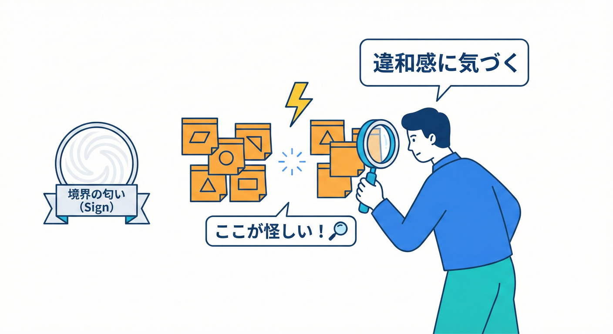
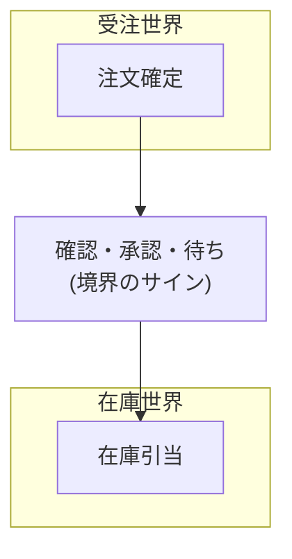
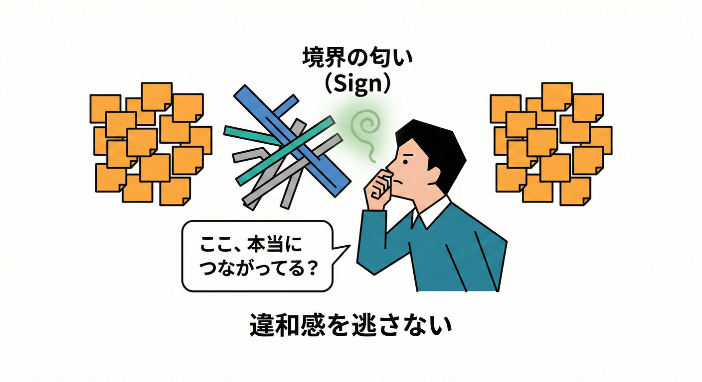

# 第15章：読み取り編（境界の“匂い”を探す）👃🔍

## この章のゴール🎯✨

イベントストーミングで並べたイベントたちから、**「ここ、境界ありそう！」**っていう“サイン”を見つけられるようになります😊
ここでの成果物はこれ👇

* **境界候補（BC候補）**：だいたい3〜6個くらいの“まとまり”🧺✨
* **境界っぽい“重いところ”メモ**：引き継ぎ・調整・待ちが起きてる場所⚡
* **衝突しそうな単語リスト**：同じ言葉が怪しいところに✅を付ける🖊️

---

## まず大事な前提（読み取りの芯）🧠✨

**Bounded Context**は「同じ言葉・同じモデルがブレずに通じる範囲」を明確にする考え方だよ🗺️✨
大きいモデルやチームが混ざると事故るから、**境界を作って関係を明示する**のが中核…って説明されてるよ。([martinfowler.com][1])

イベントストーミングは、ドメインイベントを並べて因果を見える化し、最終的に（必要なら）**集約や境界（BC）を引く**ところまでつながる手法として紹介されてるよ。([Mathias Verraes' Blog][2])

---

## 1) “匂い”チェックの全体像（この順で見ればOK）🧭✅

## ステップA：イベントの“固まり”を眺める👀🧺

* **時系列**に並んだイベントの中で、**密集してるエリア**を探す
* その固まりが「何のための流れ？」って聞かれて、**1行で言える**なら強い候補✨

💡ヒント：イベントストーミングでは、イベントが**クラスター（まとまり）**になって見えることが境界発見の入口としてよく語られるよ。([DZone][3])

---

## ステップB：イベントの“間”が重い場所を探す⚡🧱



イベントそのものより、**イベントとイベントの“間”**に境界の匂いが出るよ😊

* **確認・承認・問い合わせ・調整**が多い
* **待ち**が発生してる（在庫待ち、入金待ち、住所確認待ち…）
* **別部署/別チーム**に投げてる感じがする
* 「ここから先は別の世界」みたいに、会話が切り替わる💬🔁

こういう“摩擦”は、境界（責任の切り替え）を疑うサインになりやすいよ。BCは“分割”だけじゃなくて**所有（オーナーシップ）の境界**としても機能する、という説明もあるよ。([InfoQ][4])

---

## ステップC：同じ単語が“怪しい”場所に印を付ける🖊️🧨

次の章（第16章）でガッツリやるけど、この章では“印付け”まででOK👌✨

* 「注文」「顧客」「金額」「住所」「ステータス」あたりは**衝突しやすい**💥
* イベントの固まりが変わった瞬間に、**同じ単語なのに意味がズレそう**なら境界候補✅

---

## ステップD：境界候補に“仮ラベル”を付ける🏷️✨

ここでの命名は仮でOK！
「何をする固まり？」が伝われば勝ち😊

例：

* 受注の流れ → 「受注管理（仮）」
* 在庫の流れ → 「在庫管理（仮）」
* 配送の流れ → 「配送管理（仮）」
* お金の流れ → 「請求・決済（仮）」

---

## 2) ミニEC例でやってみよう🛒✨（境界の匂いを嗅ぐ練習）

## 例：イベント（ざっくり）🌩️

こんなイベントが時系列に並んでるとするね👇

1. OrderPlaced（注文された）🛒
2. PaymentAuthorized（決済が承認された）💳
3. StockChecked（在庫が確認された）📦
4. StockReserved（在庫が引き当てられた）📦🔒
5. OrderConfirmed（注文が確定した）✅
6. ShipmentPlanned（出荷が計画された）🚚
7. AddressConfirmed（住所が確認された）🏠
8. ShipmentPacked（荷物が梱包された）📦
9. ShipmentDispatched（発送された）🚚💨
10. InvoiceIssued（請求書が発行された）🧾
11. PaymentCaptured（決済が確定した）💰
12. RefundRequested（返金が要求された）↩️

---

## A：イベントの“固まり”を見る👀🧺

密集してるところを、目でグルーピングするよ😊
（※図は文章で表現するね✍️）

* **固まり①：注文を成立させる流れ**
  OrderPlaced → StockChecked → PaymentAuthorized → OrderConfirmed ✅

* **固まり②：在庫を押さえる流れ**
  StockChecked → StockReserved → （欠品なら別ルート）📦

* **固まり③：配送する流れ**
  ShipmentPlanned → AddressConfirmed → ShipmentPacked → ShipmentDispatched 🚚

* **固まり④：お金・請求の流れ**
  InvoiceIssued → PaymentCaptured → RefundRequested 💳🧾

ここで大事なのは、「固まりごとに“目的”が違う？」って見ること！
目的が違うなら、モデル（言葉）も違って当然だよね😊✨

---

## B：“間が重い”場所を探す⚡

例えばここ👇

* OrderConfirmed ↔ StockReserved の間
  → 「在庫確保できた？」の確認が入るなら、摩擦ポイント⚡

* ShipmentPlanned ↔ AddressConfirmed の間
  → 住所不備の問い合わせ、修正依頼、待ち…が起きるなら重い⚡

* InvoiceIssued ↔ PaymentCaptured の間
  → 決済失敗・再決済・与信期限…があるなら、会話の世界が変わる⚡

こういう摩擦は「責任が切り替わってる」匂いになりやすいよ😊
境界は“分けるため”というより、**混ざると壊れる場所を守るため**に引く感じ！([martinfowler.com][1])

---

## C：“衝突しそうな単語”をマークする🖊️🧨

例）「注文（Order）」

* 固まり①では「購入の意思決定＋明細＋注文確定」っぽい
* 固まり③では「配送の対象（届けるもの）」っぽい
* 固まり④では「請求の対象（課金・返金の単位）」っぽい

同じ“Order”でも、見てる世界が違う匂いがするよね😵‍💫
この“匂いメモ”境界が「重い（違和感が強い）」場所こそ、BCを分けるべきヒントになるんだよ🗝️✨





## 6) まとめ：境界は「事実」から浮き出てくる🧡

---

## 3) “境界の匂い”あるあるチェックリスト✅👃

## 匂い①：目的が違う（ゴールが違う）🎯

* 「この固まりの目的を1行で言って」って聞かれて、**別の答えになる**
  → 境界候補✅

## 匂い②：会話に出てくる人が違う👥

* 受注担当、倉庫担当、配送担当、経理…みたいに登場人物が変わる
  → 境界候補✅

## 匂い③：ルールが違う📏

* 在庫引き当てルール、送料計算、返金条件…が別々に進化する
  → 境界候補✅

## 匂い④：調整・確認・待ちが多い⚡

* 「確認して折り返します」
* 「承認待ち」
* 「他部署に問い合わせ」
  → 境界の“縫い目（seam）”っぽい✅

## 匂い⑤：同じ単語が怪しい🧨

* 注文/顧客/金額/住所/ステータス
  → “衝突警報”🚨（次章で深掘り）

---

## 4) ミニ演習✍️🎮：境界候補を3つ出してみよう

## お題🌩️

次のイベントの列から、**境界候補を3つ**作って、各候補に「目的（1行）」を付けてね😊

* OrderPlaced / OrderCancelled
* StockChecked / StockReserved / StockReleased
* ShipmentPlanned / ShipmentDispatched / DeliveryFailed
* InvoiceIssued / PaymentCaptured / RefundRequested

## 進め方（テンプレ）🧾✨

1. 似てるイベントを固める🧺
2. 固まりに「目的（1行）」を付ける🏷️
3. 固まり同士の“間”が重いところに⚡マーク
4. 怪しい単語に🧨マーク

---

## 解答例（1つの例だよ）✅

* 境界候補A：受注（目的：購入の意思決定を成立させる）🛒
* 境界候補B：在庫（目的：在庫を確保・解放して欠品を制御する）📦
* 境界候補C：配送（目的：荷物を届け切るための計画と実行を管理する）🚚
  （＋お金系は第4候補として出ても自然💳）

---

## 5) “境界の匂い”をコードでもちょい体験💻✨（同名を分ける感じ）

同じ「Order」でも、境界が違えば**別物**にしてOK🙆‍♀️
（この章では“雰囲気をつかむ”だけでOK！）

```csharp
namespace OrderManagement.Domain;

// 受注の「注文」：購入の意思決定と明細が中心🛒
public sealed record OrderId(Guid Value);

public sealed class Order
{
    public OrderId Id { get; }
    public IReadOnlyList<OrderLine> Lines { get; }
    public OrderStatus Status { get; private set; }

    public Order(OrderId id, IReadOnlyList<OrderLine> lines)
    {
        Id = id;
        Lines = lines;
        Status = OrderStatus.Placed;
    }
}

public sealed record OrderLine(string Sku, int Quantity);

public enum OrderStatus { Placed, Confirmed, Cancelled }
```

```csharp
namespace Shipping.Domain;

// 配送の「注文」っぽいもの：届けるための情報が中心🚚
public sealed record ShipmentId(Guid Value);

public sealed class Shipment
{
    public ShipmentId Id { get; }
    public string DestinationAddress { get; private set; }

    public Shipment(ShipmentId id, string destinationAddress)
    {
        Id = id;
        DestinationAddress = destinationAddress;
    }
}
```

ポイントはこれ👇✨

* **名前が似てても、責務が違えば分ける**
* “混ぜると便利そう”に見えるけど、後で爆発しがち💣
  （この“爆発”を防ぐのがBCの価値だよ🛡️）([martinfowler.com][1])

---

## 6) つまずきポイント集😵‍💫➡️😊

## つまずき①：イベントを“機能別”に切りすぎる✂️

「一覧」「登録」「更新」みたいなUI都合の切り方になってると、境界が弱くなりがち💦
→ まずは **業務目的**で固めよう🎯

## つまずき②：名詞（テーブル）で切りたくなる📚

「OrderテーブルがあるからOrder境界！」ってやると、だいたい“中心概念の罠”にハマることがあるよ⚠️
（中心の名詞を境界扱いするのが危ない、という話もある）([Medium][5])

## つまずき③：境界を一発で確定しようとする🔨

境界は育つもの🌱
ワークロードや状況で見直されることもあるよ、って説明されてる。([Microsoft Learn][6])
→ この章は「仮置きでOK！」が合言葉😊

---

## 7) お助けAIプロンプト🤖✨（読み取り特化）

そのままコピペで使えるよ🧡

```text
あなたはDDDのファシリテーターです。
以下のドメインイベント一覧を、目的が近いもの同士で3〜6個にクラスタリングしてください。
各クラスタに「目的（1行）」と「境界っぽいサイン（調整/待ち/確認）」を箇条書きで添えてください。
```

```text
以下のイベント時系列の中で、「ここが境界の縫い目（seam）になりそう」な箇所を3〜8個挙げてください。
それぞれについて、なぜ摩擦が起きそうか（確認/承認/待ち/責務の切替）を説明してください。
```

```text
以下のイベント一覧から、衝突しそうな単語（同じ言葉で意味が変わりそう）を抽出し、
「出現するクラスタ」「意味の違いの仮説」をセットで表にしてください。
```

---

## まとめ🌸✨

* **イベントの固まり**＝境界候補の入口🧺
* **イベントの“間”が重い**＝境界の匂いが強い⚡
* **同じ単語が怪しい**＝衝突の予兆🧨
* 境界はまず**仮置き**でOK、次章からズレを掘って精度を上げるよ😊([martinfowler.com][1])

[1]: https://www.martinfowler.com/bliki/BoundedContext.html?utm_source=chatgpt.com "Bounded Context"
[2]: https://verraes.net/2013/08/facilitating-event-storming/?utm_source=chatgpt.com "Facilitating Event Storming"
[3]: https://dzone.com/articles/demystifying-event-storming-design-level?utm_source=chatgpt.com "Demystifying Event Storming (Part 4)"
[4]: https://www.infoq.com/articles/adaptive-socio-technical-systems-flow/?utm_source=chatgpt.com "Adaptive, Socio-Technical Systems with Architecture for Flow"
[5]: https://medium.com/navalia/the-most-common-domain-driven-design-mistake-6c3f90e0ec2b?utm_source=chatgpt.com "The Most Common Domain-Driven Design Mistake"
[6]: https://learn.microsoft.com/en-us/azure/architecture/microservices/model/domain-analysis?utm_source=chatgpt.com "Using domain analysis to model microservices"
