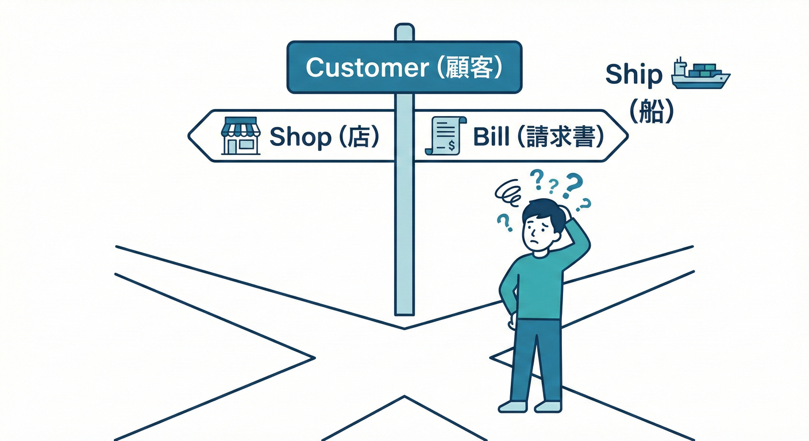
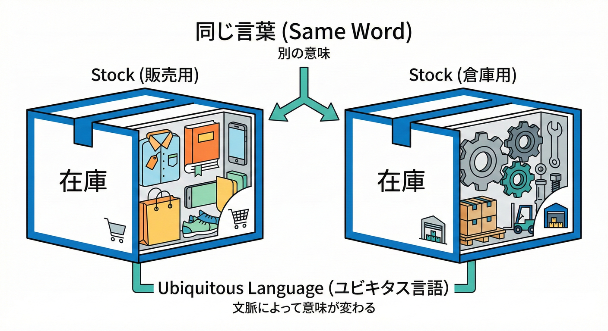
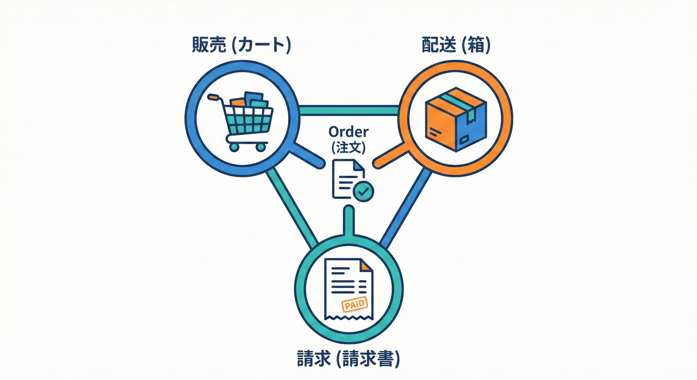
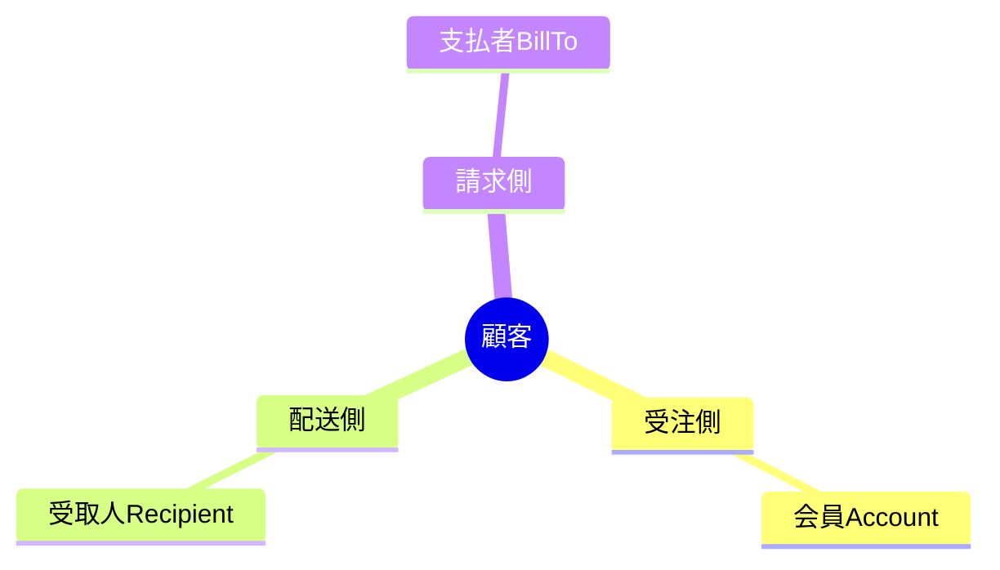
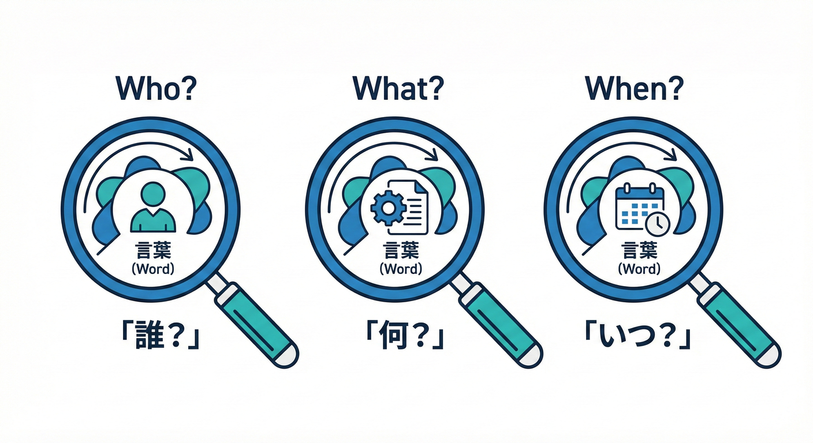
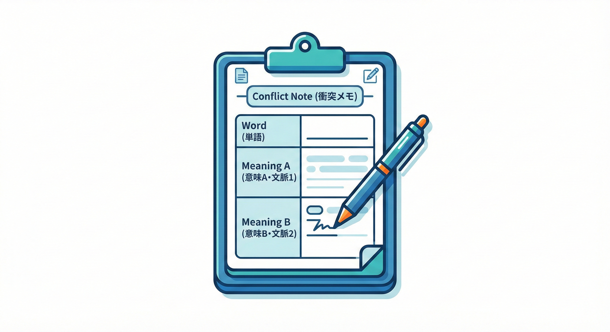
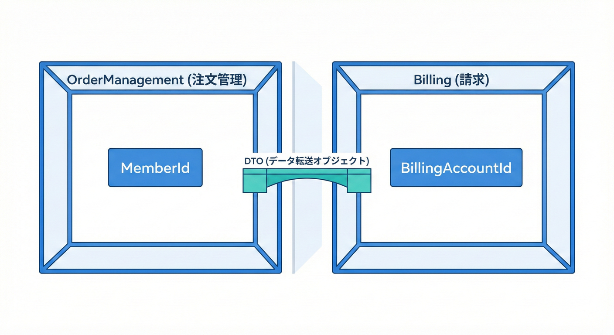

# 第16章：ズレ探しA「同じ単語・意味が違う」🧨

## この章のゴール🎯✨

* 「同じ単語なのに、意味が違う」ポイントを見つけられるようになる🔍📝
* 見つけたズレを、**“衝突メモ”**にして整理できるようになる📒✨
* そのズレが「境界（Bounded Context）」のヒントになる感覚をつかむ🗺️💡
  （Bounded Contextは“その中では言葉の意味が一貫する範囲”だよ〜、という話につながるよ✅） ([vaadin.com][1])

---

## 1) まず「同名異義」ってなに？🤔🌀



**同名異義**＝**同じ単語なのに、部署/目的/タイミングで意味が変わる**ことだよ🙋‍♀️✨
たとえば「顧客」「注文」「金額」「住所」…ぜんぶ事故りやすい単語たち💥

DDDでは、こういう“言葉のあいまいさ”を放置すると、コードがすぐ壊れやすくなるから、
**「その言葉が通じる範囲（＝境界）をはっきりさせよう」**って考えるよ🧠🔒 ([vaadin.com][1])

---

## 2) ミニECでよくある「同じ単語・意味ちがう」例🛒💥

## 例A：「顧客（Customer）」が3人いる👤👤👤



* 受注の文脈：**会員（注文した人）**
* 請求の文脈：**支払い責任者（請求先）**
* 配送の文脈：**受取人（届け先）**

📌ここで「Customerを1つのクラスに全部詰める」と…

* `Customer.Address` ← え、**配送先？請求先？**😵‍💫
* `Customer.Name` ← え、**会員名？受取人名？**😇
* ルールも分岐だらけ：`if (用途 == 請求) ... else if (用途 == 配送) ...` 💣

---

## 例B：「注文（Order）」が部署で別物📦🌀



* 受注：**カート→確定→キャンセル**を扱う「注文」
* 配送：**梱包単位・送り状**が主役の「注文」
* 請求：**請求書・入金・締め**が主役の「注文」

同じ“Order”でも、**見てる世界が違う**んだよね👀✨ ([vaadin.com][1])



---

## 3) ズレを見つける「3ステップ」🔍➡️📝➡️🗺️

## ステップ①：怪しい単語リストを作る📝🚨

イベントストーミングのイベント（過去形）を眺めて、
**名詞を抜き出す**よ✂️✨

例：

* 注文が確定した📦
* 支払いが確定した💳
* 出荷が確定した🚚
* 住所が登録された🏠
* 返金が確定した💸

ここから「注文」「支払い」「住所」「金額」「顧客」みたいな単語を候補にする🎯

---

## ステップ②：その単語を「誰の視点？」で分解する👀🧩



同じ単語でも、**視点が変わると意味がズレる**よ！

単語ごとに、この3問を当てると超強い💪✨

1. **誰が**その単語を使う？（部署/役割）👤
2. **何を決めるため**に使う？（判断/責任）⚖️
3. **いつ**使う？（どのイベントの前後？）⏳

✅この3つが違うなら、**意味が別物の可能性が高い**！

---

## ステップ③：「衝突メモ」にして固定する📒🔒

見つけたズレは、**“メモ化して固定”**が大事！
頭の中に置くと、だいたい忘れて混ざる😇

---

## 4) 衝突メモのテンプレ📝✨（この章の主役）



下のテンプレをコピって、単語ごとに埋めるだけでOK👌💕

**衝突メモ（テンプレ）**

* 対象単語：＿＿＿＿
* 意味A（文脈/視点）：＿＿＿＿

  * 使う人：＿＿＿＿
  * 代表イベント：＿＿＿＿
  * 重要ルール：＿＿＿＿
* 意味B（文脈/視点）：＿＿＿＿

  * 使う人：＿＿＿＿
  * 代表イベント：＿＿＿＿
  * 重要ルール：＿＿＿＿
* 似てるデータ：＿＿＿＿（例：住所、金額）
* **決定**：

  * ☐ 同じ単語のまま（用語統一する）
  * ☐ **別名にする**（例：ShippingAddress / BillingAddress）
  * ☐ **境界を分ける候補**（BC候補：＿＿＿＿ / ＿＿＿＿）

📌「ユビキタス言語はBounded Contextの中で育てる」ので、こういうメモが効いてくるよ📚✨ ([GitHub][2])

---

## 5) “図（文章で）”でズレを可視化しよう🗺️✍️


例：「住所」🏠が混ざってるケース

* 【受注】住所＝**届け先住所（配送のため）**📦🚚
* 【請求】住所＝**請求先住所（請求書のため）**💳🧾

文章図にすると、こう👇

* 受注の会話：
  「この**住所**に商品を届けたい」
* 請求の会話：
  「この**住所**に請求書を送りたい」

同じ「住所」でも、**目的（責任）が違う**＝ズレのサイン🚨✨

---

## 6) ミニ演習①🧩📝（ズレ探しウォーミングアップ）

次のイベントから「同じ単語・意味が違いそう」な単語を3つ選んで、衝突メモを書こう💪✨

* 注文が確定した📦
* 送料が計算された🧮
* 請求書が発行された🧾
* 出荷が確定した🚚
* 住所が更新された🏠
* 返金が確定した💸

## 解答例（1つだけ）✅

* 対象単語：住所
* 意味A：配送先住所（出荷のため）🚚
* 意味B：請求先住所（請求書のため）🧾
* 決定：別名にする（ShippingAddress / BillingAddress）＋境界の候補にもなる🗺️✨

---

## 7) ミニ演習②🧠⚖️（“境界候補”まで進める）

「顧客（Customer）」が衝突してるとき、次のうちどれが良さそう？（理由も1行で）

A. Customerを1つにしてプロパティ増やす📦
B. 名前を分ける（Member / BillTo / ShipTo）🏷️
C. “顧客”という単語を禁止する🚫

## 解答の方向性✅

* だいたい **Bがスタートとして強い**💪✨
  同じ単語を無理やり統一すると、ルールが混ざって壊れやすいからだよ💥
  （“境界の中では言葉の意味が一貫してる”状態に寄せたい） ([vaadin.com][1])

---

## 8) C#で「同名異義を分ける」超ミニ実装💻🔒



ポイントはこれ👇

* **同じ“Customer”でも別namespace（＝別コンテキスト側）に置く**📁✨
* 境界を越えるときは **DTO（契約の形）**にして渡す📨

```csharp
// ✅ 受注側（OrderManagement）の「Customer」＝会員
namespace Shop.OrderManagement.Domain;

public readonly record struct MemberId(string Value);

public sealed record ShippingAddress(
    string PostalCode,
    string Prefecture,
    string City,
    string Street
);

public sealed record Order(
    string OrderId,
    MemberId Buyer,              // 注文した会員
    ShippingAddress ShipTo,      // 届け先（配送のため）
    decimal OrderTotal
);
```

```csharp
// ✅ 請求側（Billing）の「Customer」＝請求先（支払い責任）
namespace Shop.Billing.Domain;

public readonly record struct BillingAccountId(string Value);

public sealed record BillingAddress(
    string PostalCode,
    string Prefecture,
    string City,
    string Street
);

public sealed record Invoice(
    string InvoiceId,
    BillingAccountId BillTo,     // 支払い責任者
    BillingAddress BillingTo,    // 請求先住所
    decimal InvoiceAmount
);
```

```csharp
// ✅ 境界を越えるときのDTO（Published Languageの“入口”っぽいもの）📨
namespace Shop.Contracts;

public sealed record OrderPlacedDto(
    string OrderId,
    string BuyerMemberId,
    string ShipToPostalCode,
    decimal OrderTotal
);
```

「同じCustomerを共有しない」っていうだけで、混乱が激減するよ😊✨
（C# 13 は .NET 9 SDK と最新の Visual Studio 2022 で試せるよ。） ([Microsoft Learn][3])

---

## 9) つまずきポイント集🧯😵‍💫

* **「同じ単語なんだから統一すべき！」と思いがち**
  → でも、意味が違うなら統一すると事故る💥（用語統一より“境界分離/別名”が先のことも多い）
* **DBの列が同じだから同じ意味、と勘違い**
  → データ形が似てても、責任（ルール）が違うと別物📦⚡
* **「あとで整理する」って保留し続ける**
  → まず衝突メモにして“見える化”しよう👀📝（保留でもOK、放置がNG🙅‍♀️）

---

## 10) 今日のチェックリスト✅✨（提出前に見るやつ）

* 同じ単語が、イベントの別の場所で出てくる？🔁
* その単語で、**決めてること（判断/責任）**が違う？⚖️
* その単語の“正しい形”が、部署で揉めそう？😇
* 「別名にした方が会話が速い」感じがある？🚀
* 衝突メモに書いた？📒✅

---

## 11) お助けAIプロンプト🤖✨（この章専用）

* 「次のイベント一覧から、同じ単語で意味が変わっていそうな候補を10個出して。候補ごとに“別の意味”を2案ずつ書いて」🔍📝
* 「この文章中の“顧客/注文/住所/金額”が、文脈によって何を指すか分類して（受注/請求/配送）」🧩👀
* 「“衝突メモ”をこのテンプレで埋めて：対象単語/意味A/意味B/代表イベント/重要ルール/決定」📒✅
* 「Customerを1つにまとめた設計が生む問題を、具体例（プロパティ・if・テスト）で説明して」💥🧪
* 「別名にするなら命名案を5つ（Member/BillTo/ShipToなど）＋メリットも添えて」🏷️✨

[1]: https://vaadin.com/blog/ddd-part-1-strategic-domain-driven-design?utm_source=chatgpt.com "DDD Part 1: Strategic Domain-Driven Design"
[2]: https://github.com/SAP/curated-resources-for-domain-driven-design/blob/main/blog/0002-core-concepts.md?utm_source=chatgpt.com "The Core Concepts of Domain-Driven Design"
[3]: https://learn.microsoft.com/en-us/dotnet/csharp/whats-new/csharp-13?utm_source=chatgpt.com "What's new in C# 13"
