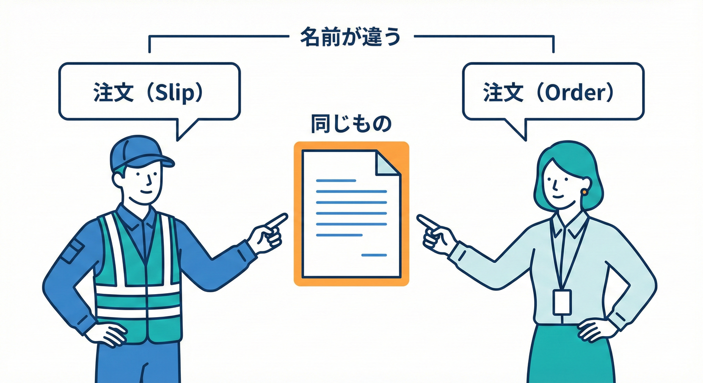
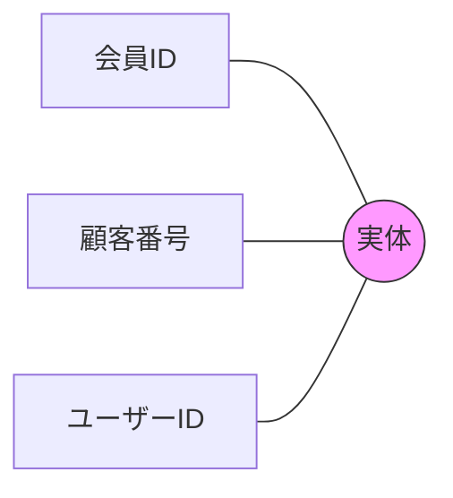

# 第17章：ズレ探しB「同じ意味・言い方が違う」🌀

## この章でできるようになること🎯✨

* 「同じ意味なのに呼び方が違う」用語を発見できる🔍
* “用語の二重管理”が起こす事故パターンを説明できる💥
* 「用語統一する？それとも境界を分ける？」を判断できる⚖️
* C#で“言葉のズレ”をコードに持ち込まない形にできる💻🔒

---

## 1. 今日のテーマ：**同義語のズレ**って何？🌀

## 例（ミニEC）🛒



* 「会員ID」＝「顧客番号」＝「ユーザー識別子」
* 「請求先」＝「決済先」＝「支払い先」

これ、**意味が同じ**のに、チームや資料・画面ごとに呼び方がバラバラな状態だよ〜って話です😵‍💫

### 何が困るの？😇

* 仕様書Aでは「会員ID」、DBでは「customer_no」、画面では「ユーザーID」…
  → **“同じ物なのに別物っぽく見える”**👻
* コードに「MemberId」「CustomerNo」「UserId」が共存
  → **変換・if・勘違いが増える**🧨

---

## 2. 「第16章（同じ単語・意味が違う）」との違い👀✨

* 第16章：**同じ言葉なのに中身が違う**（例：「注文」が部署で別物）🧨
* 第17章：**中身は同じなのに呼び方が違う**（例：「会員ID」と「顧客番号」が同じ）🌀

どっちも事故るけど、治し方がちょっと違うよ〜！🧯✨



---

## 3. 事故の起き方：同義語ズレの“3大あるある”💣

## あるある①：二重登録・二重更新が起きる🧟‍♂️🧟‍♀️

「会員ID」と「顧客番号」を別物だと思って、別テーブルに保存しちゃう…
→ 後で「同期ズレ」が発生してカオス😇

## あるある②：変換ロジックが増殖する🧬

「memberId → customerNo → userId」の変換が、あちこちでコピペされる
→ 仕様変更で全部探して直す羽目に…😵‍💫

## あるある③：レビューで誰も確信が持てない😶‍🌫️

* 「これ、会員ID入れていいんだっけ？」
* 「顧客番号って、請求の顧客番号？それとも会員の？」
  → 会話コストが上がって、開発速度が落ちる🐢💦

---

## 4. 発見手順：同義語ズレを“見つけるテンプレ”🔍📌

## Step 1：用語を“素材”から集める🧺

次から拾うのがコツだよ〜👇

* 画面項目名（ラベル、入力名）🖥️
* API/DTOのフィールド名📨
* DBカラム名🗄️
* 仕様書・議事録・チャットの単語💬
* イベントストーミングで出た言葉🌩️

## Step 2：用語カードを作る📇✨（超おすすめ）

「単語」じゃなくて「意味（定義）」が主役！

| ID   | 用語     | 定義（1文）            | 使ってる場所      | 備考     |
| ---- | ------ | ----------------- | ----------- | ------ |
| T-01 | 会員ID   | 会員アカウントを一意に識別するID | 注文画面 / 会員DB | 文字列    |
| T-02 | 顧客番号   | 会員アカウントを一意に識別するID | 請求画面 / 請求DB | 同じ定義!? |
| T-03 | ユーザーID | 会員アカウントを一意に識別するID | 管理画面        | これも同じ  |

👉 **定義が同じなら、同義語ズレ候補！**🌀✅

## Step 3：同義語ズレ候補に“しるし”を付ける🖊️

* 定義が同じ
* 参照してる実体が同じ（同じID体系・同じ元データ）
* 会話で「それ同じ意味だよね？」が頻発する

---

## 5. 判断ポイント：「統一」or「分離」or「翻訳」⚖️✨

## ✅ A) **同じBCの中**なら：基本は“用語統一”🏷️✨

BCの中は「ユビキタス言語」が命！🗣️

* 1つの概念に、1つの名前
* 同義語は“別名”として残してもいいけど、コードの中心には置かない🙅‍♀️

**統一すると良いサイン**🌈

* チームが同じ会話をしてる
* テストが書きやすい
* DTOやプロパティがスッキリする✨

## ✅ B) **別BC同士**で同じ意味なら：Published Language（公開語彙）で揃える📢

別BCでも「やりとりの契約」は揃えると事故が減るよ〜！

* API/イベント/DTOのフィールド名を統一する
* “外向きの言葉”を決める（＝公開語彙）📌

## ✅ C) 相手の都合で名前が変えられないなら：ACLで翻訳🛡️📖

外部システムや別チームの都合で「customer_no」固定…みたいな時は、
**境界で翻訳して中に持ち込まない**のが正解🙆‍♀️

---

## 6. C#で“同義語ズレ”を封じる実装パターン💻🔒

## パターン①：**強い型（Strongly Typed ID）で“同じ物”を固定する**🧷

文字列のままだと「memberId」「customerNo」が混ざりやすいよ〜！😇
そこで、**同じ概念は同じ型**にしちゃう作戦✨

```csharp
public readonly record struct CustomerId(string Value)
{
    public override string ToString() => Value;
}
```

これでメソッド引数もこうできる👇

```csharp
public sealed class OrderService
{
    public void PlaceOrder(CustomerId customerId)
    {
        // customerId は “会員アカウントを識別するID” として統一✨
    }
}
```

**嬉しいポイント**😍

* 「会員ID入れたつもりが顧客番号だった」みたいな事故が減る
* “同じ意味”がコードに刻まれる🧠✨

---

## パターン②：DTOの名前は“公開語彙”、ドメインは“内部語彙”で守る📨🏠

外の世界がどう呼んでても、内側の言葉は守りたいよね🛡️

例：外部APIが `customerNumber` で来るけど、内部は `CustomerId` に統一する👇

```csharp
using System.Text.Json.Serialization;

public sealed record BillingCustomerDto(
    [property: JsonPropertyName("customerNumber")] string CustomerNumber
);

public static class BillingMapper
{
    public static CustomerId ToCustomerId(BillingCustomerDto dto)
        => new CustomerId(dto.CustomerNumber);
}
```

👉 **“変換は境界で1回だけ”**が合言葉だよ〜🔁✨

---

## パターン③：命名ルールを“機械に見張らせる”🤖✅

* 「同じ概念は同じ単語を使う」ルールをチームで決める
* 可能なら命名規約＋レビュー＋静的解析でブレを早期に発見👀

AI補助も相性いいよ✨

* GitHubの **GitHub Copilot** は Visual Studio では 17.10 以降で統合拡張として案内されてるよ📌([Visual Studio][1])
* Microsoftのドキュメントでも、C# 14 は .NET 10 SDK / Visual Studio 2026 で試せるって明記されてるよ🆕([Microsoft Learn][2])
* .NET 10 は 2026-01-13 に更新が出てるよ（10.0系の更新情報）🧰([マイクロソフトサポート][3])
* Visual Studio 2026 のリリースノートも公開されてるよ📝([Microsoft Learn][4])

（“最新の公式情報”として、上の4つはチェック済みだよ〜✅）

---

## 7. ミニ演習：同義語ズレを見つけて直そう🧩📝

## お題：同じ意味っぽい言葉が混ざってる！😵‍💫

次の用語を「同じ意味グループ」にまとめてね👇

* 会員ID
* 顧客番号
* ユーザーID
* 請求先
* 決済先
* 支払い先
* 配送先

## 手順（テンプレ通りでOK）✅

1. それぞれ「定義（1文）」を書く📝
2. 定義が同じものをグルーピング🧺
3. 各グループで“採用する代表名（1つ）”を決める🏷️
4. 代表名以外は「別名（エイリアス）」としてメモに残す📒

## 仕上げ（コード案）💻✨

* 「会員ID/顧客番号/ユーザーID」グループ → `CustomerId` で統一
* DTOやDBで別名が必要 → 境界で `[JsonPropertyName]` や Mapper で吸収

---

## 8. つまずきポイント集（ここで詰まりがち）🧯😇

## ❌ 罠1：「同じ意味だと思ったら違った」

たとえば

* 会員ID＝会員サービスのID
* 顧客番号＝請求システムの顧客ID（別体系）
  みたいに **ID体系が違う**なら、それは第16章側（意味が違う）かも👀⚠️

## ❌ 罠2：「統一したいのに、外部都合で変えられない」

→ 無理に内部まで汚さず、ACL（翻訳層）で守る🛡️

## ❌ 罠3：「“共通”に逃げて、共有モデル化しちゃう」

“共通Customer”みたいなのを作ると、別の衝突が起きがち💥
→ まずは **BC内の用語統一**からが安全だよ〜🚶‍♀️✨

---

## 9. この章のまとめ💐

* **同じ意味なのに呼び方が違う**のは、事故の温床🌀
* まずは「用語カード（定義）」で、同義語ズレを可視化📇
* 同じBC内は **用語統一**が基本🏷️
* 外部都合があるなら **境界で翻訳（ACL/Mapper）**🛡️
* C#では **強い型（CustomerId など）**で“同じ物”を固定すると強い💪

---

## お助けAIプロンプト例🤖✨（第17章用）

* 「次の用語リストを、定義が同じもの同士でグルーピングして」🧺
* 「“同じ意味・別名”になっている可能性が高いペアを列挙して」🔍
* 「代表用語（ユビキタス言語）を1つ選び、別名の扱いルールも提案して」🏷️
* 「DTOのフィールド名はそのままで、ドメイン側の命名を統一するC#のMapper例を書いて」📨💻
* 「Strongly Typed ID（record struct）で、混同を防ぐ設計に直して」🧷✅

---

## 次章予告ちょい見せ👀✨

次は **第18章：データは似てるけど責務が違う**📦（“似てる罠”を見破る回）だよ〜！

[1]: https://visualstudio.microsoft.com/github-copilot/?utm_source=chatgpt.com "Visual Studio With GitHub Copilot - AI Pair Programming"
[2]: https://learn.microsoft.com/ja-jp/dotnet/csharp/whats-new/csharp-14?utm_source=chatgpt.com "C# 14 の新機能"
[3]: https://support.microsoft.com/en-us/topic/-net-10-0-update-january-13-2026-64f1e2a4-3eb6-499e-b067-e55852885ad5?utm_source=chatgpt.com ".NET 10.0 Update - January 13, 2026"
[4]: https://learn.microsoft.com/ja-jp/visualstudio/releases/2026/release-notes?utm_source=chatgpt.com "Visual Studio 2026 リリース ノート"
