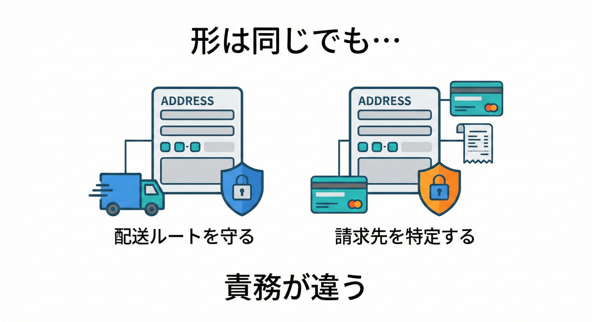
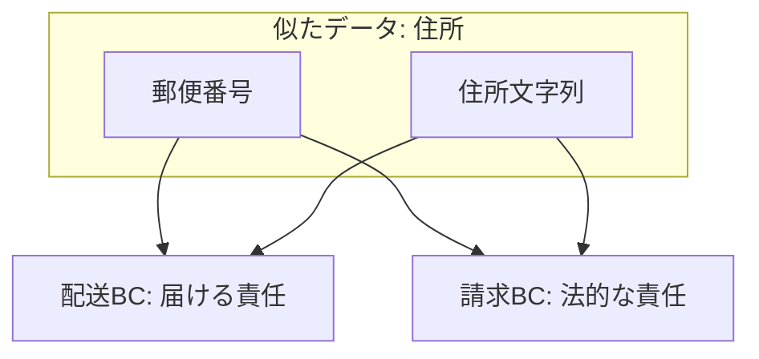

# 第18章：ズレ探しC「データは似てるけど責務が違う」📦

## ねらい（この章でできるようになること）🎯💡

* 「同じっぽいデータ」を見た瞬間に、**“責務（役割）が違う別物かも”**って気づける👀✨
* 「分ける？共有する？」の判断を、**感覚じゃなく質問で**できるようになる🧩✅
* C#で、**同名・同形のデータを“混ぜない”**ミニ実装ができる💻🔒

---

## 1. まず大事な前提：BCは「モデルが通用する範囲」🗺️

Bounded Context は、**あるモデル（言葉・ルール・意味）が一貫して通用する範囲**だよ〜📌
境界をまたぐと、同じ単語でも意味が変わってOK🙆‍♀️（むしろ混ぜると事故る）💥 ([martinfowler.com][1])

そしてこの章のテーマはここ👇
**「データの形が似てる」＝「同じもの」じゃない** 😇✨

---

## 2. 今日の主役：責務ズレ（見た目そっくりトラップ）🪤😵‍💫

「住所」「金額」「顧客」「注文」…
これらって、システムのあちこちに出てくるよね？

でも👇

* 住所：**配送の住所** と **請求の住所**
* 金額：**注文合計** と **請求金額（請求書）**

こういうのは、**データが似てても“責任の置き場”が違う**ことが多いよ〜📦✨

---

## 3. “責務が違う別物”を見抜く 5つの質問🔍📝✨



似てるデータを見たら、この5問を当ててみてね👇（ここ超つよい💪）

1. **何のためのデータ？（目的）** 🎯
2. **誰が責任者？（所有者 / 決定権）** 👑
3. **どんなルールで正しさが決まる？（不変条件・検証）** ✅
4. **いつ確定する？どのタイミングで変わる？（ライフサイクル）** ⏳
5. **間違えたら誰が困る？（失敗のコスト）** 💸😱

この答えがズレるなら、たいてい👇
**「別の概念」＝「別のモデル」＝「別のBC寄り」** だよ🧠✨

---

## 4. 例① 住所：配送住所 vs 請求住所 🏠📦💳

## ぱっと見：どっちも「住所」🏠

でも責務が違う👇

## ✅ 配送住所（Delivery / Shipping）

* 目的：**荷物を“届く”ようにする**📦
* 重要：**配達できること**（不在・置き配・時間帯・電話番号など）📞⏰
* 失敗：**届かない＝返品＝損**😱💸

## ✅ 請求住所（Billing / Invoice）

* 目的：**請求書として“法的に正しい”表記にする**🧾
* 重要：**会社名・部署名・税区分・登録番号**など（国や制度で変わることも）🏢
* 失敗：**請求NG＝支払い遅延**⏳💸

👉 同じ「住所」でも、**守るべきルールが違う＝責務が違う**✨
だから “共通 Address クラス” にまとめると、だいたいこうなる👇

* if が増える😇
* 片方の都合で項目が増える😇
* 変更が怖くなる😇

---

## 5. 例② 金額：注文合計 vs 請求金額 💰🧾

## ✅ 注文合計（Order Total）

* 目的：購入画面で「いくらになりそう？」を出す🛒
* ルール：割引、ポイント、送料見積もり、税見積もり…（変動しがち）🎢
* “正しさ”：**ユーザー体験として納得感がある**😊

## ✅ 請求金額（Invoice Amount）

* 目的：請求書・支払いの根拠を確定する🧾
* ルール：端数処理、税計算、確定送料、手数料、締め日…（厳格）📏
* “正しさ”：**会計・支払いとして正しい**✅

同じ「金額」でも、**計算ルール（＝責務）が別物**だよ💥

---

こうやって1つずつ「誰が責任を持つべきか？」を問いかけると、勝手に境界が見えてくるよ🕵️‍♀️✨


## 6. 「似てるけど別物」を“言葉”で分けるコツ🏷️✨

## 1) まずは名前に責務を入れる✍️

* 住所 → DeliveryAddress / BillingAddress
* 金額 → OrderEstimatedTotal / InvoiceTotal

※BCの中だけなら Address でもいいけど、**境界をまたぐ場面では責務名が効く**よ〜🚀

## 2) “プリミティブの寄せ集め”を卒業する🧩➡️💎

値（string/decimal）をそのまま渡すと、意味が溶ける🫠
だから **Value Object** が便利✨
Value Object は「値＋不変条件（ルール）」を一緒に閉じ込める考え方だよ📦🔒 ([milanjovanovic.tech][2])

---

## 7. C#ミニ実装：住所を「混ぜない」🚫🧩💻

ここでは、**Shipping** と **Billing** で “住所っぽいもの” を別モデルにするよ✨
（同名にしたくなっても、今回はあえて分けて体感しよ〜！）

## 📁 ざっくり構成（イメージ）

* Shipping.Domain
* Billing.Domain
* App（コンソールでもWebでもOK）

## ✅ Shipping（配送）の住所：配達できることが責務📦

```csharp
namespace Shipping.Domain;

public sealed record DeliveryAddress(
    string PostalCode,
    string Prefecture,
    string City,
    string Line1,
    string? Line2,
    string PhoneNumber)
{
    public static DeliveryAddress Create(
        string postalCode,
        string prefecture,
        string city,
        string line1,
        string? line2,
        string phoneNumber)
    {
        // 例：配送は「連絡先必須」など、責務に合わせたルールを置く
        if (string.IsNullOrWhiteSpace(phoneNumber))
            throw new ArgumentException("配送先には電話番号が必要です📞");

        if (string.IsNullOrWhiteSpace(postalCode))
            throw new ArgumentException("郵便番号が必要です📮");

        return new DeliveryAddress(postalCode, prefecture, city, line1, line2, phoneNumber);
    }
}
```

## ✅ Billing（請求）の住所：請求書として正しいことが責務🧾

```csharp
namespace Billing.Domain;

public sealed record BillingAddress(
    string CountryCode,
    string PostalCode,
    string AddressLine,
    string AddresseeName,
    string? CompanyName,
    string? DepartmentName)
{
    public static BillingAddress Create(
        string countryCode,
        string postalCode,
        string addressLine,
        string addresseeName,
        string? companyName,
        string? departmentName)
    {
        // 例：請求は「宛名必須」など、責務に合わせたルールを置く
        if (string.IsNullOrWhiteSpace(addresseeName))
            throw new ArgumentException("請求先には宛名が必要です🧾");

        if (string.IsNullOrWhiteSpace(countryCode))
            throw new ArgumentException("国コードが必要です🌍");

        return new BillingAddress(countryCode, postalCode, addressLine, addresseeName, companyName, departmentName);
    }
}
```

## 💡ポイントまとめ（超大事）🔒✨

* **同じ“住所っぽい”でも、ルールが違うなら型を分ける**✅
* “共通 Address” に寄せる前に、**責務の違いを守る**のが先🛡️
* これ、Bounded Context の「モデルを混ぜない」に直結するよ〜🧠✨ ([martinfowler.com][1])

---

## 8. ミニ演習（手を動かす✍️🧩）

## 演習A：責務5問を当ててみよう🔍

次の「住所情報」について、配送と請求で答えがどう変わるか書いてね📝✨

* 目的🎯
* 所有者👑
* ルール✅
* 変わるタイミング⏳
* 間違えた時に困る人😱

## 演習B：項目を仕分けよう🧺

次の項目を「配送に強く関係」「請求に強く関係」「両方ありうる」に分類してね👇

* 電話番号📞
* 置き配指定📦
* 宛名（個人名/法人名）🧾
* 部署名🏢
* 配達時間帯⏰
* 国コード🌍

---

## 9. つまずきポイント（あるある）⚠️😇

## あるある①「共通化＝正義」だと思っちゃう

共通化って便利だけど、**責務が違うのに共通化すると地獄**になりやすい💥
まずは **“分ける”をデフォ**にして、後で必要なら橋をかける（DTO/ACLなど）🧱🛡️✨

## あるある② 同じDBテーブルを共有して“同じもの扱い”しちゃう

テーブルが同じでも、**意味が同じとは限らない**よ🫠
モデルの責務が違えば、分けた方が安全なことが多い🛡️✨

---

## 10. チェックリスト（境界候補の確度を上げる✅）

* [ ] 目的が違う🎯
* [ ] 正しさのルールが違う✅
* [ ] 変更タイミングが違う⏳
* [ ] 誰が困るかが違う😱
* [ ] “これ誰が責任持つ？”が一言で答えられない👀
* [ ] 1つの型にすると if / null が増えそう😇
* [ ] 同じ名前だと会話が混乱しそう🌀
* [ ] 将来、別チーム/別リリースになりそう🏃‍♀️
* [ ] テスト観点が分かれる🧪
* [ ] 「共通化したい理由」が“楽したい”だけになってる😇

3つ以上当てはまったら、**分ける方向を強く疑ってOK**👌✨



---

## 11. お助けAIプロンプト🤖✨（コピペOK）

* 「この2つの“住所”は責務が違う？5つの質問で比較して」🔍
* 「配送住所と請求住所の“不変条件”をそれぞれ箇条書きにして」✅
* 「このデータ項目一覧を、配送/請求/共通に仕分けして」🧺
* 「“共通Address”にした場合の事故パターンを5つ出して」💥
* 「C#でShipping/Billingに分けたValue Objectの例を作って」💻

---

## 12. 補足：C#の最新バージョン感（安心の事実）🧠✨

現在の .NET は **.NET 10（LTS）** が “latest” として案内されていて、サポート方針として LTS/STS が整理されてるよ📌 ([Microsoft][3])
また C# は **C# 14** が最新として説明されていて、.NET 10 とセットで扱われてるよ🧁✨ ([Microsoft Learn][4])

（この章のコードは、そういう最新環境でも自然に書けるスタイルで揃えてるよ💻✨）

---

[1]: https://www.martinfowler.com/bliki/BoundedContext.html?utm_source=chatgpt.com "Bounded Context"
[2]: https://www.milanjovanovic.tech/blog/value-objects-in-dotnet-ddd-fundamentals?utm_source=chatgpt.com "Value Objects in .NET (DDD Fundamentals)"
[3]: https://dotnet.microsoft.com/en-us/download/dotnet "Browse all .NET versions to download | .NET"
[4]: https://learn.microsoft.com/en-us/dotnet/csharp/whats-new/csharp-14 "What's new in C# 14 | Microsoft Learn"
